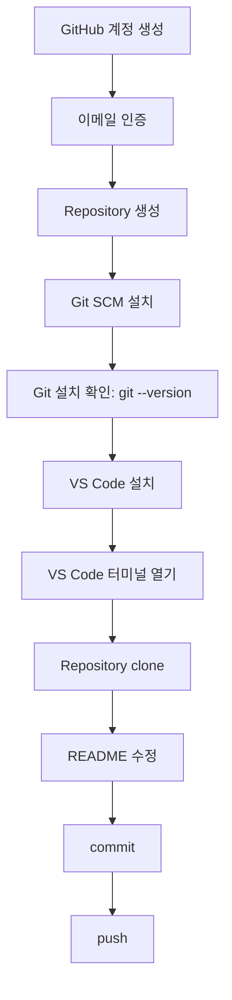

# Week 1 Day 1: 오리엔테이션과 개발 환경 준비

## Overview
오늘은 6주 과정의 방향을 이해하고, Cloud Native와 DevOps를 "도구 목록"이 아니라 "서비스를 운영 가능한 상태로 만드는 사고방식"으로 바라보는 출발점이다. 후반부에는 GitHub 계정, VS Code, Git을 수업 시간 안에서 천천히 준비하고, 설치 과정에서 발생하는 오류를 문제 해결 훈련으로 다룬다.

## Learning Goals
- 6주 과정의 최종 산출물과 학습 흐름을 설명한다.
- Cloud Native와 DevOps를 인프라/운영 관점에서 설명한다.
- GitHub 계정을 만들고 이메일 인증과 repository 생성을 완료한다.
- VS Code를 설치하고 터미널을 열 수 있다.
- Git 설치 상태를 확인하고 `clone`, `commit`, `push`의 의미를 이해한다.
- 설치 또는 계정 문제를 기록하고 질문할 수 있다.

## Lesson Index
- 1교시: 오리엔테이션 - 학습 과정 안내, 최종 목표, 6주간 만들 산출물 소개
- 2교시: Cloud Native 학습 마인드셋 - 문제 해결 프로세스, 도구 선택법, 도구를 이해한다는 것의 의미
- 3교시: 클라우드란 무엇인가? - 로컬 컴퓨터, 데이터센터, 호스팅, 클라우드의 차이
- 4교시: DevOps란 무엇인가? - 개발 라이프사이클, 배포, 운영, 피드백 루프, 협업 문화
- 5교시: GitHub 계정 생성, Git SCM 설치 및 VS Code 설치 - 계정 생성, 이메일 인증, Git 설치, VS Code 설치, 터미널 열기
- 6교시: Git/GitHub 기본 실습 - git 설치 확인, repository 생성, clone, commit, push, README 수정
- 7교시: 개인 면담 및 환경 점검 - 설치 상태 확인, 배경 지식 파악, 개인 목표 정리
- 8교시: 개인 면담 및 보충 실습 - GitHub, VS Code, Git 설정 문제 해결

## Official References
- GitHub Docs: Getting started with your GitHub account  
  https://docs.github.com/en/get-started/onboarding/getting-started-with-your-github-account
- GitHub Docs: Creating an account on GitHub  
  https://docs.github.com/articles/signing-up-for-a-new-github-account
- GitHub Docs: Set up Git  
  https://docs.github.com/en/get-started/git-basics/set-up-git
- Git: Install  
  https://git-scm.com/install/
- Visual Studio Code Docs: Getting started  
  https://code.visualstudio.com/docs/getstarted/getting-started
- Visual Studio Code Docs: Setup overview  
  https://code.visualstudio.com/docs/setup/setup-overview
- AWS: What is DevOps?  
  https://aws.amazon.com/devops/what-is-devops/
- AWS Documentation: What is cloud computing?  
  https://docs.aws.amazon.com/whitepapers/latest/aws-overview/what-is-cloud-computing.html

## Today's Key Terms
- Cloud Native: 클라우드 환경에 맞게 빠르게 배포하고 안정적으로 운영하는 접근
- Cloud Computing: 필요한 컴퓨팅 자원을 빌려 쓰는 사용량 기반 컴퓨팅
- DevOps: 개발과 운영이 같은 목표로 빠르고 안정적인 전달을 만드는 문화와 실천
- Compute: 프로그램이 실행되는 계산 자원
- Network: 요청과 응답이 이동하는 통신 경로
- Storage: 데이터가 저장되고 유지되는 공간
- CAPEX: 초기 투자 비용
- OPEX: 운영 중 계속 발생하는 비용
- TCO: 총소유비용
- GitHub: Git 저장소를 원격에서 관리하고 협업하는 서비스
- Repository: 코드와 문서, 변경 이력을 담는 저장소
- Git: 파일 변경 이력을 기록하는 버전 관리 도구
- Commit: 변경 내용을 이유와 함께 저장한 기록
- Push: 로컬 변경 기록을 원격 저장소에 올리는 작업

자세한 용어 정리는 [Week 1 Glossary](../glossary.md)를 참고한다.

## Visual Materials
- Mermaid: 6주 과정 전체 흐름도
- Mermaid: 로컬 개발 환경 준비 흐름도
- Infographic: "운영 가능한 서비스 만들기" 비유 인포그래픽

## Setup Flow
오늘의 환경 준비는 아래 순서로 진행한다. 설치가 막히면 다음 단계로 무리하게 넘어가지 않고, 7~8교시 환경 점검 시간에 원인을 정리한다.

## Required Files And Assets
- `lesson-01.md`: 오리엔테이션 샘플 교안
- `lesson-02.md`: Cloud Native 학습 마인드셋
- `lesson-03.md`: 클라우드란 무엇인가
- `lesson-04.md`: DevOps란 무엇인가
- `lesson-05.md`: GitHub 계정 생성, Git SCM 설치 및 VS Code 설치
- `lesson-06.md`: Git/GitHub 기본 실습
- `lesson-07.md`: 개인 면담 및 환경 점검
- `lesson-08.md`: 개인 면담 및 보충 실습
- `assets/`: 교안용 이미지와 시각 자료 저장 위치
- `assets/week1-day1-course-roadmap.png`: 6주 과정 비유 인포그래픽
- `assets/lesson-02-problem-solving-loop.png`: 문제 해결 루프 인포그래픽
- `assets/lesson-03-cloud-location-comparison.png`: 서비스 실행 위치 비교 인포그래픽
- `assets/lesson-04-devops-feedback-loop.png`: DevOps 피드백 루프 인포그래픽
- `assets/lesson-05-github-vscode-setup.png`: GitHub/VS Code 준비 흐름 인포그래픽
- `assets/lesson-06-git-workflow.png`: Git 기본 흐름 인포그래픽
- `assets/lesson-07-environment-check.png`: 환경 점검 분류 인포그래픽
- `assets/lesson-08-remediation-loop.png`: 보충 실습 운영 루프 인포그래픽

## Setup, Account, Permission, Cost Notes
- GitHub 계정 생성에는 이메일 인증이 필요하다.
- VS Code 설치는 운영체제별 설치 방식이 다르므로 공식 setup 문서를 기준으로 진행한다.
- Git 설치 후 `git --version`으로 확인한다.
- 오늘은 AWS 리소스를 만들지 않으므로 클라우드 비용은 발생하지 않는다.
- 계정 비밀번호, token, 개인 이메일 인증 화면은 화면 공유 시 노출하지 않는다.

## Deliverables
- GitHub 계정 생성과 이메일 인증 완료
- GitHub repository 1개 생성
- VS Code 설치와 터미널 실행 확인
- Git 설치 확인
- 개인 목표와 현재 환경 상태 기록

## End-Of-Day Checklist
- GitHub 로그인 가능
- GitHub repository 생성 가능
- VS Code 실행 가능
- VS Code 터미널 열기 가능
- `git --version` 확인
- 오늘 막힌 설치/계정 문제 기록
