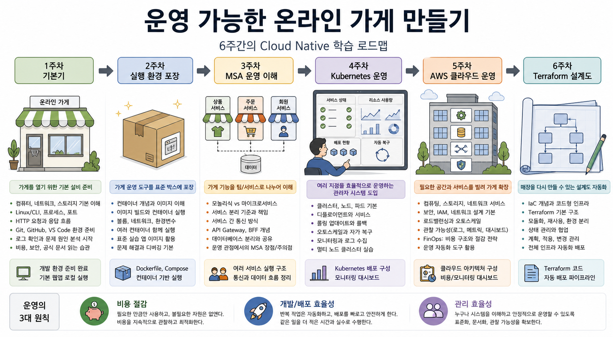
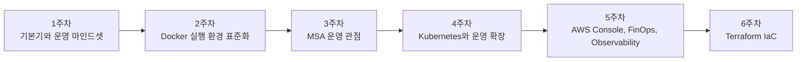

# 1교시: 오리엔테이션 - 학습 과정 안내와 최종 산출물 소개

## 수업 목표
- 학생이 6주 과정의 전체 흐름을 이해한다.
- 이 과정이 개발 강의가 아니라 인프라/Cloud Native(클라우드 환경에 맞게 빠르게 배포하고 안정적으로 운영하는 접근) 운영 역량을 만드는 과정임을 이해한다.
- 최종적으로 설명할 수 있어야 하는 산출물을 확인한다.
- 앞으로 모든 기술을 비용 절감, 개발/배포 효율성, 관리 효율성 관점으로 바라보는 기준을 잡는다.

## 시작 질문
수업은 기술 용어를 외우는 것으로 시작하지 않는다. 먼저 아래 질문을 통해 앞으로 배울 내용이 어떤 운영 문제와 연결되는지 생각한다.

- "여러분이 만든 웹사이트가 내 컴퓨터에서는 잘 되는데, 친구 컴퓨터나 회사 서버에서는 안 된다면 무엇부터 확인해야 할까요?"
- "서비스가 갑자기 느려졌을 때, 개발자에게 '느려요'라고 말하는 것과 어떤 로그/메트릭을 근거로 말하는 것은 무엇이 다를까요?"
- "클라우드에서 버튼 몇 번 누르면 서버가 만들어집니다. 그런데 왜 현업에서는 Terraform 같은 IaC를 사용할까요?"

이 질문들은 오늘부터 배울 내용이 명령어 암기가 아니라 운영 가능한 서비스를 만드는 사고방식과 연결되어 있음을 보여준다.

## 공식 참고 자료
- AWS: What is DevOps?  
  https://aws.amazon.com/devops/what-is-devops/  
  확인 키워드: culture, practices, tools, high velocity, infrastructure as code
- AWS Documentation: What is cloud computing?  
  https://docs.aws.amazon.com/whitepapers/latest/aws-overview/what-is-cloud-computing.html  
  확인 키워드: on-demand delivery, compute power, database, storage, pay-as-you-go
- AWS Well-Architected Framework: The pillars of the framework  
  https://docs.aws.amazon.com/wellarchitected/latest/framework/the-pillars-of-the-framework.html  
  확인 키워드: operational excellence, security, reliability, performance efficiency, cost optimization, sustainability

## 컴포넌트 스펙과 제약
이 교시는 특정 AWS 리소스를 생성하지 않는다. 대신 앞으로 다룰 서비스가 어떤 컴퓨팅 구성요소와 연결되는지 큰 지도를 만든다.

| 구성요소 | 1주차 표현 | 이후 연결되는 도구/서비스 | 운영상 제약 |
|---|---|---|---|
| Compute(계산 자원) | 프로그램이 실행되는 자리 | Docker container, Kubernetes Pod, EC2, ECS, EKS | CPU/Memory가 부족하면 느려지거나 죽는다 |
| Network(통신 경로) | 요청이 오가는 길 | port, security group, Service, Ingress, VPC, ALB | 닫힌 포트와 잘못된 라우팅은 정상 앱도 장애처럼 보이게 한다 |
| Storage(저장 공간) | 데이터가 남는 자리 | volume, S3, EBS, RDS | 저장 위치를 잘못 잡으면 컨테이너 삭제 시 데이터가 사라진다 |
| Configuration(실행 설정) | 실행 조건 | env, ConfigMap, Secret, Terraform variable | 설정이 코드와 섞이면 재현성과 보안이 나빠진다 |
| Observability(관찰 가능성) | 상태를 보는 창 | logs, metrics, CloudWatch, Grafana | 관찰 지점이 없으면 장애 원인보다 추측이 먼저 나온다 |
| Cost(비용) | 사용량의 결과 | Budget, Cost Explorer, resource tags | 만들기는 쉽지만 지우지 않으면 계속 비용이 발생한다 |

제약점:
- 오늘은 모든 기술의 내부 구조를 깊게 다루지 않는다.
- 오늘의 목적은 "이름을 외우는 것"이 아니라 6주 동안 반복해서 사용할 운영 기준을 만드는 것이다.
- 공식 문서의 정의와 비유가 완전히 같지는 않다. 비유는 이해를 돕는 도구이고, 최종 기준은 공식 문서다.

## 실제 사용 사례
오늘은 특정 기업 사례를 깊게 분석하지 않고, 왜 DevOps와 Cloud Native가 현업에서 필요한지 연결한다.

- AWS DevOps 소개 자료는 DevOps를 문화, 실행 방식, 도구의 조합으로 설명한다.
- AWS Well-Architected Framework는 운영 우수성, 보안, 신뢰성, 성능 효율, 비용 최적화, 지속 가능성을 함께 본다.
- 이 과정에서는 이 원칙을 학생 수준으로 낮춰 비용 절감, 개발/배포 효율성, 관리 효율성이라는 세 가지 질문으로 반복한다.

현업에서 좋은 인프라 엔지니어는 "서버 만들 줄 아는 사람"으로 끝나지 않는다. 왜 이 서버가 필요한지, 비용은 어디서 나가는지, 장애가 나면 어디서 확인할지, 개발팀이 배포를 빠르게 할 수 있는지까지 함께 본다.

## 쉬운 비유
이 과정 전체를 "작은 온라인 가게를 운영 가능한 매장으로 만드는 과정"에 비유한다.

- 1주차: 가게를 열기 전에 전기, 수도, 출입문, 창고, CCTV가 무엇인지 배운다.
- 2주차 Docker: 가게 운영에 필요한 도구를 박스에 표준 포장한다.
- 3주차 MSA: 계산대, 창고, 배송팀이 나뉘었을 때 연락망과 책임 범위를 정한다.
- 4주차 Kubernetes: 여러 지점에 직원을 배치하고 빈자리를 자동으로 채우는 운영 시스템을 둔다.
- 5주차 AWS: 실제 상가, 전기, 창고, 보안, CCTV 서비스를 빌려서 운영한다.
- 6주차 Terraform: 매장 설계도와 시공 절차를 코드로 남겨 같은 매장을 다시 만들 수 있게 한다.

비유의 한계:
- 실제 인프라는 매장보다 변경 속도가 빠르고, 장애가 눈에 보이지 않는 경우가 많다.
- 그래서 로그, 메트릭, 비용 화면, 공식 문서가 필요하다.

## imagegen 인포그래픽
이 인포그래픽은 "온라인 가게를 운영 가능한 매장으로 성장시키는 과정"을 6주 Cloud Native 학습 흐름에 대응시킨다. 가게의 기본 설비, 포장, 팀 분리, 운영 관리자, 임대 인프라, 설계도 자동화가 각각 1~6주차의 핵심 개념과 연결된다.

생성 목적: 학생이 6주 과정을 한 장의 그림으로 기억하도록 돕는다.

저장 위치:
- `week1/day1/assets/week1-day1-course-roadmap.png`

주의:
- 이 이미지는 비유 이해를 돕는 생성형 인포그래픽이다.
- 공식 정의와 정확한 수업 순서는 본 교안의 텍스트, Mermaid 다이어그램, 공식 문서를 기준으로 한다.

## Mermaid: 6주 과정 전체 흐름
아래 다이어그램은 이번 과정이 도구를 따로따로 배우는 과정이 아니라, 하나의 운영 흐름으로 연결된다는 점을 보여준다.

읽는 순서:
1. 1주차에서 서비스가 실행되는 바닥 개념을 잡는다.
2. 2주차에서 실행 환경을 Docker로 포장한다.
3. 3주차에서 여러 서비스로 나뉜 시스템을 운영 관점으로 본다.
4. 4주차에서 Kubernetes로 여러 컨테이너를 선언적으로 운영한다.
5. 5주차에서 AWS 콘솔로 실제 클라우드 서비스를 구성한다.
6. 6주차에서 5주차 수작업을 Terraform 코드로 재현한다.

## 서술형 설명
오늘 첫 시간의 목표는 학생을 겁주는 것이 아니다. 반대로 "앞으로 많은 도구를 배우겠지만, 모든 도구는 같은 질문으로 정리할 수 있다"는 안정감을 주는 것이다.

전체 흐름은 다음과 같이 이해하면 된다.

1. 이 과정은 개발 프레임워크 수업이 아니다.
   - 웹앱을 만들기는 하지만, 목적은 멋진 기능 개발이 아니다.
   - 목적은 애플리케이션을 실행하고, 배포하고, 관찰하고, 문제가 생겼을 때 원인을 좁히는 것이다.

2. 도구보다 운영 문제가 먼저다.
   - Docker는 "내 PC에서는 되는데 서버에서는 안 되는 문제"를 줄이기 위해 배운다.
   - Kubernetes는 "컨테이너가 많아졌을 때 어디에 몇 개를 띄우고, 죽으면 어떻게 살릴 것인가"를 다루기 위해 배운다.
   - AWS는 "내 컴퓨터 밖에서 실제 사용자가 접근 가능한 인프라를 어떻게 빌릴 것인가"를 배우기 위해 쓴다.
   - Terraform은 "콘솔에서 누른 설정을 어떻게 다시 재현하고 리뷰할 것인가"를 배우기 위해 쓴다.

3. 앞으로 모든 수업은 세 가지 원칙으로 정리한다.
   - 비용 절감: 이 리소스는 왜 필요하고, 얼마가 나가고, 언제 지울 것인가?
   - 개발/배포 효율성: 같은 결과를 더 빠르고 안정적으로 배포할 수 있는가?
   - 관리 효율성: 내가 없어도 다른 사람이 상태를 확인하고 운영할 수 있는가?

4. 주니어에게 가장 중요한 역량은 질문을 잘게 쪼개는 것이다.
   - "안 됩니다"가 아니라 "어느 주소로 요청했고, 어떤 상태 코드가 나왔고, 어떤 로그가 남았고, 최근 변경은 무엇입니다"라고 말할 수 있어야 한다.
   - 이 과정에서는 그 말하기 방식을 계속 훈련한다.

## 50분 강의 흐름
- 0~5분: 과정 소개와 시작 질문 확인
- 5~10분: 6주 과정의 최종 목표와 산출물 소개
- 10~20분: Cloud Native 과정이 개발 강의가 아니라 운영 역량 과정임을 설명
- 20~30분: 온라인 가게 비유로 1~6주차 흐름 설명
- 30~38분: DevOps 절대 원칙 세 가지 설명
- 38~45분: Mermaid 흐름도와 공식 문서 링크를 보며 앞으로의 학습 방식 설명
- 45~50분: 학생이 오늘 끝나기 전 완료해야 할 환경 준비 항목 안내

## DevOps 원칙 연결
- 비용 절감 관점: 클라우드 리소스는 만든 순간부터 비용을 의식해야 한다.
- 개발/배포 효율성 관점: 수작업과 개인 PC 의존을 줄이는 방향으로 학습한다.
- 관리 효율성 관점: README, 명령어, 로그, 대시보드, IaC는 모두 운영을 기억이 아니라 시스템으로 옮기는 장치다.

## 확인 질문
- Docker는 왜 "개발 도구"가 아니라 "운영 효율성 도구"로 볼 수 있는가?
- Kubernetes를 배우기 전에 Docker와 MSA 운영 문제를 먼저 경험해야 하는 이유는 무엇인가?
- AWS Console로 만든 리소스를 Terraform으로 다시 작성하는 이유는 무엇인가?
- 비용 절감, 배포 효율성, 관리 효율성 중 오늘 가장 낯선 관점은 무엇인가?

## 흔한 오해
- 오해: Cloud Native는 최신 도구를 많이 쓰는 것이다.  
  정정: Cloud Native는 변화에 빠르게 대응하고, 안정적으로 운영하고, 관찰 가능한 시스템을 만드는 접근이다.

- 오해: DevOps는 개발자가 운영도 하는 것이다.  
  정정: DevOps는 개발과 운영이 같은 목표와 피드백 루프를 공유하게 만드는 문화와 실천 방식이다.

- 오해: 클라우드는 서버를 안 관리해도 되는 것이다.  
  정정: 클라우드는 필요한 컴퓨팅 자원을 빌려 쓰는 방식이며, 관리 대상이 물리 서버 구매/설치에서 서비스 설정, 비용, 권한, 네트워크, 관찰 가능성으로 이동한다.

## 마무리 정리
오늘 1교시는 전체 과정의 지도를 보는 시간이다. 다음 교시부터는 Cloud Native를 배우는 태도와 문제 해결 방식을 더 구체적으로 다룬다. 오늘 오후에는 GitHub, VS Code, Git을 설치하고 계정을 준비한다. 설치 중 막히는 문제는 실패가 아니라 첫 번째 인프라 문제 해결 실습이다.
