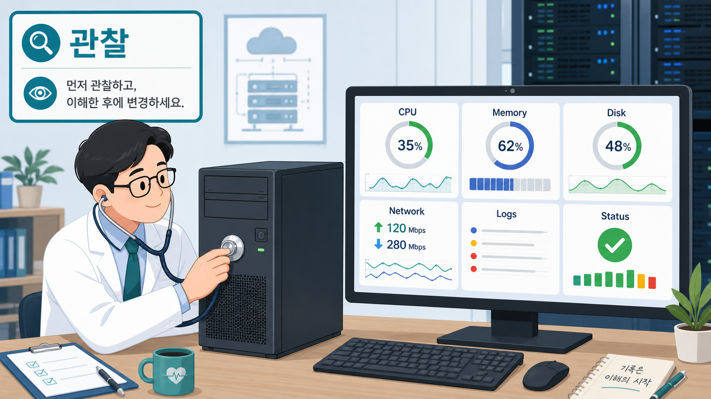
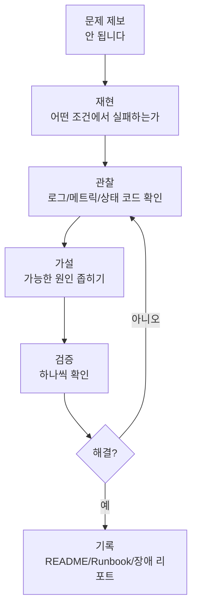
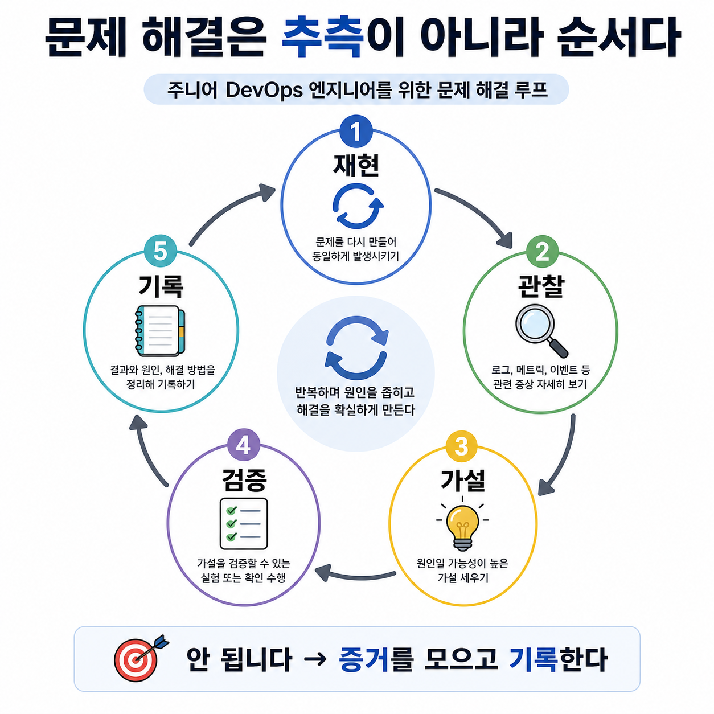

# 2교시: Cloud Native 학습 마인드셋 - 문제 해결 프로세스와 도구 선택법

## 수업 목표
- Cloud Native를 "최신 도구 묶음"이 아니라 운영 문제를 해결하기 위한 접근으로 이해한다.
- 문제 해결을 재현, 관찰, 가설, 검증, 기록의 흐름으로 설명한다.
- 도구를 선택할 때 비용 절감, 개발/배포 효율성, 관리 효율성을 함께 고려한다.
- AI와 검색 결과보다 공식 문서를 기준으로 검증하는 습관을 만든다.

## 시작 질문
- "서버가 안 됩니다"라는 말을 들으면 가장 먼저 무엇을 물어봐야 할까?
- Docker, Kubernetes, AWS, Terraform 중 어느 도구를 먼저 배워야 할까?
- 도구를 많이 아는 것과 문제를 잘 해결하는 것은 같은 일일까?

이 질문에는 "로그를 본다", "재부팅한다", "검색한다" 같은 답이 나올 수 있다. 중요한 것은 어떤 답이든 바로 조치로 뛰어들기 전에 순서를 세우는 것이다.

## 공식 참고 자료
- CNCF: Cloud Native Computing Foundation  
  https://www.cncf.io/  
  확인 키워드: cloud native projects, Kubernetes, Prometheus, Envoy, community
- CNCF Cloud Native Glossary  
  https://glossary.cncf.io/  
  확인 키워드: cloud native, container, orchestration, observability
- Google Cloud: What is cloud native?  
  https://cloud.google.com/learn/what-is-cloud-native  
  확인 키워드: scalable applications, cloud-based services, architectural constraints
- AWS: What is DevOps?  
  https://aws.amazon.com/devops/what-is-devops/  
  확인 키워드: culture, practices, tools, automation, monitoring

## 컴포넌트 스펙과 제약
이 교시에서 다루는 컴포넌트는 특정 서비스가 아니라 "문제 해결 프로세스"다.

| 단계 | 설명 | 확인할 증거 | 흔한 실수 |
|---|---|---|---|
| 재현 | 문제가 다시 발생하는 조건을 찾는다 | URL, 명령어, 입력값, 시간 | "아까 안 됐어요"로 끝냄 |
| 관찰 | 상태를 확인한다 | 로그, 상태 코드, 메트릭, 프로세스, 비용 화면 | 추측을 먼저 함 |
| 가설 | 가능한 원인을 좁힌다 | 최근 변경, 설정, 네트워크, 권한 | 원인을 하나로 단정 |
| 검증 | 가설이 맞는지 확인한다 | 명령 결과, 설정 변경 전후 비교 | 여러 개를 동시에 바꿈 |
| 기록 | 다음 사람이 반복할 수 있게 남긴다 | README, runbook, issue, 장애 리포트 | 해결 후 기록하지 않음 |

제약점:
- 이 프로세스는 문제를 즉시 해결해주지 않는다.
- 대신 문제를 작게 쪼개고, 개발팀/인프라팀이 같은 증거를 보고 대화하게 만든다.
- 초급자는 속도가 느리게 느껴질 수 있지만, 현업에서는 추측성 조치보다 훨씬 안전하다.

## 실제 사용 사례
공식 DevOps 자료들은 반복적으로 자동화, 모니터링, 협업, 빠른 피드백을 강조한다. 현업에서 DevOps가 필요한 이유는 한 사람이 모든 것을 잘해서가 아니라, 여러 사람이 같은 상태를 보고 같은 절차로 움직여야 하기 때문이다.

국내 사례는 이후 Kubernetes, AWS, Observability 주차에서 실제 기업 발표 자료와 함께 다룬다. 오늘은 사례 분석보다 "사례를 읽는 기준"을 먼저 세운다.

사례를 읽을 때 볼 질문:
- 어떤 문제가 있었는가?
- 어떤 도구를 선택했는가?
- 비용, 배포 속도, 관리 효율성 중 무엇이 좋아졌는가?
- 새롭게 생긴 운영 부담은 무엇인가?

## 쉬운 비유
문제 해결 프로세스는 병원 진료와 비슷하다.

- 재현: 언제 아픈지, 어떤 상황에서 증상이 나오는지 말한다.
- 관찰: 체온, 혈압, 검사 결과를 본다. 인프라에서는 CPU, Memory, Disk, Network, Logs 같은 메트릭을 먼저 확인한다.
- 가설: 감기인지, 장염인지, 다른 문제인지 좁힌다.
- 검증: 추가 검사나 약 반응을 확인한다.
- 기록: 진료 기록을 남겨 다음 진료에 활용한다.

비유의 한계:
- 인프라 장애는 사람 몸보다 더 많은 컴포넌트가 동시에 바뀔 수 있다.
- 그래서 "최근 변경 사항"과 "자동화된 기록"이 더 중요하다.

아래 이미지는 의사가 환자를 진찰하듯이 엔지니어가 컴퓨터의 상태를 관찰하는 장면을 보여준다. 청진기는 로그와 메트릭을 확인하는 도구에 해당하고, 모니터의 CPU, Memory, Disk, Network, Logs는 장애 원인을 추측하기 전에 확인해야 하는 기본 증거에 해당한다.

## Mermaid: 문제 해결 프로세스

## imagegen 인포그래픽
이 인포그래픽은 병원 진료 비유를 문제 해결 루프에 대응시킨다. 증상 확인은 재현, 검사 결과는 관찰, 진단은 가설, 추가 검사는 검증, 진료 기록은 장애 기록에 해당한다.

저장 위치:
- `week1/day1/assets/lesson-02-problem-solving-loop.png`
- `week1/day1/assets/lesson-02-doctor-observability.png`

읽는 순서:
1. 문제 제보를 바로 조치하지 않는다.
2. 재현 가능한 조건을 만든다.
3. 증거를 모은다.
4. 가설을 세우고 하나씩 검증한다.
5. 해결되면 반드시 기록한다.

## 서술형 설명
이 과정에서 가장 중요한 태도는 "모른다"를 빨리 인정하고 확인 가능한 상태로 바꾸는 것이다. 주니어는 모든 기술을 외울 수 없다. 대신 어떤 문서를 봐야 하는지, 어떤 명령어로 상태를 확인해야 하는지, 어떤 증거를 개발팀에게 전달해야 하는지를 익혀야 한다.

핵심 메시지는 다음과 같다.

1. 도구는 목적이 아니다.
   - Docker를 배우는 이유는 컨테이너 명령어를 외우기 위해서가 아니다.
   - 실행 환경 차이를 줄이고, 배포 단위를 표준화하기 위해 배운다.

2. Cloud Native는 복잡도를 없애는 기술이 아니다.
   - 복잡도는 사라지지 않는다.
   - 코드, 설정, 문서, 자동화, 관찰 가능성으로 복잡도를 관리 가능한 형태로 바꾸는 것이다.

3. 공식 문서는 현업의 기준점이다.
   - AI는 빠르게 초안을 만들 수 있지만 틀릴 수 있다.
   - 공식 문서는 느리게 읽히지만 기준이 된다.
   - 이 과정에서는 AI를 쓰더라도 공식 문서로 검증하는 습관을 만든다.

## 50분 강의 흐름
- 0~5분: "서버가 안 됩니다" 상황 질문
- 5~15분: 문제 해결 5단계 설명
- 15~25분: 병원 진료 비유와 Mermaid 다이어그램 설명
- 25~35분: Docker/Kubernetes/AWS/Terraform을 문제 해결 관점으로 매핑
- 35~43분: 공식 문서와 AI 답변을 비교해야 하는 이유 설명
- 43~50분: 학생 개인 학습 태도와 오늘 설치 과정에서 적용할 질문 정리

## DevOps 원칙 연결
- 비용 절감: 추측성 리소스 증설을 줄이고 원인을 확인한 뒤 조치한다.
- 개발/배포 효율성: 문제 해결 절차가 있으면 배포 실패 복구가 빨라진다.
- 관리 효율성: 기록이 남으면 같은 장애를 다른 사람도 처리할 수 있다.

## 확인 질문
- "안 됩니다"라는 보고를 받았을 때 바로 고치기 전에 확인할 세 가지는 무엇인가?
- Docker를 배우는 운영상 이유는 무엇인가?
- AI 답변을 공식 문서로 검증해야 하는 이유는 무엇인가?

## 흔한 오해
- 오해: 빠르게 고치는 사람이 좋은 엔지니어다.  
  정정: 빠르게 고치되, 원인과 재발 방지까지 남기는 사람이 좋은 엔지니어다.

- 오해: 공식 문서는 고급자만 보는 것이다.  
  정정: 초급자일수록 기준 문서를 보는 습관이 중요하다.

## 마무리 정리
다음 교시에는 Cloud Native의 배경인 클라우드와 데이터센터의 차이를 살펴본다. 오늘 배운 문제 해결 프로세스는 설치 오류, Git 오류, Docker 오류, AWS 비용 문제까지 계속 반복해서 사용할 기본 틀이다.
