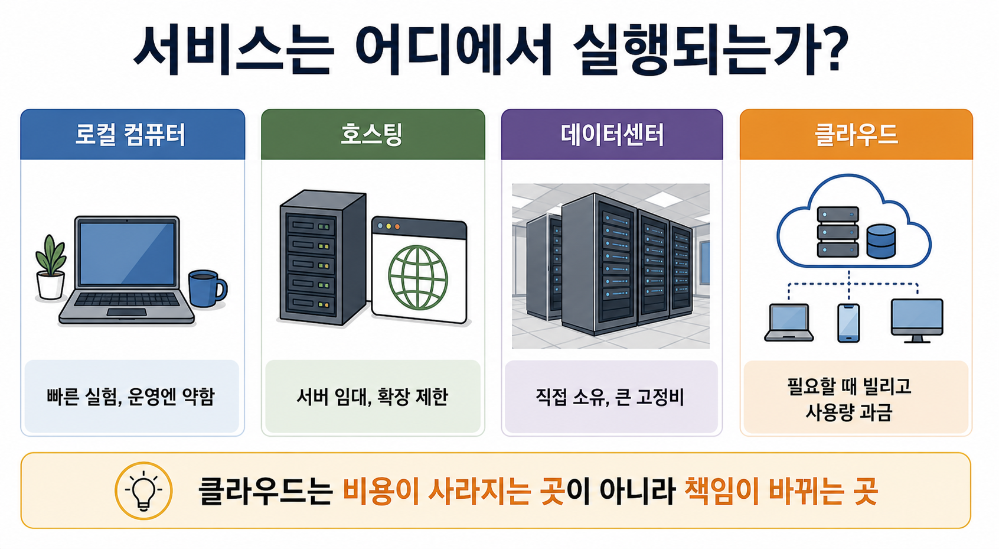

# 3교시: 클라우드란 무엇인가? - 로컬 컴퓨터, 데이터센터, 호스팅, 클라우드의 차이

## 수업 목표
- 로컬 컴퓨터, 데이터센터, 호스팅, 클라우드의 차이를 설명한다.
- 클라우드를 Cloud Computing(필요할 때 컴퓨팅 자원을 빌려 쓰는 사용량 기반 컴퓨팅)으로 이해한다.
- 클라우드의 핵심 특징인 온디맨드, 확장성, 사용량 기반 비용, 관리형 서비스를 이해한다.
- 클라우드 전환 판단에 필요한 CAPEX, OPEX, TCO의 의미를 이해한다.
- 클라우드 사용이 비용 절감과 관리 효율성을 자동으로 보장하지 않는다는 점을 이해한다.

## 시작 질문
- "내 노트북에서 웹 서버를 켜면 전 세계 사용자가 안정적으로 접속할 수 있을까?"
- "회사 서버실을 직접 운영하는 것과 AWS에서 필요한 시간만큼 EC2를 빌려 쓰는 것은 무엇이 다를까?"
- "클라우드를 쓰면 무조건 싸질까?"

## 공식 참고 자료
- AWS Documentation: What is cloud computing?  
  https://docs.aws.amazon.com/whitepapers/latest/aws-overview/what-is-cloud-computing.html  
  확인 키워드: on-demand delivery, compute power, database, storage, pay-as-you-go
- Google Cloud: What is cloud computing?  
  https://cloud.google.com/learn/what-is-cloud-computing  
  확인 키워드: on-demand availability, computing resources, internet
- AWS Well-Architected Framework: Cost Optimization pillar  
  https://docs.aws.amazon.com/wellarchitected/latest/framework/cost-optimization.html  
  확인 키워드: cost optimization, expenditure, resources, demand
- AWS Cloud Economics Center  
  https://aws.amazon.com/economics/  
  확인 키워드: cloud economics, TCO, cost optimization
- AWS Pricing Calculator  
  https://calculator.aws/  
  확인 키워드: estimate, EC2, monthly cost, region
- AWS Billing User Guide: AWS Price List Bulk API  
  https://docs.aws.amazon.com/awsaccountbilling/latest/aboutv2/using-the-aws-price-list-bulk-api.html  
  확인 키워드: price list files, programmatically, current AWS services, products
- Amazon EC2 T4g Instances  
  https://aws.amazon.com/ec2/instance-types/t4/  
  확인 키워드: t4g.medium, vCPU, memory, baseline performance, CPU credits
- Amazon EC2 On-Demand Pricing  
  https://aws.amazon.com/ec2/pricing/on-demand/  
  확인 키워드: On-Demand, no long-term commitment, per second, per hour, Linux

## 컴포넌트 스펙과 제약
오늘은 특정 클라우드 리소스를 만들지 않는다. 대신 컴퓨팅 구성요소가 어디에 위치하는지 비교한다.

| 방식 | 장점 | 제약 | 비용 관점 |
|---|---|---|---|
| 로컬 컴퓨터 | 빠르게 실험 가능 | 외부 접속, 전원, 네트워크, 보안, 장애 대응이 약함 | 이미 가진 장비는 추가 비용이 적지만 운영용으로 부적합 |
| 데이터센터 | 물리 자원 통제 가능 | 구매, 설치, 증설, 장애 대응 시간이 큼 | 초기 비용과 고정비가 큼 |
| 호스팅 | 서버 임대가 쉬움 | 유연한 확장과 서비스 조합에 한계 | 월 단위 고정비가 많음 |
| 클라우드 | 필요한 시점에 컴퓨팅 자원을 임대하고 확장, 관리형 서비스 조합 가능 | 잘못 쓰면 비용 폭증, 권한/네트워크 복잡도 증가 | 사용량 기반 비용, 끄지 않으면 계속 과금 |

제약점:
- 클라우드는 물리 장비 관리를 줄여주지만, 아키텍처와 비용 책임을 없애주지 않는다.
- 관리형 서비스는 운영 부담을 줄이지만, 서비스별 제약과 비용 구조를 이해해야 한다.
- 클라우드 리전, 가용 영역, 네트워크, IAM은 4~5주차에 더 구체적으로 다룬다.

## 클라우드 전환 비용 지표
클라우드 전환은 "서버를 클라우드로 옮긴다"가 아니라 비용 구조를 바꾸는 결정이다. 그래서 기술 설명과 함께 재무 지표를 같이 봐야 한다.

| 지표 | 의미 | 클라우드 전환에서 보는 이유 |
|---|---|---|
| CAPEX(Capital Expenditure, 초기 투자 비용) | 장비 구매와 데이터센터 구축 같은 초기 투자 비용 | 직접 서버를 사면 처음에 큰 비용이 들어간다 |
| OPEX(Operational Expenditure, 운영 비용) | 운영 중 지속적으로 발생하는 비용 | 클라우드는 사용량 기반 운영 비용 비중이 커진다 |
| TCO(Total Cost of Ownership, 총소유비용) | 소유와 운영에 들어가는 총비용 | 서버 가격만이 아니라 전력, 공간, 인력, 장애 대응, 폐기 비용까지 본다 |
| ROI(Return on Investment, 투자 대비 효과) | 투자 대비 효과 | 클라우드 전환이 비용, 속도, 안정성 측면에서 효과가 있는지 판단한다 |

처음에는 CAPEX와 OPEX의 차이만 정확히 이해해도 충분하다. 데이터센터는 장비를 먼저 사고 오래 쓰는 CAPEX 성격이 강하다. 클라우드는 필요한 만큼 빌려 쓰고 사용량에 따라 내는 OPEX 성격이 강하다. 그러나 클라우드가 항상 싸다는 뜻은 아니다. 사용량을 관찰하고, 필요 없는 리소스를 끄고, 적절한 서비스 크기를 선택해야 TCO가 낮아진다.

쉬운 판단 질문:
- 지금 비용은 장비 구매 비용인가, 운영 비용인가?
- 이 리소스를 한 달 동안 켜두면 얼마가 나가는가?
- 직접 운영할 때 필요한 사람, 시간, 장애 대응 비용까지 포함했는가?
- 클라우드로 옮기면 배포 속도나 장애 대응 시간이 줄어드는가?

## 단순 계산 예제: 짧게 쓰는 실험 환경
아래 숫자는 실제 인스턴스 타입을 기준으로 계산하되, 수업 이해를 위해 범위를 단순화한 값이다. 실제 금액은 리전, 환율, 인스턴스 타입, OS, 구매 옵션, EBS, 데이터 전송량, 공인 IPv4, 세금에 따라 달라진다. 실제 견적은 AWS Pricing Calculator와 각 회사의 데이터센터 비용 기준으로 다시 계산해야 한다. 특히 클라우드 비용은 비즈니스 규모, 아키텍처 타입, 사용 시간, 트래픽 패턴, 관리형 서비스 선택에 따라 언제든지 달라질 수 있다.

계산 전제:
- 인스턴스 타입: `t4g.medium`
- 리전: `ap-northeast-2` 서울 리전
- OS/구매 옵션: Linux On-Demand
- 스펙: 2 vCPU, 4 GiB Memory, 최대 5 Gbps 네트워크 burst
- 성격: AWS Graviton2 기반 burstable general purpose 인스턴스
- 주의: `t4g.medium`은 vCPU당 baseline performance 20%, 시간당 CPU credit 24개를 가진 burstable 인스턴스다. CPU를 지속적으로 많이 쓰는 워크로드는 Unlimited mode의 CPU credit 비용과 성능 특성을 별도로 확인해야 한다.
- 수업 기준 단가: 2026-05-29 AWS Price List Bulk API 기준, 서울 리전 Linux On-Demand `시간당 0.0416 USD`
- 환율 가정: `1 USD = 1,500원`
- 제외 항목: EBS 볼륨, 스냅샷, 데이터 전송, 공인 IPv4/Elastic IP, CloudWatch 상세 비용, 로드밸런서, NAT Gateway, 세금

상황:
- 신규 프로젝트 검증을 위해 `t4g.medium` 서버 2대가 필요하다.
- 하루 8시간만 사용한다.
- 총 사용 시간은 `2대 x 14일 x 8시간 = 224 서버-시간`이다.

클라우드 방식:
- 계산: `224 서버-시간 x 0.0416 USD = 9.3184 USD`
- 원화 환산: `9.3184 USD x 1,500원 = 약 13,978원`
- 실험이 끝나면 리소스를 삭제해 비용을 멈출 수 있다.

데이터센터 방식:
- 서버를 직접 구매하거나 장기 임대해야 한다.
- 서버 1대 구매 비용을 300만 원, 2대를 600만 원이라고 가정한다.
- 2주만 쓰더라도 장비 구매, 설치, 네트워크 연결, 상면, 전력, 냉각, 운영 인력 준비가 필요하다.
- 실험이 실패해도 장비는 남고, 감가상각과 유지보수는 계속 고려해야 한다.

이 예제에서는 짧게 쓰는 실험 환경일수록 데이터센터 방식이 불리하다. 필요한 기간만 빌려 쓰고 삭제할 수 있는 클라우드가 유리하다. 대규모 아키텍처가 필요하더라도 POC(Proof of Concept, 개념 검증) 수준에서 몇 시간만 구성해 검증하고 종료할 수 있다면, 클라우드는 큰 초기 투자 없이 빠르게 실험을 끝내는 선택지가 된다.

다만 스몰 비즈니스라고 해서 클라우드가 항상 더 싸지는 않다. 사무실이나 매장 내부에서만 쓰는 작은 업무 도구처럼 접속자가 제한적이고 외부 공개, 고가용성, 자동 확장, 관리형 데이터베이스가 필요 없다면 이미 보유한 로컬 컴퓨터나 NAS가 더 경제적일 수 있다. 반대로 같은 스몰 비즈니스라도 외부 고객 접속, 백업, 장애 대응, 보안 업데이트, 원격 접근이 중요하면 클라우드가 운영 부담을 줄여 TCO를 낮출 수 있다.

## 단순 계산 예제: 오래 쓰는 안정 워크로드
반대로 같은 서버가 3년 동안 24시간 계속 필요하다고 가정한다.

상황:
- `t4g.medium` 서버 2대가 3년 동안 항상 필요하다.
- 총 사용 시간은 `2대 x 24시간 x 365일 x 3년 = 52,560 서버-시간`이다.

클라우드 온디맨드 방식:
- 계산: `52,560 서버-시간 x 0.0416 USD = 2,186.496 USD`
- 원화 환산: `2,186.496 USD x 1,500원 = 약 3,279,744원`
- 이 금액은 EC2 컴퓨팅 비용만 단순 계산한 값이다. 실제 운영에서는 EBS, 스냅샷, 데이터 전송, 로그 저장, 모니터링 비용이 추가될 수 있다.

데이터센터 방식:
- 서버 2대 구매 비용을 600만 원이라고 가정한다.
- 그러나 이것이 끝이 아니다. 다음 비용이 추가된다.
  - 장비 교체 주기
  - 상면 또는 건물 유지비
  - 전력과 냉각
  - 네트워크 회선
  - 예비 장비
  - 장애 대응 인력
  - 24/7 운영 인력 또는 당직 체계
  - 보안 장비와 모니터링 도구

오래 쓰고 사용량이 안정적이며 규모가 충분하면 데이터센터가 유리한 경우도 있다. 하지만 서버 구매가만 비교하면 잘못된 판단이 된다. 반드시 TCO로 비교해야 한다.

계산식을 읽는 방법:
- 클라우드 컴퓨팅 비용은 보통 `리소스 개수 x 사용 시간 x 시간당 단가`로 시작한다.
- 이 단순식은 EC2 컴퓨팅만 보는 첫 번째 계산이다.
- 실제 견적에서는 스토리지, 네트워크, 로그, 백업, 보안, 운영 도구 비용을 더해야 한다.
- 데이터센터 계산에서는 서버 구매가뿐 아니라 감가상각, 상면, 전력, 냉각, 회선, 예비 장비, 유지보수, 운영 인력, 장애 대응 비용을 더해야 한다.
- 따라서 "2주 실험"과 "3년 24/7 운영"은 같은 인스턴스 2대라도 의사결정 방식이 달라진다.
- 스몰 비즈니스, 사내 전용 도구, 고객-facing 서비스, 대규모 POC, 장기 운영 시스템은 비용 계산의 기준이 서로 다르다.

## 클라우드가 점점 저렴해질 수 있는 이유
클라우드 제공자는 매우 큰 규모로 데이터센터, 서버, 네트워크, 전력, 냉각을 운영한다. 이를 규모의 경제라고 한다. 규모의 경제는 같은 자원을 더 큰 단위로 구매하고 운영하면서 단위 비용을 낮추는 효과를 말한다.

클라우드가 비용 측면에서 유리해질 수 있는 이유:
- 많은 고객의 수요를 모아 큰 규모로 장비를 구매한다.
- 데이터센터 운영 자동화 수준이 높다.
- 사용자는 필요한 시간과 크기만큼만 자원을 쓴다.
- 관리형 서비스를 통해 직접 운영해야 할 인력과 시간을 줄일 수 있다.
- 예약, Savings Plans, Spot 같은 가격 모델로 장기/유휴 자원을 더 싸게 쓸 수 있다.

하지만 규모의 경제가 모든 사용자에게 자동으로 비용 절감을 보장하지는 않는다. 켜둔 리소스, 과도한 스펙, 사용하지 않는 디스크, 불필요한 로그 보관, 잘못된 네트워크 구성은 클라우드에서도 비용 낭비가 된다.

## 실제 사용 사례
클라우드 도입 사례는 대부분 "빠른 실험", "탄력적 확장", "관리형 서비스 활용", "글로벌 배포"와 연결된다. 그러나 좋은 사례를 볼 때는 성공 문장만 보면 안 된다.

사례를 읽을 때 볼 질문:
- 기존 방식의 병목은 무엇이었는가?
- 클라우드로 옮긴 후 운영 책임이 어디로 이동했는가?
- 비용 관리 방법을 함께 설명하는가?
- 관찰 가능성이나 장애 대응 방식이 어떻게 바뀌었는가?

## 쉬운 비유
로컬 컴퓨터, 데이터센터, 클라우드를 주방에 비유한다.

- 로컬 컴퓨터: 집 주방에서 혼자 요리한다.
- 데이터센터: 큰 식당 주방을 직접 소유하고 모든 장비를 산다.
- 호스팅: 남의 주방 한 칸을 월세로 빌린다.
- 클라우드: 필요한 시간에 필요한 조리대, 냉장고, 배달 시스템을 빌린다.
- CAPEX: 큰 식당 주방과 장비를 직접 사는 비용이다.
- OPEX: 필요한 시간만큼 주방과 장비를 빌려 쓰며 내는 운영 비용이다.
- TCO: 장비 가격뿐 아니라 전기, 임대료, 청소, 고장 수리, 인력 비용까지 합친 총비용이다.

비유의 한계:
- 클라우드는 단순 서버 임대보다 훨씬 많은 관리형 서비스를 제공한다.
- 그러나 빌린 만큼 비용이 나오므로 주방을 켜놓고 집에 가면 요금이 계속 나오는 것과 같다.

## Mermaid: 인프라 위치 변화

## imagegen 인포그래픽
이 인포그래픽은 주방 비유를 인프라 실행 위치에 대응시킨다. 집 주방은 로컬 컴퓨터, 임대한 주방은 호스팅, 직접 소유한 큰 식당 주방은 데이터센터, 필요한 조리대와 설비를 사용량 기준으로 빌리는 방식은 클라우드에 해당한다. CAPEX/OPEX/TCO는 이 비유에서 "직접 사는 비용", "빌려 쓰는 운영 비용", "운영 전체에 드는 총비용"으로 연결한다. 실제 계산 예제는 이 비유를 숫자로 바꾸어 보는 연습이다.

저장 위치:
- `week1/day1/assets/lesson-03-cloud-location-comparison.png`

## 서술형 설명
클라우드는 "필요할 때 컴퓨팅 자원을 빌려 쓰는 임대형/사용량 기반 컴퓨팅"으로 이해하는 것이 더 정확하다. 단순히 서버 한 대를 빌리는 수준을 넘어, 컴퓨팅, 네트워크, 스토리지, 데이터베이스, 관찰 가능성 도구를 API와 콘솔로 빠르게 만들고, 줄이고, 조합할 수 있다는 점이 핵심이다.

다음 순서로 이해하면 클라우드의 의미가 더 명확해진다.

1. 로컬 컴퓨터는 학습에는 좋지만 운영에는 약하다.
   - 전원이 꺼지면 서비스가 꺼진다.
   - 집 네트워크는 운영용 보안과 가용성을 보장하지 않는다.

2. 데이터센터는 통제력이 높지만 느리다.
   - 장비 구매와 설치가 필요하다.
   - 용량을 잘못 예측하면 남거나 부족하다.

3. 클라우드는 빠르지만 책임이 바뀐다.
   - 서버 구매 대신 필요한 컴퓨팅 자원을 빌리고 서비스 조합을 선택한다.
   - 물리 장애 대신 설정, 권한, 비용, 관찰 가능성을 관리한다.

4. 클라우드 비용은 절약이 아니라 최적화의 문제다.
   - 작게 시작하고, 관찰하고, 필요할 때 키워야 한다.
   - 쓰지 않는 리소스를 끄는 습관이 중요하다.
   - CAPEX를 OPEX로 바꿨다고 해서 TCO가 자동으로 낮아지지는 않는다.
   - 짧은 실험 환경과 오래 지속되는 안정 워크로드는 계산 결과가 달라질 수 있다.

## 50분 강의 흐름
- 0~5분: 로컬 컴퓨터로 서비스를 운영할 수 있는지 질문
- 5~15분: 로컬/호스팅/데이터센터/클라우드 비교
- 15~22분: 주방 비유와 인프라 위치 Mermaid 설명
- 22~30분: AWS 공식 문서의 클라우드 핵심 키워드 확인
- 30~43분: CAPEX, OPEX, TCO 계산 예제 비교
- 43~47분: 규모의 경제와 운영 책임 이동 설명
- 47~50분: 다음 DevOps 교시와 연결

## DevOps 원칙 연결
- 비용 절감: 클라우드는 사용량 기반이므로 쓰지 않는 자원을 줄이는 습관이 중요하다.
- 개발/배포 효율성: 인프라 준비 시간이 줄어 실험과 배포가 빨라진다.
- 관리 효율성: 물리 장비 관리는 줄지만 설정, 권한, 비용, 관찰 책임은 커진다.

## 확인 질문
- 클라우드가 데이터센터보다 빠르게 실험할 수 있는 이유는 무엇인가?
- 클라우드가 무조건 비용을 절감하지 않는 이유는 무엇인가?
- 클라우드를 쓰면 인프라 엔지니어의 책임은 어떻게 바뀌는가?
- CAPEX와 OPEX의 차이는 무엇인가?
- TCO를 볼 때 서버 가격 외에 무엇을 포함해야 하는가?
- 2주만 쓰는 실험 서버와 3년 내내 쓰는 서버는 왜 다른 계산 방식이 필요한가?
- 클라우드의 규모의 경제가 비용 절감에 도움이 되는 이유는 무엇인가?

## 흔한 오해
- 오해: 클라우드는 서버를 안 관리해도 된다.  
  정정: 클라우드는 필요한 컴퓨팅 자원을 빌려 쓰는 방식이며, 물리 서버 구매/설치 관리는 줄지만 서비스 설정, 권한, 네트워크, 비용, 관찰 가능성을 관리해야 한다.

- 오해: 클라우드는 항상 싸다.  
  정정: 사용 패턴에 맞게 설계하고 끄고 줄여야 싸진다.

## 마무리 정리
클라우드는 컴퓨팅 자원을 빠르게 빌리고 조합할 수 있게 해준다. 하지만 빠르게 만들 수 있다는 말은 빠르게 낭비할 수도 있다는 뜻이다. 다음 교시에서는 이 클라우드 환경에서 개발과 운영이 어떻게 협업해야 하는지 DevOps 관점으로 살펴본다.
