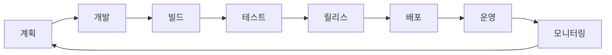
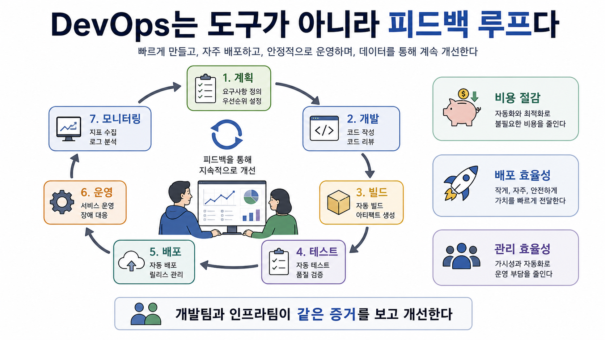

# 4교시: DevOps란 무엇인가? - 개발 라이프사이클과 운영 피드백 루프

## 수업 목표
- DevOps(개발과 운영이 같은 목표로 빠르고 안정적인 전달을 만드는 문화와 실천)를 직무명이나 도구 이름이 아니라 문화, 실행 방식, 도구의 조합으로 이해한다.
- 개발, 빌드, 테스트, 배포, 운영, 피드백의 흐름을 설명한다.
- DevOps 성과를 설명할 때 사용하는 DORA 핵심 지표를 맛보기로 이해한다.
- 인프라 엔지니어가 개발팀과 협업할 때 확인해야 할 정보를 정리한다.
- DevOps의 목표를 비용 절감, 개발/배포 효율성, 관리 효율성과 연결한다.

## 시작 질문
- "개발팀은 배포가 빠르길 원하고, 운영팀은 안정적이길 원합니다. 둘 중 하나만 선택해야 할까요?"
- "장애가 났을 때 개발팀과 인프라팀이 서로 책임을 미루지 않으려면 무엇이 필요할까요?"
- "DevOps는 개발자가 운영까지 다 하는 것일까요?"

## 공식 참고 자료
- AWS: What is DevOps?  
  https://aws.amazon.com/devops/what-is-devops/  
  확인 키워드: culture, practices, tools, speed, stability
- Google Cloud: DORA research program  
  https://cloud.google.com/devops  
  확인 키워드: software delivery performance, deployment frequency, lead time, change failure rate, time to restore
- AWS Well-Architected Framework: Operational Excellence pillar  
  https://docs.aws.amazon.com/wellarchitected/latest/operational-excellence-pillar/welcome.html  
  확인 키워드: run and monitor systems, improve processes and procedures

## 컴포넌트 스펙과 제약
DevOps는 설치하는 제품이 아니다. 그래서 특정 스펙 대신 흐름과 측정 기준을 이해해야 한다.

| 영역 | 인프라 엔지니어가 보는 질문 | 산출물 |
|---|---|---|
| 개발 | 이 앱은 어떻게 실행되는가? | README, 실행 명령 |
| 빌드 | 배포 가능한 산출물이 무엇인가? | Docker image, artifact |
| 테스트 | 배포 전 무엇을 검증하는가? | test result, health check |
| 배포 | 어디에 어떤 순서로 배포하는가? | deployment manifest, runbook |
| 운영 | 상태를 어디서 확인하는가? | logs, metrics, dashboard |
| 피드백 | 다음 배포에 무엇을 개선하는가? | incident report, postmortem |

제약점:
- DevOps를 도입한다고 조직 갈등이 자동으로 사라지지 않는다.
- 자동화가 잘못된 절차를 빠르게 반복할 수도 있다.
- 측정 지표는 개선을 위한 도구이지 사람을 압박하는 도구가 되면 안 된다.

## 실제 사용 사례
DORA 연구는 소프트웨어 전달 성과를 배포 빈도, 변경 리드 타임, 변경 실패율, 복구 시간 같은 지표로 본다. 이 지표들은 1주차에는 소개만 하고, 5일차에 다시 다룬다.

강의 연결점:
- 배포 빈도: 얼마나 자주 안정적으로 배포할 수 있는가?
- 변경 리드 타임: 코드 변경이 사용자에게 도달하는 데 얼마나 걸리는가?
- 변경 실패율: 배포가 장애로 이어지는 비율은 어떤가?
- 복구 시간: 장애 후 정상 상태로 돌아오는 데 얼마나 걸리는가?

## DevOps 핵심 지표
DevOps는 "분위기가 좋아졌다" 같은 정성적 표현만으로 평가하기 어렵다. 배포와 운영의 품질을 보려면 지표가 필요하다.

| 지표 | 의미 | 인프라 관점에서 보는 이유 |
|---|---|---|
| Deployment Frequency(배포 빈도) | 얼마나 자주 배포하는가 | 배포 절차가 자동화되고 안정적인지 본다 |
| Lead Time for Changes(변경 리드 타임) | 변경이 운영 환경에 도달하는 시간 | 개발에서 배포까지 병목이 어디 있는지 본다 |
| Change Failure Rate(변경 실패율) | 변경이 장애를 일으키는 비율 | 배포 안정성과 검증 절차의 품질을 본다 |
| Time to Restore Service(서비스 복구 시간) | 장애 후 복구까지 걸리는 시간 | 관찰 가능성, rollback, runbook의 효과를 본다 |

이 지표들은 사람을 평가하기 위한 점수가 아니라 시스템을 개선하기 위한 계기판이다. 자동차 계기판이 운전자를 혼내기 위해 있는 것이 아니라 속도, 연료, 경고등을 보여주기 위해 있는 것처럼, DevOps 지표도 배포와 운영 흐름의 상태를 보여준다.

## 쉬운 비유
DevOps는 식당의 주방과 홀, 배달팀이 같은 주문표를 보고 움직이는 것과 비슷하다.

- 개발팀: 요리를 만든다.
- 인프라팀: 주방 설비, 동선, 배달 경로, CCTV를 관리한다.
- 운영 피드백: 어떤 주문이 늦었는지, 어디서 병목이 생겼는지 기록한다.

비유의 한계:
- 소프트웨어는 식당보다 변경이 훨씬 잦다.
- 그래서 자동화와 관찰 가능성이 더 중요하다.

## Mermaid: DevOps 피드백 루프

## imagegen 인포그래픽
이 인포그래픽은 식당 운영 비유를 DevOps 피드백 루프에 대응시킨다. 주문, 조리, 검수, 서빙, 운영 기록, 개선이 계획, 개발, 테스트, 배포, 운영, 모니터링의 반복 흐름과 연결된다.
DevOps 지표는 이 비유에서 주문 처리 속도, 잘못 나간 주문 비율, 문제 발생 후 정상 운영으로 돌아오는 시간 같은 운영 계기판에 해당한다.

저장 위치:
- `week1/day1/assets/lesson-04-devops-feedback-loop.png`

## 서술형 설명
DevOps를 "개발자가 운영도 하는 것"으로 설명하면 오해가 생긴다. DevOps는 역할을 없애는 말이 아니라, 역할 사이의 벽을 낮추는 말이다.

핵심은 다음과 같다.

1. 개발과 운영은 목표가 같아야 한다.
   - 개발팀은 빠르게 기능을 전달하고 싶다.
   - 운영팀은 안정적으로 서비스를 유지하고 싶다.
   - 좋은 DevOps는 빠름과 안정성을 함께 추구한다.

2. 인프라 엔지니어는 개발팀의 코드를 전부 알 필요는 없다.
   - 대신 실행 조건을 알아야 한다.
   - 포트, 환경변수, 의존 서비스, 로그 위치, health check, 배포 순서를 알아야 한다.

3. 운영 피드백은 다음 개발의 입력이다.
   - 장애가 났는데 기록하지 않으면 같은 문제가 반복된다.
   - 로그와 메트릭은 책임 추궁이 아니라 개선 재료다.

## 50분 강의 흐름
- 0~5분: 개발팀과 운영팀의 목표 차이 질문
- 5~15분: DevOps 공식 정의와 오해 정리
- 15~25분: DevOps 피드백 루프 Mermaid 설명
- 25~35분: 인프라 엔지니어가 개발팀에 요구해야 할 정보 설명
- 35~43분: DORA 지표 맛보기
- 43~50분: GitHub/VS Code/Git 실습으로 넘어가는 이유 정리

## DevOps 원칙 연결
- 비용 절감: 자동화와 관찰로 불필요한 리소스와 반복 작업을 줄인다.
- 개발/배포 효율성: 배포 가능한 단위와 검증 절차를 표준화한다.
- 관리 효율성: 운영 상태와 장애 기록을 공유 가능한 형태로 남긴다.

## 확인 질문
- DevOps가 도구 이름이 아닌 이유는 무엇인가?
- 인프라 엔지니어가 개발팀에게 확인해야 할 실행 조건은 무엇인가?
- 빠른 배포와 안정적인 운영을 동시에 추구하려면 무엇이 필요할까?
- DORA 지표는 사람을 평가하기 위한 점수인가, 시스템을 개선하기 위한 계기판인가?

## 흔한 오해
- 오해: DevOps는 Jenkins나 Kubernetes를 쓰는 것이다.  
  정정: 도구는 DevOps를 돕는 수단이고, 핵심은 협업과 피드백 루프다.

- 오해: 운영팀은 개발 코드를 몰라도 된다.  
  정정: 내부 구현은 몰라도 실행 조건과 장애 확인 지점은 알아야 한다.

## 마무리 정리
이제 DevOps의 큰 그림을 봤으므로, 후반부에는 실제 협업의 기본 도구인 GitHub, VS Code, Git을 준비한다. 앞으로 모든 실습 결과는 개인 저장소와 README에 남긴다.
