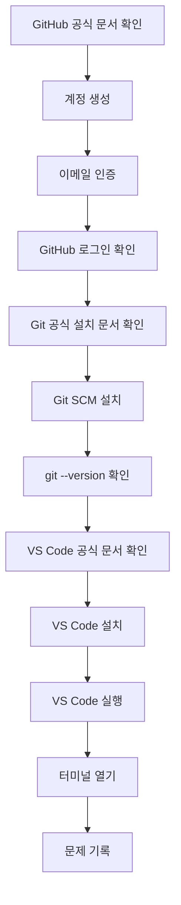

# 5교시: GitHub 계정 생성, Git SCM 설치 및 VS Code 설치

## 수업 목표
- GitHub 계정을 생성하고 이메일 인증을 완료한다.
- GitHub repository를 만들 준비를 한다.
- Git SCM을 설치하고 `git --version`으로 설치 상태를 확인한다.
- VS Code를 설치하고 실행한다.
- VS Code에서 터미널을 열 수 있다.
- 계정 생성과 설치 과정의 오류를 기록하고 해결 요청할 수 있다.

## 사전 준비
- 개인 이메일 계정
- 브라우저
- 설치 권한이 있는 개인 PC
- 네트워크 연결
- GitHub 계정에 사용할 안전한 비밀번호

비용 주의사항:
- GitHub Free 계정, Git SCM, VS Code 설치에는 비용이 들지 않는다.
- 유료 플랜, 유료 확장, GitHub Marketplace 유료 도구는 오늘 사용하지 않는다.

보안 주의사항:
- 비밀번호와 이메일 인증 코드는 화면 공유하지 않는다.
- 개인 이메일, 전화번호, 복구 코드가 보이면 화면을 가린다.
- 2FA 또는 passkey 설정은 권장하지만, 수업 시간과 개인 환경에 따라 보충 시간에 진행할 수 있다.

## 공식 참고 자료
- GitHub Docs: Creating an account on GitHub  
  https://docs.github.com/articles/signing-up-for-a-new-github-account
- GitHub Docs: Getting started with your GitHub account  
  https://docs.github.com/en/get-started/onboarding/getting-started-with-your-github-account
- Visual Studio Code Docs: Setting up Visual Studio Code  
  https://code.visualstudio.com/docs/setup/setup-overview
- Visual Studio Code Docs: Getting started  
  https://code.visualstudio.com/docs/getstarted/getting-started
- Git: Install  
  https://git-scm.com/install/
- Pro Git Book: Installing Git  
  https://git-scm.com/book/en/v2/Getting-Started-Installing-Git

## 실습 대상 스펙과 제약
GitHub 계정:
- 개인 계정은 사용자 identity 역할을 한다.
- 이메일 인증이 완료되어야 GitHub 기능 사용에 제약이 줄어든다.
- 의심스러운 네트워크나 반복 생성 시 계정 생성 제한이 발생할 수 있다.

VS Code:
- Windows, macOS, Linux에 설치 가능하다.
- 설치 방식은 운영체제별로 다르므로 공식 setup 문서를 기준으로 한다.
- 일부 회사/교육장 PC는 설치 권한이 제한될 수 있다.

Git SCM:
- Git은 로컬 컴퓨터에서 변경 이력을 기록하고 GitHub 같은 원격 저장소와 연결하는 명령행 도구다.
- Windows, macOS, Linux에 설치 가능하다.
- Windows에서는 Git for Windows 설치 후 새 터미널을 열어야 `git` 명령이 인식되는 경우가 많다.
- macOS와 Linux는 이미 설치되어 있을 수 있으므로 먼저 `git --version`으로 확인한다.
- 회사/교육장 PC에서는 보안 정책 때문에 설치 파일 실행이나 PATH 등록이 제한될 수 있다.

## 전체 실습 흐름
1. GitHub 공식 문서 확인
2. GitHub 계정 생성
3. 이메일 인증
4. GitHub 로그인 확인
5. Git 공식 설치 페이지 확인
6. Git SCM 설치
7. `git --version` 확인
8. VS Code 공식 설치 페이지 확인
9. VS Code 설치
10. VS Code 실행
11. 터미널 열기
12. 설치/계정 문제 기록

## 단계별 절차
1. 브라우저에서 `https://github.com/` 접속
2. Sign up 선택
3. 이메일, 비밀번호, username 입력
4. 이메일 인증 완료
5. GitHub 로그인 상태 확인
6. 브라우저에서 `https://git-scm.com/install/` 접속
7. 운영체제에 맞는 Git 설치 방법 선택
8. Git 설치 진행
   - Windows: 기본 옵션으로 설치하되, 터미널에서 Git을 사용할 수 있는 PATH 옵션을 유지한다.
   - macOS: 공식 안내의 installer, Homebrew, Xcode Command Line Tools 중 개인 환경에 맞는 방법을 선택한다.
   - Linux: 배포판 패키지 관리자 안내를 따른다.
9. 새 터미널을 열고 `git --version` 실행
10. 브라우저에서 `https://code.visualstudio.com/` 접속
11. 운영체제에 맞는 설치 파일 다운로드
12. 설치 진행
13. VS Code 실행
14. 메뉴에서 Terminal 또는 View > Terminal 선택
15. 터미널이 열리는지 확인
16. VS Code 터미널에서도 `git --version` 실행

## 화면/명령어 예시
VS Code 터미널에서 운영체제에 따라 다음 중 하나를 실행한다.

```bash
pwd
```

또는 Windows PowerShell에서는:

```powershell
Get-Location
```

기대 결과:
- 현재 작업 위치가 출력된다.
- 터미널 입력과 출력이 정상 동작한다.

Git 설치 확인:

```bash
git --version
```

기대 결과:
- `git version 2.x.x` 형태의 버전 정보가 출력된다.
- 버전 숫자는 설치 시점과 운영체제에 따라 다를 수 있다.

## Mermaid: 설치 흐름


## 쉬운 비유
개발 환경 준비는 수업용 작업 책상을 세팅하는 것과 비슷하다.

- GitHub 계정은 개인 사물함이다.
- Repository는 과목별 파일함이다.
- Git SCM은 파일함에 넣을 변경 이력을 정리하고 묶는 기록 도구다.
- VS Code는 작업 책상이다.
- 터미널은 도구를 직접 실행하는 작업대다.
- 상태 기록은 책상 위에 붙여두는 점검표다.

비유의 한계:
- 실제 개발 환경은 계정, 인증, 권한, 네트워크 상태에 따라 더 복잡하다.
- 그래서 공식 문서와 체크리스트를 함께 사용한다.

## imagegen 인포그래픽
이 인포그래픽은 작업 책상 준비 비유를 GitHub 계정 생성, 이메일 인증, Git SCM 설치, repository 생성, VS Code 설치, 터미널 실행, 상태 기록 과정에 대응시킨다.

저장 위치:
- `week1/day1/assets/lesson-05-github-vscode-setup.png`


## 체크포인트
- GitHub에 로그인되어 있다.
- GitHub 프로필 화면에 접근할 수 있다.
- `git --version`이 실행된다.
- VS Code가 실행된다.
- VS Code 터미널이 열린다.
- VS Code 터미널에서 현재 위치 확인 명령과 `git --version`이 실행된다.

## 50분 실습 운영 흐름
- 0~5분: 오늘 설치 목표와 보안 주의사항 안내
- 5~18분: GitHub 계정 생성과 이메일 인증 진행
- 18~25분: GitHub 로그인, 프로필 접근, 계정 상태 확인
- 25~34분: Git SCM 다운로드/설치와 `git --version` 확인
- 34~43분: VS Code 다운로드와 설치 진행
- 43~47분: VS Code 실행, 터미널 열기, VS Code 터미널에서 `git --version` 확인
- 47~50분: 완료/미완료 상태 기록, 7~8교시 보충 대상 분류

## 흔한 오류와 해결
| 오류 | 가능한 원인 | 확인/해결 |
|---|---|---|
| 이메일 인증 메일이 안 옴 | 스팸함, 오타, 메일 지연 | 스팸함 확인, 이메일 주소 재확인 |
| username 사용 불가 | 이미 사용 중인 이름 | 다른 username 선택 |
| `git` 명령을 찾을 수 없음 | Git 미설치, PATH 미등록, 설치 후 기존 터미널 사용 | Git 설치 확인, 새 터미널 열기, 재부팅 후 재확인 |
| Windows에서 Git 설치 옵션이 어려움 | 기본 옵션의 의미를 모름 | 수업에서는 기본 옵션을 유지하고, 터미널에서 Git을 사용할 수 있는 PATH 옵션만 확인 |
| VS Code 설치 실패 | 설치 권한 없음 | 관리자 권한 확인, 보충 시간에 해결 |
| 터미널이 안 열림 | shell 설정 또는 보안 정책 | View > Terminal 재시도, 현재 화면과 오류 메시지 공유 |

## 비용/보안/정리
- 오늘 설치한 Git SCM, VS Code와 GitHub Free 계정은 과금 대상이 아니다.
- GitHub에 민감정보를 올리지 않는 원칙을 먼저 확인한다.
- 비밀번호, token, 인증 코드는 절대 README에 적지 않는다.

## 운영 관점 정리
Git SCM, GitHub, VS Code는 개발 도구처럼 보이지만, 이 과정에서는 협업과 운영 기록의 시작점이다. Git은 변경 이력을 로컬에서 기록하고, GitHub repository는 코드만 올리는 장소가 아니라 README, 실행 방법, 장애 기록, 변경 이력을 남기는 운영 문서 저장소가 된다.
