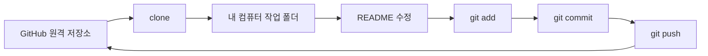
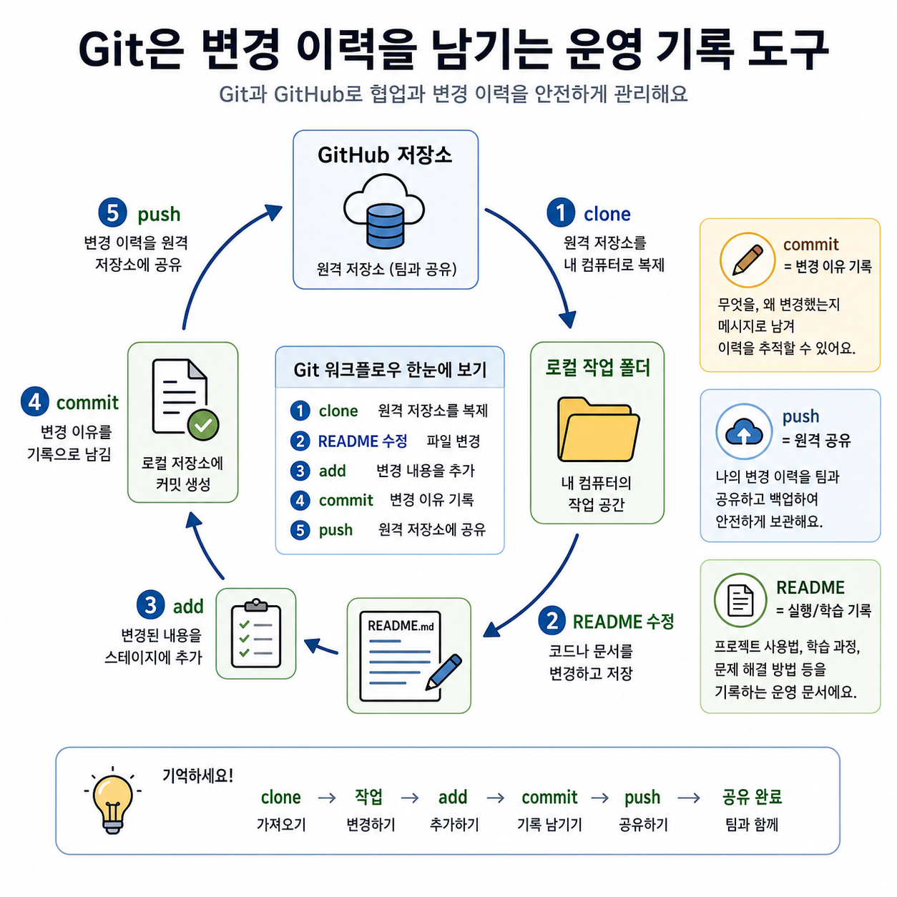

# 6교시: Git/GitHub 기본 실습 - repository, clone, commit, push, README

## 수업 목표
- Git(파일 변경 이력을 기록하는 버전 관리 도구) 설치 여부를 확인한다.
- GitHub repository(코드와 문서, 변경 이력을 담는 원격 저장소)를 생성한다.
- repository를 로컬로 clone(원격 저장소를 내 컴퓨터로 복사)한다.
- README를 수정하고 commit(변경 내용을 이유와 함께 저장한 기록)한다.
- 변경 사항을 GitHub로 push(로컬 변경 기록을 원격 저장소에 올리는 작업)한다.
- Git/GitHub를 운영 기록과 협업의 기본 도구로 이해한다.

## 사전 준비
- GitHub 계정 로그인
- VS Code 설치 완료
- VS Code 터미널 사용 가능
- Git 설치 또는 설치 가능 상태

## 공식 참고 자료
- GitHub Docs: Set up Git  
  https://docs.github.com/en/get-started/git-basics/set-up-git
- GitHub Docs: About repositories  
  https://docs.github.com/en/repositories/creating-and-managing-repositories/about-repositories
- GitHub Docs: Creating a new repository  
  https://docs.github.com/en/repositories/creating-and-managing-repositories/creating-a-new-repository
- GitHub Docs: Cloning a repository  
  https://docs.github.com/en/repositories/creating-and-managing-repositories/cloning-a-repository
- Git official book: Getting Started - Installing Git  
  https://git-scm.com/book/en/v2/Getting-Started-Installing-Git

## 실습 대상 스펙과 제약
Git:
- 로컬 컴퓨터에서 변경 이력을 관리하는 버전 관리 시스템이다.
- GitHub는 Git repository(저장소)를 원격에서 저장하고 협업하게 해주는 서비스다.

제약:
- Git이 설치되어 있지 않으면 `git --version`이 실패한다.
- GitHub 인증 방식은 HTTPS, SSH, GitHub CLI 등 여러 방식이 있다. 오늘은 초급 흐름에 맞춰 HTTPS 중심으로 진행한다.
- push 과정에서 인증 문제가 생기면 7~8교시 환경 점검에서 해결한다.

## 전체 실습 흐름
1. Git 설치 확인
2. GitHub repository 생성
3. repository URL 복사
4. 로컬 폴더 준비
5. clone
6. README 수정
7. status 확인
8. add/commit
9. push
10. GitHub 웹에서 변경 확인

## 단계별 절차
### 1. Git 설치 확인
```bash
git --version
```

기대 결과:
```text
git version x.y.z
```

실패하면:
- Git이 설치되어 있지 않거나 PATH에 잡히지 않은 것이다.
- 공식 문서 또는 Git 설치 페이지를 보고 설치한다.

### 2. GitHub repository 생성
1. GitHub 로그인
2. New repository 선택
3. repository name 입력: `cloud-native-week1`
4. Public 또는 Private 선택
5. `Add a README file` 선택
6. Create repository 클릭

### 3. clone
GitHub repository의 Code 버튼에서 HTTPS URL을 복사한다.

```bash
git clone <repository-url>
```

예:
```bash
git clone https://github.com/<username>/cloud-native-week1.git
```

### 4. README 수정
```bash
cd cloud-native-week1
```

VS Code에서 `README.md`를 열고 다음 내용을 추가한다.

```markdown
## Week 1 Day 1
- 오늘 배운 것:
- 설치 완료:
- 아직 막힌 것:
```

### 5. 변경 확인, commit, push
```bash
git status
git add README.md
git commit -m "docs: add week1 day1 learning note"
git push
```

## Mermaid: Git 기본 흐름


## 쉬운 비유
Git은 작업 일지를 남기는 방식과 비슷하다.

- clone(원격 저장소를 내 컴퓨터로 복사)은 공동 파일함에서 내 작업 책상으로 자료를 가져오는 것이다.
- README 수정은 오늘 작업 내용을 문서에 적는 것이다.
- add는 이번 기록에 포함할 변경을 고르는 것이다.
- commit은 "왜 바꿨는지"를 적어 작업 일지에 남기는 것이다.
- push는 내 작업 일지를 공동 파일함에 다시 올리는 것이다.

비유의 한계:
- Git은 단순 파일 복사보다 강력하다. 여러 사람이 동시에 변경한 이력을 비교하고 합칠 수 있다.
- 이 과정에서는 먼저 기본 기록 흐름을 익히고, 충돌과 브랜치는 이후 필요할 때 확장한다.

## imagegen 인포그래픽
이 인포그래픽은 작업 일지 비유를 Git/GitHub 흐름에 대응시킨다. 공동 파일함은 GitHub 저장소, 내 작업 책상은 로컬 폴더, 작업 일지는 commit, 공유는 push에 해당한다.

저장 위치:
- `week1/day1/assets/lesson-06-git-workflow.png`



## 체크포인트
- `git --version`이 성공한다.
- GitHub repository가 생성되어 있다.
- 로컬 폴더에 repository가 clone되어 있다.
- README 수정 후 `git status`에서 변경이 보인다.
- `git push` 후 GitHub 웹에서 README 변경 내용이 보인다.

## 50분 실습 운영 흐름
- 0~5분: Git과 GitHub의 역할 차이 설명
- 5~12분: `git --version` 확인과 미설치 학생 분류
- 12~20분: GitHub repository 생성
- 20~30분: clone과 로컬 폴더 확인
- 30~38분: README 수정, status, add, commit
- 38~45분: push와 GitHub 웹 확인
- 45~50분: 인증 실패/설치 실패/성공 학생 분류 후 7교시 점검으로 연결

## 흔한 오류와 해결
| 오류 | 가능한 원인 | 확인/해결 |
|---|---|---|
| `git: command not found` | Git 미설치 또는 PATH 문제 | Git 설치 후 터미널 재시작 |
| repository not found | URL 오류 또는 권한 문제 | GitHub URL과 로그인 계정 확인 |
| authentication failed | 인증 방식 문제 | GitHub 로그인, credential manager, token 여부 확인 |
| nothing to commit | 파일 저장 안 됨 또는 변경 없음 | README 저장 여부 확인 |
| push rejected | 원격 변경과 로컬 변경 충돌 | `git status`, `git remote -v` 결과를 기준으로 상태 확인 |

## 비용/보안/정리
- GitHub repository에는 비밀번호, API key, token, AWS credential을 절대 올리지 않는다.
- Public repository는 누구나 볼 수 있다는 전제로 작성한다.
- Private repository도 보안 저장소가 아니다. 민감정보는 별도 secret 관리 방식을 써야 한다.

## 운영 관점 정리
Git commit은 단순 저장이 아니라 변경의 기록이다. 인프라 운영에서도 누가, 언제, 왜 설정을 바꿨는지 기록이 중요하다. 6주차 Terraform에서 이 기록의 중요성이 다시 나온다.
