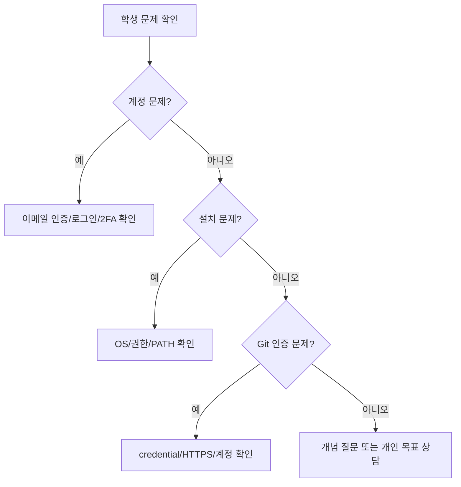
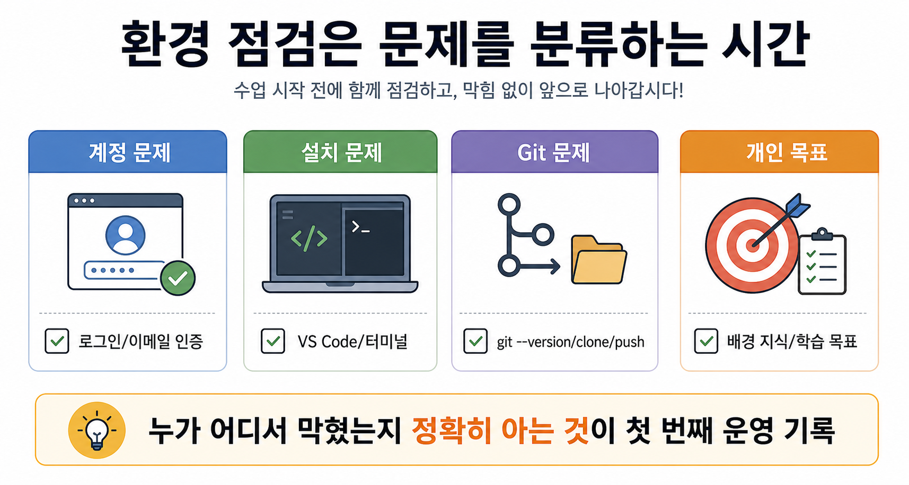

# 7교시: 개인 면담 및 환경 점검 - 설치 상태, 배경 지식, 개인 목표 정리

## 수업 목표
- 학생별 설치 상태와 계정 상태를 확인한다.
- 학생의 배경 지식과 목표를 파악한다.
- GitHub, VS Code, Git 실습에서 막힌 지점을 기록한다.
- 보충이 필요한 학생과 빠르게 진행 가능한 학생을 구분한다.

## 운영 방식
이 교시는 강의식 설명보다 면담과 점검 중심으로 진행한다. 모든 학생이 같은 속도로 진행하지 않아도 된다. 1일차의 목표는 완벽한 이해가 아니라, 이후 실습을 진행할 수 있는 최소 환경과 질문 경로를 만드는 것이다.

## 공식 참고 자료
- GitHub Docs: Getting started with your GitHub account  
  https://docs.github.com/en/get-started/onboarding/getting-started-with-your-github-account
- GitHub Docs: Set up Git  
  https://docs.github.com/en/get-started/git-basics/set-up-git
- Visual Studio Code Docs: Integrated Terminal  
  https://code.visualstudio.com/docs/terminal/basics

## 면담 질문
아래 질문은 평가가 아니라 과정에 들어가기 전 필요한 준비물을 확인하는 체크인에 가깝다. 해외여행 전에 여권, 항공권, 충전기, 일정표를 확인하듯이 GitHub, VS Code, Git, 개인 목표를 함께 점검한다. 지금 무엇을 알고 있는지보다, 앞으로 실습을 진행하기 위해 어떤 도구와 도움이 필요한지 확인하는 것이 목적이다.


아래 질문을 기준으로 현재 상태와 학습 목표를 짧게 정리한다.

- 전공 또는 이전 업무 경험이 있는가?
- Linux 터미널을 사용해본 적이 있는가?
- Git/GitHub를 사용해본 적이 있는가?
- Docker 또는 AWS를 사용해본 적이 있는가?
- 이 과정이 끝났을 때 어떤 일을 설명하거나 수행하고 싶은가?
- 오늘 설치에서 막힌 지점은 무엇인가?

## 환경 점검 체크리스트
| 항목 | 확인 방법 | 상태 |
|---|---|---|
| GitHub 로그인 | 브라우저에서 GitHub 프로필 접근 | 완료/미완료 |
| 이메일 인증 | GitHub 설정 또는 인증 안내 확인 | 완료/미완료 |
| VS Code 실행 | 프로그램 실행 | 완료/미완료 |
| VS Code 터미널 | View > Terminal | 완료/미완료 |
| Git 설치 | `git --version` | 완료/미완료 |
| repository 생성 | GitHub 웹에서 확인 | 완료/미완료 |
| clone | 로컬 폴더 확인 | 완료/미완료 |
| commit/push | GitHub README 변경 확인 | 완료/미완료 |

## 문제 분류 기준


## 쉬운 비유
환경 점검은 병원 접수와 문진표 작성에 가깝다.

- GitHub 로그인 문제는 신분 확인 문제다.
- VS Code 설치 문제는 진료실에 들어갈 준비가 안 된 상태다.
- Git 문제는 검사 장비가 동작하지 않는 상태다.
- 개인 목표 확인은 어떤 치료나 훈련이 필요한지 파악하는 과정이다.

비유의 한계:
- 수업 환경 문제는 한 가지 원인만 있는 경우보다 여러 조건이 겹치는 경우가 많다.
- 그래서 체크리스트로 상태를 나누어 기록한다.

## imagegen 인포그래픽
이 인포그래픽은 문진표 비유를 환경 점검에 대응시킨다. 계정, 설치, Git, 개인 목표를 각각 다른 점검 항목으로 나누어 어디서 막혔는지 빠르게 파악한다.

저장 위치:
- `week1/day1/assets/lesson-07-environment-check.png`
- `week1/day1/assets/lesson-07-travel-interview-checkin.png`



## 50분 면담 운영 흐름
- 0~5분: 점검 방식 안내, 학생별 상태 기록표 배포
- 5~15분: GitHub 계정/이메일 인증 문제 학생 우선 점검
- 15~25분: VS Code 설치/터미널 문제 학생 점검
- 25~35분: Git 설치와 `git --version` 문제 학생 점검
- 35~43분: repository, clone, commit, push 문제 학생 점검
- 43~50분: 학생별 미해결 문제를 8교시 보충 그룹으로 분류

## 상태 기록 양식
학생별 상태는 다음 형식으로 간단히 기록한다.

```markdown
## 학생 환경 점검 기록
- 이름:
- GitHub:
- VS Code:
- Git:
- repository:
- 막힌 문제:
- 보충 필요 여부:
- 개인 목표:
```

## 흔한 상황과 대응
| 상황 | 대응 |
|---|---|
| GitHub 계정 생성 제한 | 다른 네트워크/브라우저 시도, GitHub 안내 확인 |
| 이메일 인증 지연 | 스팸함 확인, 인증 재전송 |
| Git 설치했지만 명령 실패 | 터미널 재시작, PATH 확인 |
| push 인증 실패 | GitHub 계정, credential manager, HTTPS URL 확인 |
| 학생이 너무 빠름 | README를 더 자세히 작성하게 하거나 GitHub profile 정리 과제 부여 |

## DevOps 원칙 연결
- 비용 절감: 초반 환경 문제를 빨리 발견하면 이후 실습 지연과 불필요한 클라우드 리소스 생성을 줄일 수 있다.
- 개발/배포 효율성: 모든 학생이 같은 최소 도구를 갖추면 이후 실습 속도가 올라간다.
- 관리 효율성: 학생별 환경 상태를 기록하면 보충 수업과 문제 대응이 쉬워진다.

## 마무리 정리
이 시간의 목표는 "모두 완벽하게 끝내기"가 아니라 "누가 어디서 막혔는지 정확히 아는 것"이다. 막힌 지점을 정확히 기록하면 8교시 보충 실습에서 빠르게 처리할 수 있다.
