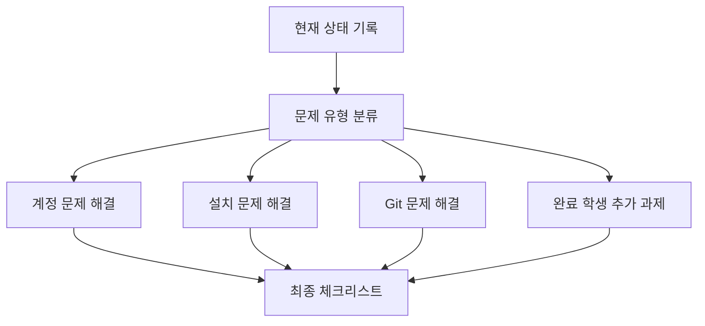
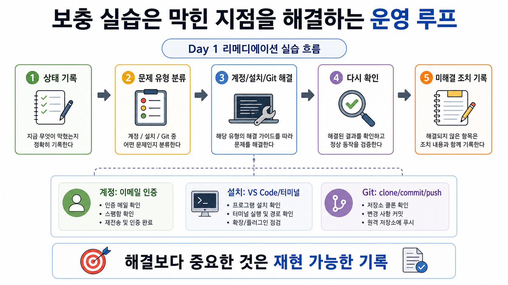

# 8교시: 개인 면담 및 보충 실습 - GitHub, VS Code, Git 설정 문제 해결

## 수업 목표
- 7교시에서 발견한 설치/계정/Git 문제를 해결한다.
- 해결하지 못한 문제는 다음 날 수업 전까지의 조치 계획으로 정리한다.
- 모든 학생이 최소한 GitHub 로그인, VS Code 실행, Git 설치 확인 중 어디까지 되었는지 명확히 기록한다.
- 빠르게 완료한 경우 README 품질 개선과 학습 기록을 추가한다.

## 운영 방식
이 교시는 보충 실습 시간이다. 긴 설명보다 문제 유형별로 상태를 나누고, 막힌 지점을 해결하거나 다음 조치를 기록하는 데 집중한다.

그룹 예시:
- A그룹: GitHub 계정/이메일 인증 문제
- B그룹: VS Code 설치/터미널 문제
- C그룹: Git 설치/PATH 문제
- D그룹: clone/commit/push 인증 문제
- E그룹: 완료 후 추가 정리 과제

## 공식 참고 자료
- GitHub Docs: Getting started with your GitHub account  
  https://docs.github.com/en/get-started/onboarding/getting-started-with-your-github-account
- GitHub Docs: Set up Git  
  https://docs.github.com/en/get-started/git-basics/set-up-git
- GitHub Docs: Caching your GitHub credentials in Git  
  https://docs.github.com/en/get-started/git-basics/caching-your-github-credentials-in-git
- VS Code Docs: Integrated Terminal  
  https://code.visualstudio.com/docs/terminal/basics

## 보충 실습 절차
### 1. 현재 상태 확인
학생은 아래 항목을 자신의 README 또는 메모장에 적는다.

```markdown
## Day 1 Environment Status
- GitHub login: done / blocked
- Email verification: done / blocked
- VS Code install: done / blocked
- VS Code terminal: done / blocked
- Git version: done / blocked
- Repository created: done / blocked
- Clone/commit/push: done / blocked
- Current blocker:
```

### 2. 문제별 해결
#### GitHub 계정 문제
- 이메일 주소 오타 확인
- 스팸함 확인
- 인증 메일 재전송
- 다른 브라우저 또는 네트워크 시도

#### VS Code 문제
- 설치 파일이 운영체제에 맞는지 확인
- 설치 권한 확인
- 프로그램 실행 확인
- 터미널 메뉴 위치 확인

#### Git 문제
```bash
git --version
```

실패 시:
- Git 설치 여부 확인
- 터미널 재시작
- PATH 문제 확인

#### clone/commit/push 문제
```bash
git status
git remote -v
```

확인할 것:
- 현재 폴더가 repository 내부인지
- remote URL이 맞는지
- GitHub 로그인 계정과 repository 소유자가 맞는지

## 완료 학생 추가 과제
빠르게 끝난 학생은 다음을 수행한다.

1. README에 오늘 배운 내용 정리
2. "내가 생각하는 DevOps" 5줄 작성
3. 오늘 막힌 오류가 없었다면, 예상 가능한 오류 2개와 확인 방법 작성
4. GitHub profile의 README 또는 bio 정리 여부 확인

## Mermaid: 보충 실습 진행 흐름


## 쉬운 비유
보충 실습은 정비소에서 차량 문제를 분류하고 다시 시동을 걸어보는 과정과 비슷하다.

- 상태 기록은 차량 증상을 적는 접수표다.
- 문제 유형 분류는 엔진, 전기, 타이어처럼 점검 구역을 나누는 일이다.
- 계정/설치/Git 해결은 각 부품을 점검하고 조정하는 과정이다.
- 다시 확인은 수리 후 시동을 걸어보는 단계다.
- 미해결 조치 기록은 다음 정비를 위한 작업 기록이다.

비유의 한계:
- 소프트웨어 환경은 차량보다 눈에 보이지 않는 상태가 많다.
- 그래서 명령어 출력, 인증 상태, 오류 메시지를 기록해야 한다.

## imagegen 인포그래픽
이 인포그래픽은 정비소 비유를 보충 실습 운영 루프에 대응시킨다. 상태 기록, 문제 유형 분류, 해결, 재확인, 미해결 조치 기록이 반복되는 흐름을 보여준다.

저장 위치:
- `week1/day1/assets/lesson-08-remediation-loop.png`



## 수업 종료 전 체크리스트
- GitHub 로그인 가능 여부 기록
- VS Code 실행 가능 여부 기록
- Git 설치 확인 여부 기록
- repository 생성 여부 기록
- clone/commit/push 성공 여부 기록
- 미해결 문제와 다음 조치 기록

## 50분 보충 운영 흐름
- 0~5분: 7교시에서 분류한 문제 그룹 확인
- 5~15분: GitHub 계정/이메일 인증 문제 처리
- 15~25분: VS Code 설치/터미널 문제 처리
- 25~35분: Git 설치/PATH 문제 처리
- 35~43분: clone/commit/push 인증 문제 처리
- 43~48분: 완료 학생 README 추가 과제 확인
- 48~50분: 미해결 문제의 다음 조치와 2일차 전 준비사항 안내

## 비용/보안/정리
- 오늘은 비용 발생 리소스를 만들지 않는다.
- GitHub 공개 저장소에 개인 정보나 secret을 올리지 않는다.
- 화면 공유 시 이메일 인증 코드, password, token이 노출되지 않게 한다.

## 운영 관점 정리
인프라 운영에서 가장 위험한 상태는 "안 되는 것은 아는데 어디서 막혔는지 모르는 상태"다. 오늘의 보충 실습은 설치를 끝내는 시간이기도 하지만, 더 중요하게는 문제를 분류하고 기록하는 훈련이다.

## 다음 수업 연결
2일차에는 컴퓨팅, 네트워크, 스토리지, 프로세스, 포트, HTTP 흐름을 다룬다. 오늘 GitHub와 VS Code가 준비되어 있어야 이후 실습 기록과 코드 저장을 안정적으로 이어갈 수 있다.
