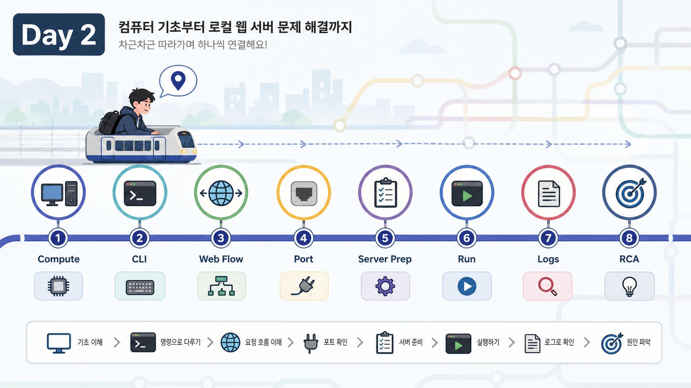
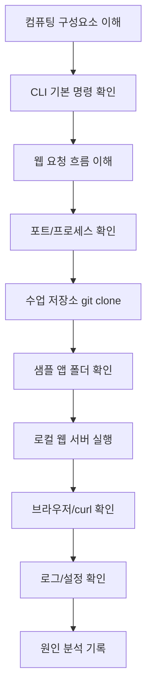

# Week 1 Day 2: 컴퓨팅 기본기와 로컬 웹 서버 실행

## Overview
2일차는 "내 컴퓨터에서 웹 서비스가 실행되고 접속되는 과정"을 직접 확인한다. CPU, Memory, Disk, Network, Process 같은 컴퓨팅 구성요소를 먼저 이해하고, Linux/CLI 명령으로 상태를 관찰한 뒤, 브라우저와 `curl`로 로컬 웹 서버에 접속한다.

이 날의 핵심은 개발자가 코드를 작성하는 방식보다 인프라 엔지니어가 실행 조건, 포트, 프로세스, 로그, 설정을 어떻게 확인하는지에 있다.

## Learning Goals
- 컴퓨팅 구성요소가 애플리케이션 실행과 어떻게 연결되는지 설명한다.
- CLI에서 현재 위치, 파일, 프로세스, 네트워크 요청을 확인한다.
- Browser, DNS, IP, TCP, HTTP, Server, Response의 흐름을 설명한다.
- `localhost`, `0.0.0.0`, port, process, listen 상태를 구분한다.
- 샘플 웹 앱을 로컬에서 실행하고 브라우저와 `curl`로 확인한다.
- 로그, 설정, 환경변수, secret의 차이를 설명한다.
- 재현, 관찰, 가설, 검증, 수정, 기록 흐름으로 기본 장애를 분석한다.

## Lesson Index
- 1교시: 컴퓨팅의 기본 - CPU, Memory, Disk, Network, Process가 애플리케이션과 만나는 방식
- 2교시: Linux/CLI 기본 - `pwd`, `ls`, `cd`, `cat`, `grep`, `curl`, `ps`, `kill`, 환경변수, 권한
- 3교시: 웹 서비스의 기본 흐름 - Browser, DNS, IP, TCP, HTTP, Server, Response
- 4교시: 포트와 프로세스 - `localhost`, `0.0.0.0`, port binding, listen 상태 확인
- 5교시: 로컬 웹 서버 실행 준비 - 런타임 설치 여부 확인, 샘플 앱 확인, 실행 명령 확인
- 6교시: 로컬 웹 서버 실행 실습 - 브라우저와 `curl` 접속 확인, 포트 충돌 관찰
- 7교시: 로그와 설정의 기본 - stdout 로그, 에러 메시지, config, secret, `.env`
- 8교시: 원인 분석 기본 라이프사이클 - 재현, 관찰, 가설, 검증, 수정, 기록

## Official References
- GNU Coreutils Manual  
  https://www.gnu.org/software/coreutils/manual/coreutils.html
- curl Documentation  
  https://curl.se/docs/
- MDN Web Docs: An overview of HTTP  
  https://developer.mozilla.org/en-US/docs/Web/HTTP/Guides/Overview
- MDN Web Docs: What is a domain name?  
  https://developer.mozilla.org/en-US/docs/Learn/Common_questions/Web_mechanics/What_is_a_domain_name
- Python Docs: `http.server`  
  https://docs.python.org/3/library/http.server.html
- IANA Service Name and Transport Protocol Port Number Registry  
  https://www.iana.org/assignments/service-names-port-numbers/service-names-port-numbers.xhtml
- The Twelve-Factor App: Config  
  https://12factor.net/config
- GitHub Docs: Ignoring files  
  https://docs.github.com/en/get-started/git-basics/ignoring-files

## Today's Key Terms
- CPU: 명령을 계산하는 처리 장치
- Memory: 실행 중인 데이터가 잠시 올라가는 공간
- Disk: 파일과 데이터를 저장하는 공간
- Network: 요청과 응답이 이동하는 통신 경로
- Process: 실행 중인 프로그램
- CLI: 명령어로 컴퓨터를 조작하는 인터페이스
- HTTP: 웹 요청과 응답을 주고받는 프로토콜
- Port: 한 컴퓨터 안에서 서비스 입구를 구분하는 번호
- Environment Variable: 실행 시점에 주입하는 설정값
- stdout/stderr: 프로그램의 일반 출력과 에러 출력 통로

자세한 용어 정리는 [Week 1 Glossary](../glossary.md)를 참고한다.

## Setup Flow
오늘은 비용이 발생하는 클라우드 리소스를 만들지 않는다. 모든 실습은 로컬 컴퓨터에서 진행한다.

## Required Files And Assets
- `lesson-01.md`: 컴퓨팅 기본
- `lesson-02.md`: Linux/CLI 기본
- `lesson-03.md`: 웹 서비스 흐름
- `lesson-04.md`: 포트와 프로세스
- `lesson-05.md`: 로컬 웹 서버 실행 준비
- `lesson-06.md`: 로컬 웹 서버 실행 실습
- `lesson-07.md`: 로그와 설정
- `lesson-08.md`: 원인 분석 라이프사이클
- `sample-app/`: 로컬 웹 서버 실습용 정적 웹 앱
- `assets/`: 교안용 이미지와 시각 자료

## Deliverables
- `sample-app`을 로컬 웹 서버로 실행한 화면
- `git clone https://github.com/niceguy61/kdt_devops_lecture_2026_rev2.git` 실행 결과
- `curl http://localhost:8000` 실행 결과
- 포트 충돌 또는 접속 실패 상황 1개 관찰 기록
- 로그/설정/환경변수 개념 정리
- 원인 분석 기록 1개

## End-Of-Day Checklist
- `pwd`, `ls`, `cd`, `cat`, `grep`을 사용할 수 있다.
- `curl`로 웹 서버 응답을 확인할 수 있다.
- `ps`로 프로세스를 찾고, 필요한 경우 안전하게 종료할 수 있다.
- `localhost:8000`과 포트의 의미를 설명할 수 있다.
- 샘플 앱 실행 방법을 README에 적을 수 있다.
- 에러 메시지를 복사해 원인 분석 기록에 남길 수 있다.
