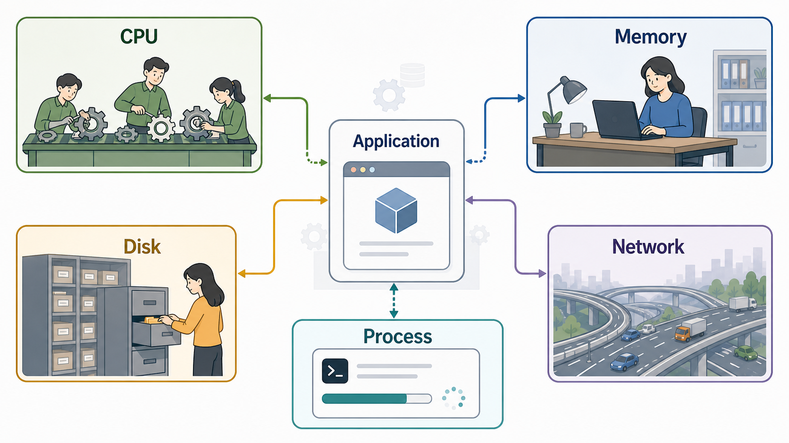
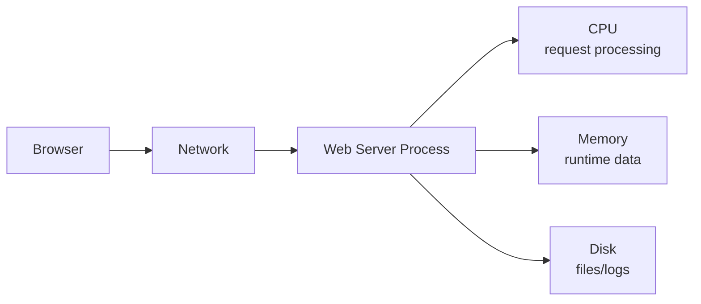

# 1교시: 컴퓨팅의 기본 - CPU, Memory, Disk, Network, Process

## 수업 목표
- 애플리케이션이 실행될 때 CPU, Memory, Disk, Network, Process가 어떤 역할을 하는지 설명한다.
- "서버가 느리다"는 말을 컴퓨팅 구성요소 관점으로 나누어 질문할 수 있다.
- Docker, Kubernetes, AWS에서 반복해서 등장할 Compute 개념의 바닥을 만든다.

## 시작 질문
- 웹 페이지가 늦게 열리면 CPU 문제일까, 네트워크 문제일까?
- 프로그램이 실행 중이라는 말은 컴퓨터 안에서 무엇이 일어난다는 뜻일까?
- 파일은 Disk에 있는데, 실행 중인 데이터는 왜 Memory에 올라갈까?

## 공식 참고 자료
- AWS Documentation: Compute services  
  https://docs.aws.amazon.com/whitepapers/latest/aws-overview/compute-services.html
- Linux man-pages project  
  https://www.kernel.org/doc/man-pages/
- GNU Coreutils Manual  
  https://www.gnu.org/software/coreutils/manual/coreutils.html
- procps-ng  
  https://gitlab.com/procps-ng/procps
- iproute2  
  https://wiki.linuxfoundation.org/networking/iproute2

## 컴포넌트 스펙과 제약
오늘은 특정 클라우드 서비스를 만들지 않는다. 대신 어떤 서버든 공통으로 갖는 실행 구성요소를 이해한다.

| 구성요소 | 한 줄 뜻 | 웹 서비스에서 보이는 현상 | 제약 |
|---|---|---|---|
| CPU | 명령을 계산하는 처리 장치 | 요청 처리, 암호화, 압축, 데이터 계산 | 한 번에 처리할 수 있는 작업량이 제한됨 |
| Memory | 실행 중인 데이터가 잠시 올라가는 공간 | 캐시, 세션, 실행 중 객체 | 부족하면 느려지거나 프로세스가 종료될 수 있음 |
| Disk | 파일과 데이터를 저장하는 공간 | HTML, 이미지, 로그, DB 파일 | 느린 디스크는 읽기/쓰기 병목이 됨 |
| Network | 요청과 응답이 이동하는 통신 경로 | 브라우저 접속, API 호출, 패키지 다운로드 | 지연, 방화벽, DNS, 대역폭 영향을 받음 |
| Process | 실행 중인 프로그램 | 웹 서버, DB, 백그라운드 작업 | 죽으면 서비스가 멈추고, 중복 실행 시 포트 충돌 가능 |

초급자는 "서버"를 하나의 덩어리로 생각하기 쉽다. 하지만 운영에서는 어느 구성요소가 병목인지 분리해서 봐야 한다. 같은 장애처럼 보여도 CPU 부족, Memory 부족, Disk 가득 참, Network 차단, Process 종료는 대응 방법이 다르다.

## 쉬운 비유
웹 애플리케이션을 작은 식당으로 비유한다.

- CPU: 주문을 처리하는 요리사다.
- Memory: 조리대다. 지금 만드는 음식과 재료가 올라와 있다.
- Disk: 창고다. 오래 보관할 재료와 장부가 있다.
- Network: 손님과 배달원이 드나드는 길이다.
- Process: 오늘 실제로 문을 열고 일하는 운영팀이다.

비유의 한계:
- 실제 컴퓨터는 사람이 아니라 운영체제와 하드웨어가 동시에 많은 일을 처리한다.
- 그래도 "어디가 막혔는지"를 나눠 보는 데에는 이 비유가 유용하다.

## imagegen 인포그래픽
이 인포그래픽은 실행 중인 애플리케이션을 중심에 두고 CPU, Memory, Disk, Network, Process가 어떤 역할로 연결되는지 보여준다.

저장 위치:
- `week1/day2/assets/lesson-01-compute-components.png`



## Mermaid: 실행 구성요소 관계


## 손으로 확인하기
오늘 명령 예제는 Linux, macOS 터미널, Git Bash 또는 WSL처럼 Unix 계열 명령을 사용할 수 있는 환경을 기준으로 진행한다. 중요한 것은 숫자를 외우는 것이 아니라 "무엇을 확인하는 명령인지"를 이해하는 것이다.

### 1. 현재 작업 위치와 파일 확인
애플리케이션을 실행하기 전에는 내가 어느 폴더에 있는지 먼저 확인한다. 잘못된 폴더에서 명령을 실행하면 "파일이 없다", "실행이 안 된다" 같은 문제가 생긴다.

```bash
pwd
ls
```

예상해서 볼 것:
- `pwd`는 현재 폴더 경로를 출력한다.
- `ls`는 현재 폴더의 파일과 하위 폴더를 출력한다.

실제 WSL 실행 예시:

```bash
$ pwd
/mnt/d/paperclip

$ ls week1/day2/sample-app
README.md
index.html
```

해석:
- 현재 작업 위치는 `/mnt/d/paperclip`이다.
- 샘플 앱 폴더에는 `README.md`와 `index.html`이 있다.

### 2. CPU 확인
CPU는 요청을 처리하는 계산 자원이다. 코어 수가 많을수록 동시에 처리할 수 있는 작업 여지가 커지지만, 애플리케이션 구조와 병목에 따라 체감 성능은 달라진다.

```bash
nproc
```

예상해서 볼 것:
- 숫자 하나가 출력된다.
- 예: `8`이면 논리 CPU 8개를 사용할 수 있다는 뜻이다.

실제 WSL 실행 예시:

```bash
$ nproc
24
```

해석:
- 이 WSL 환경에서는 논리 CPU 24개를 사용할 수 있다.
- 학생 PC에서는 `4`, `8`, `16`처럼 다른 값이 나올 수 있다.

조금 더 자세히 보려면 다음 명령을 사용한다.

```bash
lscpu
```

확인할 줄:
- `CPU(s)`
- `Model name`
- `Architecture`

실제 WSL 실행 예시:

```bash
$ lscpu | grep -E '^(Architecture|CPU\(s\)|Model name|Thread\(s\) per core|Core\(s\) per socket)'
Architecture:                         x86_64
CPU(s):                               24
Model name:                           AMD Ryzen 9 5900X 12-Core Processor
Thread(s) per core:                   2
Core(s) per socket:                   12
```

해석:
- `Architecture`는 CPU 아키텍처다.
- `CPU(s)`는 운영체제가 인식하는 논리 CPU 수다.
- `Thread(s) per core`가 2이면 한 코어가 2개의 논리 실행 단위로 보일 수 있다는 뜻이다.

macOS에서는 `lscpu`가 없을 수 있다. 그 경우 이 교시에서는 `sysctl -n hw.ncpu` 정도만 확인하고 넘어간다.

```bash
sysctl -n hw.ncpu
```

### 3. Memory 확인
Memory는 실행 중인 프로그램과 데이터가 올라가는 공간이다. Memory가 부족하면 프로그램이 느려지거나 종료될 수 있다.

```bash
free -h
```

예상해서 볼 것:
- `Mem:` 줄의 `total`, `used`, `available`
- `available`이 너무 작으면 새 프로세스 실행이 불안정할 수 있다.

실제 WSL 실행 예시:

```bash
$ free -h
               total        used        free      shared  buff/cache   available
Mem:            31Gi       6.2Gi       7.1Gi        80Mi        18Gi        25Gi
Swap:          8.0Gi          0B       8.0Gi
```

해석:
- 전체 Memory는 약 `31Gi`다.
- 현재 사용량은 `6.2Gi`다.
- `available`이 `25Gi`이므로 새 프로세스를 실행할 여유가 있는 상태로 볼 수 있다.

macOS에서는 `free`가 없을 수 있다. 그 경우 다음 명령으로 전체 메모리 크기만 확인한다.

```bash
sysctl -n hw.memsize
```

주의:
- `free -h`의 `used`가 높다고 무조건 장애는 아니다. Linux는 캐시 때문에 메모리를 적극적으로 사용할 수 있다.
- 운영에서는 `available`과 애플리케이션 로그, OOM(Out Of Memory, 메모리 부족으로 프로세스가 종료되는 상황) 흔적을 함께 본다.

### 4. Disk 확인
Disk는 파일, 로그, 데이터가 저장되는 공간이다. Disk가 가득 차면 로그를 쓰지 못하거나 데이터베이스가 멈출 수 있다.

```bash
df -h
```

예상해서 볼 것:
- `Size`, `Used`, `Avail`, `Use%`
- `Use%`가 90% 이상이면 정리나 증설 검토가 필요할 수 있다.

실제 WSL 실행 예시:

```bash
$ df -h .
Filesystem      Size  Used Avail Use% Mounted on
D:\             500G  142G  359G  29% /mnt/d/paperclip
```

해석:
- 현재 폴더는 호스트의 `D:\` 드라이브가 WSL에 마운트된 경로에 있다.
- 전체 500G 중 142G를 사용하고 있고, 사용률은 29%다.
- 이 정도 출력에서는 Disk 부족 문제로 보기는 어렵다.

현재 폴더 안 파일 크기를 확인한다.

```bash
du -sh .
```

예상해서 볼 것:
- 현재 폴더가 차지하는 전체 용량

실제 WSL 실행 예시:

```bash
$ du -sh week1/day2/sample-app
5.0K    week1/day2/sample-app
```

해석:
- 샘플 앱은 정적 HTML과 README만 있으므로 매우 작다.

### 5. Network 확인
Network는 요청과 응답이 이동하는 경로다. 로컬 실습에서도 네트워크 명령으로 연결 가능 여부를 확인한다.

```bash
ip addr
```

확인할 것:
- `lo`: 로컬 loopback 인터페이스
- `127.0.0.1`: 내 컴퓨터 자신을 가리키는 주소
- `inet`: 네트워크 인터페이스에 할당된 IP

실제 WSL 실행 예시:

```bash
$ ip -br addr
lo               UNKNOWN        127.0.0.1/8 ::1/128
eth0             UP             172.17.136.3/20 fe80::215:5dff:fe93:ad67/64
docker0          DOWN           172.18.0.1/16
```

해석:
- `lo`는 loopback 인터페이스다. `127.0.0.1`과 `localhost`가 여기와 연결된다.
- `eth0`는 WSL이 외부 네트워크와 통신할 때 사용하는 주요 인터페이스다.
- `docker0` 같은 인터페이스는 Docker를 설치한 환경에서 보일 수 있다.
- 실제 출력에는 더 많은 `br-*`, `veth*` 인터페이스가 나올 수 있다. Docker, Kubernetes, CNI 실습 환경이 있으면 네트워크 인터페이스가 많아지는 것이 정상이다.

macOS에서는 다음 명령을 사용한다.

```bash
ifconfig
```

외부 웹 사이트에 HTTP 요청을 보내 응답 헤더를 확인한다.

```bash
curl -I https://developer.mozilla.org/
```

예상해서 볼 것:
- `HTTP/`로 시작하는 상태 라인
- `200`, `301`, `302` 같은 status code
- 응답 헤더

실제 WSL 실행 예시:

```bash
$ curl -I https://developer.mozilla.org/
HTTP/2 302
location: /en-US/
content-type: text/plain; charset=utf-8
server: Google Frontend
content-length: 29
```

해석:
- `HTTP/2 302`는 요청이 다른 위치로 redirect된다는 뜻이다.
- `location: /en-US/`는 이동할 경로를 알려준다.
- 외부 사이트는 지역, 캐시, CDN 상태에 따라 응답 헤더가 달라질 수 있다.

주의:
- 이 명령이 실패했다고 바로 "인터넷이 안 된다"고 단정하지 않는다.
- DNS, 프록시, 방화벽, 인증서, 대상 서버 상태를 나누어 봐야 한다.

### 6. Process 확인
Process는 실행 중인 프로그램이다. 웹 서버도 실행되면 하나의 프로세스가 된다.

```bash
ps
```

더 자세히 보려면 다음 명령을 사용한다.

```bash
ps aux | head
```

확인할 열:
- `USER`: 실행한 사용자
- `PID`: 프로세스 ID
- `%CPU`: CPU 사용 비율
- `%MEM`: Memory 사용 비율
- `COMMAND`: 실행 명령

실제 WSL 실행 예시:

```bash
$ ps -eo pid,ppid,%cpu,%mem,comm --sort=-%cpu | head
    PID    PPID %CPU %MEM COMMAND
      2       1  100  0.0 bash
      1       0 80.0  0.0 bwrap
      3       2  0.0  0.0 ps
      4       2  0.0  0.0 head
```

해석:
- `PID`는 프로세스 ID다.
- `%CPU`와 `%MEM`은 현재 관찰 시점의 사용률이다.
- 수업 환경이나 실습 도구에 따라 `bash`, `python3`, `node`, `docker` 같은 프로세스가 보일 수 있다.

특정 프로세스를 찾는다.

```bash
ps aux | grep python
```

주의:
- `grep python` 명령 자체도 결과에 같이 보일 수 있다.
- 프로세스를 종료할 때는 PID와 COMMAND가 맞는지 먼저 확인한다.

### 7. 작은 서버를 실행해 구성요소 연결하기
아래 실습은 5~6교시에서 더 자세히 반복한다. 1교시에서는 컴퓨팅 구성요소가 실제 실행과 어떻게 연결되는지 미리 본다.

샘플 앱 폴더로 이동한다.

```bash
cd week1/day2/sample-app
```

웹 서버를 실행한다.

```bash
python3 -m http.server 8000
```

실제 WSL 실행 예시:

```bash
$ python3 --version
Python 3.12.3

$ python3 -m http.server 8000
Serving HTTP on 0.0.0.0 port 8000 (http://0.0.0.0:8000/) ...
```

해석:
- Python 3.12.3이 설치되어 있다.
- `0.0.0.0 port 8000`은 이 서버 프로세스가 8000번 포트에서 요청을 기다린다는 뜻이다.
- 이 터미널은 서버가 실행 중인 동안 입력 대기 상태로 남아 있다.

새 터미널을 열어 접속한다.

```bash
curl -I http://127.0.0.1:8000
```

실제 WSL 실행 예시:

```bash
$ curl -I http://127.0.0.1:8000
HTTP/1.0 200 OK
Server: SimpleHTTP/0.6 Python/3.12.3
Date: Sun, 31 May 2026 07:46:58 GMT
Content-type: text/html
Content-Length: 1287
Last-Modified: Sun, 31 May 2026 07:04:02 GMT
```

해석:
- `200 OK`는 서버가 정상적으로 응답했다는 뜻이다.
- `Content-type: text/html`은 HTML 문서를 돌려줬다는 뜻이다.
- `Content-Length: 1287`은 응답 본문의 크기다.

다시 프로세스를 확인한다.

```bash
ps -eo pid,ppid,%cpu,%mem,comm,args | grep 'python3 -m http.server'
```

실제 WSL 실행 예시:

```bash
$ ps -eo pid,ppid,%cpu,%mem,comm,args | grep 'python3 -m http.server'
4152123 3878751  0.0  0.0 python3  python3 -m http.server 8000
4156893 4156890  0.0  0.0 grep     grep python3 -m http.server
```

해석:
- `python3 -m http.server 8000` 줄이 실제 웹 서버 프로세스다.
- `grep python3 -m http.server` 줄은 검색 명령 자기 자신이므로 서버 프로세스가 아니다.

서버 실행 터미널에서 요청 로그를 확인한다. 브라우저나 `curl` 요청을 보낼 때마다 로그가 한 줄씩 늘어난다.

```text
127.0.0.1 - - [31/May/2026 16:46:58] "HEAD / HTTP/1.1" 200 -
```

구성요소 연결:
- CPU: 요청을 처리한다.
- Memory: Python 프로세스와 서버 실행 상태를 올려둔다.
- Disk: `index.html` 파일을 읽는다.
- Network: `localhost:8000` 요청과 응답이 오간다.
- Process: `python3 -m http.server 8000`이 실행 중이다.

정리할 때는 서버 실행 터미널에서 `Ctrl+C`를 누른다.

## 50분 강의 흐름
- 0~5분: "서버가 느리다"라는 보고를 구성요소 질문으로 바꾸기
- 5~17분: CPU, Memory, Disk, Network, Process 역할 설명
- 17~27분: 식당 비유와 인포그래픽 설명
- 27~42분: 명령어로 CPU, Memory, Disk, Network, Process 확인
- 42~47분: 작은 웹 서버 실행으로 구성요소 연결
- 47~50분: 확인 질문과 2교시 CLI로 연결

## DevOps 원칙 연결
- 비용 절감: 병목을 확인하지 않고 서버 크기만 키우면 비용이 낭비된다.
- 개발/배포 효율성: 실행 구성요소를 알면 개발팀과 장애 상황을 더 빨리 공유할 수 있다.
- 관리 효율성: CPU, Memory, Disk, Network, Process 단위로 점검표를 만들 수 있다.

## 확인 질문
- Process와 프로그램 파일은 무엇이 다른가?
- Memory 부족과 Disk 부족은 증상이 어떻게 다를 수 있는가?
- Network 문제가 있을 때 먼저 확인할 질문은 무엇인가?

## 마무리 정리
Cloud Native 도구는 이름이 달라도 결국 컴퓨팅 구성요소 위에서 동작한다. 다음 교시에서는 이 구성요소들을 CLI로 직접 확인하는 기본 명령을 익힌다.
