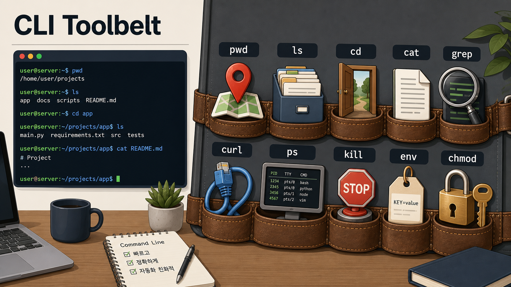
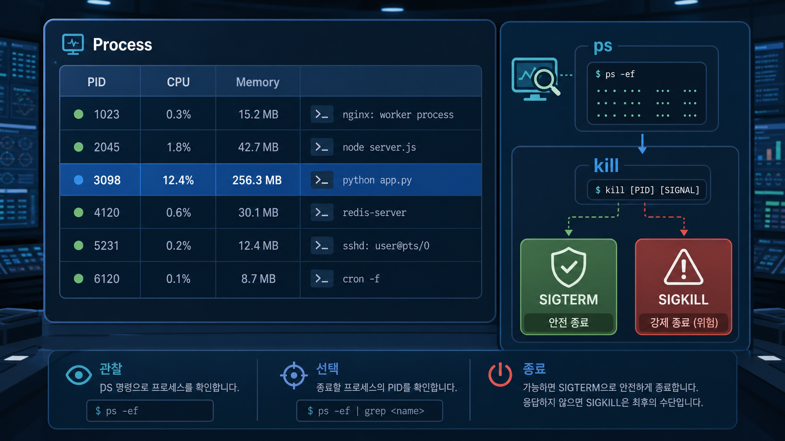

# 2교시: Linux/CLI 기본 - 상태를 확인하는 명령어 도구함

## 수업 목표
- CLI(Command Line Interface, 명령어 인터페이스)를 상태 확인 도구로 이해한다.
- `pwd`, `ls`, `cd`, `cat`, `grep`, `curl`, `ps`, `kill`의 목적을 설명한다.
- 환경변수와 권한이 실행 문제와 어떻게 연결되는지 이해한다.

## 공식 참고 자료
- GNU Coreutils Manual  
  https://www.gnu.org/software/coreutils/manual/coreutils.html
- curl Documentation  
  https://curl.se/docs/
- Linux man-pages project  
  https://www.kernel.org/doc/man-pages/
- GitHub Docs: Set up Git  
  https://docs.github.com/en/get-started/git-basics/set-up-git

## 명령어 스펙과 제약
CLI 명령은 운영체제와 shell에 따라 옵션과 출력이 다를 수 있다. 수업에서는 의미가 같은 명령을 중심으로 다룬다.

| 목적 | macOS/Linux/Git Bash | Windows PowerShell | 의미 |
|---|---|---|---|
| 현재 위치 | `pwd` | `Get-Location` | 내가 어느 폴더에 있는지 확인 |
| 파일 목록 | `ls` | `Get-ChildItem` | 폴더 안 파일 확인 |
| 폴더 이동 | `cd` | `Set-Location` 또는 `cd` | 작업 위치 변경 |
| 파일 보기 | `cat README.md` | `Get-Content README.md` | 파일 내용 출력 |
| 문자열 찾기 | `grep "port" README.md` | `Select-String "port" README.md` | 특정 단어 검색 |
| HTTP 요청 | `curl http://localhost:8000` | `curl.exe http://localhost:8000` | 웹 응답 확인 |
| 프로세스 보기 | `ps` | `Get-Process` | 실행 중 프로그램 확인 |
| 프로세스 종료 | `kill <PID>` | `Stop-Process -Id <PID>` | 실행 중 프로그램 종료 |

제약점:
- `kill`은 먼저 종료해도 되는 프로세스인지 확인한 뒤 사용한다.
- `curl`은 네트워크, DNS, 방화벽, 서버 상태에 따라 실패할 수 있다.
- 권한 문제는 명령어를 많이 입력한다고 해결되지 않는다. 필요한 권한과 정책을 확인해야 한다.

## 쉬운 비유
CLI는 엔지니어의 도구함이다.

- `pwd`는 현재 위치를 알려주는 지도다.
- `ls`는 서랍 안 목록을 보여주는 라벨이다.
- `cat`은 문서를 펼쳐보는 도구다.
- `grep`은 단어를 찾는 돋보기다.
- `curl`은 웹 서버에 직접 말을 걸어보는 전화기다.
- `ps`는 지금 일하는 사람 명단이다.
- `kill`은 일을 멈추라고 요청하는 정지 버튼이다.

비유의 한계:
- 실제 명령은 실수하면 파일 삭제나 프로세스 종료 같은 영향을 줄 수 있다.
- 오늘은 삭제 명령을 사용하지 않고 읽기와 확인 중심으로 진행한다.

## imagegen 인포그래픽
이 인포그래픽은 CLI 명령어를 엔지니어의 도구함으로 표현한다. 각 명령은 "무엇을 확인하려는가"와 연결해서 읽는다.

저장 위치:
- `week1/day2/assets/lesson-02-cli-toolbelt.png`
- `week1/day2/assets/lesson-02-process-control.png`



프로세스 종료는 별도 주의가 필요하다. 아래 이미지는 `ps`로 PID를 확인하고, `kill`로 종료 요청을 보내는 관계를 보여준다.



## 실습 명령
현재 폴더와 파일을 확인한다.

```bash
pwd
ls
```

샘플 앱 폴더로 이동한다.

```bash
cd week1/day2/sample-app
ls
cat README.md
```

README에서 `localhost` 단어를 찾는다.

```bash
grep "localhost" README.md
```

환경변수를 확인한다.

```bash
printenv
```

Windows PowerShell에서는:

```powershell
Get-ChildItem Env:
```

## 50분 강의 흐름
- 0~7분: CLI를 왜 배우는지 설명
- 7~20분: 위치/파일/내용 확인 명령 실습
- 20~30분: `grep`, 환경변수, 권한 개념 설명
- 30~40분: `ps`, `kill`, PID와 프로세스 종료 주의사항
- 40~47분: `curl`이 3교시 웹 흐름과 연결되는 방식 예고
- 47~50분: 명령어 목적 다시 말하기

## DevOps 원칙 연결
- 비용 절감: 상태 확인 없이 리소스를 새로 만들거나 재설치하는 일을 줄인다.
- 개발/배포 효율성: 실행 위치와 로그를 빠르게 확인하면 문제 전달이 빨라진다.
- 관리 효율성: 명령어는 자동화 스크립트와 IaC의 기초가 된다.

## 확인 질문
- `pwd`와 `ls`를 먼저 확인해야 하는 이유는 무엇인가?
- `curl`은 브라우저와 무엇이 다른가?
- `kill`을 쓰기 전에 확인해야 하는 것은 무엇인가?
