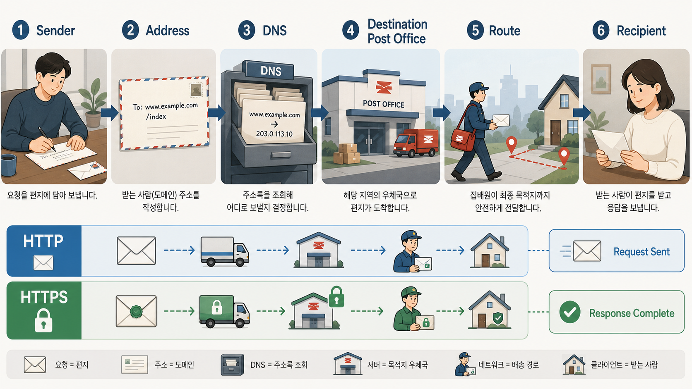
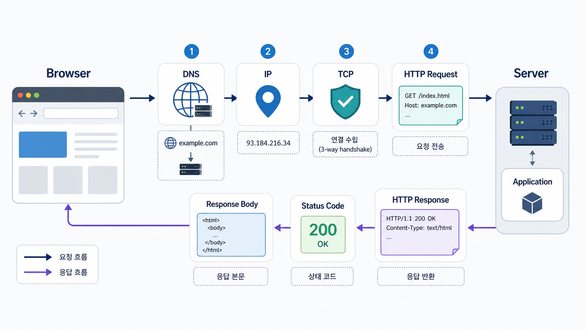
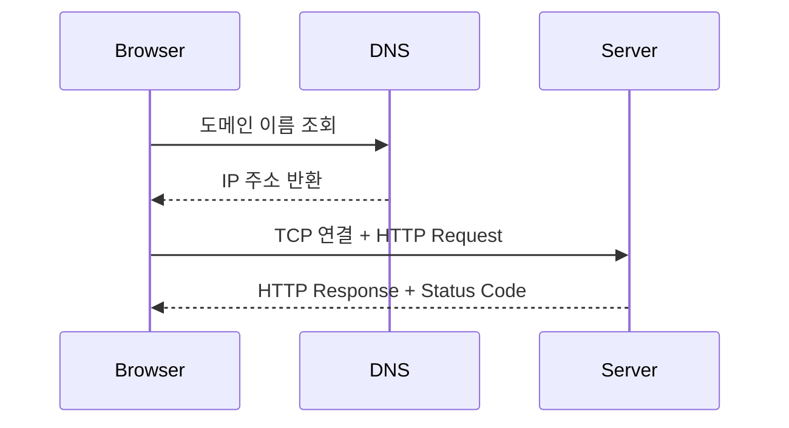
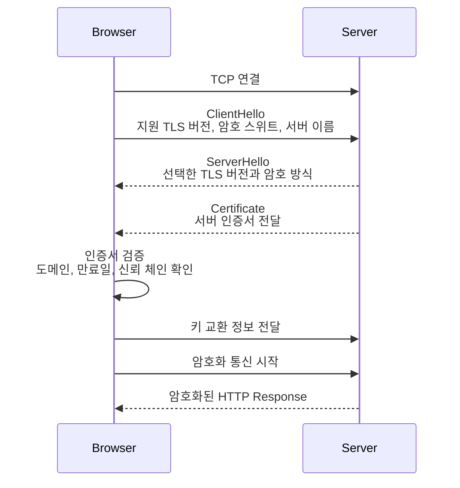

# 3교시: 웹 서비스의 기본 흐름 - Browser, DNS, IP, TCP, HTTP, Server, Response

## 수업 목표
- 브라우저에서 주소를 입력했을 때 요청이 서버까지 가는 흐름을 설명한다.
- DNS, IP, TCP, HTTP를 한 문장씩 구분한다.
- HTTP status code가 원인 분석의 첫 단서가 되는 이유를 이해한다.

## 공식 참고 자료
- MDN Web Docs: An overview of HTTP  
  https://developer.mozilla.org/en-US/docs/Web/HTTP/Guides/Overview
- MDN Web Docs: What is a domain name?  
  https://developer.mozilla.org/en-US/docs/Learn/Common_questions/Web_mechanics/What_is_a_domain_name
- MDN Web Docs: HTTP response status codes  
  https://developer.mozilla.org/en-US/docs/Web/HTTP/Reference/Status
- MDN Web Docs: HTTPS  
  https://developer.mozilla.org/en-US/docs/Glossary/HTTPS
- MDN Web Docs: TLS  
  https://developer.mozilla.org/en-US/docs/Glossary/TLS
- Cloudflare Learning Center: What happens in a TLS handshake?  
  https://www.cloudflare.com/learning/ssl/what-happens-in-a-tls-handshake/
- Korea.net: Media watchdog defends SNI blocking, denies internet censorship  
  https://www.korea.net/NewsFocus/policies/view?articleId=168066
- Open Net Korea: UN Special Rapporteur Expresses Concern over SNI Filtering  
  https://www.opennetkorea.org/en/wp/2737

## 컴포넌트 스펙과 제약
| 구성요소 | 의미 | 운영 관점에서 확인할 것 |
|---|---|---|
| Browser | 사용자가 요청을 보내는 클라이언트 | 주소, 캐시, 개발자 도구 |
| DNS | 이름을 IP로 찾는 체계 | 도메인이 올바른 IP로 가는가 |
| IP | 네트워크에서 목적지를 찾는 주소 | 서버 주소, 방화벽, 라우팅 |
| TCP | 연결을 맺고 데이터를 주고받는 전송 방식 | 포트 열림, 연결 실패 |
| HTTP | 웹 요청/응답 규칙 | method, path, status code, header, body |
| Server | 요청을 받아 처리하는 프로그램 | process, port, log, config |
| Response | 서버가 돌려주는 결과 | status code, body, error message |

제약점:
- 브라우저에 "안 됨"이라고 보이는 문제도 DNS, TCP, HTTP, 서버 내부 오류 중 어디서 실패했는지 나눠 봐야 한다.
- HTTP 상태 코드만으로 모든 원인을 알 수는 없다. 로그와 서버 상태를 함께 봐야 한다.

## 쉬운 비유
웹 요청은 우편을 보내는 과정과 비슷하다.

- Browser: 우편을 보내는 사람이다. 주소창에 목적지를 적는다.
- URL/Domain: 봉투에 적는 상대방 주소다. 예를 들어 `developer.mozilla.org` 같은 이름이다.
- DNS: 주소록을 보고 이 우편을 어느 목적지 우체국, 즉 어떤 IP로 보낼지 정하는 과정이다.
- IP: 실제 수신지 우체국의 주소다.
- TCP: 우편이 이동할 수 있는 길을 열고, 목적지까지 갈 수 있는지 확인하는 운송 경로다.
- HTTP Request: 봉투 안에 넣은 요청서다. 어떤 경로를 달라고 하는지, 어떤 방식으로 요청하는지가 들어 있다.
- HTTP와 HTTPS: 일반 우편과 등기의 차이처럼 이해할 수 있다. HTTP는 내용을 보호하지 않는 기본 전달이고, HTTPS는 암호화와 인증서 검증을 통해 더 안전하게 전달한다.
- Server: 수신지 우체국 또는 담당 부서처럼 요청을 받아 처리하는 곳이다.
- HTTP Response: 처리 결과를 돌려보내는 답장이다.
- Status Code: "전송 요청 접수", "다른 주소로 이동", "주소 없음", "처리 실패" 같은 완료 알림이다.

우편 비유로 보면 DNS는 "주소를 보고 어느 우체국으로 보낼지 정하는 단계"에 가깝고, TCP는 "그 우체국까지 실제로 이동할 수 있는 길을 여는 단계"에 가깝다. HTTP는 "봉투 안에 들어 있는 요청과 답장 형식"이고, status code는 "요청 처리 결과 알림"이다.

비유의 한계:
- HTTPS는 단순히 속도가 빠른 등기우편이라는 뜻이 아니다. 핵심은 암호화, 인증서, 무결성 확인이다.
- 실제 네트워크는 우편 배송보다 훨씬 빠르고 여러 계층이 동시에 동작한다.
- 그래도 "이름 찾기, 연결하기, 요청하기, 응답받기" 순서로 나누면 장애 위치를 좁힐 수 있다.



## imagegen 인포그래픽
이 인포그래픽은 브라우저 요청이 DNS, IP, TCP, HTTP를 거쳐 서버에 도달하고 응답으로 돌아오는 흐름을 보여준다.

저장 위치:
- `week1/day2/assets/lesson-03-web-request-flow.png`
- `week1/day2/assets/lesson-03-postal-web-flow.png`



## Mermaid: 요청 흐름


## 손으로 확인하기
수업 중 실행 중인 로컬 서버가 없다면 5~6교시에서 다시 실행한다.

```bash
curl -I https://developer.mozilla.org/
```

확인할 것:
- `HTTP/`로 시작하는 상태 라인
- `200`, `301`, `404`, `500` 같은 status code
- 응답 헤더

상태 코드 해석:
- `2xx`: 요청 성공
- `3xx`: 다른 위치로 이동
- `4xx`: 클라이언트 요청 문제
- `5xx`: 서버 처리 문제

## HTTP vs HTTPS
HTTP(HyperText Transfer Protocol)는 브라우저와 서버가 웹 요청과 응답을 주고받는 규칙이다. HTTPS(HTTP Secure)는 HTTP 메시지를 TLS(Transport Layer Security) 위에서 주고받아 통신 내용을 보호하는 방식이다.

우체국 비유로 다시 보면 HTTP는 봉투에 요청서를 넣어 보내는 기본 우편에 가깝다. 중간에서 누군가 봉투 내용을 볼 수 있거나 바꿀 위험이 있다. HTTPS는 봉투를 잠금 장치가 있는 보안 봉투에 넣고, 받는 우체국이 진짜 수신지가 맞는지 인증서로 확인한 뒤 전달하는 방식에 가깝다.

| 구분 | HTTP | HTTPS |
|---|---|---|
| 기본 URL | `http://example.com` | `https://example.com` |
| 기본 포트 | `80` | `443` |
| 데이터 보호 | 평문 전송이라 중간에서 내용이 노출될 수 있음 | TLS로 암호화되어 중간자가 내용을 보기 어려움 |
| 서버 신뢰 확인 | 별도 인증서 검증 없음 | 인증서로 접속한 서버가 신뢰 가능한지 확인 |
| 변조 방지 | 중간에서 내용이 바뀌어도 탐지하기 어려움 | TLS 무결성 검증으로 변조를 탐지 |
| 운영 확인 포인트 | 서버 응답, 포트 80, redirect 정책 | 인증서 만료일, 인증서 체인, SNI, 포트 443, TLS 설정 |

HTTPS가 제공하는 핵심:
- 암호화: 요청과 응답 내용을 중간에서 읽기 어렵게 만든다.
- 인증: 브라우저가 접속한 서버가 신뢰 가능한 인증서를 가진 서버인지 확인한다.
- 무결성: 통신 중 데이터가 바뀌었는지 탐지한다.

HTTPS가 보호하는 대표 정보:
- URL path: `/login`, `/payment` 같은 세부 경로
- query string: `?q=keyword` 같은 요청 파라미터
- request/response body: 로그인 요청, API 응답, HTML 내용
- cookie와 session token
- 대부분의 HTTP header

HTTPS가 항상 완전히 숨겨주지는 않는 정보:
- 접속한 IP 주소
- DNS 질의 정보
- TLS handshake 중 일부 메타데이터
- 과거 TLS 구성에서는 SNI(Server Name Indication, 하나의 IP에서 여러 도메인을 구분하기 위해 클라이언트가 보내는 서버 이름)가 평문으로 보일 수 있었다.

이 차이 때문에 HTTPS는 "내용을 보호하는 기술"이지, 모든 접속 사실을 완전히 숨기는 기술은 아니다. 최근에는 ECH(Encrypted ClientHello, TLS ClientHello 일부를 암호화해 SNI 노출을 줄이는 기술) 같은 흐름도 등장했지만, 모든 환경에서 항상 적용된다고 가정하면 안 된다.

## 국내 사례: 2019년 HTTPS/SNI 차단 논란
2019년 국내에서는 해외 불법 사이트 차단을 위해 SNI 정보를 활용하는 방식이 도입되며 논란이 있었다. 정부 측은 HTTPS 본문을 복호화해 들여다보는 방식이 아니며 불법 정보 차단을 위한 조치라고 설명했고, 시민사회와 국제 인권 전문가 쪽에서는 표현의 자유와 감시 가능성에 대한 우려를 제기했다.

이 사례에서 수업이 가져갈 기술적 포인트는 다음과 같다.

- HTTPS는 HTTP 본문, cookie, path, query, 응답 내용을 보호하기 때문에 중간자가 웹 페이지 내용을 쉽게 볼 수 없게 만든다.
- 하지만 과거 TLS 구성에서는 SNI처럼 접속 도메인을 추론할 수 있는 메타데이터가 보일 수 있었다.
- 그래서 웹 서비스 운영자는 가능한 한 HTTPS를 기본으로 적용하고, HTTP 접속은 HTTPS로 redirect하는 구성을 선호해야 한다.
- 수업과 실습에서도 특별한 이유가 없으면 `http://`보다 `https://`가 적용된 공식 문서와 웹 페이지를 우선 사용한다.
- 단, 로컬 실습의 `http://localhost:8000`은 학습 편의를 위한 예외다. 운영 서비스라면 HTTPS 적용을 기본 전제로 본다.

이 사례는 특정 정치적 평가보다 "암호화가 어디까지 보호하고, 어디부터 메타데이터로 남는가"를 이해하기 위한 사례로 다룬다.

## HTTPS 암호화는 어떻게 이루어지는가
HTTPS는 HTTP 메시지를 바로 암호화해서 보내는 것이 아니라, 먼저 TLS handshake로 안전한 통신 조건을 합의한 뒤 HTTP 요청과 응답을 암호화해 보낸다. 아래 흐름은 초급자를 위한 단순화된 설명이다. 실제 TLS 1.2, TLS 1.3의 세부 메시지와 왕복 횟수는 다르다.



핵심 개념:
- 인증서: 이 서버가 해당 도메인의 서버인지 확인하는 신분증 역할을 한다.
- 비대칭키/키 교환: 처음 안전하게 통신 키를 합의하기 위해 사용한다.
- 세션 키: 실제 HTTP 요청과 응답 본문을 빠르게 암호화하는 데 사용하는 대칭키다.
- 암호화된 HTTP: handshake 이후에는 요청 path, header, body, 응답 body가 암호화되어 전송된다.

운영자가 확인할 수 있는 명령:

```bash
curl -Iv https://example.com
```

확인할 것:
- TLS 버전: 예를 들어 `TLSv1.3`
- 인증서 subject 또는 issuer
- 인증서 검증 성공 여부
- 최종 status code

주의:
- 인증서 오류가 난다고 무조건 서버가 해킹된 것은 아니다. 만료, 도메인 불일치, 중간 인증서 누락, 사내 프록시 등 여러 원인이 있다.
- 반대로 자물쇠 아이콘이 있다고 서비스가 안전하게 설계되었다는 뜻도 아니다. HTTPS는 전송 구간 보호이고, 애플리케이션 권한, 입력 검증, secret 관리도 별도로 필요하다.

## 자주 나오는 질문: HTTPS는 암호화 때문에 느리지 않나요?
암호화와 복호화는 계산 작업이므로 비용이 있다. 브라우저와 서버가 TLS handshake를 하고, 세션 키를 합의하고, 이후 HTTP 요청과 응답을 암호화/복호화해야 하기 때문이다. 그래서 "보안 처리를 하면 항상 느려지는 것 아닌가?"라는 질문은 자연스럽다.

하지만 운영 환경에서는 다음 이유로 HTTPS를 기본값으로 본다.

1. DNS를 매 요청마다 항상 새로 조회하지 않는다.
   - 브라우저와 운영체제는 DNS 결과를 일정 시간 캐시할 수 있다.
   - DNS TTL(Time To Live, 캐시 유지 시간)에 따라 같은 도메인의 IP를 재사용할 수 있다.

2. TCP 연결을 매 요청마다 항상 새로 만들지 않는다.
   - HTTP keep-alive를 사용하면 같은 서버와의 연결을 일정 시간 재사용할 수 있다.
   - HTTP/2는 하나의 연결에서 여러 요청을 동시에 처리하는 multiplexing을 지원한다.

3. TLS handshake도 매번 전체 과정을 반복하지 않을 수 있다.
   - TLS session resumption을 사용하면 이전에 합의한 정보를 활용해 연결 비용을 줄일 수 있다.
   - TLS 1.3은 이전 세대보다 handshake 왕복 비용을 줄였다.

4. 암호화 처리는 많이 최적화되어 있다.
   - 현대 CPU, 운영체제, TLS 라이브러리, 브라우저, 로드밸런서는 HTTPS 처리를 매우 많이 최적화했다.
   - 대규모 서비스는 TLS 종료를 로드밸런서나 프록시 계층에서 처리하기도 한다.

5. HTTPS의 보안 이점이 비용보다 훨씬 크다.
   - 로그인, cookie, token, 결제, 개인정보, API 응답은 평문으로 흘러가면 안 된다.
   - 운영 관점에서는 "조금 더 빠른 HTTP"보다 "사용자와 서비스 데이터를 보호하는 HTTPS"가 기본 선택이다.

Packet 관점에서 아주 단순히 보면, 네트워크는 큰 데이터를 packet(네트워크가 전송하기 쉽게 나눈 작은 데이터 조각)으로 나누어 보낸다. HTTPS를 사용하면 HTTP 내용이 암호화된 상태로 packet에 담긴다. 중간 장비는 packet의 출발지와 목적지 같은 전송에 필요한 일부 정보는 볼 수 있지만, 암호화된 HTTP 본문 내용은 쉽게 읽을 수 없다.

정리하면 HTTPS는 초기 연결과 암호화/복호화 비용이 있다. 하지만 매번 DNS 조회부터 전체 TLS handshake까지 반복하는 구조는 아니며, 연결 재사용과 세션 재개, HTTP/2/HTTP/3, 하드웨어 최적화로 비용을 줄인다. 그래서 현대 웹 서비스에서는 HTTPS 적용을 예외가 아니라 기본값으로 본다.

운영자가 자주 만나는 HTTPS 문제:
- 인증서 만료: 브라우저가 "안전하지 않음" 또는 인증서 오류를 표시한다.
- 도메인 불일치: 인증서의 도메인과 접속한 도메인이 다르다.
- HTTP에서 HTTPS로 redirect 누락: 사용자가 `http://`로 접속했을 때 보안 접속으로 이동하지 않는다.
- 로드밸런서 또는 프록시 설정 오류: 외부는 HTTPS인데 내부 서버는 HTTP로 통신할 수 있어 어느 구간에서 TLS가 종료되는지 알아야 한다.

손으로 확인하기:

```bash
curl -I http://example.com
curl -I https://example.com
```

확인할 것:
- URL이 `http://`인지 `https://`인지
- status code가 `301`, `302`, `200` 중 무엇인지
- `location` header로 HTTPS redirect가 걸리는지
- HTTPS 요청에서 인증서 오류가 나는지

## HTTP Status Code 빠른 표
Status code는 서버가 요청을 어떻게 처리했는지 알려주는 짧은 결과 알림이다. 운영자는 status code를 보고 장애 위치를 처음으로 좁힌다.

| 범주 | 대표 코드 | 뜻 | 운영 관점에서 먼저 볼 것 |
|---|---|---|---|
| `2xx` | `200 OK` | 요청이 성공했다 | 응답 본문이 기대한 내용인지 확인 |
| `2xx` | `201 Created` | 새 리소스가 생성됐다 | 생성 API, 저장소, DB 반영 여부 확인 |
| `3xx` | `301 Moved Permanently` | 주소가 영구적으로 바뀌었다 | redirect 대상 URL, DNS/도메인 설정 확인 |
| `3xx` | `302 Found` | 임시로 다른 주소로 이동한다 | 로그인, 지역화, 임시 redirect 정책 확인 |
| `4xx` | `400 Bad Request` | 요청 형식이 잘못됐다 | 파라미터, JSON 형식, header 확인 |
| `4xx` | `401 Unauthorized` | 인증이 필요하거나 실패했다 | token, 로그인 상태, 인증 header 확인 |
| `4xx` | `403 Forbidden` | 인증은 되었지만 권한이 없다 | IAM, role, ACL, 접근 정책 확인 |
| `4xx` | `404 Not Found` | 요청한 경로나 리소스가 없다 | URL path, 라우팅, 정적 파일 위치 확인 |
| `4xx` | `429 Too Many Requests` | 요청이 너무 많아 제한됐다 | rate limit, retry 정책, 트래픽 급증 확인 |
| `5xx` | `500 Internal Server Error` | 서버 내부 처리 중 실패했다 | 애플리케이션 로그, 예외, 최근 배포 확인 |
| `5xx` | `502 Bad Gateway` | 중간 프록시/게이트웨이가 뒤 서버 응답을 못 받았다 | 로드밸런서, reverse proxy, upstream 상태 확인 |
| `5xx` | `503 Service Unavailable` | 서비스가 일시적으로 처리 불가하다 | 서버 다운, 배포 중, capacity, health check 확인 |
| `5xx` | `504 Gateway Timeout` | 중간 장비가 제한 시간 안에 응답을 못 받았다 | timeout, DB 지연, API 지연, 네트워크 경로 확인 |

주의:
- `4xx`라고 항상 사용자 잘못은 아니다. 서버의 라우팅 설정이나 인증 정책 문제일 수도 있다.
- `5xx`라고 항상 인프라 문제는 아니다. 애플리케이션 코드 예외일 수도 있다.
- status code는 출발점일 뿐이며, 로그, 요청 경로, 최근 변경, 프로세스 상태를 함께 확인해야 한다.

## 50분 강의 흐름
- 0~8분: 브라우저 주소 입력 후 일어나는 일 질문
- 8~20분: DNS, IP, TCP, HTTP 역할 설명
- 20~28분: 우체국 비유와 인포그래픽 설명
- 28~40분: HTTP와 HTTPS 차이, TLS handshake, SNI 논란 사례, HTTPS 성능 질문 설명
- 40~45분: `curl -I`로 상태 코드 확인
- 45~48분: `2xx`, `3xx`, `4xx`, `5xx`를 장애 분석 단서로 읽기
- 48~50분: 4교시 포트/프로세스와 연결

## DevOps 원칙 연결
- 비용 절감: 네트워크 문제와 애플리케이션 문제를 구분하면 불필요한 증설을 줄인다.
- 개발/배포 효율성: 상태 코드와 요청 경로를 공유하면 개발팀과 협업이 빨라진다.
- 관리 효율성: HTTP 흐름은 모니터링, 로드밸런서, Ingress 이해의 기본이다.

## 확인 질문
- DNS와 IP는 무엇이 다른가?
- HTTP와 HTTPS는 무엇이 다른가?
- TCP 연결 실패와 HTTP 500은 어떻게 다른가?
- `curl -I`는 무엇을 확인하는 데 유용한가?
