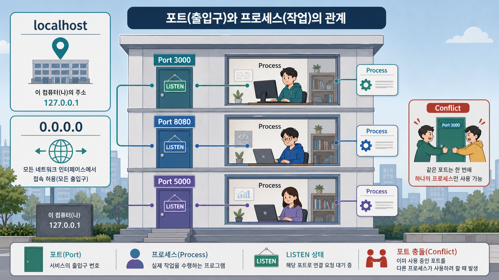
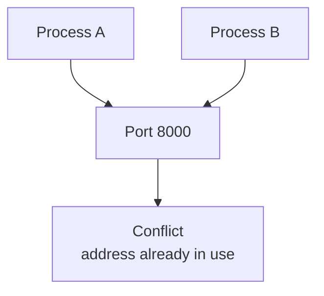
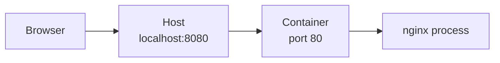
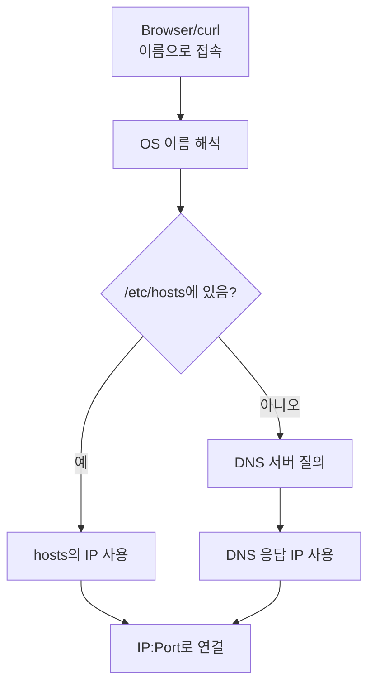

# 4교시: 포트와 프로세스 - localhost, 0.0.0.0, port binding, listen

## 수업 목표
- `localhost`, `0.0.0.0`, port, process, listen 상태를 구분한다.
- 포트 충돌이 왜 발생하는지 설명한다.
- 로컬 웹 서버 실행 전에 포트를 확인하는 습관을 만든다.

## 공식 참고 자료
- IANA Service Name and Transport Protocol Port Number Registry  
  https://www.iana.org/assignments/service-names-port-numbers/service-names-port-numbers.xhtml
- Python Docs: `http.server`  
  https://docs.python.org/3/library/http.server.html
- Linux man-pages project  
  https://www.kernel.org/doc/man-pages/
- Docker Docs: Publishing and exposing ports  
  https://docs.docker.com/get-started/docker-concepts/running-containers/publishing-ports/
- Linux man-pages: hosts file  
  https://man7.org/linux/man-pages/man5/hosts.5.html

## 핵심 개념
| 용어 | 뜻 | 예시 |
|---|---|---|
| `localhost` | 내 컴퓨터 자신을 가리키는 이름 | `http://localhost:8000` |
| `127.0.0.1` | 내 컴퓨터 자신을 가리키는 IPv4 주소 | 로컬 접속 확인 |
| `/etc/hosts` | 내 컴퓨터에서만 적용되는 로컬 이름-주소 매핑 파일 | `127.0.0.1 localhost` |
| `0.0.0.0` | 가능한 모든 네트워크 인터페이스에서 받겠다는 의미 | 개발 서버 bind 주소 |
| Port | 한 컴퓨터 안에서 서비스 입구를 구분하는 번호 | `8000`, `8080`, `3000` |
| Listen | 프로세스가 특정 포트에서 요청을 기다리는 상태 | 웹 서버 실행 중 |
| Port conflict | 같은 포트를 두 프로세스가 동시에 쓰려는 상황 | 이미 `8000` 사용 중 |

제약점:
- `localhost`에서 잘 된다고 외부에서도 접속 가능한 것은 아니다.
- `0.0.0.0`으로 바인딩하면 접근 범위가 넓어질 수 있으므로 보안 정책과 방화벽을 함께 봐야 한다.
- `/etc/hosts` 수정은 내 컴퓨터에만 적용된다. 팀원, 고객, 외부 사용자는 같은 설정을 공유하지 않는다.
- 포트 번호는 관습이 있다. 예를 들어 HTTP는 80, HTTPS는 443을 많이 쓴다.

## 쉬운 비유
컴퓨터를 건물로 보면 port는 출입문 번호다.

- `localhost`는 "이 건물 안에서 자기 자신을 부르는 주소"다.
- Process는 건물 안에서 실제로 일하는 직원이다.
- Port는 손님이 찾아가는 문 번호다.
- Listen은 직원이 문을 열고 손님을 기다리는 상태다.
- Port conflict는 두 직원이 같은 문을 동시에 쓰겠다고 다투는 상황이다.

은행 창구로도 이해할 수 있다. 은행 입구에 "8000번 창구로 오세요"라고 안내했는데, 같은 8000번 창구에 두 명의 상담사가 동시에 앉아 있다면 고객은 누구에게 업무를 맡겨야 할지 알 수 없다. 두 상담사가 같은 말을 동시에 듣고 서로 다른 처리를 한다면 더 위험하다. 그래서 운영체제는 보통 하나의 IP/Port 조합에 하나의 프로세스만 listen하도록 제한한다. 이 제한이 없으면 요청을 누구에게 전달할지 결정하는 추가 과정이 필요하고, 그만큼 홉과 판단 비용이 늘어난다.

Docker 맛보기로 보면, 컨테이너는 집 안의 안방, 작은방, 화장실, 거실처럼 격리된 공간에 가깝다. 밖에서 집으로 들어오는 사람은 "집 주소와 현관문 번호"를 보고 들어온다. 하지만 집 안에서는 실제로 안방에 갈지, 작은방에 갈지 내부 규칙이 필요하다. Docker의 port publishing은 호스트의 문 번호를 컨테이너 안의 문 번호로 연결하는 규칙이다.

예를 들어 다음 표현은 2주차 Docker에서 다시 나온다.

```bash
docker run -p 8080:80 nginx
```

이 명령은 "내 컴퓨터의 8080번 문으로 들어온 요청을 컨테이너 안의 80번 문으로 전달한다"는 뜻이다. 아직 Docker를 실행하지는 않는다. 오늘은 `8080:80`처럼 바깥 포트와 안쪽 포트가 다를 수 있다는 감각만 만든다.

비유의 한계:
- 실제 네트워크는 로컬, 사설망, 공인망, 방화벽, NAT가 함께 동작한다.
- Docker의 network namespace, bridge network, NAT는 2주차에 다시 다룬다.
- 오늘은 로컬 컴퓨터 안에서 포트와 프로세스 관계만 확인하고, Docker는 개념 맛보기로만 본다.

## imagegen 인포그래픽
이 인포그래픽은 컴퓨터를 건물로 보고, 포트를 문 번호, 프로세스를 문 뒤에서 일하는 서비스로 표현한다.

저장 위치:
- `week1/day2/assets/lesson-04-port-process-map.png`



## Mermaid: 포트 충돌


## Mermaid: Docker 포트 맛보기


이 그림에서 브라우저는 컨테이너 안의 80번 포트를 직접 알 필요가 없다. 사용자는 `localhost:8080`으로 접속하고, Docker가 그 요청을 컨테이너 내부 80번 포트로 전달한다.

## `/etc/hosts`: 내 컴퓨터의 로컬 주소록
`localhost`가 진짜로 `127.0.0.1`에 연결되어 있는지는 `/etc/hosts` 파일에서 확인할 수 있다. 이 파일은 DNS 서버에 물어보기 전에 내 컴퓨터가 먼저 참고할 수 있는 로컬 주소록에 가깝다.

일반적인 이름 해석 흐름은 아래처럼 이해하면 된다.

1. 브라우저나 `curl`이 `localhost` 또는 `dev.example.test` 같은 이름으로 접속을 시도한다.
2. 운영체제가 먼저 로컬 설정을 확인한다. 이때 `/etc/hosts`에 해당 이름이 있으면 그 IP를 사용한다.
3. `/etc/hosts`에 없으면 DNS resolver가 설정된 DNS 서버에 물어본다.
4. DNS 서버가 IP를 알려주면 그 IP로 연결을 시도한다.

그래서 `/etc/hosts`는 DNS보다 앞에서 동작하는 "내 컴퓨터 전용 우선 주소록"처럼 볼 수 있다. 이 순서 때문에 실제 DNS에 도메인을 등록하지 않아도 내 컴퓨터에서는 특정 이름을 원하는 IP로 임시 연결할 수 있다.



확인 명령:

```bash
cat /etc/hosts
```

실제 WSL 실행 예시:

```text
# This file was automatically generated by WSL.
127.0.0.1    localhost
127.0.1.1    DESKTOP-4SRFD38.localdomain    DESKTOP-4SRFD38

# The following lines are desirable for IPv6 capable hosts
::1     ip6-localhost ip6-loopback
```

위 출력은 WSL 환경 예시다. PC 이름과 추가 항목은 학생마다 다를 수 있다.

예상해서 볼 수 있는 줄:

```text
127.0.0.1 localhost
::1       ip6-localhost ip6-loopback
```

해석:
- `127.0.0.1 localhost`는 `localhost`라는 이름을 내 컴퓨터 자신인 `127.0.0.1`로 해석하라는 뜻이다.
- `::1 localhost`는 IPv6에서 내 컴퓨터 자신을 가리키는 loopback 주소다.
- 그래서 `http://localhost:8000`과 `http://127.0.0.1:8000`은 로컬 실습에서 비슷하게 동작할 수 있다.

도메인을 아직 실제 DNS에 연결하지 못했을 때 `/etc/hosts`를 임시로 사용할 수 있다. 예를 들어 개발 중인 서비스를 `dev.example.test`라는 이름으로 미리 확인하고 싶다면 로컬에서 다음과 같은 매핑을 둘 수 있다.

```text
127.0.0.1 dev.example.test
```

그 뒤 로컬 서버가 8000번 포트에서 실행 중이면 브라우저에서 다음처럼 접속해 볼 수 있다.

```text
http://dev.example.test:8000
```

하지만 이 방식에는 중요한 한계가 있다.

| 방식 | 적용 범위 | 장점 | 위험/한계 |
|---|---|---|---|
| `/etc/hosts` 수정 | 내 컴퓨터 한 대 | 실제 DNS 없이 이름 기반 테스트 가능 | 나만 되고 다른 사람은 안 될 수 있음 |
| 실제 DNS 레코드 등록 | DNS를 조회하는 사용자 전체 | 팀원, 서버, 고객이 같은 이름으로 접근 가능 | 도메인 소유, DNS 전파, TTL 관리 필요 |

운영 관점에서 특히 조심할 점:
- `/etc/hosts`로만 되는 상태를 "배포 완료"로 착각하면 안 된다.
- 내 컴퓨터에서는 `dev.example.test`가 열리는데 팀원 컴퓨터에서는 안 열릴 수 있다.
- 서버, CI/CD, 컨테이너 내부, Kubernetes Pod는 각자 다른 hosts/DNS 환경을 가질 수 있다.
- 실제 서비스라면 DNS 레코드, 인증서, 로드밸런서, 방화벽까지 함께 연결되어야 한다.
- `/etc/hosts`가 DNS보다 우선될 수 있으므로, 잘못된 hosts 항목이 남아 있으면 실제 DNS가 정상이어도 내 컴퓨터만 다른 곳으로 접속할 수 있다.

수업에서는 `/etc/hosts`를 직접 수정하지 않고 읽기 중심으로만 확인한다. 수정이 필요한 경우에는 백업과 원복 방법을 먼저 정하고 진행한다.

## 왜 포트 충돌은 허용하면 안 되는가
포트 충돌은 단순히 "명령이 실패했다"는 문제가 아니다. 운영 관점에서는 요청의 책임자가 모호해지는 문제다.

| 상황 | 현실 비유 | 운영상 문제 |
|---|---|---|
| 하나의 포트에 하나의 프로세스 | 8000번 창구에 상담사 1명 | 요청 담당자가 명확하다 |
| 하나의 포트에 두 프로세스가 listen 시도 | 8000번 창구에 상담사 2명 | 누가 응답해야 하는지 모호하다 |
| 임의로 중간 분배자를 둠 | 번호표 담당자가 다시 상담사를 고름 | 홉이 늘고, 분배 규칙과 장애 지점이 추가된다 |
| 명시적 로드밸런서 사용 | 은행이 공식 번호표 시스템을 둠 | 분배 책임이 명확하지만 별도 구성과 관찰이 필요하다 |

여러 프로세스가 같은 일을 처리해야 한다면 "같은 포트에 우연히 같이 붙는 방식"이 아니라 로드밸런서, reverse proxy, Kubernetes Service 같은 명시적인 분배 장치를 둔다. 이 장치들은 요청을 어떤 기준으로 어디에 보낼지 책임 있게 결정하고, 로그와 헬스체크로 관찰할 수 있어야 한다.

## 확인 명령
이 교시는 Linux/WSL 기준으로 진행한다.

```bash
ss -ltnp
```

특정 포트만 보고 싶다면:

```bash
ss -ltnp | grep ':8000'
```

출력에서 확인할 것:
- `LISTEN`: 프로세스가 요청을 기다리는 상태
- `Local Address:Port`: 어떤 주소와 포트에서 기다리는지
- `users:(...)`: 어떤 프로세스가 포트를 사용 중인지

프로세스 목록에서 서버를 찾는다.

```bash
ps -eo pid,ppid,%cpu,%mem,comm,args | grep 'http.server'
```

포트 사용 프로세스를 종료해야 한다면 먼저 PID와 대상이 맞는지 확인한다. 수업에서는 무작정 종료하지 않고, 실행 중인 로컬 실습 서버만 종료한다.

`localhost` 매핑도 확인한다.

```bash
cat /etc/hosts
```

확인할 것:
- `127.0.0.1 localhost`
- `::1 localhost`

포트 충돌을 일부러 만들어보는 흐름:

1. 첫 번째 터미널에서 서버 실행

```bash
cd week1/day2/sample-app
python3 -m http.server 8000
```

2. 두 번째 터미널에서 같은 포트로 다시 실행

```bash
cd week1/day2/sample-app
python3 -m http.server 8000
```

3. 예상되는 오류

```text
OSError: [Errno 98] Address already in use
```

해석:
- 이미 8000번 포트를 사용하는 프로세스가 있다.
- 새 서버를 실행하려면 기존 서버를 종료하거나 다른 포트를 사용해야 한다.

다른 포트를 사용하는 예:

```bash
python3 -m http.server 8001
```

이제 접속 주소도 바뀐다.

```text
http://localhost:8001
```

## 50분 강의 흐름
- 0~8분: 주소 뒤의 `:8000`이 무엇인지 질문
- 8~18분: localhost, 0.0.0.0, port, process, listen 설명
- 18~26분: `/etc/hosts`로 localhost 매핑 확인
- 26~33분: 건물/문 번호와 은행 창구 비유, 인포그래픽 설명
- 33~40분: 포트 확인 명령 소개
- 40~46분: 포트 충돌 시나리오 설명과 실습
- 46~48분: Docker port publishing 맛보기
- 48~50분: 5교시 로컬 서버 준비와 연결

## DevOps 원칙 연결
- 비용 절감: 접속 실패를 서버 증설로 오해하지 않고 포트/프로세스 상태부터 확인한다.
- 개발/배포 효율성: 포트 규칙을 문서화하면 실행과 배포가 쉬워진다.
- 관리 효율성: 로컬 포트 개념은 Docker port binding과 Kubernetes Service 이해로 이어진다.

## 확인 질문
- `localhost:8000`에서 `8000`은 무엇인가?
- `localhost`와 `0.0.0.0`은 무엇이 다른가?
- 포트 충돌이 발생하면 무엇을 먼저 확인해야 하는가?
- Docker의 `8080:80`은 바깥 포트와 안쪽 포트 중 무엇을 의미하는가?
- `/etc/hosts`로 도메인을 연결했을 때 왜 다른 사람은 접속하지 못할 수 있는가?
