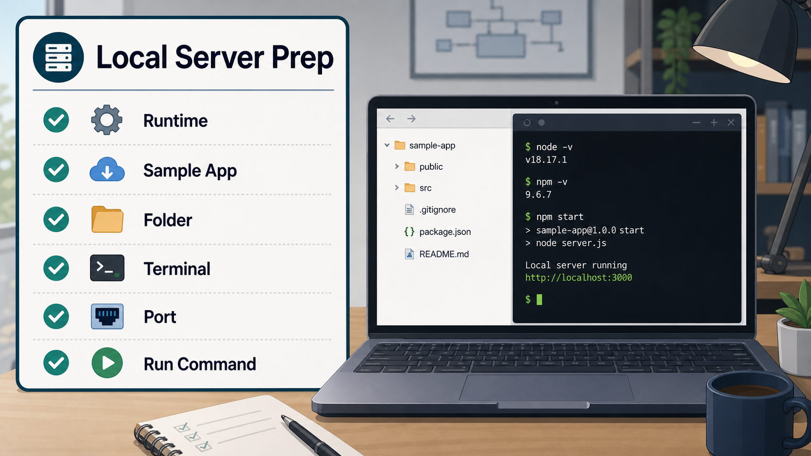
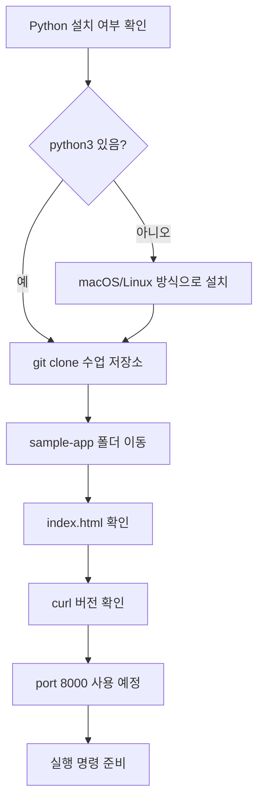

# 5교시: 로컬 웹 서버 실행 준비 - 런타임, 샘플 앱, 실행 명령 확인

## 수업 목표
- 로컬 웹 서버를 실행하기 전에 필요한 준비 항목을 점검한다.
- macOS/Linux 환경에서 Python 설치 여부를 확인하고, 없으면 설치한다.
- GitHub 저장소를 `git clone`으로 내려받아 실습 폴더를 준비한다.
- 샘플 앱 폴더 구조와 실행 명령을 읽는다.

## 공식 참고 자료
- Python Docs: `http.server`  
  https://docs.python.org/3/library/http.server.html
- Python: Downloads  
  https://www.python.org/downloads/
- Python: Using Python on Unix platforms  
  https://docs.python.org/3/using/unix.html
- Homebrew: Python  
  https://formulae.brew.sh/formula/python@3.13
- Visual Studio Code Docs: Integrated Terminal  
  https://code.visualstudio.com/docs/terminal/basics
- curl Documentation  
  https://curl.se/docs/
- GitHub Docs: Cloning a repository  
  https://docs.github.com/en/repositories/creating-and-managing-repositories/cloning-a-repository

## 실습 대상 스펙과 제약
실습 앱:
- 원격 저장소: `https://github.com/niceguy61/kdt_devops_lecture_2026_rev2.git`
- 위치: `week1/day2/sample-app`
- 구성: 정적 HTML 1개와 README
- 실행 방식: Python 내장 `http.server`
- 기본 포트: `8000`

제약점:
- 이 교시는 macOS/Linux 기준으로 진행한다.
- Python이 설치되어 있지 않으면 운영체제별 공식 설치 방법 또는 패키지 관리자를 사용한다.
- `git clone`은 이미 같은 이름의 폴더가 있으면 실패할 수 있다. 기존 폴더가 있으면 위치를 확인하고 다른 작업 폴더에서 진행한다.
- 회사/교육장 PC는 설치 권한이 제한될 수 있다. 권한 오류가 나면 무리하게 진행하지 않고 7~8교시 보충 시간에 해결한다.
- `http.server`는 개발/학습용 간단 서버다. 운영 환경에 그대로 쓰는 서버가 아니다.
- 같은 포트를 이미 다른 프로그램이 사용 중이면 실행에 실패한다.

## 쉬운 비유
로컬 웹 서버 실행 준비는 여행 전 체크인과 비슷하다.

- Runtime은 이동 수단이다. Python이 있어야 `http.server`를 실행할 수 있다.
- Sample app은 여행 가방이다. 안에 어떤 파일이 있는지 확인해야 한다.
- Port는 탑승구 번호다. 이미 다른 사람이 쓰고 있으면 바꿔야 한다.
- Run command는 탑승권이다. 정확히 어떤 명령으로 실행하는지 확인해야 한다.

비유의 한계:
- 실제 서버 실행은 여행처럼 한 번 확인하고 끝나는 것이 아니라, 실행 중 계속 상태를 봐야 한다.

## imagegen 인포그래픽
이 인포그래픽은 로컬 웹 서버 실행 전 점검 항목을 체크리스트로 보여준다. 런타임, 샘플 앱, 폴더, 터미널, 포트, 실행 명령을 빠짐없이 확인한다.

저장 위치:
- `week1/day2/assets/lesson-05-local-server-prep.png`



## Python 설치와 확인
먼저 Python이 이미 설치되어 있는지 확인한다.

```bash
python3 --version
```

예상 결과:

```bash
Python 3.x.x
```

명령을 찾을 수 없거나 버전이 나오지 않으면 아래 방법 중 자기 환경에 맞는 방법으로 설치한다. 설치 명령은 네트워크와 권한이 필요할 수 있으므로 수업 시간에 천천히 진행한다.

macOS에서 Homebrew를 사용하는 경우:

```bash
brew install python
```

macOS에서 Homebrew를 사용하지 않는 경우:
- `https://www.python.org/downloads/` 접속
- macOS용 Python installer 다운로드
- 설치 후 새 터미널을 열고 `python3 --version` 확인

Ubuntu/Debian 계열 Linux:

```bash
sudo apt update
sudo apt install -y python3
python3 --version
```

Fedora 계열 Linux:

```bash
sudo dnf install -y python3
python3 --version
```

주의:
- `sudo`는 관리자 권한으로 설치한다는 뜻이다. 비밀번호 입력이 필요할 수 있다.
- 설치 후에도 명령이 인식되지 않으면 새 터미널을 열어 다시 확인한다.
- 여러 Python 버전이 설치된 환경에서는 수업에서는 `python3` 명령만 사용한다.

## 준비 명령
수업 자료 저장소를 내려받는다. 이미 1일차에 clone을 완료했다면 이 단계는 확인만 한다.

```bash
git clone https://github.com/niceguy61/kdt_devops_lecture_2026_rev2.git
cd kdt_devops_lecture_2026_rev2
```

기대 결과:
- `kdt_devops_lecture_2026_rev2` 폴더가 생성된다.
- 폴더 안에 `docs`, `week1` 같은 수업 자료가 보인다.

저장소 루트에서 샘플 앱 폴더로 이동한다.

```bash
cd week1/day2/sample-app
ls
cat README.md
```

`curl` 설치 여부를 확인한다.

```bash
curl --version
```

## 실행 전 체크리스트
| 항목 | 확인 방법 | 상태 |
|---|---|---|
| Python 설치 | `python3 --version` | 완료/미완료 |
| 수업 저장소 clone | `git clone https://github.com/niceguy61/kdt_devops_lecture_2026_rev2.git` | 완료/미완료 |
| 샘플 앱 폴더 | `ls`로 `index.html` 확인 | 완료/미완료 |
| curl | `curl --version` | 완료/미완료 |
| 실행 포트 | 기본 `8000` 사용 예정 | 완료/미완료 |
| 종료 방법 | 실행 터미널에서 `Ctrl+C` | 완료/미완료 |

## Mermaid: 실행 준비 흐름


## 50분 실습 흐름
- 0~7분: 로컬 웹 서버를 실행하기 전에 확인해야 할 항목 소개
- 7~22분: Python 설치 여부 확인, macOS/Linux 설치 진행
- 22~30분: `git clone`으로 수업 저장소 내려받기
- 30~37분: curl 설치 여부와 실행 포트 확인
- 37~45분: 실행 명령과 종료 방법 설명, 학생별 준비 상태 기록
- 45~50분: 6교시 실행 실습으로 연결

## DevOps 원칙 연결
- 비용 절감: 실행 전 준비 상태를 확인하면 불필요한 재설치와 시간 낭비를 줄인다.
- 개발/배포 효율성: 실행 명령을 README에 적으면 팀원이 같은 방식으로 실행할 수 있다.
- 관리 효율성: 준비 체크리스트는 이후 Docker, Terraform 실습에서도 반복된다.

## 확인 질문
- Runtime이 없으면 어떤 문제가 발생하는가?
- `http.server`가 운영용 서버가 아닌 이유는 무엇인가?
- 실행 전에 포트를 확인해야 하는 이유는 무엇인가?
