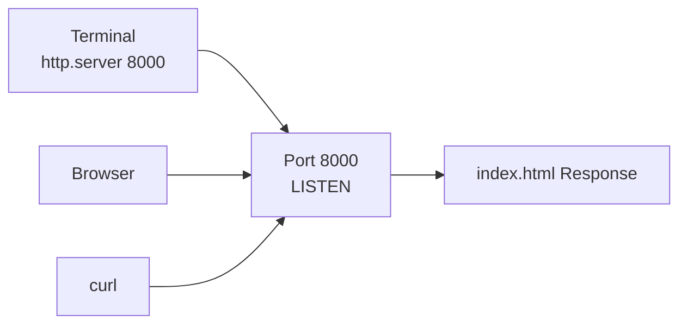
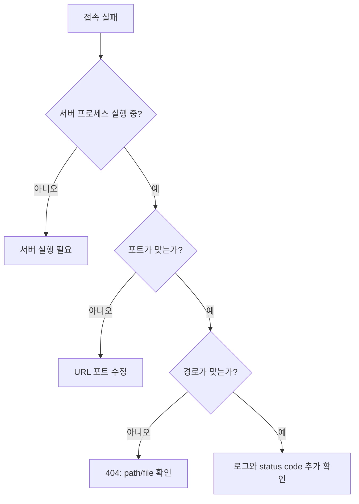

# 6교시: 로컬 웹 서버 실행 실습 - 브라우저, curl, 로그, 포트 변경

## 수업 목표
- 샘플 앱을 로컬 웹 서버로 실행한다.
- 브라우저와 `curl`로 같은 서버를 확인한다.
- 서버 로그를 보고 정상 요청, 404 요청, 포트 충돌을 구분한다.
- 포트 충돌 시 프로세스를 확인하고, 종료 또는 포트 변경으로 해결한다.
- 실행/관찰/수정 결과를 짧은 트러블슈팅 기록으로 남긴다.

## 공식 참고 자료
- Python Docs: `http.server`  
  https://docs.python.org/3/library/http.server.html
- curl Documentation  
  https://curl.se/docs/
- MDN Web Docs: HTTP response status codes  
  https://developer.mozilla.org/en-US/docs/Web/HTTP/Reference/Status

## 실습 스펙과 제약
| 항목 | 값 |
|---|---|
| 실습 폴더 | `week1/day2/sample-app` |
| 실행 명령 | `python3 -m http.server 8000` |
| 접속 URL | `http://localhost:8000` |
| 확인 도구 | Browser, `curl`, `ps`, `ss` |
| 종료 방법 | 실행 터미널에서 `Ctrl+C` |

제약점:
- 이 교시는 macOS/Linux 기준으로 진행한다.
- 서버 실행 터미널을 닫으면 서버도 종료될 수 있다.
- 포트 `8000`을 이미 사용 중이면 다른 포트를 쓰거나 기존 프로세스를 종료해야 한다.
- 브라우저 캐시 때문에 화면이 즉시 바뀌지 않을 수 있다.

## 쉬운 비유
로컬 서버 실행은 임시 안내 데스크를 여는 것과 비슷하다.

- 서버 실행은 안내 데스크를 여는 일이다.
- `localhost:8000`은 내 건물 안 8000번 안내 데스크다.
- 브라우저는 손님처럼 데스크를 방문한다.
- `curl`은 손님 없이 전화로 응답만 확인하는 도구다.
- 로그는 안내 데스크가 남기는 방문 기록이다.
- 포트 충돌은 같은 번호의 데스크를 두 개 열려고 하는 상황이다.

비유의 한계:
- 실제 웹 서버는 여러 요청을 동시에 처리하고 파일 경로, MIME type, 권한 같은 세부 조건도 본다.

## imagegen 인포그래픽
이 인포그래픽은 터미널에서 로컬 서버를 실행하고, 브라우저와 `curl`로 같은 응답을 확인하는 흐름을 보여준다.

저장 위치:
- `week1/day2/assets/lesson-06-local-server-lab.png`


## 실습 1: 정상 실행과 브라우저 확인
샘플 앱 폴더로 이동한다.

```bash
cd week1/day2/sample-app
```

서버를 실행한다.

```bash
python3 -m http.server 8000
```

기대 출력:

```text
Serving HTTP on 0.0.0.0 port 8000 (http://0.0.0.0:8000/) ...
```

이 터미널은 서버가 실행 중인 상태이므로 닫지 않는다. 이후 로그가 이 터미널에 계속 출력된다.

브라우저에서 접속한다.

```text
http://localhost:8000
```

서버 실행 터미널에서 관찰할 로그:

```text
127.0.0.1 - - [date] "GET / HTTP/1.1" 200 -
```

해석:
- `GET /`는 루트 경로 요청이다.
- `200`은 정상 응답이다.
- 요청이 들어올 때마다 서버 터미널에 로그가 남는다.

## 실습 2: curl로 본문과 헤더 확인
새 터미널을 열어 `curl`로 확인한다.

```bash
curl http://localhost:8000
```

기대 결과:
- HTML 문서 내용이 터미널에 출력된다.
- 브라우저가 보여주는 화면과 같은 파일을 응답받은 것이다.

헤더만 확인한다.

```bash
curl -I http://localhost:8000
```

기대 결과:

```text
HTTP/1.0 200 OK
Server: SimpleHTTP/0.6 Python/3.x.x
Content-type: text/html
Content-Length: ...
```

## 실습 3: 404 오류 재현과 로그 읽기
없는 경로를 요청한다.

```bash
curl -I http://localhost:8000/not-found
```

기대 결과:

```text
HTTP/1.0 404 File not found
```

서버 실행 터미널에서 관찰할 로그:

```text
127.0.0.1 - - [date] code 404, message File not found
127.0.0.1 - - [date] "HEAD /not-found HTTP/1.1" 404 -
```

해석:
- 서버는 살아 있다.
- 포트도 열려 있다.
- 다만 요청한 경로 `/not-found`에 해당하는 파일이 없다.
- 이 상황은 "서버 다운"이 아니라 "요청 경로 또는 파일 위치 문제"로 분류한다.

## 실습 4: 프로세스와 포트 상태 확인
서버가 실행 중인지 확인한다.

```bash
ps -eo pid,ppid,%cpu,%mem,comm,args | grep 'http.server'
```

예상 출력 예:

```text
46998 3878751  0.0  0.0 python3  python3 -m http.server 8000
```

포트가 listen 중인지 확인한다.

```bash
ss -ltnp | grep ':8000'
```

예상해서 볼 것:
- `LISTEN`
- `:8000`
- `python3` 또는 해당 서버 프로세스

`ss`에서 프로세스 정보가 보이지 않을 수 있다. 권한이나 운영체제 설정에 따라 출력이 다를 수 있으므로, 그 경우 `ps` 결과와 함께 판단한다.

## 실습 5: 포트 충돌 관찰
서버가 켜진 상태에서 다른 터미널에서 같은 명령을 다시 실행한다.

```bash
python3 -m http.server 8000
```

관찰할 메시지:

```text
OSError: [Errno 98] Address already in use
```

이 메시지는 "서버 코드가 틀렸다"가 아니라 "이미 누군가 8000번 포트를 사용 중"이라는 뜻이다.

원인 분석:
- 재현: 같은 포트로 서버를 두 번 실행했다.
- 관찰: `Address already in use`가 출력됐다.
- 가설: 8000번 포트를 이미 첫 번째 서버가 사용 중이다.
- 검증: `ps` 또는 `ss`로 8000번 포트 사용 프로세스를 확인한다.
- 수정: 기존 서버를 종료하거나 다른 포트로 실행한다.

## 실습 6: 기존 서버 종료
서버 실행 터미널에서 종료한다.

```text
Ctrl+C
```

종료 후 다시 확인한다.

```bash
curl -I http://localhost:8000
```

예상 결과:

```text
curl: (7) Failed to connect to localhost port 8000
```

해석:
- 서버가 종료되었으므로 더 이상 8000번 포트에서 응답하지 않는다.

## 실습 7: 다른 포트로 실행
8000번 포트를 유지해야 하는 이유가 없다면 다른 포트로 실행할 수 있다.

```bash
python3 -m http.server 8001
```

접속 주소도 포트에 맞게 바꾼다.

```bash
curl -I http://localhost:8001
```

브라우저도 다음 주소로 접속한다.

```text
http://localhost:8001
```

해석:
- 실행 포트가 바뀌면 URL도 함께 바뀐다.
- README나 실행 문서에 포트를 정확히 적어야 다른 사람이 같은 방식으로 실행할 수 있다.

## 실습 기록 작성
아래 형식으로 오늘 관찰한 내용을 짧게 남긴다.

```markdown
# Local Server Lab Note

## 정상 실행
- 실행 명령:
- 접속 URL:
- curl -I 결과:
- 서버 로그:

## 404 재현
- 요청:
- status code:
- 서버 로그:
- 원인 해석:

## 포트 충돌
- 재현 명령:
- 에러 메시지:
- 확인 명령:
- 해결 방법:

## 포트 변경
- 변경 전 포트:
- 변경 후 포트:
- 변경 후 접속 URL:
```

## Mermaid: 실행과 확인


## Mermaid: 오류 원인 분류


## 50분 실습 흐름
- 0~5분: 실행 명령, 터미널 2개 사용 방식, 종료 방법 복습
- 5~13분: 서버 실행과 브라우저 정상 화면 확인
- 13~20분: `curl`, `curl -I`로 본문과 헤더 확인
- 20~28분: 서버 로그에서 `GET /`, status code, 요청 경로 읽기
- 28~35분: `/not-found`로 404 재현, 서버 다운과 경로 오류 구분
- 35~42분: 포트 충돌 재현, `Address already in use` 원인 분석
- 42~47분: `ps`, `ss`, `Ctrl+C`, 포트 8001 변경으로 해결
- 47~50분: 실습 기록 작성과 7교시 로그/설정으로 연결

## DevOps 원칙 연결
- 비용 절감: 로컬에서 먼저 실행 검증하면 클라우드 리소스를 만들기 전 오류를 줄인다.
- 개발/배포 효율성: 브라우저와 `curl` 확인은 배포 검증의 기본 패턴이다.
- 관리 효율성: 정상 로그, 404 로그, 포트 충돌 메시지를 표준적으로 기록하면 같은 문제를 빠르게 해결한다.

## 확인 질문
- 브라우저 확인과 `curl` 확인은 각각 어떤 장점이 있는가?
- `404`는 서버가 죽었다는 뜻인가, 경로가 없다는 뜻인가?
- 포트 충돌 메시지가 나오면 무엇을 확인해야 하는가?
- 포트를 8001로 바꾸면 URL과 README에는 무엇을 바꿔야 하는가?
- 서버 종료를 잊으면 다음 실습에 어떤 문제가 생길 수 있는가?
