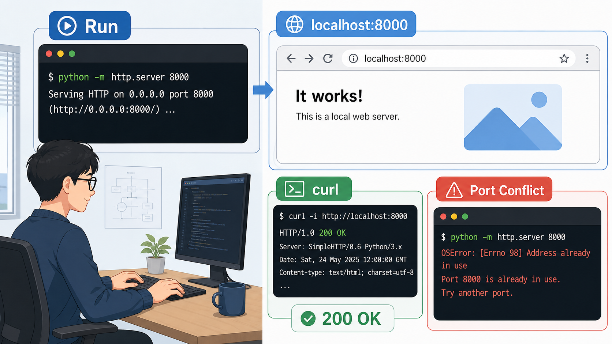
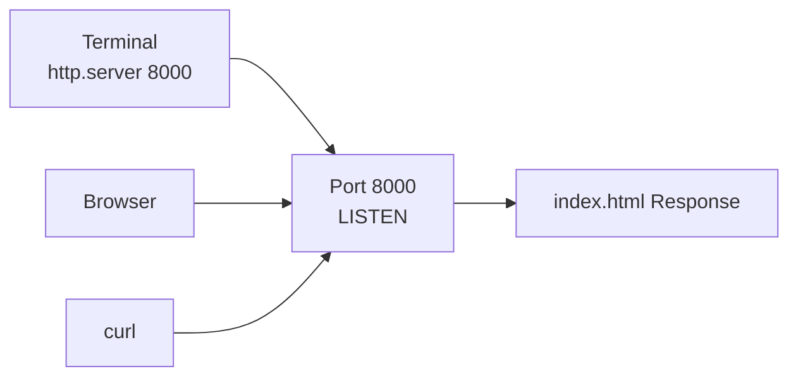

# 6교시: 로컬 웹 서버 실행 실습 - 브라우저, curl, 포트 충돌

## 수업 목표
- 샘플 앱을 로컬 웹 서버로 실행한다.
- 브라우저와 `curl`로 같은 서버를 확인한다.
- 포트 충돌 상황을 관찰하고 원인을 설명한다.

## 공식 참고 자료
- Python Docs: `http.server`  
  https://docs.python.org/3/library/http.server.html
- curl Documentation  
  https://curl.se/docs/
- MDN Web Docs: HTTP response status codes  
  https://developer.mozilla.org/en-US/docs/Web/HTTP/Reference/Status

## 실습 스펙과 제약
| 항목 | 값 |
|---|---|
| 실습 폴더 | `week1/day2/sample-app` |
| 실행 명령 | `python3 -m http.server 8000` |
| 접속 URL | `http://localhost:8000` |
| 확인 도구 | Browser, `curl` |
| 종료 방법 | 실행 터미널에서 `Ctrl+C` |

제약점:
- 서버 실행 터미널을 닫으면 서버도 종료될 수 있다.
- 포트 `8000`을 이미 사용 중이면 다른 포트를 쓰거나 기존 프로세스를 종료해야 한다.
- 브라우저 캐시 때문에 화면이 즉시 바뀌지 않을 수 있다.

## 쉬운 비유
로컬 서버 실행은 임시 안내 데스크를 여는 것과 비슷하다.

- 서버 실행은 안내 데스크를 여는 일이다.
- `localhost:8000`은 내 건물 안 8000번 안내 데스크다.
- 브라우저는 손님처럼 데스크를 방문한다.
- `curl`은 손님 없이 전화로 응답만 확인하는 도구다.
- 포트 충돌은 같은 번호의 데스크를 두 개 열려고 하는 상황이다.

비유의 한계:
- 실제 웹 서버는 여러 요청을 동시에 처리하고 파일 경로, MIME type, 권한 같은 세부 조건도 본다.

## imagegen 인포그래픽
이 인포그래픽은 터미널에서 로컬 서버를 실행하고, 브라우저와 `curl`로 같은 응답을 확인하는 흐름을 보여준다.

저장 위치:
- `week1/day2/assets/lesson-06-local-server-lab.png`



## 실습 절차
샘플 앱 폴더로 이동한다.

```bash
cd week1/day2/sample-app
```

서버를 실행한다.

```bash
python3 -m http.server 8000
```

Windows에서 `python3`가 실패하면 다음을 사용한다.

```powershell
py -m http.server 8000
```

브라우저에서 접속한다.

```text
http://localhost:8000
```

새 터미널을 열어 `curl`로 확인한다.

```bash
curl http://localhost:8000
```

헤더만 확인한다.

```bash
curl -I http://localhost:8000
```

서버를 종료한다.

```text
Ctrl+C
```

## 포트 충돌 관찰
서버가 켜진 상태에서 다른 터미널에서 같은 명령을 다시 실행하면 포트 충돌이 발생할 수 있다.

```bash
python3 -m http.server 8000
```

관찰할 메시지:
- `Address already in use`
- `Only one usage of each socket address`
- `OSError`

이 메시지는 "서버 코드가 틀렸다"가 아니라 "이미 누군가 8000번 포트를 사용 중"이라는 뜻일 수 있다.

## Mermaid: 실행과 확인


## 50분 실습 흐름
- 0~8분: 실행 명령과 종료 방법 복습
- 8~20분: 서버 실행과 브라우저 확인
- 20~30분: `curl`, `curl -I` 응답 확인
- 30~40분: 포트 충돌 상황 만들고 에러 메시지 읽기
- 40~47분: 충돌 해결 방법 정리
- 47~50분: 7교시 로그와 설정으로 연결

## DevOps 원칙 연결
- 비용 절감: 로컬에서 먼저 실행 검증하면 클라우드 리소스를 만들기 전 오류를 줄인다.
- 개발/배포 효율성: 브라우저와 `curl` 확인은 배포 검증의 기본 패턴이다.
- 관리 효율성: 포트 충돌 메시지를 표준적으로 기록하면 같은 문제를 빠르게 해결한다.

## 확인 질문
- 브라우저 확인과 `curl` 확인은 각각 어떤 장점이 있는가?
- 포트 충돌 메시지가 나오면 무엇을 확인해야 하는가?
- 서버 종료를 잊으면 다음 실습에 어떤 문제가 생길 수 있는가?
