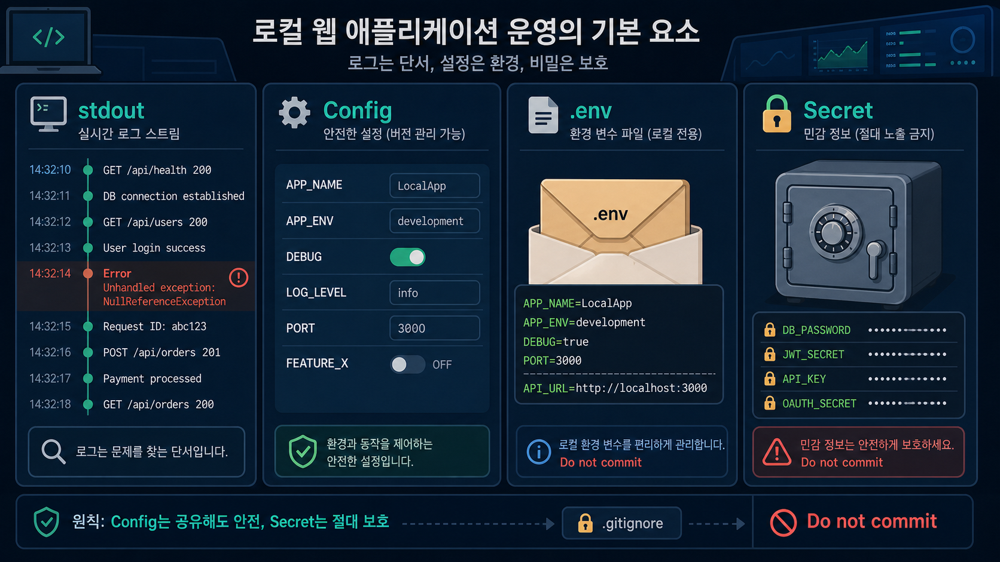
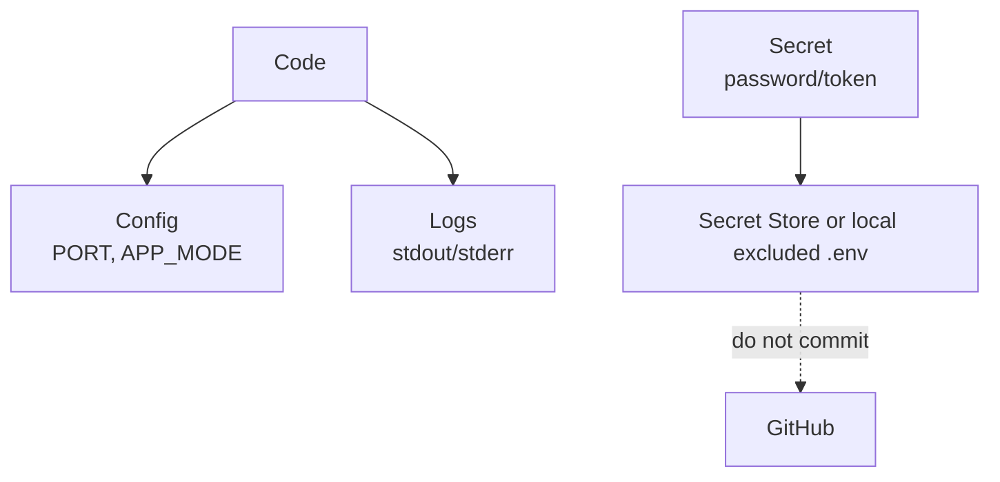

# 7교시: 로그와 설정의 기본 - stdout, 에러 메시지, config, secret, .env

## 수업 목표
- 로그를 "프로그램이 남기는 관찰 가능한 증거"로 이해한다.
- stdout, stderr, error message, config, secret, `.env`의 차이를 설명한다.
- secret을 코드와 GitHub에 올리면 안 되는 이유를 이해한다.

## 공식 참고 자료
- The Twelve-Factor App: Config  
  https://12factor.net/config
- GitHub Docs: Ignoring files  
  https://docs.github.com/en/get-started/git-basics/ignoring-files
- Python Docs: `http.server`  
  https://docs.python.org/3/library/http.server.html

## 핵심 개념
| 용어 | 뜻 | 예시 | 주의 |
|---|---|---|---|
| stdout | 일반 출력 통로 | 요청 로그, 실행 메시지 | 운영에서는 로그 수집 대상 |
| stderr | 에러 출력 통로 | 예외, 실패 메시지 | 장애 분석의 핵심 단서 |
| Error message | 실패 이유를 알려주는 문장 | `Address already in use` | 그대로 복사해 기록 |
| Config | 환경별로 달라지는 설정 | port, API URL | 코드와 분리하면 변경이 쉬움 |
| Secret | 노출되면 위험한 값 | password, token, API key | GitHub에 올리면 안 됨 |
| `.env` | 환경변수를 파일로 관리하는 방식 | `PORT=8000` | `.gitignore`로 제외 필요 |

제약점:
- 로그가 많다고 관찰 가능성이 좋은 것은 아니다. 필요한 단서가 검색 가능해야 한다.
- `.env`는 편리하지만 secret을 안전하게 보관하는 완전한 보안 도구는 아니다.
- 오늘 샘플 앱은 정적 서버라 `.env`를 직접 읽지 않는다. 개념과 기록 방식만 다룬다.

## 쉬운 비유
로그와 설정은 여행 기록과 준비물 목록에 비유할 수 있다.

- stdout은 여행 중 남기는 일반 기록이다.
- stderr는 문제가 생겼을 때 적는 사고 메모다.
- Config는 목적지에 따라 바뀌는 준비물 목록이다.
- Secret은 여권 번호나 카드 비밀번호처럼 공개하면 안 되는 정보다.
- `.env`는 개인별 준비물 메모장이다.

비유의 한계:
- 실제 secret은 단순 메모가 아니라 접근 권한, 암호화, 회전 정책까지 함께 관리해야 한다.

## imagegen 인포그래픽
이 인포그래픽은 로그, 에러, 설정, `.env`, secret을 분리해서 보여준다. 특히 secret은 코드 저장소에 올리지 않는다는 점을 강조한다.

저장 위치:
- `week1/day2/assets/lesson-07-logs-config-env.png`



## 실습: 로그 관찰
서버를 실행한 터미널에서 브라우저 접속 후 출력되는 줄을 관찰한다.

```bash
python3 -m http.server 8000
```

다른 터미널:

```bash
curl http://localhost:8000
curl http://localhost:8000/not-found
```

관찰할 것:
- 정상 요청과 실패 요청의 로그 차이
- status code
- 요청 경로
- 에러 메시지

## 실습: 설정 파일 예시
수업에서는 `.env` 파일을 실제 secret 없이 예시로만 작성한다.

```text
PORT=8000
APP_MODE=local
```

절대 넣지 말아야 할 예:

```text
PASSWORD=real-password
API_TOKEN=real-token
```

## Mermaid: 설정과 secret 분리


## 50분 실습 흐름
- 0~8분: 로그가 장애 분석의 증거인 이유
- 8~18분: stdout, stderr, error message 설명
- 18~28분: 정상 요청과 실패 요청 로그 관찰
- 28~38분: config, secret, `.env` 차이 설명
- 38~45분: secret을 GitHub에 올리면 안 되는 이유
- 45~50분: 8교시 원인 분석 기록으로 연결

## DevOps 원칙 연결
- 비용 절감: 로그로 원인을 좁히면 추측성 재시작과 증설을 줄인다.
- 개발/배포 효율성: 설정을 코드와 분리하면 환경별 배포가 쉬워진다.
- 관리 효율성: secret 관리 원칙은 AWS, Kubernetes, Terraform까지 이어진다.

## 확인 질문
- stdout과 stderr는 무엇이 다른가?
- config와 secret은 무엇이 다른가?
- 에러 메시지를 기록할 때 왜 원문을 남겨야 하는가?
