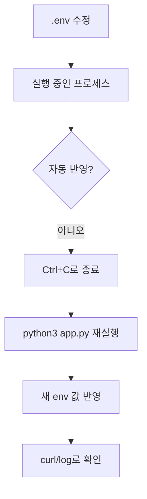
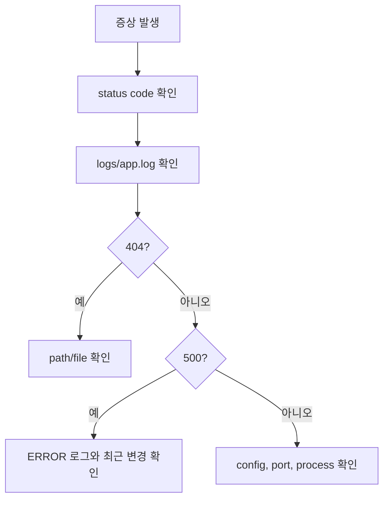

# 7교시: 로그와 설정의 기본 - env 수정, 재기동, 로그 분석, 트러블슈팅

## 수업 목표
- 로그를 "프로그램이 남기는 관찰 가능한 증거"로 이해한다.
- stdout, stderr, file log, error message, config, secret, `.env`의 차이를 설명한다.
- `.env`를 수정하고 애플리케이션을 재기동해야 설정이 반영되는 흐름을 실습한다.
- 정상 요청, 404, 500, 포트 변경을 로그로 확인하고 트러블슈팅 기록을 남긴다.
- secret을 코드와 GitHub에 올리면 안 되는 이유를 이해한다.

## 공식 참고 자료
- The Twelve-Factor App: Config  
  https://12factor.net/config
- GitHub Docs: Ignoring files  
  https://docs.github.com/en/get-started/git-basics/ignoring-files
- Python Docs: `http.server`  
  https://docs.python.org/3/library/http.server.html
- Python Docs: `os.environ`
  https://docs.python.org/3/library/os.html#os.environ
- GNU Coreutils Manual: `tail`
  https://www.gnu.org/software/coreutils/manual/coreutils.html

## 실습 대상 스펙과 제약
| 항목 | 값 |
|---|---|
| 실습 폴더 | `week1/day2/sample-app` |
| 실행 파일 | `app.py` |
| 설정 예시 | `.env.example` |
| 로컬 설정 파일 | `.env` |
| 기본 포트 | `8000` |
| 로그 파일 | `logs/app.log` |
| 확인 도구 | `curl`, `tail`, `grep`, `ps`, `ss` |

제약점:
- `.env`는 애플리케이션 시작 시점에 읽는다. 실행 중에 `.env`만 바꿔도 이미 실행 중인 프로세스에는 바로 반영되지 않는다.
- `.env`와 `logs/`는 `.gitignore`에 포함되어 Git에 올리지 않는다.
- 실습용 `SECRET_TOKEN`은 실제 secret이 아니다. 실제 token, password, key를 `.env.example`, README, GitHub에 쓰면 안 된다.
- file log는 로컬 실습을 위해 사용한다. 운영 환경에서는 로그 수집기, CloudWatch, Grafana Loki 같은 별도 로그 시스템을 사용할 수 있다.

## 핵심 개념
| 용어 | 뜻 | 예시 | 주의 |
|---|---|---|---|
| stdout | 일반 출력 통로 | 서버 시작 로그, 요청 로그 | 컨테이너 환경에서는 기본 로그 수집 대상 |
| stderr | 에러 출력 통로 | 예외, 실패 메시지 | 장애 분석의 핵심 단서 |
| file log | 파일에 저장되는 로그 | `logs/app.log` | 디스크 용량과 보관 주기 관리 필요 |
| Error message | 실패 이유를 알려주는 문장 | `Address already in use` | 그대로 복사해 기록 |
| Config | 환경별로 달라지는 설정 | `PORT`, `APP_MODE` | 코드와 분리하면 변경이 쉬움 |
| Secret | 노출되면 위험한 값 | password, token, API key | GitHub에 올리면 안 됨 |
| `.env` | 환경변수를 파일로 관리하는 방식 | `PORT=8000` | `.gitignore`로 제외 필요 |
| 재기동 | 프로세스를 종료하고 다시 시작 | `Ctrl+C` 후 `python3 app.py` | 시작 시점 설정을 다시 읽게 함 |

## 쉬운 비유
로그와 설정은 여행 기록과 준비물 목록에 비유할 수 있다.

- stdout은 여행 중 실시간으로 말하는 상황 공유다.
- file log는 나중에 다시 볼 수 있도록 남기는 여행 일지다.
- Config는 목적지에 따라 바뀌는 준비물 목록이다.
- Secret은 여권 번호나 카드 비밀번호처럼 공개하면 안 되는 정보다.
- `.env`는 개인별 준비물 메모장이다.
- 재기동은 메모장을 바꾼 뒤 새 계획으로 다시 출발하는 일이다.

비유의 한계:
- 실제 secret은 단순 메모가 아니라 접근 권한, 암호화, 회전 정책까지 함께 관리해야 한다.

## 인포그래픽
이 인포그래픽은 로그, 에러, 설정, `.env`, secret을 분리해서 보여준다. 특히 secret은 코드 저장소에 올리지 않는다는 점을 강조한다.

저장 위치:
- `week1/day2/assets/lesson-07-logs-config-env.png`


## 실습 1: 환경 파일 준비
샘플 앱 폴더로 이동한다.

```bash
cd week1/day2/sample-app
```

실습용 `.env`를 만든다.

```bash
cp .env.example .env
cat .env
```

기대 내용:

```text
APP_NAME=local-server-lab
APP_MODE=local
PORT=8000
LOG_FILE=logs/app.log
# Do not put real secrets in this training file.
SECRET_TOKEN=
```

Git에 올라가지 않는지 확인한다.

```bash
cat .gitignore
git status --short
```

확인할 것:
- `.gitignore`에 `.env`와 `logs/`가 있다.
- `git status --short`에 `.env`와 `logs/`가 보이지 않아야 한다.

## 실습 2: 앱 실행과 로그 생성
앱을 실행한다.

```bash
python3 app.py
```

기대 stdout:

```text
{"time": "...", "level": "INFO", "app": "local-server-lab", "mode": "local", "message": "server starting", "port": 8000, "logFile": ".../logs/app.log"}
```

다른 터미널에서 정상 요청을 보낸다.

```bash
curl http://localhost:8000/
curl http://localhost:8000/health
curl http://localhost:8000/config
```

로그 파일을 확인한다.

```bash
tail -n 20 logs/app.log
```

확인할 것:
- `server starting`
- `request handled`
- `health check`
- `config requested`
- `status: 200`

## 실습 3: 404와 500 로그 분석
없는 경로를 요청한다.

```bash
curl -i http://localhost:8000/not-found
```

의도적으로 에러 응답을 만든다.

```bash
curl -i http://localhost:8000/error
```

로그를 확인한다.

```bash
tail -n 20 logs/app.log
grep '"level": "WARN"' logs/app.log
grep '"level": "ERROR"' logs/app.log
```

해석:
- `/not-found`는 `WARN`과 `status: 404`로 남는다.
- `/error`는 `ERROR`와 `status: 500`으로 남는다.
- 404는 경로 문제, 500은 서버 내부 처리 실패로 분류한다.

## 실습 4: env 수정 후 재기동
`.env`에서 포트와 모드를 바꾼다.

```bash
sed -i 's/PORT=8000/PORT=8001/' .env
sed -i 's/APP_MODE=local/APP_MODE=debug/' .env
cat .env
```

중요한 점:
- `.env`를 바꿔도 이미 실행 중인 서버는 아직 8000번 포트에서 동작한다.
- 설정 파일을 시작 시점에 읽는 앱은 재기동해야 변경이 반영된다.

기존 서버를 종료한다.

```text
Ctrl+C
```

다시 실행한다.

```bash
python3 app.py
```

새 포트로 확인한다.

```bash
curl http://localhost:8001/config
```

확인할 것:
- `APP_MODE`가 `debug`로 보인다.
- `PORT`가 `8001`로 보인다.
- `logs/app.log`에 새 `server starting` 로그가 추가된다.

## 실습 5: 포트 설정 오류 트러블슈팅
잘못된 포트를 넣어본다.

```bash
sed -i 's/PORT=8001/PORT=abc/' .env
python3 app.py
```

기대 오류:

```text
Invalid PORT: abc. PORT must be a number.
```

해석:
- 앱이 시작되기 전에 설정값 검증에서 실패했다.
- 이 경우 포트 충돌이 아니라 config 값 오류다.

정상값으로 복구한다.

```bash
sed -i 's/PORT=abc/PORT=8000/' .env
sed -i 's/APP_MODE=debug/APP_MODE=local/' .env
python3 app.py
```

## Mermaid: env 수정과 재기동


## Mermaid: 로그 기반 원인 분석


## 실습 기록 양식
```markdown
# Env And Log Lab Note

## 정상 요청
- 실행 명령:
- 확인 URL:
- status code:
- 로그 파일:

## 404 분석
- 요청:
- 로그 레벨:
- 원인:

## 500 분석
- 요청:
- 로그 레벨:
- 원인:

## env 수정과 재기동
- 변경 전:
- 변경 후:
- 재기동 명령:
- 확인 결과:

## 설정 오류
- 잘못된 설정:
- 에러 메시지:
- 복구 방법:
```

## 50분 실습 흐름
- 0~6분: 로그, config, secret, `.env`, 재기동 개념 설명
- 6~13분: `.env.example`에서 `.env` 생성, `.gitignore` 확인
- 13~22분: `python3 app.py` 실행, 정상 요청과 stdout/file log 확인
- 22~31분: `/not-found`, `/error`로 404/500 로그 분석
- 31~40분: `.env`에서 `PORT`, `APP_MODE` 변경 후 재기동
- 40~46분: 잘못된 `PORT=abc` 설정 오류 재현과 복구
- 46~50분: 실습 기록 작성과 8교시 원인 분석으로 연결

## DevOps 원칙 연결
- 비용 절감: 로그로 원인을 좁히면 추측성 재시작과 증설을 줄인다.
- 개발/배포 효율성: 설정을 코드와 분리하면 환경별 배포가 쉬워진다.
- 관리 효율성: secret 관리와 로그 표준화는 Docker, Kubernetes, AWS 운영으로 이어진다.

## 확인 질문
- stdout과 file log는 무엇이 다른가?
- `.env`를 수정했는데 왜 재기동이 필요한가?
- 404 로그와 500 로그는 원인 분석에서 어떻게 다르게 읽어야 하는가?
- `PORT=abc`는 포트 충돌인가, 설정값 오류인가?
- secret을 `.env.example`이나 GitHub에 올리면 왜 안 되는가?
