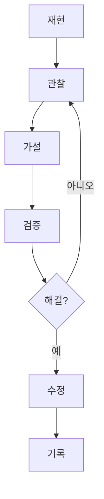

# 8교시: 원인 분석 기본 라이프사이클 - 재현, 관찰, 가설, 검증, 수정, 기록

## 수업 목표
- 장애를 바로 고치기보다 증거 기반으로 분석하는 흐름을 적용한다.
- 로컬 서버 접속 실패를 재현, 관찰, 가설, 검증, 수정, 기록으로 정리한다.
- 다음 사람이 같은 문제를 해결할 수 있도록 짧은 장애 분석 기록을 남긴다.

## 공식 참고 자료
- Google SRE Book: Monitoring Distributed Systems  
  https://sre.google/sre-book/monitoring-distributed-systems/
- GitHub Docs: About READMEs  
  https://docs.github.com/en/repositories/managing-your-repositorys-settings-and-features/customizing-your-repository/about-readmes
- MDN Web Docs: HTTP response status codes  
  https://developer.mozilla.org/en-US/docs/Web/HTTP/Reference/Status

## 분석 라이프사이클
| 단계 | 질문 | 산출물 |
|---|---|---|
| 재현 | 어떤 조건에서 다시 발생하는가? | 명령, URL, 입력값 |
| 관찰 | 어떤 증거가 있는가? | 로그, status code, 프로세스, 포트 |
| 가설 | 원인 후보는 무엇인가? | 포트 충돌, 경로 오류, 서버 미실행 |
| 검증 | 하나씩 확인했는가? | 명령 결과, 전후 비교 |
| 수정 | 무엇을 바꿨는가? | 포트 변경, 서버 재실행 |
| 기록 | 다음 사람이 따라할 수 있는가? | README, 장애 기록 |

제약점:
- 처음부터 완벽한 원인 분석을 요구하지 않는다.
- 대신 추측과 증거를 구분해서 적는 습관을 만든다.
- 여러 수정 작업을 동시에 하면 무엇이 문제를 해결했는지 알기 어렵다.

## 쉬운 비유
원인 분석은 여행 중 길을 잃었을 때의 대처와 비슷하다.

- 재현: 어디에서 길을 잘못 들었는지 다시 확인한다.
- 관찰: 지도, 표지판, 현재 위치를 본다.
- 가설: 지하철 출구를 잘못 나왔는지, 주소를 잘못 입력했는지 후보를 세운다.
- 검증: 한 가지씩 확인한다.
- 수정: 올바른 길로 이동한다.
- 기록: 다음 사람에게 길 안내를 남긴다.

비유의 한계:
- 실제 시스템 장애는 동시에 여러 원인이 있을 수 있다.
- 그래도 증거를 먼저 모으고 하나씩 검증하는 원칙은 같다.

## imagegen 인포그래픽
이 인포그래픽은 재현, 관찰, 가설, 검증, 수정, 기록의 순환 구조를 보여준다. 핵심은 "증거 먼저"다.

저장 위치:
- `week1/day2/assets/lesson-08-rca-lifecycle.png`


## 실습 시나리오
다음 중 하나를 선택해 짧게 분석한다.

1. 서버를 실행하지 않고 `curl http://localhost:8000`을 실행한다.
2. `localhost:8001`처럼 잘못된 포트로 접속한다.
3. 서버가 켜진 상태에서 같은 포트로 서버를 한 번 더 실행한다.
4. `curl http://localhost:8000/not-found`로 없는 경로를 요청한다.

## 기록 양식
아래 양식으로 `troubleshooting-note.md`를 작성한다.

```markdown
# Troubleshooting Note

## 증상
- 

## 재현 방법
- 

## 관찰한 증거
- 명령:
- 출력:
- status code:
- 로그:

## 가설
- 

## 검증
- 

## 수정
- 

## 다음에 같은 문제가 나면 확인할 것
- 
```

## Mermaid: 분석 루프


## 50분 실습 흐름
- 0~8분: "바로 고치기"와 "증거 기반 분석"의 차이
- 8~18분: 분석 라이프사이클 설명
- 18~30분: 학생별 실패 시나리오 선택과 재현
- 30~40분: 로그, status code, 포트, 프로세스 증거 수집
- 40~47분: 기록 양식 작성
- 47~50분: 3일차 배포 개념과 연결

## DevOps 원칙 연결
- 비용 절감: 원인을 모르고 리소스를 늘리거나 재설치하는 비용을 줄인다.
- 개발/배포 효율성: 장애 기록이 있으면 같은 문제의 복구 시간이 줄어든다.
- 관리 효율성: runbook과 README는 개인 기억을 팀 자산으로 바꾼다.

## 확인 질문
- 증상과 원인은 무엇이 다른가?
- 가설을 검증할 때 한 번에 하나씩 확인해야 하는 이유는 무엇인가?
- 장애 기록에 반드시 남겨야 할 증거는 무엇인가?

## 마무리 정리
2일차의 목표는 로컬 웹 서버를 완벽하게 운영하는 것이 아니라, 실행과 접속, 포트와 프로세스, 로그와 설정, 원인 분석의 기본 언어를 만드는 것이다. 이 언어는 2주차 Docker에서 컨테이너 실행 문제를 분석할 때 그대로 다시 사용된다.
