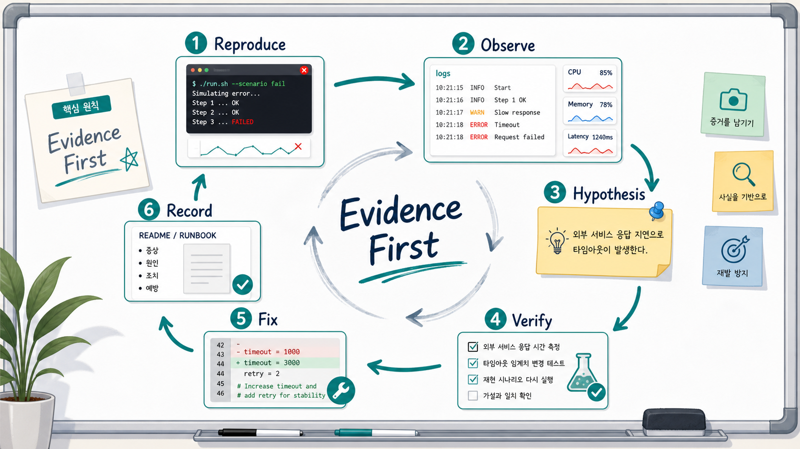
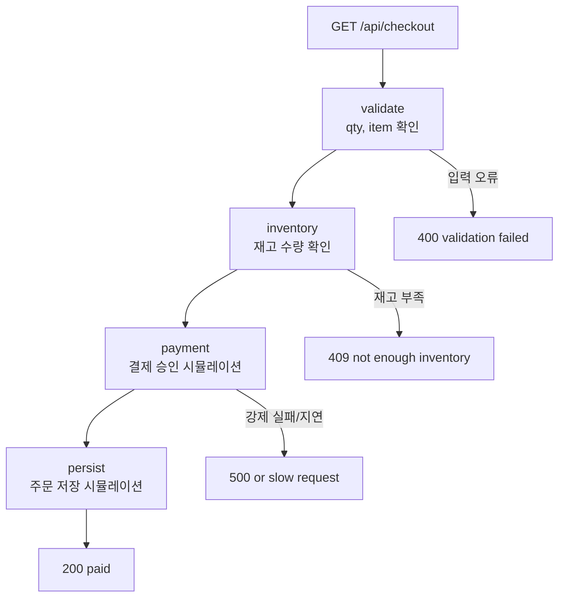
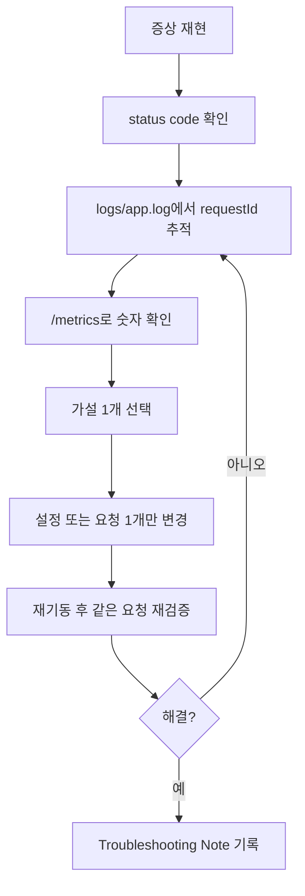

# 8교시: 관찰 가능성과 원인 분석 실습 - 로그, 메트릭, 가설, 수정 기록

## 수업 목표
- 7교시 기본 샘플 앱과 분리된 관찰 가능성 실습 앱을 실행한다.
- API 요청이 여러 처리 단계를 지나갈 때 어떤 로그가 남아야 원인을 좁힐 수 있는지 확인한다.
- 속도 저하, 입력값 오류, 재고 부족, 설정 오류, 강제 실패 지점을 재현한다.
- 로그, status code, duration, `/metrics`, `.env` 변경 이력을 근거로 가설을 세운다.
- 무엇을 바꿀지 결정하고, 변경 후 재기동과 재검증까지 기록한다.

## 공식 참고 자료
- Google SRE Book: Monitoring Distributed Systems
  https://sre.google/sre-book/monitoring-distributed-systems/
- OpenTelemetry Docs: Observability Primer
  https://opentelemetry.io/docs/concepts/observability-primer/
- MDN Web Docs: HTTP response status codes
  https://developer.mozilla.org/en-US/docs/Web/HTTP/Reference/Status
- Python Docs: `http.server`
  https://docs.python.org/3/library/http.server.html
- Python Docs: `time`
  https://docs.python.org/3/library/time.html

## 실습 대상 스펙과 제약
| 항목 | 값 |
|---|---|
| 실습 앱 | `week1/day2/observability-app` |
| 실행 파일 | `app2.py` |
| 설정 파일 | `.env` |
| 기본 포트 | `8010` |
| 로그 파일 | `logs/app.log` |
| 주요 API | `/api/checkout` |
| 상태 확인 | `/health`, `/config`, `/metrics` |

제약점:
- 이 앱은 학습용 단일 프로세스 앱이다. 실제 운영처럼 외부 DB, 결제 시스템, 분산 추적 저장소를 사용하지 않는다.
- `/metrics`는 메모리에만 저장된다. 앱을 재기동하면 초기화된다.
- `FAIL_STEP`은 장애를 학습하기 위한 강제 실패 설정이다. 실제 서비스에서는 이런 값을 운영 환경에 노출하지 않는다.
- 로그 파일은 로컬 실습용이다. Docker와 Kubernetes에서는 stdout 수집, CloudWatch/Loki 같은 중앙 로그 수집으로 확장된다.

## 핵심 개념
| 용어 | 뜻 | 오늘의 확인 기준 |
|---|---|---|
| Observability | 시스템 내부 상태를 외부 증거로 추론할 수 있는 능력 | 로그와 메트릭으로 실패 지점을 좁힌다 |
| Log | 사건을 시간순으로 남긴 기록 | `requestId`, `step`, `status`, `durationMs`, `errorPoint`를 본다 |
| Metric | 숫자로 요약한 상태 | 요청 수, 상태 코드별 수, 평균 처리 시간, 느린 요청 수 |
| Hypothesis | 증거를 바탕으로 세운 원인 후보 | "payment 단계가 느리다", "qty 입력이 잘못됐다" |
| Validation | 가설이 맞는지 확인하는 절차 | 설정 하나만 바꾸고 재기동 후 다시 요청 |
| Runbook | 같은 문제를 다시 처리하기 위한 기록 | 증상, 증거, 가설, 수정, 재검증을 남긴다 |

## 쉬운 비유
관찰 가능성은 공항 수하물 추적 화면과 비슷하다. 짐이 사라졌다는 말만 있으면 어디서 문제가 생겼는지 알 수 없다. 하지만 체크인, 보안 검색, 항공기 적재, 도착지 하역 같은 단계별 기록이 있으면 어느 지점에서 멈췄는지 좁힐 수 있다.

오늘의 체크아웃 API도 같은 방식으로 본다. 요청 하나가 `validate`, `inventory`, `payment`, `persist` 단계를 지나가고, 각 단계가 로그를 남긴다. 장애 분석은 "느낌상 결제가 문제 같다"가 아니라 "같은 `requestId`에서 `payment` 단계 이후 `ERROR`가 남았다"처럼 말할 수 있어야 한다.

비유의 한계:
- 실제 운영 시스템은 여러 서버와 외부 서비스가 연결되어 있어 request id, trace id, log aggregation이 더 중요해진다.
- 오늘은 그 구조를 로컬 단일 앱에서 축소해서 연습한다.

## 인포그래픽
이 인포그래픽은 재현, 관찰, 가설, 검증, 수정, 기록의 순환 구조를 보여준다. 핵심은 "증거 먼저"다.

저장 위치:
- `week1/day2/assets/lesson-08-rca-lifecycle.png`



## API 처리 흐름


## 실습 1: 앱 실행과 기준 상태 확인
8교시 전용 앱으로 이동한다.

```bash
cd week1/day2/observability-app
cp .env.example .env
cat .env
```

기대 설정:

```text
APP_NAME=checkout-observability-lab
APP_MODE=local
PORT=8010
LOG_FILE=logs/app.log
SLOW_MS=0
SLOW_THRESHOLD_MS=500
INVENTORY_LIMIT=5
FAIL_STEP=none
```

앱을 실행한다.

```bash
python3 app2.py
```

다른 터미널에서 상태를 확인한다.

```bash
curl http://localhost:8010/health
curl http://localhost:8010/config
```

확인할 것:
- `/health`가 `healthy`를 반환한다.
- `/config`에 `SLOW_MS=0`, `INVENTORY_LIMIT=5`, `FAIL_STEP=none`이 보인다.
- 서버 터미널과 `logs/app.log`에 `server starting` 로그가 남는다.

## 실습 2: 정상 요청의 단계별 로그 확인
정상 체크아웃 요청을 보낸다.

```bash
curl "http://localhost:8010/api/checkout?item=book&qty=1"
tail -n 20 logs/app.log
```

확인할 로그 필드:
- `requestId`: 한 요청을 끝까지 따라가기 위한 ID
- `step`: `validate`, `inventory`, `payment`, `persist`
- `status`: 최종 HTTP 상태 코드
- `durationMs`: 처리 시간

같은 요청을 찾는 방법:

```bash
grep "checkout step completed" logs/app.log
grep "checkout completed" logs/app.log
```

정상 가설:
- 모든 단계가 지나갔고 `checkout completed`가 `status=200`으로 끝나면 앱 로직은 정상이다.

## 실습 3: 입력값 오류 재현
숫자가 아닌 수량을 보낸다.

```bash
curl -i "http://localhost:8010/api/checkout?item=book&qty=abc"
tail -n 20 logs/app.log
```

증거:
- HTTP status code는 `400`이다.
- 로그에는 `checkout validation failed`가 남는다.
- `errorPoint`는 `validate`다.
- `hint`는 query string을 확인하라고 안내한다.

가설:
- 서버가 죽은 것이 아니라 요청 파라미터가 잘못됐다.

수정 방향:
- 호출자가 `qty`에 숫자를 보내도록 요청 형식을 수정한다.

재검증:

```bash
curl -i "http://localhost:8010/api/checkout?item=book&qty=1"
```

## 실습 4: 재고 부족 재현
기본 재고 한도보다 큰 수량을 요청한다.

```bash
curl -i "http://localhost:8010/api/checkout?item=book&qty=99"
tail -n 20 logs/app.log
curl http://localhost:8010/metrics
```

증거:
- HTTP status code는 `409`다.
- `errorPoint`는 `inventory`다.
- 로그에 `inventoryLimit`와 요청 `qty`가 함께 남는다.

가설:
- 앱 실행 자체는 정상이다.
- 비즈니스 조건상 재고 한도를 초과했다.

수정 방향:
- 요청 수량을 낮춘다.
- 또는 실습상 재고 정책을 바꾸려면 `.env`의 `INVENTORY_LIMIT`를 조정하고 재기동한다.

재기동 실습:

```bash
sed -i 's/INVENTORY_LIMIT=5/INVENTORY_LIMIT=100/' .env
```

실행 중인 서버를 `Ctrl+C`로 종료한 뒤 다시 실행한다.

```bash
python3 app2.py
curl -i "http://localhost:8010/api/checkout?item=book&qty=99"
```

확인할 것:
- 같은 요청이 `200`으로 바뀌면 가설이 맞았다는 뜻이다.
- 변경한 것은 `INVENTORY_LIMIT` 하나뿐이어야 한다.

## 실습 5: 느린 요청 재현과 속도 가설
`SLOW_MS`는 payment 단계에 인위적인 지연을 넣는다. 느린 요청을 분석하려면 먼저 서버를 종료하고 `.env`를 바꾼다.

```bash
sed -i 's/SLOW_MS=0/SLOW_MS=800/' .env
sed -i 's/SLOW_THRESHOLD_MS=500/SLOW_THRESHOLD_MS=500/' .env
python3 app2.py
```

요청을 보낸다.

```bash
curl -i "http://localhost:8010/api/checkout?item=book&qty=1"
tail -n 20 logs/app.log
curl http://localhost:8010/metrics
```

증거:
- `checkout completed` 로그의 `durationMs`가 500ms 이상이다.
- 최종 로그 레벨이 `WARN`으로 남는다.
- `/metrics`의 `slowRequests`가 증가한다.

가설:
- 전체 앱이 항상 느린 것이 아니라 payment 단계의 대기 시간이 원인이다.

수정 방향:
- `.env`에서 `SLOW_MS`를 낮추고 재기동한다.
- 운영 환경이라면 외부 결제 API latency, timeout, retry 설정을 확인한다.

## 실습 6: 강제 실패 지점 재현
`FAIL_STEP`으로 특정 단계의 500 오류를 만든다. 먼저 서버를 종료하고 설정을 바꾼다.

```bash
sed -i 's/FAIL_STEP=none/FAIL_STEP=payment/' .env
python3 app2.py
```

요청을 보낸다.

```bash
curl -i "http://localhost:8010/api/checkout?item=book&qty=1"
tail -n 30 logs/app.log
curl http://localhost:8010/metrics
```

증거:
- HTTP status code는 `500`이다.
- 로그의 `errorPoint`는 `payment`다.
- `hint`는 `FAIL_STEP`과 최근 `.env` 변경을 확인하라고 안내한다.
- `/metrics`의 `lastError`에도 실패 지점이 남는다.

가설:
- 라우팅이나 포트 문제가 아니라 payment 단계 실패다.
- 최근 설정 변경이 원인일 수 있다.

수정 방향:

```bash
sed -i 's/FAIL_STEP=payment/FAIL_STEP=none/' .env
```

서버를 재기동하고 같은 요청을 다시 보낸다.

```bash
python3 app2.py
curl -i "http://localhost:8010/api/checkout?item=book&qty=1"
```

## 실습 7: `.env` 설정 오류 로그 확인
서버가 시작되기 전에 실패하는 설정 오류도 관찰 대상이다.

```bash
sed -i 's/PORT=8010/PORT=abc/' .env
python3 app2.py
```

기대 오류:

```text
Invalid PORT: abc. PORT must be a number.
```

로그 확인:

```bash
tail -n 10 logs/app.log
```

확인할 것:
- `config validation failed` 로그가 남는다.
- `setting`은 `PORT`다.
- `reason`은 숫자여야 한다는 내용이다.

복구:

```bash
sed -i 's/PORT=abc/PORT=8010/' .env
python3 app2.py
```

## 가설 수립 기준표
| 관찰 증거 | 가능한 가설 | 먼저 확인할 것 | 바꿀 것 |
|---|---|---|---|
| 연결 실패 | 서버 미실행 또는 포트 불일치 | `ss -ltnp`, `/config` | `PORT`, 실행 명령 |
| `400` | 요청 파라미터 오류 | `errorPoint=validate` | 요청 URL의 `qty` |
| `409` | 재고 한도 초과 | `inventoryLimit`, `qty` | `qty` 또는 `INVENTORY_LIMIT` |
| `500` | 특정 처리 단계 실패 | `errorPoint`, `FAIL_STEP` | `FAIL_STEP`, 최근 변경 |
| `durationMs` 큼 | 느린 단계 존재 | `SLOW_MS`, `slowRequests` | `SLOW_MS`, timeout 기준 |
| 시작 전 종료 | `.env` 설정 오류 | `config validation failed` | 잘못된 설정값 |

## Mermaid: 증거 기반 분석 루프


## 실습 기록 양식
아래 양식으로 `troubleshooting-note.md`를 작성한다.

```markdown
# Troubleshooting Note

## 증상
- 요청:
- 기대 결과:
- 실제 결과:

## 재현 방법
- 명령:
- 재현 조건:

## 관찰한 증거
- status code:
- requestId:
- 로그 메시지:
- errorPoint:
- durationMs:
- metrics:
- 최근 .env 변경:

## 가설
- 

## 검증
- 확인 명령:
- 결과:

## 수정
- 변경한 값:
- 재기동 여부:

## 재검증
- 같은 요청:
- 결과:

## 다음에 같은 문제가 나면 확인할 것
- 
```

## 50분 실습 흐름
- 0~6분: 7강 기본 앱과 8강 관찰 앱을 분리한 이유 설명
- 6~12분: 앱 실행, `/config`, `/metrics`, 로그 위치 확인
- 12~20분: 정상 체크아웃 요청과 단계별 로그 추적
- 20~28분: `400`, `409` 재현과 가설 수립
- 28~38분: `SLOW_MS`, `FAIL_STEP` 변경 후 재기동과 재검증
- 38~44분: `PORT=abc` 설정 오류 로그 확인
- 44~50분: 장애 분석 기록 작성과 Docker 로그 분석으로 연결

## DevOps 원칙 연결
- 비용 절감: 원인을 모른 채 리소스를 늘리거나 재설치하지 않고, 증거로 좁혀 불필요한 작업을 줄인다.
- 개발/배포 효율성: 개발팀에는 "안 됩니다"가 아니라 request id, status code, error point, 재현 명령을 전달한다.
- 관리 효율성: 로그 필드와 기록 양식이 표준화되면 다음 장애 대응 시간이 줄어든다.

## 확인 질문
- `400`, `409`, `500`은 각각 어떤 원인 후보를 먼저 떠올리게 하는가?
- `requestId`가 없으면 여러 단계의 로그를 따라가기 어려운 이유는 무엇인가?
- 느린 요청을 확인할 때 `durationMs`와 `/metrics`를 함께 보는 이유는 무엇인가?
- `.env`를 바꾼 뒤 왜 재기동과 재검증이 필요한가?

## 마무리 정리
8교시의 핵심은 "문제를 고치는 능력"보다 먼저 "문제를 설명 가능한 형태로 만드는 능력"이다. 로컬 앱에서 request id, 단계별 로그, status code, duration, 설정 변경 이력을 연결해서 말할 수 있어야 Docker, Kubernetes, AWS에서도 같은 방식으로 장애를 좁힐 수 있다.
