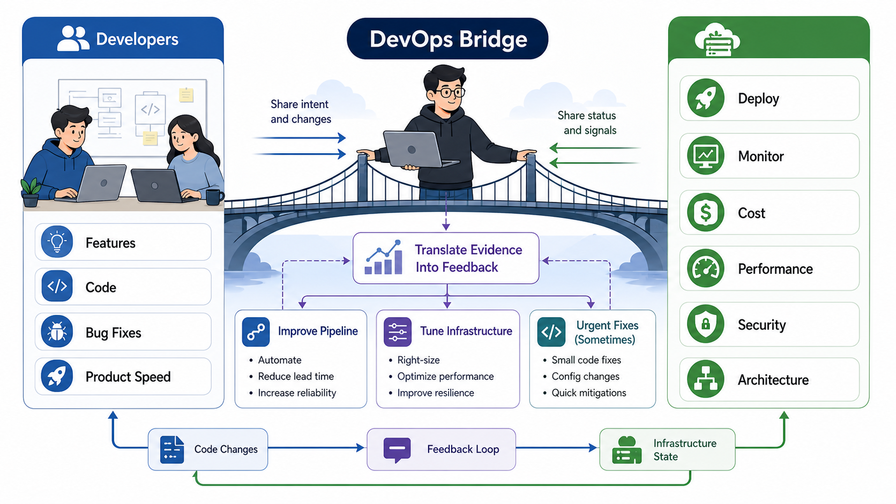

# 3교시: 개발자가 보는 인프라 vs 인프라 엔지니어가 보는 인프라

## 수업 목표
- 같은 시스템을 개발자와 인프라 엔지니어가 다르게 바라보는 이유를 설명한다.
- 안정성, 확장성, 비용, 보안, 관찰 가능성을 인프라 관점의 핵심 질문으로 정리한다.
- DevOps/클라우드 엔지니어가 개발자와 인프라 사이에서 어떤 문제를 번역하고 조율하는지 설명한다.
- 인프라 관점의 비용 절감과 성능 개선이 애플리케이션 코드와 연결되는 지점을 이해한다.
- 개발팀에 요청해야 할 정보와 인프라팀이 제공해야 할 정보를 구분한다.
- 미니 앱을 기준으로 운영 인수 체크리스트를 작성한다.

## 공식 참고 자료
- AWS Well-Architected Framework  
  https://docs.aws.amazon.com/wellarchitected/latest/framework/welcome.html
- Google SRE Book: Monitoring Distributed Systems  
  https://sre.google/sre-book/monitoring-distributed-systems/
- GitHub Docs: About READMEs  
  https://docs.github.com/en/repositories/managing-your-repositorys-settings-and-features/customizing-your-repository/about-readmes

## 핵심 개념
| 관점 | 개발자가 주로 묻는 질문 | 인프라/DevOps 엔지니어가 추가로 묻는 질문 |
|---|---|---|
| 기능 | 기능이 요구사항대로 동작하는가? | 기능이 실패했을 때 어디서 증거를 찾는가? |
| 실행 | 내 로컬에서 실행되는가? | 다른 환경에서도 같은 방식으로 실행되는가? |
| 설정 | 어떤 값이 필요한가? | 환경별 설정을 어떻게 분리하고 보호하는가? |
| 성능 | 응답이 충분히 빠른가? | 느려졌을 때 어떤 지표로 판단하는가? |
| 보안 | 인증/권한 코드가 있는가? | secret, network exposure, 최소 권한이 지켜지는가? |
| 비용 | 기능 구현 비용은 어느 정도인가? | 실행 자원, 로그 저장, 트래픽 비용은 어떻게 커지는가? |

개발자 관점이 틀렸다는 뜻이 아니다. 개발자는 주로 기능과 도메인 규칙을 책임진다. 인프라 엔지니어는 그 기능이 반복 가능하게 실행되고, 장애가 났을 때 관찰 가능하며, 비용과 보안 리스크가 통제되는지를 본다. 협업이 잘 되려면 두 관점이 서로를 대체하는 것이 아니라 연결되어야 한다.

현업에서 개발자는 늘 feature 수정, bug fix, product 요구사항 처리에 쫓긴다. 최근에는 인프라를 배우는 개발자도 많지만, 모든 개발자가 Docker, Kubernetes, AWS, 네트워크, 비용 최적화, 모니터링까지 깊게 볼 시간을 갖기는 어렵다. 그래서 애플리케이션 성능은 신경 쓰더라도, 인프라 조합 때문에 발생하는 비용 증가나 성능 저하를 놓치는 경우가 있다.

인프라/DevOps 엔지니어는 들어오는 코드를 배포하고 운영하며 모니터링한다. 이 과정에서 애플리케이션 코드와 인프라 설정의 조합이 맞지 않아 문제가 생기는 경우가 있다. 예를 들어 애플리케이션은 정상 코드처럼 보이지만, 로그를 너무 많이 남겨 로그 저장 비용이 급증하거나, health check가 무거워져 load balancer와 container가 불필요하게 흔들리거나, 메모리 사용 패턴이 container limit과 맞지 않아 재시작이 반복될 수 있다.

이때 좋은 인프라 엔지니어는 "개발팀이 잘못했다"고 말하지 않는다. 어떤 요청에서, 어떤 로그와 지표가, 어떤 비용이나 성능 문제로 이어졌는지 증거를 모아 개발팀이 이해할 수 있는 언어로 report한다. 반대로 개발팀이 너무 바빠 즉시 수정하지 못하고, 비용 또는 장애 영향이 큰 경우에는 인프라/DevOps 엔지니어가 직접 작은 설정 수정, 배포 스크립트 수정, 로그 레벨 조정, 캐시/timeout 설정 변경, 간단한 코드 수정까지 수행하는 경우도 있다.

따라서 Cloud Native 과정에서 개발을 일정 부분 이해하는 이유는 개발자가 되기 위해서만이 아니다. 개발자의 사이클을 이해하고, 개발자와 더 나은 방식으로 소통하며, 애플리케이션과 인프라의 경계에서 성능, 비용, 안정성을 함께 개선하기 위해서다.

## 쉬운 비유
개발자가 건물 내부의 가게를 설계한다면, 인프라 엔지니어는 전기, 수도, 출입구, 소방 설비, CCTV, 유지비를 함께 본다. 가게 인테리어가 훌륭해도 전기가 자주 끊기거나 출입구가 하나뿐이면 운영하기 어렵다.

이 비유의 한계는 소프트웨어에서는 가게 구조가 하루에도 여러 번 바뀔 수 있다는 점이다. 그래서 인프라 관점에서는 변경을 안전하게 반복하는 능력이 중요하다.

## 인포그래픽
아래 인포그래픽은 같은 서비스를 개발자 관점과 인프라 엔지니어 관점으로 나누어 보여준다. 두 관점은 경쟁 관계가 아니라 운영 가능한 서비스를 만들기 위해 함께 필요한 관점이다.


아래 인포그래픽은 DevOps/클라우드 엔지니어가 개발자와 인프라 사이에서 증거를 번역하고, 배포 파이프라인과 운영 환경을 개선하며, 비용과 성능 문제를 함께 줄이는 역할을 보여준다.



## 인프라 운영 질문 5가지
1. 안정성: 프로세스가 죽으면 어떻게 알 수 있는가?
2. 확장성: 요청이 늘어나면 어떤 자원이 먼저 부족해지는가?
3. 비용: 켜져 있는 동안 어떤 비용이 계속 발생하는가?
4. 보안: 어떤 포트와 secret이 외부에 노출되는가?
5. 관찰 가능성: 실패 지점과 최근 변경을 어떤 증거로 설명할 수 있는가?

## DevOps/클라우드 엔지니어의 위치
DevOps/클라우드 엔지니어는 개발자와 인프라 사이의 중간에 서 있다. 개발자가 만든 애플리케이션을 배포 가능한 형태로 만들고, 인프라 위에서 안정적으로 실행되게 하며, 관찰 결과를 다시 개발팀과 비즈니스에 전달한다.

| 역할 | 설명 | 예시 |
|---|---|---|
| 번역자 | 인프라 지표를 개발자가 이해할 수 있는 문제로 바꾼다 | "CPU 높음"이 아니라 "이미지 리사이즈 요청에서 CPU가 급등" |
| 운영자 | 코드를 실행 환경에 배포하고 상태를 관찰한다 | 배포, rollback, health check, log 확인 |
| 최적화 담당 | 비용과 성능을 함께 본다 | instance size 조정, autoscaling, cache, log level |
| 자동화 담당 | 반복 작업을 pipeline으로 바꾼다 | GitHub Actions, image build, deploy workflow |
| 피드백 제공자 | 개발팀에 수정 요청을 증거 기반으로 전달한다 | request id, metric, log, 재현 명령 |
| 긴급 대응자 | 영향이 큰 경우 제한된 범위에서 직접 수정한다 | timeout, env, config, 간단한 patch |

이 역할은 조직마다 다르게 불린다. DevOps Engineer, Cloud Engineer, Platform Engineer, SRE가 일부 겹치는 일을 할 수 있다. 공통점은 개발자가 만든 기능이 실제 인프라에서 안전하고 효율적으로 동작하도록 돕는다는 점이다.

## 개발 이해가 필요한 이유
인프라 엔지니어가 개발을 이해해야 하는 이유는 애플리케이션 코드를 모두 대신 작성하기 위해서가 아니다. 문제의 위치를 정확히 찾고, 개발자와 같은 언어로 대화하기 위해서다.

| 알아야 할 개발 이해 | 필요한 이유 |
|---|---|
| HTTP request/response | 어느 endpoint에서 문제가 나는지 설명 |
| 상태 코드 | 4xx와 5xx 원인 후보 구분 |
| 환경변수와 config | 환경별 동작 차이 분석 |
| 로그 레벨 | DEBUG/INFO/WARN/ERROR 비용과 분석 품질 조정 |
| dependency | build 실패와 런타임 실패 구분 |
| 간단한 코드 구조 | 어디를 개발팀에 report할지 판단 |
| 성능 기본 | cache, timeout, connection, payload 크기 이해 |

개발을 모르면 모든 문제를 "서버 문제" 또는 "인프라 문제"로만 볼 수 있다. 반대로 인프라를 모르면 모든 문제를 "코드 문제"로만 볼 수 있다. Cloud Native 엔지니어는 이 둘을 연결해 문제를 좁히는 사람이다.

## 인프라와 애플리케이션 조합에서 생기는 문제
| 관찰 증거 | 가능한 조합 문제 | 개발팀에 전달할 피드백 | 인프라 측 조치 |
|---|---|---|---|
| CPU 사용률 급등 | 특정 API가 CPU를 많이 쓰는 로직 | endpoint, payload, 요청량, profile 결과 공유 | autoscaling 임시 조정 |
| Memory limit 초과 | 앱 메모리 사용 패턴과 limit 불일치 | 어떤 작업 후 메모리가 증가하는지 공유 | limit 조정, restart 정책 확인 |
| 로그 비용 급증 | DEBUG 로그 또는 큰 payload 로그 | 로그 레벨/필드 조정 요청 | 보관 기간/필터 조정 |
| health check 실패 | health endpoint가 무겁거나 외부 의존 | 가벼운 health check 분리 요청 | interval/timeout 조정 |
| 응답 지연 | DB/API 호출 timeout, connection pool 문제 | trace/log/request id 공유 | timeout, retry, scaling 조정 |
| 배포 후만 실패 | 환경변수 또는 secret 차이 | 필요한 config 목록 재확인 | secret 주입 방식 점검 |

## 피드백은 비난이 아니라 증거 전달이다
개발팀은 바쁘다. "느립니다", "서버가 이상합니다", "코드 고쳐주세요"처럼 말하면 우선순위가 올라가기 어렵다. 좋은 피드백은 개발자가 바로 재현하고 판단할 수 있게 증거를 포함한다.

부족한 피드백:

```text
결제 API가 느린 것 같습니다. 확인 부탁드립니다.
```

개선된 피드백:

```text
2026-05-31 14:10~14:30 사이 /api/payment 요청의 p95 latency가 300ms에서 2.4s로 증가했습니다.
requestId=req-123 로그에서 외부 PG 호출 전까지는 80ms, PG 응답 대기 후 2.3s가 소요되었습니다.
동시에 ECS task CPU는 35% 수준이라 compute 병목보다는 외부 호출 timeout/retry 가능성이 높아 보입니다.
최근 배포 commit은 abc123이고, 재현 요청은 curl ... 입니다.
```

이런 피드백은 개발자를 압박하는 문장이 아니라, 문제를 함께 좁히기 위한 자료다.

## 직접 수정이 필요한 경우와 주의점
인프라/DevOps 엔지니어가 개발팀 대신 직접 수정하는 경우도 있다. 다만 이것은 기본값이 아니라 예외적 선택이다. 기준은 명확해야 한다.

| 직접 수정 가능성이 있는 경우 | 주의 |
|---|---|
| 환경변수 기본값 오류 | 변경 전후 기록과 rollback 필요 |
| 로그 레벨 과다 | 비용 영향과 분석 영향 함께 확인 |
| timeout/retry 설정 | 장애 전파와 사용자 경험 영향 확인 |
| 배포 스크립트 오류 | 재실행 가능성과 실패 로그 남기기 |
| 간단한 health check 수정 | 개발팀 리뷰와 사후 공유 필요 |

직접 수정은 "개발팀을 대신한다"가 아니라 "비즈니스 영향이 크고, 변경 범위가 작고, rollback 가능하며, 증거가 충분할 때 임시로 문제를 줄이는 행위"에 가깝다. 장기적으로는 개발팀과 합의된 수정으로 되돌아가야 한다.

## 실습: 운영 인수 체크리스트 작성
`mini-deploy-lab`을 실행한 뒤 운영 인수 관점으로 점검한다.

```bash
cd week1/day3/mini-deploy-lab
cp .env.example .env
python3 app.py
```

다른 터미널:

```bash
curl http://localhost:8020/health
curl http://localhost:8020/config
curl -i http://localhost:8020/not-found
tail -n 20 logs/app.log
```

체크리스트:

| 항목 | 확인 방법 | 결과 |
|---|---|---|
| 실행 명령 | README | |
| 기본 포트 | `.env.example`, `/config` | |
| 로그 위치 | `.env.example`, `tail logs/app.log` | |
| 정상 확인 | `/health` | |
| 실패 확인 | `/not-found` | |
| 설정 변경 | `PORT` 변경 후 재기동 | |
| 보안 주의 | secret 없음 확인 | |

## 개발팀에 요청할 정보
운영 가능한 서비스를 만들려면 다음 정보를 개발팀에 요청할 수 있어야 한다.

- 실행 명령과 필요한 런타임 버전
- 필수 환경변수와 기본값
- 외부 의존성 목록
- health check endpoint
- 로그 형식과 주요 에러 메시지
- 정상 종료와 비정상 종료 시나리오
- 예상 트래픽과 성능 기준
- 민감 정보가 포함되는 위치
- 성능 문제가 의심되는 endpoint와 최근 변경 내용
- 인프라에서 임시 조치해도 되는 설정 범위

## 인프라팀이 제공할 정보
반대로 인프라/DevOps 엔지니어는 개발팀에 다음 정보를 제공해야 한다.

- 배포 대상 환경과 네트워크 접근 방식
- 사용할 포트와 도메인
- 로그 수집 방식과 보관 기간
- secret 주입 방식
- 리소스 제한과 비용 기준
- 배포/롤백 절차
- 장애 발생 시 연락과 기록 방식
- 로그와 메트릭 기반의 성능/비용 피드백
- 개발자가 직접 dev/staging에 배포할 수 있는 자동화 경로

## Mermaid: 협업 정보 흐름


## 피드백 기록 양식
```markdown
# Dev-Infra Feedback Note

## 증상
-

## 영향
- 사용자 영향:
- 비용 영향:
- 성능 영향:

## 관찰 증거
- 시간:
- endpoint:
- request id:
- metric:
- log:
- 최근 배포 commit:

## 가설
-

## 개발팀에 요청할 것
-

## 인프라에서 임시로 조치할 것
-

## rollback 또는 후속 확인
-
```

## DevOps 원칙 연결
- 비용 절감: 예상 트래픽과 리소스 기준 없이 배포하면 과한 스펙을 선택하기 쉽다.
- 개발/배포 효율성: 필요한 정보를 표준화하고 개발팀이 이해할 수 있는 피드백으로 전달하면 수정 대기와 질문 왕복이 줄어든다.
- 관리 효율성: 운영 인수 체크리스트와 피드백 기록은 개인 감각을 팀의 반복 가능한 절차로 바꾼다.

## 확인 질문
- 개발자가 기능 완료라고 말해도 인프라 관점에서 아직 부족할 수 있는 정보는 무엇인가?
- health check와 로그 형식은 왜 개발팀과 미리 합의해야 하는가?
- 비용은 개발이 끝난 뒤 따로 보는 주제인가, 설계 중 함께 봐야 하는 주제인가?
- DevOps/클라우드 엔지니어가 개발을 이해해야 하는 이유는 무엇인가?
- 개발팀이 바쁜 상황에서 좋은 성능 피드백은 어떤 증거를 포함해야 하는가?
- 어떤 경우에 인프라 엔지니어가 직접 작은 수정까지 고려할 수 있는가?

## 마무리 정리
인프라 엔지니어의 역할은 개발자의 일을 대신하는 것이 아니라, 서비스가 반복 가능하고 안전하게 실행되도록 조건을 명확히 하는 것이다. DevOps/클라우드 엔지니어는 여기에 더해 개발팀과 인프라팀 사이에서 증거를 번역하고, 비용과 성능을 개선하며, 더 나은 아키텍처로 이동할 길을 만든다. 다음 교시에서는 이 조건을 문서와 스크립트, 그리고 IaC 개념으로 확장한다.
