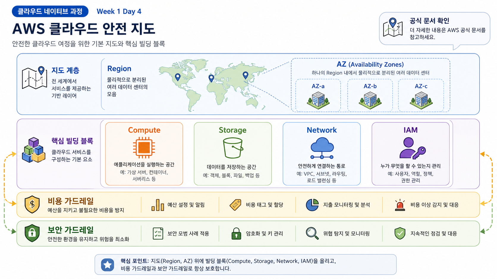
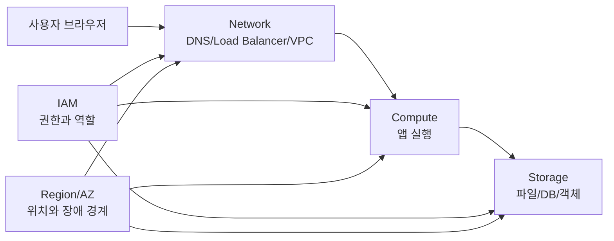

# 1교시: 클라우드 기본 구성 요소 - Region, AZ, Compute, Storage, Network, IAM의 큰 그림

## 수업 목표
- 클라우드 리소스를 위치, 실행, 저장, 통신, 권한의 관점으로 나누어 설명한다.
- Region과 Availability Zone이 장애 격리와 지연 시간에 영향을 준다는 점을 이해한다.
- Compute, Storage, Network, IAM이 3일차의 웹 애플리케이션 구조와 어떻게 연결되는지 설명한다.
- AWS 서비스 이름을 외우기보다 어떤 운영 문제를 해결하는 구성요소인지 구분한다.

## 시작 상황
3일차에는 미니 웹앱을 로컬에서 실행하고, 포트와 로그, README를 확인했다. 이제 같은 앱을 클라우드에 올린다고 생각해 보자. "AWS에 올린다"는 말은 너무 넓다. 어느 지역에 둘 것인지, 어떤 실행 자원에서 돌릴 것인지, 데이터는 어디에 둘 것인지, 외부 사용자는 어떤 네트워크 경로로 들어올 것인지, 누가 설정을 바꿀 수 있는지까지 정해야 한다.

클라우드는 커다란 컴퓨터 한 대가 아니라, 위치와 역할이 나뉜 자원들의 조합이다. 초급자는 서비스 이름을 많이 외우기보다 먼저 지도를 만들어야 한다. 이 지도에서 Region(지리적 리소스 위치), AZ(Availability Zone, 한 Region 안의 분리된 데이터센터 묶음), Compute(실행 자원), Storage(저장 자원), Network(통신 경로), IAM(권한 관리)이 기본 축이 된다.

## 공식 참고 자료
- AWS Documentation: Regions and Availability Zones  
  https://docs.aws.amazon.com/AWSEC2/latest/UserGuide/using-regions-availability-zones.html
- AWS Documentation: AWS global infrastructure  
  https://docs.aws.amazon.com/whitepapers/latest/aws-overview/global-infrastructure.html
- AWS Documentation: Compute services  
  https://docs.aws.amazon.com/whitepapers/latest/aws-overview/compute-services.html
- AWS Documentation: Storage services  
  https://docs.aws.amazon.com/whitepapers/latest/aws-overview/storage-services.html
- AWS Documentation: Networking services  
  https://docs.aws.amazon.com/whitepapers/latest/aws-overview/networking-services.html
- AWS IAM User Guide: What is IAM?  
  https://docs.aws.amazon.com/IAM/latest/UserGuide/introduction.html

## 핵심 개념
| 구성요소 | 쉬운 뜻 | 대표 질문 | 이후 연결 |
|---|---|---|---|
| Region | 리소스를 둘 지리적 지역 | 사용자가 어느 지역에 있는가? | AWS 배포, 비용, 지연 시간 |
| Availability Zone | Region 안의 분리된 장애 경계 | 한 데이터센터 장애를 견딜 것인가? | 고가용성, ALB, RDS Multi-AZ |
| Compute | 프로그램 실행 자원 | 앱이 어디서 실행되는가? | EC2, ECS, EKS, Lambda |
| Storage | 데이터 저장 자원 | 데이터가 재시작 후에도 남아야 하는가? | EBS, S3, RDS |
| Network | 요청과 응답의 길 | 누가 어디로 접속할 수 있는가? | VPC, subnet, route, security group |
| IAM | 사람과 프로그램의 권한 | 누가 무엇을 할 수 있는가? | 최소 권한, 역할, 정책 |

## 쉬운 비유: 도시와 건물 관리
클라우드 Region은 도시와 비슷하다. 서울, 도쿄, 버지니아처럼 사용자가 가까운 도시를 고르면 왕복 시간이 줄어들 수 있다. AZ는 같은 도시 안에서도 서로 떨어진 건물 단지와 비슷하다. 한 건물에 문제가 생겨도 다른 건물에서 서비스를 계속할 수 있게 분리한다.

Compute는 일을 처리하는 사무실, Storage는 문서 보관실, Network는 도로와 출입문, IAM은 출입증과 권한 규칙에 가깝다. 좋은 운영자는 사무실만 크게 빌리지 않는다. 문서가 어디에 저장되는지, 누가 들어올 수 있는지, 도로가 막히면 어떤 우회가 있는지, 출입증이 과하게 발급되어 있지 않은지를 함께 본다.

이 비유의 한계는 클라우드가 실제 도시처럼 눈에 보이지 않고, 설정 변경이 API와 콘솔 클릭으로 즉시 반영된다는 점이다. 그래서 더더욱 문서와 변경 기록, 권한 통제가 필요하다.

## 인포그래픽
아래 인포그래픽은 4일차 전체 학습 지도를 보여준다. Region과 AZ 위에 Compute, Storage, Network, IAM을 배치하고, 바깥에 비용과 보안 가드레일을 둔다.

## Mermaid: 로컬 앱을 클라우드 구성요소로 해석하기

이 다이어그램은 서비스 접속을 왼쪽에서 오른쪽으로 읽는다. 사용자는 네트워크 입구를 통해 앱 실행 자원에 도착하고, 앱은 저장 자원에 접근한다. IAM은 모든 접근의 권한 경계이며, Region/AZ는 리소스가 실제로 배치되는 위치와 장애 격리를 결정한다.

## 운영 판단 기준
| 판단 질문 | 확인할 것 | 잘못 판단했을 때의 문제 |
|---|---|---|
| 어떤 Region을 쓸 것인가? | 사용자 위치, 서비스 제공 여부, 비용, 규제 | 지연 시간 증가, 서비스 미지원, 비용 차이 |
| AZ를 몇 개 고려할 것인가? | 장애 허용 수준, 실습 범위 | 단일 장애점 또는 과한 비용 |
| 어떤 Compute가 필요한가? | 실행 시간, 제어 수준, 배포 방식 | 과한 서버 관리 또는 제약 미확인 |
| 어떤 Storage가 필요한가? | 파일, 블록, 객체, 관계형 데이터 | 데이터 손실, 백업 누락, 비용 증가 |
| 어떤 Network 경로가 열려야 하는가? | 외부 공개 여부, 포트, 보안 그룹 | 접속 실패 또는 과도한 노출 |
| 누가 수정할 수 있어야 하는가? | 사용자, 역할, 정책 | root 남용, 권한 과다, 감사 어려움 |

## 실습: 서비스 이름보다 역할 먼저 분류하기
아래 표를 개인 노트에 채운다. 지금은 리소스를 만들지 않는다.

| 서비스 또는 개념 | 역할 분류 | 사용 조건 | 비용/보안 주의 |
|---|---|---|---|
| EC2 | Compute | 서버처럼 직접 실행 환경을 관리해야 할 때 | 켜져 있는 시간, 공개 포트 |
| S3 | Storage | 정적 파일, 이미지, 백업 객체 저장 | 공개 버킷, 저장량/요청 비용 |
| VPC | Network | 리소스가 통신할 격리 네트워크 필요 | 라우팅, 공개/비공개 subnet |
| IAM Role | IAM | 서비스나 사용자에게 권한 부여 | 과한 정책, 장기 access key |
| RDS | Storage/Database | 관계형 DB를 관리형으로 사용할 때 | 인스턴스 시간, 백업, 공개 접근 |

확인 질문:
- EC2는 "클라우드"인가, 아니면 클라우드 안의 Compute 선택지인가?
- S3는 데이터베이스인가, 객체 저장소인가?
- IAM을 나중에 붙이면 되는 부가기능으로 봐도 되는가?

## 흔한 오해
| 오해 | 바로잡기 |
|---|---|
| Region은 아무 데나 골라도 된다 | 지연 시간, 서비스 지원, 비용, 규제에 영향을 준다 |
| AZ가 많으면 무조건 좋다 | 가용성은 높아질 수 있지만 구조와 비용이 복잡해진다 |
| Compute만 만들면 서비스가 된다 | 네트워크, 저장소, 권한, 로그가 함께 필요하다 |
| IAM은 보안팀만 다룬다 | 인프라/DevOps 엔지니어가 매일 마주치는 운영 경계다 |

## DevOps 원칙 연결
- 비용 절감: 리소스 역할을 먼저 분류하면 필요 없는 관리형 서비스나 과한 서버 생성을 줄인다.
- 개발/배포 효율성: Compute, Network, Storage 경계를 알면 배포 실패가 코드 문제인지 인프라 문제인지 빠르게 나눌 수 있다.
- 관리 효율성: IAM과 Region/AZ 기준을 문서화하면 팀원이 같은 구조로 리소스를 찾고 검토할 수 있다.

## 다음 수업 연결
다음 교시에서는 같은 클라우드 리소스라도 IaaS, PaaS, SaaS, Managed Service에 따라 사용자가 책임지는 범위가 달라진다는 점을 다룬다. 서비스 선택은 기능 선택이 아니라 운영 책임 선택이다.
