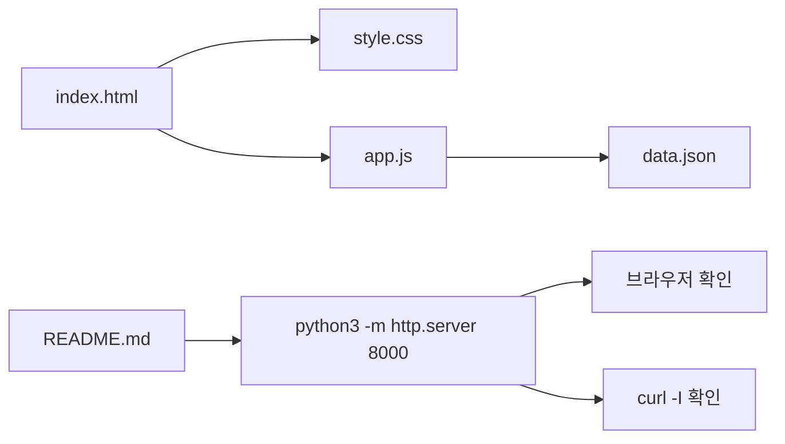

# 1교시: 공통 샘플앱 구조 읽기

## 수업 목표
- Day4가 새 앱 개발 시간이 아니라 공통 샘플앱 운영 실습임을 이해한다.
- `index.html`, `style.css`, `app.js`, `data.json`, `README.md`의 역할을 구분한다.
- 파일 구조를 실행 조건 관점으로 읽는다.

## 오늘 반드시 가져갈 것
| 필수 개념 | 왜 필수인가 | 놓치면 생기는 문제 | 확인 기록 |
|---|---|---|---|
| 공통 샘플앱 | 모두 같은 앱으로 실습해야 성공/실패를 비교할 수 있다. | 학생마다 다른 앱 오류를 디버깅하느라 운영 개념이 흐려진다. | sample-app 경로 |
| 파일 역할 | HTML, CSS, JS, JSON, README가 맡는 일이 다르다. | 화면 문제와 데이터 문제를 구분하지 못한다. | file role map |
| 실행 조건 | 샘플앱도 source, runtime, command, port, data를 가진다. | "파일만 있으면 된다"고 오해한다. | 실행 조건 표 |
| 제외 범위 | backend, DB, login, paid API는 오늘 하지 않는다. | 개발 수업처럼 범위가 커진다. | 제외 항목 note |

### 챌린저 복구 기준
- 파일을 모두 이해하려 하지 말고 "어느 파일이 어떤 역할인가"부터 표시한다.
- 코드를 외우지 않는다. 파일이 실행 흐름에서 어디에 쓰이는지만 읽는다.
- 모르는 단어는 README의 start/check/stop 위치와 연결해 본다.

## 50분 운영
| 시간 | 활동 | 학습 초점 | 학생 산출 |
|---|---|---|---|
| 0-5분 | Day4 방향 확인 | 개발이 아니라 운영 관찰 실습임을 고정한다. | 방향 note |
| 5-15분 | 샘플앱 폴더 열기 | 파일 목록과 역할을 읽는다. | file list |
| 15-30분 | 파일 역할 매핑 | HTML/CSS/JS/JSON/README 책임을 나눈다. | role map |
| 30-40분 | 실행 조건 표 작성 | runtime, command, port, data를 연결한다. | execution contract |
| 40-50분 | 제외 범위 확인 | 구현하지 않을 것을 명확히 한다. | exclusion note |

## 0-5분 Day4 방향 확인
Day4는 "내 앱을 새로 만드는 날"이 아니다. 이미 준비된 샘플앱을 사용해 서버 실행, 성공 확인, 실패 관찰, runbook 작성을 체험한다. IT를 처음 접하는 챌린저도 같은 출발점에서 시작하도록 앱을 통일한다.

## 5-15분 샘플앱 폴더 열기
```bash
cd week1/day4/sample-app
ls -la
```

### 파일 역할 표
| 파일 | 역할 | 오늘 볼 관점 |
|---|---|---|
| `index.html` | 화면 구조와 script/css 연결 | 브라우저가 처음 읽는 파일 |
| `style.css` | 화면 스타일 | 실행 성공의 핵심은 아니지만 화면 확인에 도움 |
| `app.js` | `data.json`을 읽고 화면 갱신 | 오류가 나면 console에 흔적이 남음 |
| `data.json` | 화면에 표시할 더미 데이터 | 경로/문법 오류 관찰 대상 |
| `README.md` | 실행과 확인 절차 | runbook의 시작점 |

## 15-30분 파일 역할 매핑


## 30-40분 실행 조건 표 작성
| 실행 조건 | 샘플앱 값 |
|---|---|
| Source | `week1/day4/sample-app` |
| Runtime | Python 3 |
| Command | `python3 -m http.server 8000` |
| Port | 8000 |
| Data | `data.json` |
| Dependency | 외부 서비스 없음 |

## 40-50분 제외 범위 확인
| 제외 항목 | 오늘 제외하는 이유 |
|---|---|
| backend server | 정적 서버 실행 관찰에 집중한다. |
| database | 데이터 저장보다 JSON 파일 요청을 관찰한다. |
| login/auth | 권한과 session은 Week1 범위를 넘는다. |
| paid API | 비용과 key 관리 위험을 만들지 않는다. |
| cloud deploy | 로컬 실행과 확인 기록을 먼저 안정화한다. |

## 평가 기준
| 기준 | 충족 |
|---|---|
| 샘플앱 파일 5개의 역할을 설명했다. | |
| 실행 조건 표를 작성했다. | |
| 제외 범위를 개발 포기가 아니라 운영 범위 통제로 설명했다. | |

## 다음 연결
다음 교시는 이 샘플앱을 실제로 로컬 서버에서 실행하고 브라우저, `curl`, 서버 로그로 성공 기준을 확인한다.
