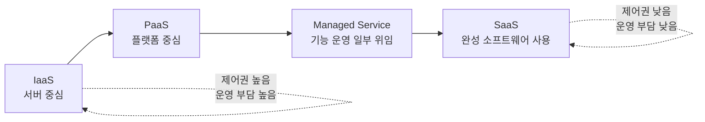

# 2교시: 클라우드 서비스 모델 - IaaS, PaaS, SaaS, Managed Service, Shared Responsibility Model

## 수업 목표
- IaaS, PaaS, SaaS, Managed Service의 차이를 운영 책임 관점에서 설명한다.
- Shared Responsibility Model을 사용해 클라우드 제공자와 사용자의 보안 책임을 구분한다.
- 관리형 서비스가 운영 부담을 줄이지만 비용, 제약, 책임을 없애지는 않는다는 점을 이해한다.
- 서비스 선택 시 제어권, 운영 부담, 비용 예측, 보안 책임을 함께 비교한다.

## 시작 상황
같은 웹 애플리케이션을 운영하더라도 선택지는 여러 가지다. 직접 서버를 빌려 OS부터 관리할 수도 있고, 컨테이너 실행 플랫폼을 쓸 수도 있고, 정적 파일만 올리는 서비스를 쓸 수도 있다. 더 많이 관리할수록 제어권은 늘지만 운영 부담도 늘어난다. 덜 관리할수록 빠르게 시작할 수 있지만, 서비스 제약과 과금 구조를 더 정확히 읽어야 한다.

이 차이를 정리하는 기본 언어가 IaaS(Infrastructure as a Service), PaaS(Platform as a Service), SaaS(Software as a Service), Managed Service다. 초급자는 이 단어를 시험 용어처럼 외우기보다 "내가 직접 책임지는 범위가 어디까지인가"로 이해해야 한다.

## 공식 참고 자료
- AWS: Types of cloud computing  
  https://aws.amazon.com/types-of-cloud-computing/
- AWS: Shared Responsibility Model  
  https://aws.amazon.com/compliance/shared-responsibility-model/
- AWS Well-Architected Framework: Security pillar  
  https://docs.aws.amazon.com/wellarchitected/latest/security-pillar/welcome.html
- AWS Documentation: Introduction to AWS  
  https://docs.aws.amazon.com/whitepapers/latest/aws-overview/introduction.html

## 핵심 개념
| 모델 | 사용자가 주로 관리하는 것 | 제공자가 주로 관리하는 것 | 예시 관점 |
|---|---|---|---|
| IaaS | OS 설정, 런타임, 앱, 데이터, 네트워크 설정 일부 | 물리 서버, 데이터센터, 가상화 기반 | 서버를 빌려 직접 운영 |
| PaaS | 앱 코드, 설정, 데이터 | 런타임 일부, 플랫폼 운영 | 앱 실행 플랫폼에 배포 |
| SaaS | 계정, 데이터 입력, 권한 설정 | 애플리케이션 대부분 | 완성된 소프트웨어 사용 |
| Managed Service | 서비스 설정과 데이터 사용 방식 | 패치, 백업 일부, 운영 자동화 일부 | DB, 캐시, 메시지 큐 관리형 사용 |

Managed Service는 PaaS와 완전히 같은 말은 아니다. RDS처럼 특정 기능을 관리형으로 제공하는 서비스도 있고, ECS/Fargate처럼 실행 환경 일부를 대신 관리해 주는 선택지도 있다. 중요한 것은 이름보다 책임 경계다.

## 쉬운 비유: 주거 형태와 책임 범위
IaaS는 빈 사무실을 빌리는 것과 비슷하다. 전기와 건물은 제공되지만, 책상 배치, 출입 관리, 청소, 장비 설치는 직접 해야 한다. PaaS는 기본 인테리어와 공용 설비가 갖춰진 공유 오피스에 가깝다. SaaS는 이미 완성된 회의실 예약 서비스를 사용하는 것과 비슷하다.

Managed Service는 청소, 보안, 설비 점검 같은 일부 운영을 전문가에게 맡기는 방식이다. 하지만 맡겼다고 해서 사용자의 책임이 사라지는 것은 아니다. 회의실 예약 서비스에서도 누가 어떤 회의실을 예약할 수 있는지, 민감한 문서를 올려도 되는지, 비용 한도를 어떻게 둘지는 사용자가 정해야 한다.

비유의 한계는 실제 클라우드 책임 경계가 서비스마다 다르고, 같은 서비스 안에서도 설정에 따라 달라질 수 있다는 점이다. 그래서 모델 이름을 외운 뒤 끝내지 말고, 반드시 공식 문서에서 책임과 제약을 확인해야 한다.

## Shared Responsibility Model 읽기
Shared Responsibility Model은 "클라우드의 보안"과 "클라우드 안에서의 보안"을 나눈다. AWS는 데이터센터, 물리 장비, 일부 기반 서비스를 보호한다. 사용자는 계정, 권한, 데이터, 네트워크 공개 범위, 애플리케이션 설정을 보호해야 한다.

| 영역 | AWS 책임 예시 | 사용자 책임 예시 |
|---|---|---|
| 물리 데이터센터 | 시설 보안, 하드웨어 관리 | 직접 접근하지 않음 |
| 계정과 권한 | IAM 기능 제공 | MFA, 최소 권한, access key 관리 |
| 데이터 | 저장 서비스 제공 | 암호화 설정, 공개 범위, 백업 정책 |
| 네트워크 | 글로벌 인프라 제공 | 보안 그룹, 라우팅, 공개 subnet 판단 |
| 애플리케이션 | 실행 기반 제공 | 코드 보안, secret 주입, 로그 관리 |

이 모델은 보안팀만의 문서가 아니다. 인프라/DevOps 엔지니어가 매일 내리는 결정의 기준이다. 예를 들어 RDS를 사용하면 데이터베이스 엔진 설치와 일부 패치는 줄어들 수 있지만, 어떤 subnet에 둘지, 공개 접근을 막을지, 백업 보관 기간을 어떻게 둘지, 어떤 사용자가 접근할지는 여전히 사용자의 책임이다.

## 의사결정 표
| 선택 기준 | 직접 관리에 가까운 선택 | 관리형에 가까운 선택 |
|---|---|---|
| 제어권 | OS, 런타임, 네트워크 세부 제어 가능 | 제공되는 옵션 안에서 설정 |
| 운영 부담 | 패치, 백업, 모니터링 직접 설계 | 일부 자동화 또는 기본 제공 |
| 초기 속도 | 느릴 수 있음 | 빠르게 시작 가능 |
| 비용 구조 | 인스턴스/스토리지 중심으로 예측 가능할 수 있음 | 편의 기능과 요청량에 따라 달라짐 |
| 보안 책임 | 설정 범위가 넓어 실수 가능성 증가 | 서비스 제약 안에서 권한/데이터 설정 중요 |
| 학습 난이도 | 내부 구조 이해에 좋음 | 빠른 실습에 좋지만 제약을 읽어야 함 |

## Mermaid: 책임 범위가 줄어드는 방향

오른쪽으로 갈수록 사용자가 직접 관리하는 범위는 줄어든다. 하지만 책임이 0이 되지는 않는다. 계정, 권한, 데이터 입력, 비용 한도, 계약과 규정 준수는 계속 남는다.

## 실습: 같은 요구사항을 서비스 모델로 나누기
요구사항: "수업용 체크리스트 웹앱을 다른 사람이 접속할 수 있게 공개하고 싶다."

| 선택지 | 모델 관점 | 사용자가 챙길 것 | 이번 주차 판단 |
|---|---|---|---|
| EC2에 직접 배포 | IaaS | OS, 웹서버, 보안 그룹, 로그, 패치 | 1주차에는 생성하지 않음 |
| 컨테이너 플랫폼 사용 | PaaS/Managed | 이미지, 배포 설정, 로그, 권한 | 2~5주차 이후 연결 |
| 정적 사이트 호스팅 | Managed/PaaS | 파일 배포, 공개 범위, 캐시 | 추후 선택 가능 |
| GitHub Pages | SaaS/Managed에 가까움 | 저장소 공개 범위, 빌드 설정 | 비용 없는 발표용 후보 |

이번 주차에서는 AWS 리소스를 바로 만들기보다 어떤 선택지가 어떤 책임을 가져오는지 분류한다. 책임을 모르면 서비스 선택이 빠른 시작처럼 보이다가 나중에 비용, 권한, 장애 대응에서 막힌다.

## 흔한 오해
| 오해 | 바로잡기 |
|---|---|
| Managed Service는 보안도 전부 대신해 준다 | 계정, 권한, 데이터, 네트워크 공개 범위는 사용자가 책임진다 |
| SaaS는 인프라 지식이 필요 없다 | 권한, 감사, 데이터 반출, 비용 정책은 여전히 중요하다 |
| 직접 관리하면 항상 싸다 | 운영 인력, 장애 대응, 패치 시간을 포함하면 비쌀 수 있다 |
| 관리형은 항상 비싸다 | 짧은 실험과 작은 팀에서는 운영 부담 감소가 더 클 수 있다 |

## DevOps 원칙 연결
- 비용 절감: 운영 부담까지 비용으로 보면 직접 관리와 관리형의 장단점을 더 정확히 비교할 수 있다.
- 개발/배포 효율성: 관리형 서비스는 반복 운영을 줄여 배포 속도를 높일 수 있지만, 제약을 모르면 장애 대응이 느려진다.
- 관리 효율성: 책임 경계를 문서화하면 보안 사고가 났을 때 "누가 무엇을 확인해야 하는가"가 명확해진다.

## 다음 수업 연결
다음 교시에서는 실제 AWS 계정을 만들기 전에 과금 구조, Free Tier, 결제 수단, root user와 MFA를 확인한다. 클라우드 계정은 실습 도구이면서 동시에 실제 비용과 권한이 연결된 운영 경계다.
