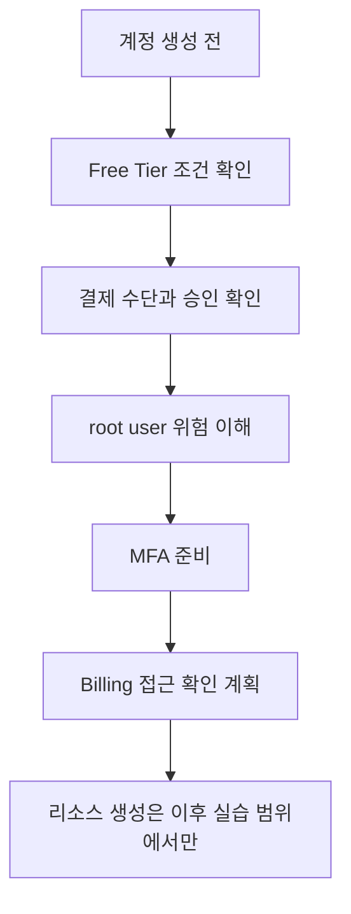

# 3교시: AWS 계정 생성 전 안내 - 과금 구조, Free Tier, 결제 수단, MFA, root 계정 주의사항

## 수업 목표
- AWS 계정이 실제 비용 청구와 연결되는 운영 계정임을 이해한다.
- Free Tier가 조건부 무료 범위이며, 모든 서비스가 무조건 무료가 아니라는 점을 설명한다.
- root user의 위험과 MFA 필요성을 계정 보안 관점에서 설명한다.
- 계정 생성 전 결제 수단, 이메일, 휴대폰, MFA 준비 상태를 점검한다.

## 시작 상황
클라우드 실습에서 가장 위험한 문장은 "무료니까 그냥 만들어도 된다"이다. AWS에는 Free Tier가 있지만, Free Tier는 특정 서비스와 사용량 조건에 대해 적용된다. 사용량을 넘거나, Free Tier에 포함되지 않는 서비스를 만들거나, 리소스를 삭제하지 않으면 비용이 발생할 수 있다.

AWS 계정은 단순 웹사이트 회원가입이 아니다. 결제 수단과 연결되고, root user는 계정 전체를 통제할 수 있다. 그래서 계정 생성 전에는 실습 범위, 비용 확인 방법, MFA 설정, root user 사용 제한을 먼저 이해해야 한다.

## 공식 참고 자료
- AWS Free Tier  
  https://aws.amazon.com/free/
- AWS Billing and Cost Management User Guide  
  https://docs.aws.amazon.com/awsaccountbilling/latest/aboutv2/billing-what-is.html
- AWS Account Management: Create an AWS account  
  https://docs.aws.amazon.com/accounts/latest/reference/manage-acct-creating.html
- AWS IAM User Guide: AWS account root user  
  https://docs.aws.amazon.com/IAM/latest/UserGuide/id_root-user.html
- AWS IAM User Guide: Multi-factor authentication in IAM  
  https://docs.aws.amazon.com/IAM/latest/UserGuide/id_credentials_mfa.html

## 핵심 개념
| 용어 | 뜻 | 확인할 질문 |
|---|---|---|
| AWS Account | AWS 리소스와 비용, 권한이 묶이는 최상위 단위 | 이 계정을 누가 관리하고 비용을 확인하는가? |
| Root User | 계정 생성 이메일로 로그인하는 최고 권한 사용자 | 일상 작업에 쓰지 않도록 보호했는가? |
| MFA | 비밀번호 외 추가 인증 요소 | 분실 시 복구 방법을 알고 있는가? |
| Free Tier | 조건을 만족하면 무료인 사용량 범위 | 서비스, 기간, 사용량 조건을 확인했는가? |
| Billing | 비용과 청구를 확인하는 영역 | 접근 권한과 알림 기준을 확인했는가? |

## Free Tier를 읽는 기준
Free Tier 문서에서 확인할 것은 "무료"라는 단어가 아니라 조건이다.

| 확인 항목 | 왜 필요한가 |
|---|---|
| 서비스명 | 모든 AWS 서비스가 Free Tier에 포함되는 것은 아니다 |
| 기간 조건 | 12개월 무료, 항상 무료, 단기 trial이 다를 수 있다 |
| 사용량 단위 | 시간, GB, 요청 수, 데이터 전송량 등 기준이 다르다 |
| 리전 차이 | 서비스 제공 여부와 가격이 리전에 따라 다를 수 있다 |
| 초과 시 비용 | 작은 초과도 월말 청구로 이어질 수 있다 |

1주차에는 비용이 발생하는 리소스를 만들지 않는다. 오늘 계정 생성이 진행되더라도 핵심은 로그인, MFA, Billing 접근 확인이다. EC2, RDS, NAT Gateway, 고정 IP, 대용량 스토리지 같은 리소스는 이후 주차에서 명확한 실습 범위와 정리 절차가 있을 때 다룬다.

## 쉬운 비유: 무료 체험 헬스장
Free Tier는 "헬스장 무료 체험권"과 비슷하다. 무료 체험권이 있다고 해서 모든 PT, 사물함, 운동복 대여, 주차, 추가 프로그램이 무료라는 뜻은 아니다. 체험 기간과 제공 범위 안에서만 무료다. 범위를 넘으면 결제가 시작된다.

AWS에서도 "계정 생성은 무료"와 "리소스 사용이 무료"는 다른 말이다. 어떤 서비스는 일정 시간 무료일 수 있고, 어떤 서비스는 저장량이나 요청 수 기준으로 무료일 수 있으며, 어떤 서비스는 Free Tier가 없을 수 있다. 비유의 한계는 클라우드 비용이 사용량에 따라 자동으로 계속 증가할 수 있다는 점이다. 그래서 콘솔에서 비용 확인과 알림 설정을 함께 봐야 한다.

## 계정 생성 전 체크리스트
| 항목 | 확인 | 메모 |
|---|---|---|
| 사용할 이메일을 정했다 |  |  |
| 이메일 접근 권한을 잃지 않는다 |  |  |
| 휴대폰 인증을 받을 수 있다 |  |  |
| 결제 수단 사용 승인을 받았다 |  |  |
| MFA 앱 또는 passkey 준비가 되었다 |  |  |
| root user를 일상 작업에 쓰지 않는 이유를 안다 |  |  |
| Billing 화면 접근이 필요함을 이해했다 |  |  |
| 실습 후 리소스 정리 원칙을 이해했다 |  |  |

## 비용 발생 위험이 큰 초급자 실수
| 실수 | 왜 위험한가 | 예방 기준 |
|---|---|---|
| 리소스를 만들고 끄지 않음 | 시간당 비용이 계속 발생할 수 있다 | 실습 종료 체크리스트 작성 |
| Free Tier 범위를 확인하지 않음 | 무료가 아닌 서비스 사용 가능 | 공식 Free Tier 페이지 확인 |
| 리전을 잘못 선택 | 다른 리전에 만든 리소스를 놓칠 수 있다 | 수업 리전 고정, 전체 리전 확인 |
| root user로 계속 작업 | 실수의 영향 범위가 계정 전체가 된다 | MFA 설정 후 일상 작업 제한 |
| access key를 GitHub에 올림 | 외부에서 비용 발생 리소스를 만들 수 있다 | secret 검색과 key 비활성화 절차 |

## Mermaid: 계정 생성 전 안전 흐름

## 교육용 계산 예제
다음 숫자는 교육용 가정값이다. 실제 가격은 서비스, 리전, 날짜에 따라 달라지므로 AWS Pricing Calculator와 공식 pricing 문서를 확인해야 한다.

가정:
- 어떤 리소스가 시간당 0.02 USD라고 가정한다.
- 실수로 24시간 켜 두면 `0.02 x 24 = 0.48 USD`다.
- 한 달 30일 동안 켜 두면 `0.02 x 24 x 30 = 14.40 USD`다.
- 환율을 1 USD = 1,350 KRW로 가정하면 `14.40 x 1,350 = 19,440 KRW`다.

이 계산은 큰 비용처럼 보이지 않을 수 있다. 하지만 실제 계정에는 여러 리소스가 동시에 만들어질 수 있고, 데이터 전송, 스토리지, 로그, 백업, 고정 IP, NAT Gateway처럼 별도 비용 항목이 붙을 수 있다. 비용 관리는 큰 회사만의 문제가 아니라 초급 실습 첫날부터 필요한 습관이다.

## DevOps 원칙 연결
- 비용 절감: 계정 생성 전 비용 조건을 확인하면 실습 비용 사고를 예방한다.
- 개발/배포 효율성: 안전한 계정 기준이 있어야 이후 AWS 배포 실습을 지연 없이 진행할 수 있다.
- 관리 효율성: root user, MFA, Billing 접근 기준을 문서화하면 개인별 환경 차이를 빠르게 파악할 수 있다.

## 다음 수업 연결
다음 교시에서는 계정 생성과 MFA 설정, 콘솔 로그인, Billing 알림 확인 흐름을 실제 체크리스트로 진행한다. 완료하지 못한 학생은 막힌 지점과 다음 조치를 기록한다.
