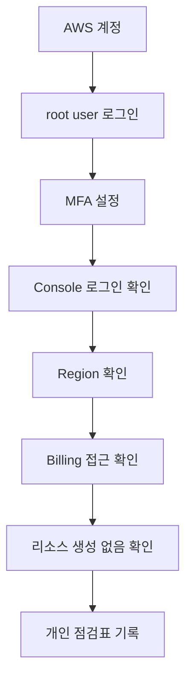

# 4교시: AWS 계정 생성 및 보안 기본 설정 - 계정 생성, MFA 설정, Billing 알림 확인, 콘솔 로그인

## 수업 목표
- AWS 계정 생성 또는 기존 계정 로그인 상태를 확인한다.
- root user MFA 설정 여부를 확인하고, 설정하지 못하면 이유와 다음 조치를 기록한다.
- Billing and Cost Management 화면 접근 가능 여부를 확인한다.
- 콘솔에서 현재 리전과 계정 정보를 확인하는 습관을 만든다.

## 사전 준비
오늘 실습은 학생 개인 상황에 따라 진행 속도가 다를 수 있다. 결제 수단, 휴대폰 인증, 보호자 또는 회사 승인, 보안 정책 때문에 계정 생성이 즉시 완료되지 않을 수 있다. 그런 경우 무리해서 우회하지 않는다. 막힌 지점을 기록하고 다음 조치를 정리하는 것도 오늘의 산출물이다.

비용 주의사항:
- 오늘은 비용 발생 리소스를 만들지 않는다.
- 계정 생성, MFA, Billing 접근 확인을 중심으로 진행한다.
- 콘솔 화면에서 "Create", "Launch", "Start" 버튼을 누르기 전에는 반드시 수업 범위인지 확인한다.

보안 주의사항:
- root user 비밀번호를 공유하지 않는다.
- MFA QR 코드나 복구 코드를 화면 공유 또는 GitHub에 올리지 않는다.
- access key를 만들지 않는다.
- 결제 정보와 개인 정보를 캡처해 공유하지 않는다.

## 공식 참고 자료
- AWS Account Management: Create an AWS account  
  https://docs.aws.amazon.com/accounts/latest/reference/manage-acct-creating.html
- AWS IAM User Guide: Enable MFA devices for users in AWS  
  https://docs.aws.amazon.com/IAM/latest/UserGuide/id_credentials_mfa_enable.html
- AWS IAM User Guide: AWS account root user  
  https://docs.aws.amazon.com/IAM/latest/UserGuide/id_root-user.html
- AWS Billing and Cost Management User Guide  
  https://docs.aws.amazon.com/awsaccountbilling/latest/aboutv2/billing-what-is.html

## 전체 실습 흐름
1. AWS 공식 계정 생성 문서를 확인한다.
2. 계정 생성 또는 기존 계정 로그인을 진행한다.
3. root user MFA 설정 여부를 확인한다.
4. AWS Console에 로그인한다.
5. 현재 Region을 확인한다.
6. Billing and Cost Management 화면 접근 가능 여부를 확인한다.
7. 비용 알림 또는 Budget 설정 위치를 확인한다.
8. 오늘 만든 리소스가 없는지 확인한다.

## 단계별 절차
### 1. 공식 문서에서 계정 생성 흐름 확인
먼저 공식 문서를 연다. AI 답변이나 블로그를 보더라도 최종 기준은 AWS 공식 문서다.

확인할 키워드:
- root user email address
- contact information
- payment information
- phone verification
- support plan

Support plan 선택 단계가 나오면 실습용 계정에서는 무료 또는 기본 지원 범위를 우선 확인한다. 유료 지원 플랜을 선택하지 않도록 주의한다.

### 2. 계정 생성 또는 로그인
계정이 없는 학생은 공식 흐름에 따라 생성한다. 이미 계정이 있는 학생은 로그인한다.

기록할 것:
| 항목 | 기록 |
|---|---|
| 계정 생성 완료 여부 |  |
| 기존 계정 사용 여부 |  |
| 막힌 단계 |  |
| 다음 조치 |  |

### 3. MFA 설정 확인
root user에 MFA를 설정한다. MFA 방식은 수업 환경과 개인 장치에 따라 달라질 수 있다. passkey, authenticator app, hardware key 중 가능한 방식을 선택한다.

확인할 것:
- MFA가 root user에 연결되었는가?
- MFA 장치를 잃어버렸을 때 복구 절차를 어디서 확인할 수 있는가?
- MFA 화면이나 QR 코드를 외부에 노출하지 않았는가?

### 4. Console과 Region 확인
콘솔 오른쪽 위 또는 상단 메뉴에서 현재 Region을 확인한다. 이후 수업에서는 리전을 정해 진행할 수 있으므로, 오늘은 "내가 지금 어느 리전을 보고 있는가"를 확인하는 습관을 만든다.

기록 예시:
```text
현재 콘솔 Region:
수업에서 사용할 기본 Region:
다른 Region에 리소스가 있는지 확인 필요:
```

### 5. Billing 접근 확인
Billing and Cost Management 화면에 접근한다. 조직 또는 계정 설정에 따라 root user가 아닌 IAM 사용자는 Billing 접근 권한이 없을 수 있다. 오늘은 접근 가능 여부를 확인하고, 접근이 안 되면 권한 요청 항목으로 기록한다.

확인할 것:
- 현재 비용 또는 청구 대시보드를 볼 수 있는가?
- Budget 또는 알림 설정 메뉴 위치를 찾을 수 있는가?
- Free Tier 사용량 확인 위치를 찾을 수 있는가?

## 관찰 포인트
| 관찰 대상 | 정상 상태 | 문제가 있을 때 |
|---|---|---|
| 로그인 | 콘솔 홈 진입 가능 | 이메일, 비밀번호, 인증 문제 기록 |
| MFA | 로그인 시 추가 인증 요구 | MFA 미설정, 장치 분실 위험 |
| Region | 현재 위치가 명확함 | 다른 리전 리소스 놓칠 수 있음 |
| Billing | 비용 화면 접근 가능 | 권한 또는 계정 설정 확인 필요 |
| 리소스 생성 | 오늘은 생성하지 않음 | 실수로 만든 리소스 즉시 공유 |

## 흔한 오류와 대응
| 증상 | 가능한 원인 | 대응 |
|---|---|---|
| 휴대폰 인증 실패 | 번호 형식, 통신사, 국가 코드 문제 | 공식 문서 흐름 재확인, 잠시 후 재시도 |
| 결제 수단 오류 | 카드 인증 실패, 승인 제한 | 다른 결제 수단 또는 승인 요청 |
| MFA 등록 실패 | 시간 동기화, QR 인식 실패 | 앱 시간 동기화, 수동 코드 입력 |
| Billing 화면 접근 불가 | 권한 부족 또는 계정 설정 | root user 또는 관리자에게 권한 확인 |
| 콘솔 언어/화면이 다름 | UI 업데이트 또는 언어 설정 | 공식 문서 메뉴명 기준으로 찾기 |

## Mermaid: 보안 기본 설정 흐름


## 완료 기록 양식
```text
AWS 계정 상태:
MFA 설정 상태:
Billing 접근 상태:
현재 Region:
비용 알림/Budget 메뉴 확인 여부:
오늘 생성한 리소스:
막힌 지점:
다음 조치:
```

## DevOps 원칙 연결
- 비용 절감: Billing 접근을 먼저 확인해야 이후 실습 리소스 비용을 추적할 수 있다.
- 개발/배포 효율성: 계정과 MFA 문제가 초반에 정리되어야 실제 배포 실습 시간을 확보할 수 있다.
- 관리 효율성: 개인별 환경 점검표는 5주차 AWS 실습의 장애 대응 자료가 된다.

## 다음 수업 연결
다음 교시에서는 비용을 더 체계적으로 본다. 데이터센터 비용과 클라우드 사용량 기반 과금을 비교하고, 켜 둔 리소스가 어떻게 월 비용으로 누적되는지 계산한다.
