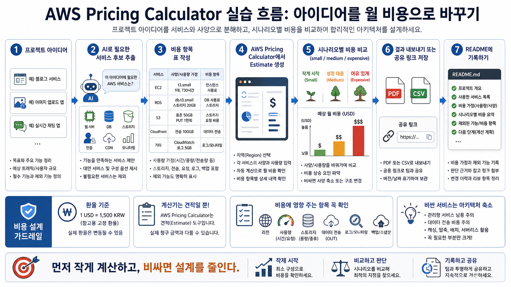
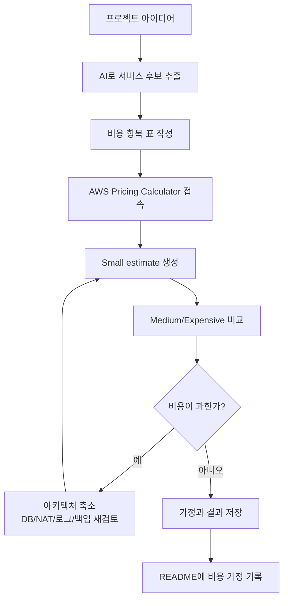

# 5교시: AWS Pricing Calculator 실습 - 프로젝트 아이디어를 월 비용으로 바꾸기

## 수업 목표
- 프로젝트 아이디어를 AWS 서비스 후보와 비용 항목으로 분해한다.
- AI Coding Tool을 사용해 필요한 서비스 후보를 뽑되, 공식 문서와 계산기로 검증한다.
- AWS Pricing Calculator에서 estimate를 만들고, 리전·사용 시간·스토리지·데이터 전송·로그·백업 가정을 입력한다.
- small, medium, expensive 시나리오를 비교해 비싸면 아키텍처를 줄이는 판단을 한다.
- 계산 결과를 PDF/CSV 또는 공유 링크로 저장하고 README에 비용 가정과 제외한 기능을 기록한다.

## 시작 상황
3강에서는 AWS Free Tier/Credits와 비용 사고를 배웠고, 4강에서는 계정 생성과 Billing/Budget 확인을 했다. 5강에서는 실제 AWS 리소스를 만들지 않는다. 대신 AWS Pricing Calculator로 “만약 이 프로젝트를 AWS에 올리면 어떤 비용 항목이 생길까?”를 계산한다.

초급자는 비용을 너무 늦게 본다. 앱을 만들고, 배포하고, 데이터베이스와 파일 업로드와 로그를 붙인 뒤에야 비용을 확인한다. 그러면 이미 구조가 커져 있어서 줄이기 어렵다. 좋은 인프라/DevOps 엔지니어는 설계 초안 단계에서 비용 항목을 먼저 찾는다. 특히 AI가 만들어 준 프로젝트 아이디어는 기능이 과해지기 쉽기 때문에, AI에게 “필요해 보이는 AWS 서비스 후보와 비용 위험”을 뽑게 한 뒤 사람이 줄여야 한다.

오늘의 핵심은 정확한 청구 금액을 맞히는 것이 아니다. AWS Pricing Calculator는 견적 도구이며 실제 청구서가 아니다. 실제 비용은 리전, 사용량, 할인, Free Tier/Credits, 데이터 전송, 로그, 백업, 서비스 설정, 환율, 날짜에 따라 달라진다. 그래도 계산기를 써 보면 어떤 기능이 비용을 키우는지, 어떤 서비스를 빼면 비용이 줄어드는지, 작은 실습 아키텍처가 왜 중요한지 빠르게 볼 수 있다.

## 공식 참고 자료
- AWS Pricing Calculator
  https://calculator.aws/
- AWS Pricing Calculator User Guide
  https://docs.aws.amazon.com/pricing-calculator/latest/userguide/what-is-pricing-calculator.html
- AWS Pricing Calculator: Generate estimates
  https://docs.aws.amazon.com/pricing-calculator/latest/userguide/generate-estimates.html
- AWS Pricing Calculator: Export estimates
  https://docs.aws.amazon.com/pricing-calculator/latest/userguide/export-estimates.html
- AWS Pricing Calculator: Sharing your estimate
  https://docs.aws.amazon.com/pricing-calculator/latest/userguide/sharing-estimates.html
- AWS Well-Architected Framework: Cost Optimization pillar
  https://docs.aws.amazon.com/wellarchitected/latest/cost-optimization-pillar/welcome.html
- AWS Billing and Cost Management User Guide
  https://docs.aws.amazon.com/awsaccountbilling/latest/aboutv2/billing-what-is.html

## 인포그래픽: AWS Pricing Calculator 실습 흐름
아래 인포그래픽은 프로젝트 아이디어를 서비스 후보, 비용 항목, Calculator estimate, 시나리오 비교, README 기록으로 바꾸는 흐름을 보여준다. 이미지 속 비용 예시는 고정 가격이 아니라 실습 절차를 설명하기 위한 표현이다.



## 핵심 개념
| 용어 | 한 줄 뜻 | 오늘의 사용 방식 |
|---|---|---|
| Estimate | 예상 비용 견적 | 프로젝트 후보 아키텍처의 월 비용을 계산한다 |
| Service candidate | 필요해 보이는 AWS 서비스 후보 | AI와 사람이 함께 뽑고 줄인다 |
| Usage assumption | 사용량 가정 | 시간, 요청 수, GB, 전송량, 로그량을 적는다 |
| Scenario | 비교용 설계안 | small, medium, expensive로 나누어 비교한다 |
| Monthly cost | 월 예상 비용 | 730시간 또는 한 달 기준으로 본다 |
| Export | 견적 저장 | PDF, CSV, 공유 링크 등으로 기록한다 |
| Cost driver | 비용을 크게 만드는 항목 | DB, NAT, 데이터 전송, 로그, 백업, 큰 instance를 찾는다 |

## 쉬운 비유: 장보기 전에 장바구니 가격 보기
프로젝트 아이디어는 요리 레시피와 비슷하다. “파스타를 만들자”라고 하면 면, 소스, 고기, 채소, 치즈, 조리 도구가 필요하다. 장을 보기 전에 장바구니에 담아 보면 예상 금액을 알 수 있다. 너무 비싸면 고기를 줄이거나, 치즈를 다른 것으로 바꾸거나, 오늘은 기본 파스타만 만들 수 있다.

AWS Pricing Calculator도 장바구니와 비슷하다. 실제로 결제하는 도구가 아니라, 만들기 전에 예상 비용을 보는 도구다. EC2, RDS, S3, CloudFront, CloudWatch 같은 서비스를 장바구니에 넣고, 사용 시간과 용량과 전송량을 입력한다. 비용이 너무 크면 아키텍처를 줄인다.

비유의 한계는 장바구니 가격은 대체로 고정되어 있지만 클라우드 비용은 사용량에 따라 계속 변한다는 점이다. 사용자가 늘고, 로그가 많아지고, 백업을 오래 보관하고, 데이터 전송이 증가하면 실제 비용은 계산기보다 달라질 수 있다. 그래서 계산기는 시작점이고, 실제 운영에서는 Billing, Cost Explorer, Budget, 태그 기반 추적이 필요하다.

## 오늘 사용할 환율 기준
오늘의 계산 연습은 고정 환율을 사용한다.

```text
1 USD = 1,500 KRW
```

예시:
```text
10 USD = 15,000 KRW
50 USD = 75,000 KRW
100 USD = 150,000 KRW
200 USD = 300,000 KRW
```

실제 환율은 변동된다. 수업에서는 학생들이 계산을 비교하기 쉽도록 1,500원을 고정 기준으로 사용한다.

## 전체 실습 흐름
1. 프로젝트 아이디어를 한 문장으로 쓴다.
2. AI Coding Tool에 필요한 AWS 서비스 후보를 뽑게 한다.
3. 서비스 후보를 기능, 비용 항목, 줄이는 방법으로 정리한다.
4. AWS Pricing Calculator에 접속한다.
5. small scenario estimate를 만든다.
6. medium 또는 expensive scenario를 복제하거나 새로 만들어 비교한다.
7. 비싼 항목을 찾아 아키텍처를 줄인다.
8. estimate를 PDF/CSV 또는 공유 링크로 저장한다.
9. README에 비용 가정, 제외한 기능, 다음 단계 개선안을 기록한다.

## 실습 1: 프로젝트 아이디어 정리
3일차에 만든 앱 또는 8교시에 다룰 프로젝트 아이디어를 사용한다. 아직 아이디어가 없다면 다음 중 하나를 고른다.

| 아이디어 | 기본 기능 |
|---|---|
| 학습 체크리스트 앱 | 항목 목록, 필터, 검색, 상세 보기 |
| 장애 대응 런북 앱 | 증상 검색, 조치 방법, 명령어 목록 |
| 이미지 업로드 포트폴리오 | 이미지 목록, 설명, 태그 필터 |
| 실시간 알림 대시보드 | 알림 목록, 상태 표시, 필터 |
| 간단한 블로그 | 글 목록, 상세 보기, 관리자 작성 기능 후보 |

작성 양식:
```text
프로젝트 이름:
한 문장 설명:
사용자 수 가정:
트래픽 가정:
저장 데이터:
파일 업로드 여부:
로그인 필요 여부:
실시간 기능 필요 여부:
외부 API 필요 여부:
```

처음부터 정확할 필요는 없다. 중요한 것은 “모른다”를 빈칸으로 두지 않고 가정값으로 바꾸는 것이다.

## 실습 2: AI로 서비스 후보 추출하기
AI Coding Tool을 사용할 수 있으면 아래 프롬프트를 사용한다.

```text
너는 주니어 DevOps 엔지니어를 돕는 클라우드 비용 리뷰어야.
다음 프로젝트 아이디어를 AWS에 올린다고 가정했을 때 필요한 서비스 후보와 비용 항목을 뽑아줘.

프로젝트:
- 이름:
- 기능:
- 사용자 수 가정:
- 트래픽 가정:
- 저장 데이터:
- 파일 업로드:
- 로그인:
- 실시간 기능:

요구사항:
- AWS 서비스 후보를 compute, storage, database, network, observability, security, delivery로 나눠줘.
- 각 서비스가 왜 필요한지 설명해줘.
- 비용이 커질 수 있는 조건을 써줘.
- 1주차 실습 기준으로 제외하거나 더미 데이터로 대체할 수 있는 항목을 표시해줘.
- small / medium / expensive 시나리오로 나눠줘.
- 실제 요금은 AWS Pricing Calculator에서 확인해야 한다고 명시해줘.
```

AI 답변은 비용 견적이 아니라 후보 목록이다. AI가 `RDS`, `NAT Gateway`, `OpenSearch`, `EKS`, `GPU`, `Kinesis` 같은 서비스를 제안하면 바로 쓰지 않는다. 먼저 “정말 필요한가?”, “이번 실습에서 제외할 수 있는가?”, “더 작은 대체안이 있는가?”를 묻는다.

## 실습 3: 비용 항목 표 작성
AI 답변 또는 본인 판단을 바탕으로 표를 채운다.

| 기능 | 서비스 후보 | 사용량 가정 | 비용 항목 | 줄이는 방법 |
|---|---|---|---|---|
| 웹 화면 공개 | S3, CloudFront 또는 정적 호스팅 | 월 요청 수, 데이터 전송량 | 저장량, 요청, 전송 | 파일 압축, 캐시, 정적 배포 |
| 앱 서버 | EC2, ECS, App Runner 등 | 실행 시간, 인스턴스 크기 | compute 시간 | 작은 인스턴스, 짧은 실행, 서버리스 검토 |
| 데이터 저장 | RDS, DynamoDB, S3, 더미 JSON | GB, 요청 수, 백업 | DB 실행, 스토리지, 백업 | 1주차는 더미 JSON, 작은 DB |
| 파일 업로드 | S3 | 저장 GB, PUT/GET 요청, 전송량 | 저장, 요청, 전송 | 업로드 제한, 이미지 압축 |
| 로그인 | Cognito 또는 외부 SaaS | 사용자 수, 요청 수 | MAU, 요청, 연동 | 1주차 제외, 샘플 사용자 |
| 로그/모니터링 | CloudWatch | 로그 GB, metric 수, 보관 기간 | 수집, 저장, 알림 | 로그 레벨, 짧은 retention |
| 외부 연결 | NAT Gateway, API 호출 | 시간, GB 처리량, 요청 | 게이트웨이, 전송 | public endpoint, 아키텍처 단순화 |

초급 실습에서는 “기능이 멋져 보이는가”보다 “계산 가능한가”가 더 중요하다. 사용량 가정이 없으면 계산기에 넣을 수 없다.

## 실습 4: AWS Pricing Calculator 접속
접속 주소:
```text
https://calculator.aws/
```

기본 흐름:
1. 브라우저에서 `https://calculator.aws/`를 연다.
2. `Create estimate` 또는 견적 생성 버튼을 찾는다.
3. 검색창에서 서비스 이름을 검색한다. 예: `EC2`, `S3`, `RDS`, `CloudFront`, `CloudWatch`.
4. Region을 수업 기준 리전으로 맞춘다.
5. 서비스별 사용량을 입력한다.
6. estimate summary에서 월 비용을 확인한다.

주의:
- Pricing Calculator는 리소스를 생성하지 않는다.
- 입력값을 저장하거나 공유하려면 export 또는 share 기능을 사용한다.
- 계산 결과는 실제 청구 금액과 다를 수 있다.

## 실습 5: Small Scenario 만들기
첫 estimate는 반드시 작게 만든다.

Small scenario 기준:
| 항목 | 기준 |
|---|---|
| 사용자 수 | 아주 적은 수 또는 수업 발표용 |
| 실행 시간 | 24시간 상시 실행보다 실습 시간 기준 먼저 고려 |
| 인스턴스 | 가능한 작은 크기 |
| 데이터베이스 | 가능하면 제외, 필요하면 작은 단일 구성 |
| 파일 저장 | 작은 GB 단위 |
| 로그 | 필요한 로그만, 짧은 보관 기간 |
| 고가용성 | 처음에는 Multi-AZ, 대형 cluster 제외 |
| NAT Gateway | 가능하면 제외 |

예시 입력 가정:
```text
Region: 수업 기준 리전
Compute: 작은 인스턴스 1개 또는 대체 서비스
Usage: 월 730시간 또는 실습 시간 기준
Storage: 20GB 이하
Data transfer: 낮은 트래픽 가정
Logs: 1~5GB, 짧은 retention
Backup: 최소 또는 제외
```

이 값은 실제 권장 구성이 아니라 계산 연습용 시작점이다. 중요한 것은 “작게 시작한 estimate”를 만든 뒤 필요할 때 늘리는 것이다.

## 실습 6: Medium / Expensive Scenario 비교
같은 아이디어를 3개 시나리오로 나눈다.

| 시나리오 | 목적 | 특징 |
|---|---|---|
| Small | 발표와 학습용 | 최소 기능, 작은 자원, DB/고가용성 제외 가능 |
| Medium | 작은 팀 내부 도구 | 앱 서버와 작은 DB, 제한된 로그, 일부 백업 |
| Expensive | 과한 설계 확인 | Multi-AZ, NAT, 대형 DB, 많은 로그, 파일 업로드 |

비교할 질문:
- 어떤 서비스가 월 비용을 가장 크게 올렸는가?
- 사용량을 줄이면 비용이 줄어드는가, 기본 실행 비용이 큰가?
- DB가 필요한가, 더미 JSON 또는 S3 객체로 대체 가능한가?
- NAT Gateway가 꼭 필요한가?
- 로그 보관 기간을 줄일 수 있는가?
- 파일 업로드 크기 제한을 둘 수 있는가?
- 고가용성 옵션은 지금 필요한가, 이후 주차에서 다룰 것인가?

## 실습 7: 비싸면 아키텍처 줄이기
비용이 예상보다 크면 기능을 포기하는 것이 아니라 첫 버전을 줄인다.

| 비싼 항목 | 줄이는 방법 |
|---|---|
| RDS | 1주차는 더미 JSON, 이후 작은 단일 DB로 시작 |
| NAT Gateway | private subnet 구조를 뒤로 미루고 단순 네트워크 사용 |
| Load Balancer | 단일 앱 검증 단계에서는 제외 가능 |
| EKS | 4주차 Kubernetes 학습 전에는 로컬 Docker 또는 간단한 배포로 대체 |
| OpenSearch | 검색 기능을 프론트엔드 필터나 DB 기본 검색으로 축소 |
| GPU/AI API | 더미 응답, 작은 quota, 사전 생성 데이터로 대체 |
| CloudWatch Logs | 로그 레벨과 retention을 줄임 |
| S3 데이터 전송 | 이미지 압축, 캐시, 샘플 파일 수 제한 |

이 판단은 비용 절감만을 위한 것이 아니다. 초급 실습에서 구조가 과하면 장애가 났을 때 원인을 찾기 어렵다. 작은 아키텍처는 비용도 줄이고 학습 속도도 높인다.

## 실습 8: 결과 저장
Pricing Calculator에서 가능한 방식으로 결과를 저장한다.

저장 후보:
- PDF export
- CSV export
- share link
- 화면 캡처
- README에 비용 요약 표 작성

README 기록 양식:
```markdown
## Cost Estimate

계산 도구: AWS Pricing Calculator
계산 날짜:
환율 기준: 1 USD = 1,500 KRW
Region:

### Scenario Summary
| Scenario | 월 예상 비용(USD) | 월 예상 비용(KRW) | 주요 비용 항목 |
|---|---:|---:|---|
| Small | | | |
| Medium | | | |
| Expensive | | | |

### Assumptions
- 사용자 수:
- 실행 시간:
- 저장량:
- 데이터 전송량:
- 로그 보관:
- 백업:

### Excluded For Now
- 제외한 서비스:
- 제외한 이유:
- 이후 다시 검토할 시점:

### Calculator Evidence
- 공유 링크 또는 파일명:
- 계산기는 견적이며 실제 청구 금액과 다를 수 있음:
```

## Mermaid: 아이디어에서 비용 견적까지


## 흔한 실수
| 실수 | 문제 | 예방 |
|---|---|---|
| Calculator 결과를 실제 청구서로 믿음 | 실제 사용량, 할인, Free Tier, 환율과 다를 수 있다 | Billing에서 실제 비용 확인 필요 |
| 리전을 대충 선택 | 리전별 가격과 서비스 제공 여부가 다를 수 있다 | 수업 기준 리전 고정 |
| 데이터 전송을 0으로 둠 | 외부 전송 비용을 놓칠 수 있다 | OUT 트래픽 가정 입력 |
| 로그 비용을 빼먹음 | 운영 중 로그 저장 비용이 늦게 보인다 | CloudWatch Logs 후보 추가 |
| 백업과 snapshot을 빼먹음 | DB/스토리지 비용이 과소 추정된다 | backup retention 확인 |
| Medium부터 계산 | 초급 실습에 과한 구조가 기준이 된다 | Small부터 계산 |
| AI가 추천한 서비스를 전부 넣음 | 비용과 복잡도가 급증한다 | 필요한 기능만 남긴다 |

## DevOps 원칙 연결
- 비용 절감: 리소스를 만들기 전에 비용 항목을 보면 비싼 설계를 초기에 줄일 수 있다.
- 개발/배포 효율성: 작게 계산한 아키텍처는 실제 배포 실습에서 문제 원인을 찾기 쉽다.
- 관리 효율성: estimate, 가정, 제외한 기능을 README에 남기면 팀원이 비용 판단을 검토할 수 있다.

## 다음 수업 연결
다음 교시에서는 보안 기본 원칙과 공식 Documentation 읽는 법을 다룬다. Pricing Calculator로 비용을 예측했다면, 이제 같은 서비스 후보를 보안 관점에서 다시 검토해야 한다. 비용이 낮아도 권한이 과하거나 secret이 노출되면 안전한 설계가 아니다.
