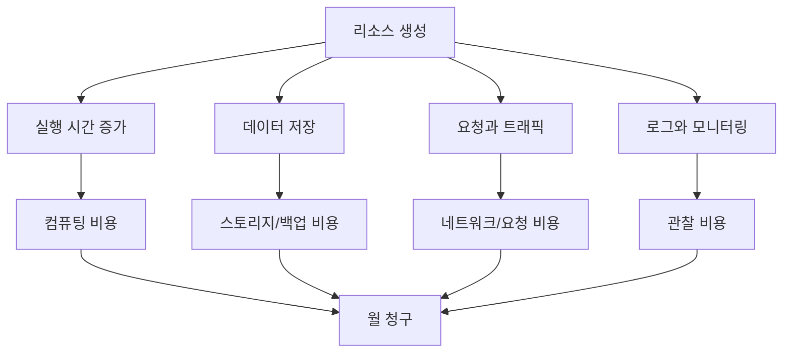

# 5교시: 클라우드 비용 관리 기본 - 데이터센터 비용과 클라우드 비용 비교, 사용량 기반 과금, 낭비 사례

## 수업 목표
- CAPEX, OPEX, TCO, ROI를 클라우드 비용 판단의 기본 언어로 설명한다.
- 데이터센터 비용과 클라우드 사용량 기반 비용의 차이를 비교한다.
- 시간당 비용, 월 비용, 유휴 리소스 비용을 단순 계산으로 추정한다.
- 비용 최적화가 무조건 가장 싼 선택이 아니라 요구사항과 운영 부담을 함께 맞추는 일임을 이해한다.

## 시작 상황
클라우드는 "서버를 사지 않아도 된다"는 장점이 있다. 하지만 "서버를 사지 않는다"가 "비용이 없다"는 뜻은 아니다. 데이터센터는 큰 초기 투자와 장기 운영 비용이 중심이고, 클라우드는 필요한 만큼 빨리 만들고 쓴 만큼 내는 구조에 가깝다. 이 구조는 실험과 변동 워크로드에 유리하지만, 켜 둔 리소스와 데이터 전송, 로그, 백업을 방치하면 비용이 계속 쌓인다.

인프라/DevOps 엔지니어는 기능이 동작하는지만 보지 않는다. 이 구조가 하루, 한 달, 1년 동안 얼마나 들지, 사용자가 없을 때도 비용이 나가는지, 장애 대응과 운영 인력 비용까지 고려했을 때 의미가 있는지를 함께 본다.

## 공식 참고 자료
- AWS Cloud Economics Center  
  https://aws.amazon.com/economics/
- AWS Pricing Calculator  
  https://calculator.aws/
- AWS Billing and Cost Management User Guide  
  https://docs.aws.amazon.com/awsaccountbilling/latest/aboutv2/billing-what-is.html
- AWS Well-Architected Framework: Cost Optimization pillar  
  https://docs.aws.amazon.com/wellarchitected/latest/cost-optimization-pillar/welcome.html
- AWS Free Tier  
  https://aws.amazon.com/free/

## 핵심 개념
| 용어 | 한 줄 뜻 | 비용 판단에서의 역할 |
|---|---|---|
| CAPEX | 초기 투자 비용 | 서버, 장비, 상면 같은 선구매 비용 |
| OPEX | 운영 비용 | 월별 사용료, 인력, 전력, 유지보수 비용 |
| TCO | 총소유비용 | 구매부터 폐기까지 전체 비용 |
| ROI | 투자 대비 효과 | 비용을 들인 결과가 속도/안정성/매출에 기여하는지 |
| Unit Cost | 단위당 비용 | 사용자 1명, 요청 1건, 서비스 1개당 비용 |
| Idle Resource | 사용되지 않지만 켜져 있는 자원 | 초급 실습에서 가장 흔한 낭비 |

## 쉬운 비유: 자동차 구매와 렌터카
데이터센터는 자동차를 직접 사는 것과 비슷하다. 차값을 먼저 내고, 보험, 정비, 주차, 세금, 감가상각을 직접 관리한다. 많이 오래 탈수록 유리할 수 있지만, 처음 시작할 때 큰 돈이 필요하고 필요 없어져도 바로 사라지지 않는다.

클라우드는 렌터카나 카셰어링에 가깝다. 필요할 때 빠르게 빌리고 반납할 수 있다. 짧은 실험이나 사용량이 들쭉날쭉한 서비스에는 유리하다. 하지만 반납하지 않고 계속 세워 두면 계속 요금이 나간다. 비유의 한계는 클라우드 비용이 자동차 대여료처럼 한 항목만 있는 것이 아니라 컴퓨팅, 저장, 네트워크, 로그, 백업, 관리형 기능으로 나뉜다는 점이다.

## 계산 예제 1: 시간당 비용을 월 비용으로 바꾸기
다음 숫자는 교육용 가정값이다. 실제 가격은 AWS Pricing Calculator와 공식 pricing 문서에서 확인해야 한다. 기준 날짜는 2026년 6월 1일이며, 환율은 계산 연습용으로 1 USD = 1,350 KRW를 사용한다.

가정:
- 리소스 A가 시간당 0.05 USD다.
- 하루 24시간, 한 달 30일 켜 둔다.

계산:
```text
월 사용 시간 = 24 x 30 = 720시간
월 비용(USD) = 0.05 x 720 = 36 USD
월 비용(KRW) = 36 x 1,350 = 48,600 KRW
```

해석:
- 시간당 0.05 USD는 작아 보이지만 한 달 내내 켜 두면 약 36 USD가 된다.
- 같은 리소스를 5개 만들면 약 180 USD가 된다.
- 여기에 스토리지, 데이터 전송, 로그, 백업 비용이 붙을 수 있다.

## 계산 예제 2: 짧은 POC와 장기 운영 비교
가정:
- POC 리소스는 시간당 0.20 USD다.
- 4시간만 쓰고 삭제하면 `0.20 x 4 = 0.80 USD`다.
- 한 달 켜 두면 `0.20 x 720 = 144 USD`다.

이 예제에서 클라우드는 짧은 실험에 유리하다. 서버를 구매하지 않고 4시간 만에 검증하고 삭제할 수 있기 때문이다. 그러나 삭제하지 않으면 같은 자원이 월 비용으로 바뀐다. 그래서 POC에서는 생성보다 삭제와 확인이 더 중요하다.

## 비용 낭비 사례
| 낭비 사례 | 왜 발생하는가 | 예방 방법 |
|---|---|---|
| 켜 둔 서버 | 실습 후 종료/삭제 누락 | 종료 체크리스트, Budget 알림 |
| 사용하지 않는 스토리지 | 서버 삭제 후 볼륨/스냅샷 남음 | 리소스 의존성 확인 |
| 과한 인스턴스 크기 | 성능 기준 없이 큰 타입 선택 | 작은 타입에서 시작, 지표 기반 조정 |
| 불필요한 로그 보관 | 로그 레벨/보관 기간 미설정 | 필요한 로그와 보존 기간 정의 |
| 리전별 중복 리소스 | 다른 리전에 만든 자원 놓침 | 전체 리전 확인 습관 |
| 고정 IP 방치 | 연결되지 않은 IP 비용 가능 | 사용 여부 점검 |

## 의사결정 표
| 상황 | 데이터센터/기존 장비가 유리할 수 있음 | 클라우드가 유리할 수 있음 |
|---|---|---|
| 사용량 | 장기간 고정적이고 예측 가능 | 변동이 크거나 실험이 많음 |
| 초기 비용 | 이미 장비가 있고 여유가 있음 | 초기 투자 없이 빠르게 시작해야 함 |
| 운영 인력 | 전문 인력이 있고 프로세스가 있음 | 작은 팀이라 관리형 서비스가 필요 |
| 규제/보안 | 특정 물리 통제가 필수 | 클라우드 인증과 관리형 보안 기능 활용 가능 |
| 확장성 | 확장 계획이 제한적 | 수요 증가/감소에 빠르게 대응 필요 |

## Mermaid: 비용이 누적되는 경로


## 실습: 내 프로젝트 아이디어 비용 항목 찾기
3일차에 만든 미니 앱이나 8교시에 다룰 프로젝트 아이디어를 기준으로 비용 항목을 표시한다.

| 기능 | 필요한 리소스 후보 | 비용 발생 조건 | 줄이는 방법 |
|---|---|---|---|
| 정적 화면 공개 | 정적 호스팅, CDN | 저장량, 요청, 트래픽 | 작은 파일, 캐시, 무료 범위 확인 |
| 로그인 | 인증 서비스 또는 직접 구현 | 사용자 수, 요청 수 | 1주차에서는 제외 |
| 데이터 저장 | DB, 객체 저장소 | 실행 시간, 저장량, 백업 | 더미 JSON으로 대체 |
| 로그 확인 | 로그 서비스 | 수집량, 보관 기간 | 핵심 로그만, 짧은 보관 |
| API 호출 | 외부 API 또는 서버 | 요청 수, 서버 실행 시간 | 더미 데이터, 캐시 |

## DevOps 원칙 연결
- 비용 절감: 시간당 비용을 월 비용으로 바꾸어 보면 켜 둔 리소스의 위험이 보인다.
- 개발/배포 효율성: 비용 한도가 명확해야 개발자가 안전하게 실험할 수 있다.
- 관리 효율성: 비용 항목을 기능별로 나누면 나중에 태그, Budget, Cost Explorer로 추적하기 쉬워진다.

## 다음 수업 연결
다음 교시에서는 비용과 함께 반드시 봐야 하는 보안 원칙을 다룬다. 특히 최소 권한, secret 관리, 공식 문서 검증은 이후 Docker, Kubernetes, AWS, Terraform 실습 전체에 반복된다.
