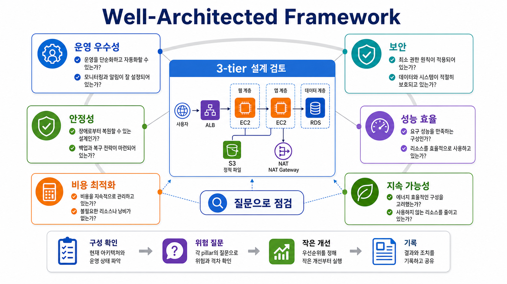
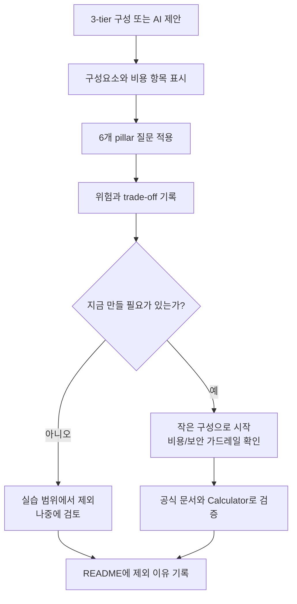

# 6교시: AWS Well-Architected Framework - AWS를 쓰기 전에 아키텍처를 질문으로 점검하기

## 수업 목표
- AWS Well-Architected Framework가 특정 서비스 사용법이 아니라 아키텍처를 점검하는 질문 체계임을 이해한다.
- 6개 pillar인 운영 우수성, 보안, 안정성, 성능 효율, 비용 최적화, 지속 가능성을 초급자 수준의 질문으로 바꾼다.
- 5교시에서 계산한 표준 3-tier 예시를 Well-Architected 관점으로 검토한다.
- 1주차에 AWS를 다루는 이유가 “리소스를 많이 만드는 것”이 아니라 “클라우드 운영 판단 기준을 먼저 세우는 것”임을 정리한다.
- AI 답변, 공식 문서, 비용 계산 결과를 Well-Architected 질문으로 검증하는 습관을 만든다.

## 시작 상황
1주차 학생에게 AWS는 낯설다. 아직 Docker도 본격적으로 다루지 않았고, Kubernetes나 Terraform도 배우지 않았다. 그런데 4일차에 AWS 계정, 비용, Calculator가 등장하면 “벌써 AWS를 하는 게 맞나?”라는 혼동이 생길 수 있다.

이 혼동은 자연스럽다. 1주차의 목표는 AWS 전문가가 되는 것이 아니다. 1주차의 목표는 앞으로 어떤 도구를 배우더라도 반복해서 쓰게 될 운영 질문을 먼저 익히는 것이다.

3일차에는 3-tier 아키텍처를 배웠다. 4일차 5교시에는 그 3-tier 구조를 AWS Pricing Calculator에 넣어 비용 항목으로 바꾸어 보았다. 6교시에서는 “이 설계가 좋은 설계인가?”를 바로 묻는다. 이때 사용하는 공식 질문 체계가 AWS Well-Architected Framework다.

Well-Architected Framework는 정답지를 주는 문서가 아니다. 질문을 주는 문서다. 같은 3-tier 구조라도 학습용 POC, 사내 도구, 고객이 쓰는 운영 서비스에 따라 좋은 선택이 달라진다. 그래서 오늘은 서비스를 생성하지 않는다. 대신 이미 계산한 `ALB 1`, `EC2 2대`, `NAT Gateway 1`, `RDS 1`, `S3 1GB`, `EBS 8GB x 2`, `트래픽 가정`을 6개 관점으로 질문한다.

## 공식 참고 자료
- AWS Well-Architected Framework
  https://docs.aws.amazon.com/wellarchitected/latest/framework/welcome.html
- AWS Well-Architected Framework: Operational Excellence pillar
  https://docs.aws.amazon.com/wellarchitected/latest/operational-excellence-pillar/welcome.html
- AWS Well-Architected Framework: Security pillar
  https://docs.aws.amazon.com/wellarchitected/latest/security-pillar/welcome.html
- AWS Well-Architected Framework: Reliability pillar
  https://docs.aws.amazon.com/wellarchitected/latest/reliability-pillar/welcome.html
- AWS Well-Architected Framework: Performance Efficiency pillar
  https://docs.aws.amazon.com/wellarchitected/latest/performance-efficiency-pillar/welcome.html
- AWS Well-Architected Framework: Cost Optimization pillar
  https://docs.aws.amazon.com/wellarchitected/latest/cost-optimization-pillar/welcome.html
- AWS Well-Architected Framework: Sustainability pillar
  https://docs.aws.amazon.com/wellarchitected/latest/sustainability-pillar/welcome.html
- AWS Shared Responsibility Model
  https://aws.amazon.com/compliance/shared-responsibility-model/
- AWS IAM User Guide: Security best practices in IAM
  https://docs.aws.amazon.com/IAM/latest/UserGuide/best-practices.html

## 인포그래픽: 3-tier 설계를 6개 질문으로 점검하기
아래 인포그래픽은 표준 3-tier 아키텍처를 Well-Architected Framework의 6개 pillar로 검토하는 흐름을 보여준다. 생성 이미지이므로 공식 다이어그램이 아니라 기억 보조 자료로 사용한다.



## 핵심 개념
| 개념 | 한 줄 뜻 | 오늘의 사용 방식 |
|---|---|---|
| Well-Architected Framework | 클라우드 아키텍처를 점검하는 AWS의 공식 질문 체계 | 3-tier 견적을 운영 질문으로 검토한다 |
| Pillar | 좋은 아키텍처를 보는 큰 관점 | 6개 관점으로 위험을 나누어 본다 |
| Trade-off | 하나를 얻기 위해 다른 것을 일부 포기하는 선택 | 비용을 줄이면 안정성이 낮아질 수 있다 |
| Risk | 장애, 보안, 비용, 운영 복잡도처럼 문제가 될 가능성 | 만들기 전에 기록하고 줄인다 |
| Workload | 함께 동작해 비즈니스 가치를 만드는 서비스와 리소스 묶음 | 오늘은 표준 3-tier 예시를 workload로 본다 |
| Review | 설계를 질문으로 점검하고 개선점을 찾는 절차 | 정답 채점이 아니라 위험 발견이다 |

## 쉬운 비유: 건물 사용 전 안전 점검표
건물을 짓기 전에 설계도를 본다고 해서 건축가가 되는 것은 아니다. 그래도 입구가 어디인지, 비상구가 있는지, 전기 용량이 충분한지, 화재 경보가 있는지, 관리비가 과하지 않은지, 사용하지 않는 공간이 낭비되고 있지 않은지는 점검할 수 있다.

Well-Architected Framework도 비슷하다. AWS 서비스를 모두 능숙하게 다룬 뒤에만 읽는 문서가 아니다. 오히려 초급자일수록 설계가 커지기 전에 질문을 배워야 한다. “RDS를 붙이면 멋져 보인다”에서 멈추지 않고 “백업은?”, “복구는?”, “비용은?”, “권한은?”, “사용하지 않을 때 끌 수 있는가?”를 묻는 것이 인프라/DevOps 관점이다.

비유의 한계도 있다. 건물 안전 점검은 물리적 구조가 느리게 변하지만, 클라우드는 설정 변경 하나로 네트워크 공개 범위, 비용, 권한, 장애 범위가 빠르게 바뀐다. 그래서 한 번 점검하고 끝나는 것이 아니라 설계 변경, 배포, 장애, 비용 증가 때마다 반복해서 점검해야 한다.

## 왜 1주차에 AWS를 보는가
오늘의 AWS는 “배포 대상”이 아니라 “운영 사고방식의 예시”다.

| 오해 | 실제 목표 |
|---|---|
| 1주차부터 AWS를 제대로 써야 한다 | 계정, 비용, 책임, 공식 문서 기준을 먼저 익힌다 |
| 서비스를 많이 만들어야 클라우드를 배운다 | 만들기 전에 무엇을 확인해야 하는지 배운다 |
| Pricing Calculator 결과가 정답이다 | 비용을 만드는 항목과 가정을 찾는 연습이다 |
| Well-Architected는 고급자 문서다 | 초급자도 질문 형태로 사용할 수 있다 |
| 보안은 나중에 배운다 | 계정과 비용이 연결된 순간부터 보안은 시작된다 |

2주차 Docker는 실행 환경을 표준화하는 기술이다. 4주차 Kubernetes는 여러 실행 단위를 배치하고 유지하는 기술이다. 5~6주차 AWS와 Terraform은 클라우드 리소스를 재현 가능하게 만들고 운영하는 기술이다. Well-Architected 질문은 이 모든 기술을 배울 때 반복해서 돌아오는 판단 기준이다.

## 6개 Pillar 한눈에 보기
| Pillar | 초급자용 질문 | 3-tier 예시에서 보는 부분 |
|---|---|---|
| 운영 우수성 | 문제가 생겼을 때 무엇을 보고, 누가, 어떻게 조치하는가? | 로그, 문서, 배포 절차, 삭제 절차 |
| 보안 | 누가 무엇에 접근할 수 있고, secret과 데이터는 보호되는가? | IAM, MFA, security group, S3 공개 여부, access key |
| 안정성 | 일부가 실패해도 복구하거나 계속 동작할 수 있는가? | 2 AZ, ALB, RDS backup, 단일 NAT Gateway 위험 |
| 성능 효율 | 요구 성능에 맞는 리소스를 낭비 없이 쓰는가? | EC2 크기, RDS 크기, 캐시 후보, 트래픽 증가 |
| 비용 최적화 | 필요한 만큼만 쓰고, 비용 증가를 관찰하는가? | ALB/NAT/RDS/EBS/S3/traffic, Budget, Calculator |
| 지속 가능성 | 불필요한 리소스와 낭비를 줄이는가? | 꺼진 실습 리소스, 작은 시작, idle resource 제거 |

6개 pillar는 서로 따로 놀지 않는다. 예를 들어 NAT Gateway를 1개만 두면 비용은 줄어들 수 있지만 안정성은 낮아질 수 있다. RDS Multi-AZ를 켜면 안정성은 좋아질 수 있지만 비용은 커진다. 로그를 많이 남기면 운영 우수성은 좋아질 수 있지만 비용과 개인정보 위험이 늘 수 있다. 좋은 설계는 한 항목을 최대화하는 것이 아니라 목적에 맞는 균형을 기록하는 것이다.

## 5교시 Standard 3-Tier를 Well-Architected로 검토하기
검토 대상:

```text
VPC: 1
AZ: 2
ALB: 1
EC2: 2
EBS: 8GB x 2
NAT Gateway: 1
Elastic IP: 1
RDS: 1, Single-AZ
S3: 1GB
CloudWatch Logs: 1GB
Data transfer out: 10GB/월
NAT data processing: 5GB/월
S3 download: 5GB/월
```

이 구성은 학습용으로 적당한 비교 대상이지만 운영 정답은 아니다. 6개 pillar로 질문하면 다음과 같은 위험과 선택지가 보인다.

| Pillar | 점검 질문 | 보이는 위험 | 가능한 개선 |
|---|---|---|---|
| 운영 우수성 | 장애가 나면 어떤 로그와 지표를 먼저 볼 것인가? | 로그 보관과 알림 기준이 없음 | health check, 로그 retention, 운영 README 작성 |
| 보안 | root 계정과 access key를 일상 작업에 쓰지 않는가? | 과한 권한, secret 노출, S3 공개 설정 실수 | MFA, IAM 최소 권한, `.env` 분리, 공개 범위 점검 |
| 안정성 | 2 AZ인데 단일 장애점은 어디인가? | NAT Gateway 1개, RDS Single-AZ | 학습용이면 기록만, 운영이면 NAT 2개/RDS Multi-AZ 검토 |
| 성능 효율 | 작은 인스턴스로 시작해도 요구사항을 만족하는가? | 너무 큰 리소스는 낭비, 너무 작은 리소스는 지연 | 부하 가정, 지표 기반 크기 조정 |
| 비용 최적화 | 기본 시간 비용이 큰 항목은 무엇인가? | ALB, NAT Gateway, RDS는 트래픽이 적어도 비용 발생 가능 | POC에서는 ALB/NAT/RDS 축소 검토 |
| 지속 가능성 | 사용하지 않는 리소스를 줄일 수 있는가? | 실습 후 켜진 리소스, 불필요한 로그/스토리지 | 삭제 체크리스트, 작은 용량, 보관 기간 제한 |

## Pillar 1: 운영 우수성
운영 우수성은 “잘 돌아가게 만드는 습관”에 가깝다. 초급자는 서비스가 한 번 실행되면 끝났다고 생각하기 쉽다. 하지만 운영 관점에서는 누가 배포했는지, 어떤 변경이 들어갔는지, 실패하면 어떤 로그를 볼지, 정리 절차가 있는지가 중요하다.

오늘 수준의 질문:
- 이 아키텍처를 다른 사람이 보고 이해할 수 있는 README가 있는가?
- 장애가 나면 ALB, EC2, RDS, S3 중 어디부터 확인할 것인가?
- health check 경로가 있는가?
- 로그가 어디에 남고, 얼마나 보관되는가?
- 리소스를 만들었다면 삭제 순서를 알고 있는가?

운영 우수성 산출물은 화려한 대시보드가 아니다. 1주차에는 짧은 운영 메모면 충분하다.

```markdown
## 운영 메모
- 정상 확인:
- 장애 시 첫 확인 위치:
- 로그 위치:
- 비용 확인 위치:
- 정리/삭제 순서:
- 아직 자동화하지 않은 작업:
```

## Pillar 2: 보안
보안은 계정 생성 순간부터 시작된다. AWS는 물리 데이터센터, 하드웨어, 일부 관리형 서비스의 기반을 책임지지만, 사용자가 만든 계정 권한, 데이터 공개 범위, access key 관리, 애플리케이션 설정까지 대신 책임지지는 않는다.

초급자에게 가장 중요한 보안 질문:
- root user로 일상 작업을 하지 않는가?
- MFA가 설정되어 있는가?
- GitHub에 access key, token, password가 올라가지 않는가?
- 보안 그룹에서 `0.0.0.0/0`을 열었다면 포트와 이유가 명확한가?
- S3 bucket, RDS, EC2가 의도치 않게 공개되어 있지 않은가?
- AI가 제안한 IAM 정책이 `AdministratorAccess`처럼 과하지 않은가?

GitHub 공개 저장소에 AWS access key가 올라가면 단순 경고로 끝나지 않을 수 있다. 키가 자동으로 감지되어 비활성화되거나 경고 메일이 올 수 있고, 이미 외부에서 사용되었을 가능성을 확인해야 한다. 그래서 “나중에 지우면 된다”가 아니라 “처음부터 올리지 않는다”가 기준이다.

로컬 점검 명령은 `rg`를 우선 사용한다.

```bash
rg -n "password|token|secret|api_key|AWS_ACCESS_KEY|AWS_SECRET_ACCESS_KEY" .
rg -n "0\\.0\\.0\\.0/0|AdministratorAccess|public-read" .
rg -n "aws .*create|aws .*delete|terraform apply|terraform destroy" .
```

검색 결과가 나온다고 무조건 문제는 아니다. 예시 문구일 수도 있다. 그러나 실제 키, 실제 공개 설정, 실제 생성/삭제 명령이면 실행 전 멈춰야 한다.

## Pillar 3: 안정성
안정성은 “절대 장애가 나지 않는 구조”가 아니다. 장애가 날 수 있음을 인정하고, 실패 범위를 줄이고, 복구할 수 있게 만드는 것이다.

5교시 Standard 구성은 2 AZ와 EC2 2대를 사용한다. 겉으로는 안정적으로 보인다. 하지만 자세히 보면 단일 NAT Gateway와 Single-AZ RDS가 남아 있다. 이 말은 “틀렸다”가 아니다. 학습용 표준 견적에서는 비용을 낮추기 위해 일부 안정성을 포기한 것이다. 중요한 것은 그 선택을 기록하는 것이다.

| 선택 | 안정성 효과 | 비용 효과 | 1주차 판단 |
|---|---|---|---|
| EC2 2대, 2 AZ | 앱 서버 한 대 장애에 대비 가능 | EC2 비용 증가 | 개념 이해용으로 좋음 |
| NAT Gateway 1개 | private subnet 외부 통신 가능 | NAT 기본 비용 발생 | 단일 장애점임을 기록 |
| NAT Gateway 2개 | AZ별 장애 격리 개선 | NAT 비용 증가 | More Reliable에서 비교 |
| RDS Single-AZ | 단순하고 저렴 | DB 장애/점검 영향 큼 | 학습용 기준 |
| RDS Multi-AZ | DB 가용성 개선 | 비용 증가 | 운영 요구가 있을 때 검토 |

## Pillar 4: 성능 효율
성능 효율은 “가장 큰 서버를 쓰자”가 아니다. 요구 성능을 만족하는 가장 적절한 방식을 찾는 것이다. 초급자는 성능 문제가 두려워 처음부터 큰 인스턴스, 큰 DB, 복잡한 캐시를 선택하기 쉽다. 하지만 사용자가 거의 없는 POC에서 큰 리소스는 비용과 관리 부담만 늘린다.

성능 효율 질문:
- 예상 사용자는 몇 명인가?
- 월 트래픽과 피크 트래픽은 어느 정도인가?
- CPU가 병목인지, DB가 병목인지, 네트워크 전송량이 병목인지 어떻게 알 것인가?
- 캐시가 정말 필요한가, 아니면 쿼리와 정적 파일 크기를 먼저 줄일 수 있는가?
- 작은 인스턴스로 시작하고 지표를 보고 키울 수 있는가?

오늘의 기준은 “작게 시작하되 관찰 가능하게 만든다”이다. 인스턴스를 크게 잡는 것보다 응답 시간, 오류율, CPU/메모리, DB 연결 수를 볼 수 있는 구조가 더 중요하다.

## Pillar 5: 비용 최적화
비용 최적화는 무조건 싸게 만드는 것이 아니다. 목적에 맞지 않는 지출을 줄이는 것이다. 5교시에서 본 것처럼 트래픽이 적어도 ALB, NAT Gateway, RDS처럼 기본 실행 비용이 있는 항목이 있다. EBS, S3, 로그, 백업은 작게 보여도 남겨 두면 누적된다.

비용 최적화 질문:
- 월 730시간 내내 켜야 하는가?
- POC 단계에서 ALB가 꼭 필요한가?
- NAT Gateway 없이 더 단순한 구조로 시작할 수 있는가?
- RDS가 필요한가, 더미 JSON 또는 로컬 DB로 충분한가?
- EBS volume, snapshot, S3 object, 로그가 실습 후 남지 않는가?
- Budget과 Billing 확인 절차가 있는가?

계산 예시:

```text
월 비용(원) = 월 비용(USD) x 1,500
일 비용(원) = 월 비용(원) / 30
실습 후 7일 방치 비용(원) = 일 비용(원) x 7
```

예를 들어 Calculator에서 Standard 구성이 월 `60 USD`로 나왔다면:

```text
월 비용 = 60 x 1,500 = 90,000원
일 비용 = 90,000 / 30 = 3,000원
7일 방치 비용 = 3,000 x 7 = 21,000원
```

정확한 실제 청구 금액은 아니지만, 실습 후 리소스를 방치하면 비용이 계속 누적된다는 감각을 만들 수 있다.

## Pillar 6: 지속 가능성
지속 가능성은 초급자에게 멀게 느껴질 수 있다. 하지만 기본은 단순하다. 사용하지 않는 리소스를 만들지 않고, 필요 이상으로 크게 잡지 않고, 낭비를 줄이는 것이다. 이것은 비용 최적화와도 연결되지만, 단순히 돈을 아끼는 것보다 더 넓은 운영 책임이다.

초급자 수준의 지속 가능성 질문:
- 실습이 끝난 리소스를 삭제했는가?
- 필요 없는 로그와 백업을 오래 보관하지 않는가?
- 작은 리소스로 시작하고 실제 지표를 보고 키우는가?
- 데이터 전송량을 줄이기 위해 이미지 크기와 캐시를 고려하는가?
- 사용하지 않는 계정, key, bucket, volume, snapshot을 정리하는가?

## 실습 1: 3-tier 견적을 6개 pillar로 리뷰하기
5교시의 Standard 3-Tier Cost Estimate를 열고 아래 표를 채운다.

```markdown
## Well-Architected Mini Review

검토 대상:
계산 날짜:
환율 기준: 1 USD = 1,500 KRW
Calculator evidence:

| Pillar | 현재 설계에서 확인한 점 | 위험 | 지금 할 조치 | 나중에 검토할 조치 |
|---|---|---|---|---|
| 운영 우수성 | | | | |
| 보안 | | | | |
| 안정성 | | | | |
| 성능 효율 | | | | |
| 비용 최적화 | | | | |
| 지속 가능성 | | | | |

### 이번 주에는 하지 않을 것
-

### 다음 주차 이후 다시 볼 것
-
```

작성 예시:

| Pillar | 현재 설계에서 확인한 점 | 위험 | 지금 할 조치 | 나중에 검토할 조치 |
|---|---|---|---|---|
| 안정성 | EC2 2대와 2 AZ를 가정했다 | RDS는 Single-AZ, NAT는 1개 | 학습용 선택이라고 기록 | 운영 요구가 생기면 Multi-AZ와 NAT 2개 비교 |
| 비용 최적화 | ALB/NAT/RDS가 포함되어 있다 | POC에는 과할 수 있다 | 실제 생성하지 않고 Calculator로만 비교 | 3주차 이후 작은 구성으로 시작 |

## 실습 2: AI 답변을 Well-Architected 질문으로 검증하기
AI에게 아키텍처를 물으면 대개 그럴듯한 서비스 목록을 준다. 그러나 목록이 길다고 좋은 설계는 아니다. AI 답변을 받은 뒤 다음 질문으로 다시 검증한다.

```text
다음 AWS 아키텍처 제안을 Well-Architected Framework의 6개 pillar로 리뷰해줘.

요구사항:
- 각 pillar별로 위험을 1개 이상 찾아줘.
- 초급 실습에서 줄일 수 있는 서비스를 표시해줘.
- 비용이 커질 수 있는 항목을 표시해줘.
- 보안상 위험한 기본값이나 과한 권한을 표시해줘.
- 실제 생성 전 공식 문서에서 확인해야 할 키워드를 알려줘.
- 결론은 "지금 만들 것", "나중에 만들 것", "만들지 않을 것"으로 나눠줘.
```

AI 답변은 리뷰 초안일 뿐이다. 최종 기준은 공식 문서, Calculator, 현재 계정 상태, 수업 범위다.

## 실습 3: 공식 문서 확인 기록
아래 양식으로 Well-Architected 또는 AWS 공식 문서를 확인한 기록을 남긴다.

```text
확인한 주제:
확인한 공식 문서 링크:
문서에서 확인한 pillar:
문서에서 확인한 키워드:
현재 3-tier 예시에 적용되는 질문:
비용 또는 보안에 영향 있는 부분:
오늘 실행할 것:
오늘 실행하지 않을 것:
이유:
```

## Mermaid: Well-Architected 리뷰 흐름


## 흔한 오해
| 오해 | 바로잡기 |
|---|---|
| Well-Architected는 AWS 고급자만 보는 문서다 | 초급자도 질문 형태로 사용할 수 있다 |
| 6개 pillar를 모두 완벽하게 만족해야 한다 | 목적과 단계에 맞는 trade-off를 기록하는 것이 중요하다 |
| 비용 최적화는 무조건 싸게 만드는 것이다 | 필요한 가치를 유지하면서 낭비를 줄이는 것이다 |
| 보안은 배포 직전에 보면 된다 | 계정, 권한, secret, 공개 범위는 시작부터 봐야 한다 |
| 안정성은 Multi-AZ를 켜면 끝이다 | 백업, 복구, 관찰, 장애 범위까지 함께 봐야 한다 |
| AI가 추천한 AWS 서비스 목록이 곧 설계다 | 서비스 목록은 초안이고, Well-Architected 질문으로 검토해야 한다 |

## DevOps 원칙 연결
- 비용 절감: 비용 최적화와 지속 가능성 질문을 사용하면 과한 리소스와 방치 비용을 줄일 수 있다.
- 개발/배포 효율성: 운영 우수성 질문을 사용하면 배포, 장애 확인, 정리 절차가 문서로 남는다.
- 관리 효율성: 보안, 안정성, 성능 질문을 나누어 보면 문제 발생 시 원인과 책임 범위를 더 빨리 좁힐 수 있다.

## 다음 수업 연결
다음 교시에서는 개인별 환경을 점검한다. AWS 계정, MFA, Billing, Budget, Docker 실행 상태가 이후 수업을 막지 않도록 확인한다. 단, 오늘의 관점은 계속 유지한다. 계정이 만들어졌는지보다 더 중요한 것은 계정이 안전하게 보호되고, 비용을 볼 수 있고, 실습 범위를 넘는 리소스를 만들지 않는 기준이 있는지다.
