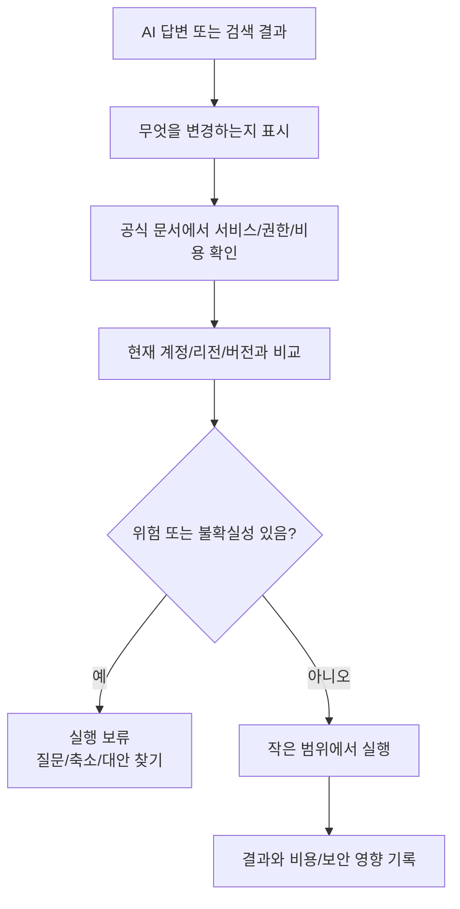

# 6교시: 보안 기본 원칙과 공식 Documentation 읽는 법 - 최소 권한, secret 관리, AI 답변 검증, 버전과 전제 조건 확인

## 수업 목표
- 최소 권한과 secret 관리가 클라우드 실습의 기본 안전장치임을 이해한다.
- 공식 문서를 읽을 때 서비스명, 리전, 버전, 전제 조건, 비용 조건을 확인한다.
- AI 답변을 그대로 실행하지 않고 공식 문서와 현재 환경으로 검증한다.
- 보안과 비용 위험이 있는 명령 또는 설정을 실행 전 점검하는 습관을 만든다.

## 시작 상황
AI 도구는 빠르게 명령어와 설정 예시를 만들어 준다. 하지만 클라우드 명령은 로컬 예제보다 위험할 수 있다. 잘못된 권한 정책, 공개 스토리지, 하드코딩된 access key, 과한 네트워크 허용, 삭제하지 않은 리소스가 실제 비용과 보안 사고로 이어질 수 있기 때문이다.

초급자에게 필요한 첫 번째 보안 능력은 모든 것을 완벽히 아는 것이 아니다. 실행 전 멈춰서 "이 명령은 무엇을 만들고, 어떤 권한을 요구하며, 비용과 공개 범위가 어떻게 되는가"를 확인하는 습관이다.

## 공식 참고 자료
- AWS IAM User Guide: Security best practices in IAM  
  https://docs.aws.amazon.com/IAM/latest/UserGuide/best-practices.html
- AWS Well-Architected Framework: Security pillar  
  https://docs.aws.amazon.com/wellarchitected/latest/security-pillar/welcome.html
- AWS Shared Responsibility Model  
  https://aws.amazon.com/compliance/shared-responsibility-model/
- AWS Documentation: AWS account root user  
  https://docs.aws.amazon.com/IAM/latest/UserGuide/id_root-user.html
- The Twelve-Factor App: Config  
  https://12factor.net/config
- GitHub Docs: Removing sensitive data from a repository  
  https://docs.github.com/en/authentication/keeping-your-account-and-data-secure/removing-sensitive-data-from-a-repository

## 핵심 개념
| 개념 | 뜻 | 운영 기준 |
|---|---|---|
| Least Privilege | 필요한 작업에 필요한 최소 권한만 부여 | 넓은 관리자 권한을 기본값으로 쓰지 않는다 |
| Secret | 노출되면 위험한 key, token, password | 코드와 GitHub에 저장하지 않는다 |
| Public Exposure | 외부에서 접근 가능한 상태 | 공개가 필요한 리소스만 열고 근거를 남긴다 |
| Official Documentation | 서비스 제공자가 관리하는 기준 문서 | AI 답변과 블로그보다 우선한다 |
| Prerequisite | 실행 전 필요한 조건 | 버전, 권한, 리전, 계정 상태를 확인한다 |

## 쉬운 비유: 출입증과 금고 열쇠
IAM 권한은 회사 출입증과 비슷하다. 모든 직원에게 모든 층, 서버실, 금고, 문서고 출입 권한을 주면 편할 수는 있지만 사고가 났을 때 피해 범위가 커진다. 최소 권한은 불편하게 만들기 위한 원칙이 아니라, 실수와 침해가 발생했을 때 피해 범위를 줄이는 운영 원칙이다.

Secret은 금고 열쇠와 같다. 열쇠를 회의실 화이트보드에 붙여 두면 잠깐은 편해 보이지만 누구나 가져갈 수 있다. GitHub 공개 저장소에 access key나 token을 올리는 것은 인터넷에 열쇠 사진을 올리는 것과 비슷하다. 비유의 한계는 디지털 secret은 복사 흔적이 남기 어렵고, 한 번 노출되면 이미 외부에서 사용되었을 가능성을 고려해야 한다는 점이다.

## 공식 문서 읽기 체크리스트
공식 문서를 열었을 때 다음 항목을 확인한다.

| 확인 항목 | 질문 |
|---|---|
| 문서 주체 | AWS 공식 문서인가, 블로그인가, 개인 글인가? |
| 서비스명 | 내가 쓰려는 서비스와 같은 문서인가? |
| 리전 | 이 기능이 수업 리전에서 지원되는가? |
| 버전 | CLI, SDK, 콘솔 화면 버전 차이가 있는가? |
| 권한 | 어떤 IAM 권한이 필요한가? |
| 비용 | 생성, 실행, 저장, 요청, 전송 비용이 있는가? |
| 기본값 | 공개/비공개, 암호화, 백업 기본값은 무엇인가? |
| 정리 절차 | 삭제 또는 비활성화 방법이 있는가? |

## AI 답변 검증 질문
AI에게 받은 답변은 초안으로만 사용한다. 다음 질문으로 검증한다.

| AI 답변 내용 | 검증 질문 |
|---|---|
| "이 명령을 실행하세요" | 무엇을 생성/변경/삭제하는가? |
| "무료입니다" | 어떤 Free Tier 조건을 기준으로 하는가? |
| "관리자 권한을 부여하세요" | 최소 권한으로 줄일 수 있는가? |
| "보안 그룹 0.0.0.0/0 허용" | 왜 전체 공개가 필요한가? 포트는 무엇인가? |
| "환경변수에 key를 넣으세요" | `.env.example`과 실제 secret 저장 위치가 분리되었는가? |
| "이 설정이 최신입니다" | 공식 문서 기준 날짜와 서비스 버전은 무엇인가? |

## 실행 전 위험 키워드 점검
로컬 프로젝트와 AI 생성 코드에서 위험 키워드를 확인한다. 이 명령은 검색용이며, 결과가 나오면 맥락을 읽어야 한다.

```bash
grep -R "password\\|token\\|secret\\|api_key\\|AWS_ACCESS_KEY" .
grep -R "0.0.0.0/0\\|AdministratorAccess\\|public-read" .
grep -R "aws .*create\\|aws .*delete\\|terraform apply\\|terraform destroy" .
```

해석:
- `password`, `token`, `secret`이 나오면 실제 민감정보인지 예시 문구인지 확인한다.
- `0.0.0.0/0`은 전체 인터넷 공개를 의미할 수 있으므로 포트와 목적을 확인한다.
- 생성/삭제 명령은 비용과 데이터 손실 가능성을 먼저 확인한다.

## Mermaid: AI 답변을 공식 문서로 검증하는 흐름


## 실습: 공식 문서 검증 기록 작성
아래 양식으로 문서 검증 기록을 만든다.

```text
검증한 주제:
AI 또는 검색 답변 요약:
확인한 공식 문서 링크:
문서에서 확인한 키워드:
필요 권한:
비용 발생 조건:
보안 주의사항:
현재 수업 범위에서 실행 여부:
실행하지 않는다면 이유:
```

## 흔한 오해
| 오해 | 바로잡기 |
|---|---|
| 공식 문서는 너무 어려워서 나중에 보면 된다 | 초급자일수록 비용/보안 조건은 공식 문서로 확인해야 한다 |
| AI가 최신 명령을 알려줄 것이다 | 서비스 UI와 CLI는 바뀌므로 현재 공식 문서와 비교해야 한다 |
| secret은 private repo에 있으면 괜찮다 | 접근자, 백업, 로그, 유출 가능성을 고려해야 한다 |
| 실습 계정이라 보안이 덜 중요하다 | 실습 계정도 결제 수단과 실제 리소스 생성 권한이 있다 |

## DevOps 원칙 연결
- 비용 절감: 실행 전 비용 조건을 확인하면 잘못된 리소스 생성을 줄인다.
- 개발/배포 효율성: 공식 문서 기준을 습관화하면 오류 해결 시간이 줄어든다.
- 관리 효율성: 권한과 secret 처리 기준이 있어야 팀 프로젝트가 안전하게 확장된다.

## 다음 수업 연결
다음 교시에서는 개인별 환경을 점검한다. AWS 계정, MFA, Billing, Docker 실행 상태가 이후 수업을 막지 않도록 막힌 지점을 구체적으로 기록한다.
