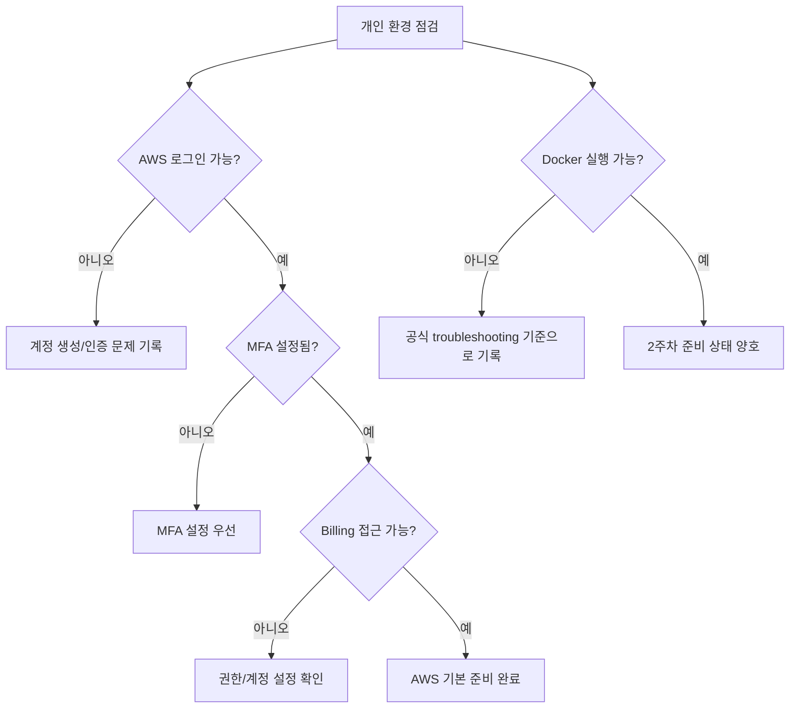

# 7교시: 개인 면담 및 환경 점검 - AWS 계정, MFA, Billing 알림, Docker 실행 상태 확인

## 수업 목표
- 개인별 AWS 계정, MFA, Billing 접근, Docker 실행 상태를 확인한다.
- 완료 여부보다 막힌 지점과 다음 조치를 명확히 기록한다.
- 이후 Docker와 AWS 실습에서 반복될 환경 문제를 조기에 발견한다.
- 비용과 보안 위험이 있는 미완료 항목을 구분한다.

## 시작 상황
클라우드와 Docker 수업은 개인 환경 차이가 크게 영향을 준다. 어떤 학생은 계정 생성이 끝났지만 Billing 접근이 안 될 수 있고, 어떤 학생은 Docker가 실행되지만 가상화 설정이 꺼져 있을 수 있다. 또 어떤 학생은 회사 또는 교육장 보안 정책 때문에 설치나 결제 수단 등록이 막힐 수 있다.

환경 점검의 목적은 학생을 평가하는 것이 아니다. 이후 실습이 막히지 않도록 위험을 빨리 발견하고, 수업 중 해결할 것과 별도 조치가 필요한 것을 나누는 것이다.

## 공식 참고 자료
- AWS IAM User Guide: Multi-factor authentication in IAM  
  https://docs.aws.amazon.com/IAM/latest/UserGuide/id_credentials_mfa.html
- AWS Billing and Cost Management User Guide  
  https://docs.aws.amazon.com/awsaccountbilling/latest/aboutv2/billing-what-is.html
- Docker Docs: Install Docker Desktop  
  https://docs.docker.com/desktop/
- Docker Docs: Troubleshoot Docker Desktop  
  https://docs.docker.com/desktop/troubleshoot/

## 점검 항목
| 영역 | 확인 항목 | 상태 | 다음 조치 |
|---|---|---|---|
| AWS 계정 | 로그인 가능 |  |  |
| AWS 보안 | root user MFA 설정 |  |  |
| AWS 비용 | Billing 화면 접근 |  |  |
| AWS 비용 | Budget 또는 알림 메뉴 위치 확인 |  |  |
| AWS 콘솔 | 현재 Region 확인 가능 |  |  |
| Docker | Docker Desktop 실행 |  |  |
| Docker | `docker version` 확인 |  |  |
| GitHub | secret이 저장소에 없는지 확인 |  |  |

## Docker 상태 확인 명령
Docker는 2주차에 본격적으로 다루지만, 설치와 실행 상태는 미리 확인한다.

```bash
docker version
docker info
```

기대 결과:
- Docker Client와 Server 정보가 모두 보인다.
- Docker Desktop이 실행 중이어야 한다.
- Server에 연결할 수 없다는 메시지가 나오면 Docker daemon이 실행 중인지 확인한다.

흔한 증상:
| 증상 | 가능한 원인 | 대응 |
|---|---|---|
| `Cannot connect to the Docker daemon` | Docker Desktop 미실행 | Docker Desktop 실행 후 재시도 |
| 가상화 관련 오류 | BIOS/WSL/Hyper-V 설정 문제 | 운영체제별 공식 문서 확인 |
| 권한 오류 | 사용자 그룹 또는 관리자 권한 문제 | 설치 방식과 권한 확인 |
| 회사 PC 제한 | 보안 정책 | 별도 장비 또는 승인 필요 |

## AWS 상태 확인 기록
```text
이름:
AWS 로그인 가능 여부:
root MFA 상태:
Billing 접근 가능 여부:
Budget/알림 메뉴 확인 여부:
현재 Region:
오늘 생성한 AWS 리소스:
계정 생성/인증에서 막힌 지점:
다음 수업 전 필요한 조치:
```

## 환경 문제 우선순위
| 우선순위 | 문제 | 이유 |
|---|---|---|
| 높음 | MFA 미설정 상태로 계정 사용 | 계정 탈취 위험이 크다 |
| 높음 | Billing 접근 불가 | 비용 확인 없이 리소스 실습을 진행할 수 없다 |
| 높음 | 결제 수단/계정 생성 미완료 | 5주차 AWS 실습 참여 방식 조정 필요 |
| 중간 | Docker daemon 연결 실패 | 2주차 전 해결 필요 |
| 중간 | GitHub secret 노출 의심 | 즉시 삭제만으로 충분하지 않을 수 있다 |
| 낮음 | 콘솔 언어/테마 차이 | 수업 흐름에는 큰 영향 없음 |

## 면담 질문
- AWS 계정 생성에서 가장 막힌 단계는 어디인가?
- MFA를 설정했다면 어떤 방식으로 설정했는가?
- Billing 화면을 열 수 있는가?
- Docker Desktop은 실행되는가?
- 3일차 미니 앱을 다시 실행할 수 있는가?
- GitHub 저장소에 secret, token, 결제 정보, 개인정보가 들어간 적이 있는가?
- 다음 수업 전 혼자 해결해야 할 항목과 수업 중 도움받아야 할 항목은 무엇인가?

## Mermaid: 환경 점검 분기


## 산출물
오늘의 산출물은 "모든 항목 완료"가 아니라 "상태가 분명한 점검표"다. 다음과 같이 분류한다.

| 분류 | 의미 |
|---|---|
| 완료 | 바로 다음 실습에 사용할 수 있음 |
| 수업 중 도움 필요 | 오류 메시지와 환경 정보가 있어 함께 해결 가능 |
| 외부 승인 필요 | 결제 수단, 회사 정책, 보호자 승인 등 수업 중 해결 불가 |
| 대체 경로 필요 | 개인 계정 사용이 어려워 수업 데모 또는 팀 계정 관찰로 진행 |

## DevOps 원칙 연결
- 비용 절감: Billing 접근과 리소스 생성 여부를 확인하면 비용 사고를 예방한다.
- 개발/배포 효율성: 환경 문제를 미리 분류하면 Docker/AWS 실습 시간을 지킬 수 있다.
- 관리 효율성: 개인 상태 기록은 이후 장애 대응과 보충 실습의 기준 자료가 된다.

## 다음 수업 연결
마지막 교시에서는 학생이 만들고 싶은 프로젝트 아이디어를 클라우드 리소스, 비용, 보안 위험으로 해석한다. 좋은 프로젝트 아이디어는 큰 기술 목록이 아니라 운영 가능한 범위 조정에서 시작한다.
