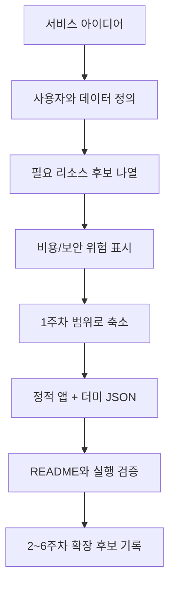

# 8교시: 프로젝트 아이디어 면담 - 만들고 싶은 서비스, 필요한 리소스, 예상 위험 요소 정리

## 수업 목표
- 만들고 싶은 서비스를 기능이 아니라 필요한 리소스와 운영 위험으로 분해한다.
- 1주차 범위에 맞게 비용이 들지 않는 더미 데이터와 정적 앱 구조로 아이디어를 줄인다.
- 이후 Docker, Kubernetes, AWS, Terraform으로 확장할 수 있는 프로젝트 후보를 정리한다.
- 비용, 보안, 관찰 가능성, 공식 문서 확인이 프로젝트 설계의 일부임을 이해한다.

## 시작 상황
"쇼핑몰을 만들고 싶다", "채팅 앱을 만들고 싶다", "AI 서비스를 만들고 싶다" 같은 아이디어는 좋은 출발점이다. 하지만 운영 관점에서는 곧바로 질문이 따라온다. 사용자는 몇 명인가, 로그인은 필요한가, 데이터는 저장되는가, 파일 업로드가 있는가, 외부 API key가 필요한가, 비용이 계속 발생하는 리소스가 있는가, 장애가 나면 어디서 증거를 볼 것인가.

1주차의 프로젝트 아이디어 면담은 아이디어를 작게 만들기 위한 시간이 아니다. 운영 가능한 첫 버전으로 줄이기 위한 시간이다. 줄인 첫 버전은 2주차 Docker, 3주차 MSA, 4주차 Kubernetes, 5주차 AWS, 6주차 Terraform에서 점진적으로 확장할 수 있다.

## 공식 참고 자료
- AWS Well-Architected Framework  
  https://docs.aws.amazon.com/wellarchitected/latest/framework/welcome.html
- AWS Well-Architected Framework: Cost Optimization pillar  
  https://docs.aws.amazon.com/wellarchitected/latest/cost-optimization-pillar/welcome.html
- AWS Well-Architected Framework: Security pillar  
  https://docs.aws.amazon.com/wellarchitected/latest/security-pillar/welcome.html
- GitHub Docs: About READMEs  
  https://docs.github.com/en/repositories/managing-your-repositorys-settings-and-features/customizing-your-repository/about-readmes
- MDN Web Docs: JSON  
  https://developer.mozilla.org/en-US/docs/Learn/JavaScript/Objects/JSON

## 아이디어를 운영 관점으로 바꾸는 질문
| 질문 | 왜 필요한가 |
|---|---|
| 사용자는 누구인가? | 공개 범위, 인증, 개인정보 여부가 달라진다 |
| 데이터는 무엇인가? | 더미 JSON, DB, 객체 저장소 중 선택 기준이 된다 |
| 데이터가 사라지면 안 되는가? | 백업과 영속 저장 필요 여부가 결정된다 |
| 외부 API가 필요한가? | 비용, quota, secret 관리가 필요하다 |
| 파일 업로드가 있는가? | 저장소, 용량, 악성 파일 위험이 생긴다 |
| 로그인/권한이 필요한가? | 인증, 세션, 개인정보 보호가 필요하다 |
| 장애가 나면 무엇을 확인할 것인가? | 로그, health check, 상태 페이지가 필요하다 |
| 이번 주차에서 제외할 기능은 무엇인가? | 실습 범위와 비용을 통제한다 |

## 쉬운 비유: 건물 조감도와 1차 모형
프로젝트 아이디어는 큰 건물 조감도와 같다. 조감도에는 멋진 입구, 여러 층, 주차장, 보안실, 전기실, 엘리베이터가 모두 보일 수 있다. 하지만 첫 수업에서 실제 건물을 모두 짓지는 않는다. 먼저 작은 모형을 만들어 동선과 방의 역할을 확인한다.

1주차의 정적 프론트엔드 앱과 더미 JSON은 이 모형에 해당한다. 실제 로그인, 결제, 데이터베이스, AI API를 붙이지 않아도 화면 흐름과 데이터 구조, README, 실행 방법을 검증할 수 있다. 비유의 한계는 실제 서비스에서는 모형에서 보이지 않는 성능, 보안, 데이터 정합성 문제가 반드시 생긴다는 점이다. 그래서 이후 주차에서 Docker, MSA, Kubernetes, AWS, Terraform으로 확장한다.

## 리소스 분해 표
아이디어를 아래 표로 분해한다.

| 기능 | 필요한 리소스 후보 | 1주차 대체 방식 | 비용 위험 | 보안 위험 |
|---|---|---|---|---|
| 상품 목록 | DB 또는 JSON | `data/products.json` | DB 실행 비용 | 개인정보 없음 |
| 로그인 | 인증 서비스 | 제외, 샘플 사용자 표시 | 인증 서비스 비용 | 비밀번호/토큰 |
| 이미지 업로드 | 객체 저장소 | 로컬 샘플 이미지 | 저장량/요청 비용 | 공개 파일, 악성 파일 |
| AI 요약 | 외부 AI API | 미리 작성한 더미 요약 | API 호출 비용 | API key 노출 |
| 관리자 페이지 | 권한 시스템 | 제외, README에 확장 계획 | 개발/운영 복잡도 | 권한 우회 |

## 프로젝트 범위 조정 기준
| 원래 요구 | 1주차 범위로 줄인 형태 |
|---|---|
| 실제 회원가입과 로그인 | 샘플 사용자 3명을 JSON으로 표시 |
| 실시간 채팅 | 정적 메시지 목록과 필터 |
| 결제 연동 | 샘플 결제 내역 JSON |
| AI API 호출 | 더미 응답과 프롬프트 기록 |
| 데이터베이스 저장 | 읽기 전용 JSON 목록 |
| 관리자 권한 | 화면 구조만 만들고 실제 권한 제외 |

범위를 줄일 때 중요한 것은 "언젠가 만들 기능"을 삭제하는 것이 아니라, 지금 만들지 않는 이유를 기록하는 것이다. README에 제외한 기능과 이유가 있으면 프로젝트가 미완성으로 보이지 않고, 운영 판단이 있는 첫 버전으로 보인다.

## Mermaid: 아이디어에서 운영 가능한 첫 버전까지


## 실습: 프로젝트 아이디어 카드 작성
아래 양식을 작성한다.

```text
프로젝트 이름:
한 문장 설명:
주 사용자:
핵심 화면 3개:
필요한 데이터:
1주차에서 만들 범위:
1주차에서 제외할 기능:
외부 API 필요 여부:
비용이 생길 수 있는 지점:
secret 또는 개인정보 위험:
장애가 나면 확인할 증거:
공식 문서로 확인해야 할 주제:
2주차 Docker로 확장할 지점:
5주차 AWS로 확장할 지점:
```

## 의사결정 표: 지금 만들 것과 나중에 만들 것
| 판단 기준 | 지금 만든다 | 나중에 만든다 |
|---|---|---|
| 비용 | 무료 로컬 실행 가능 | 유료 API/클라우드 리소스 필요 |
| 보안 | secret과 개인정보 없음 | 인증, 결제, 개인정보 필요 |
| 시간 | 2시간 안에 기본 동작 가능 | 여러 서비스 연동 필요 |
| 검증 | 브라우저와 README로 확인 가능 | 배포, 모니터링, 알림 필요 |
| 학습 연결 | Docker 이미지화 가능 | AWS/Terraform 이후 적합 |

## 발표 준비 질문
- 이 프로젝트는 어떤 문제를 해결하는가?
- 1주차 버전에서 일부러 제외한 기능은 무엇인가?
- 데이터베이스 대신 더미 JSON을 사용한 이유는 무엇인가?
- 비용이 발생할 수 있는 지점은 어디인가?
- secret이 필요한 기능은 무엇이며, 이번 버전에서는 어떻게 피했는가?
- 2주차 Docker에서는 무엇을 컨테이너로 실행할 수 있는가?
- 5주차 AWS에서는 어떤 서비스 후보를 검토할 수 있는가?

## DevOps 원칙 연결
- 비용 절감: 아이디어 단계에서 유료 API와 데이터베이스를 제외하면 실습 비용과 계정 문제를 줄인다.
- 개발/배포 효율성: 작은 첫 버전은 실행, README, 검증을 빠르게 반복하게 한다.
- 관리 효율성: 필요한 리소스와 제외한 기능을 문서화하면 이후 Docker/AWS/Terraform 확장이 자연스럽다.

## 4일차 정리
오늘 배운 클라우드 기본 구성요소, 서비스 모델, 계정 보안, 비용 계산, 공식 문서 검증은 이후 모든 주차의 안전 기준이다. 2주차 Docker는 실행 환경을 표준화하고, 5주차 AWS는 오늘 만든 클라우드 지도를 실제 서비스 이름으로 확장한다. 좋은 인프라 엔지니어는 리소스를 빨리 만드는 사람만이 아니라, 만들기 전에 위치, 비용, 권한, 책임, 정리 방법을 설명할 수 있는 사람이다.
