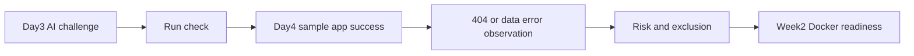

# 6교시: Day3 AI 챌린지와 Day4 운영 기록 발표

## 수업 목표
- Day3 AI 웹사이트 챌린지 결과를 3분 안에 발표한다.
- Day4 샘플앱 운영 기록에서 성공/실패/오류 관찰을 함께 설명한다.
- 기능 자랑보다 실행 확인, 위험 제외, handoff, Docker readiness를 중심으로 말한다.

## 오늘 반드시 가져갈 것
| 필수 개념 | 왜 필수인가 | 놓치면 생기는 문제 | 확인 기록 |
|---|---|---|---|
| Day3 챌린지 발표 | AI로 만든 정적 웹사이트 초안을 검증 과정과 함께 설명한다. | 결과물만 보여주고 AI 검증 기준을 놓친다. | prompt, static files, run check |
| Day4 운영 기록 발표 | 공통 샘플앱의 성공/실패/오류 관찰을 말한다. | DevOps 과정이 개발 결과 발표처럼 보인다. | success/404/error notes |
| 3분 구조 | 짧은 시간 안에 실행 방법, 확인 기록, 위험을 말한다. | 설명이 길어져 핵심 검증을 놓친다. | presentation card |
| Docker readiness | 다음 주차 질문을 자기 산출물 기준으로 남긴다. | Week2가 갑자기 새로운 과목처럼 느껴진다. | Docker question |

### 챌린저 복구 기준
- 발표가 길어지면 디자인 설명을 줄이고 실행 방법과 확인 기록을 먼저 말한다.
- Day3 결과가 미완성이어도 괜찮다. 무엇을 제외했고 어떻게 확인했는지를 말한다.
- Day4 기록은 성공만 말하지 말고 404 또는 data/JSON 오류 관찰 하나를 포함한다.

## 50분 운영
| 시간 | 활동 | 학습 초점 | 학생 산출 |
|---|---|---|---|
| 0-5분 | 발표 기준 안내 | 기능 자랑보다 확인 기록 중심을 강조한다. | 발표 기준 |
| 5-10분 | 발표 카드 작성 | Day3 결과와 Day4 기록을 5개 항목으로 제한한다. | presentation card |
| 10-40분 | 학생 발표 | 시간 관리와 질문을 진행한다. | 발표 |
| 40-48분 | 동료 평가 | 실행 가능성과 handoff 기준으로 피드백한다. | feedback note |
| 48-50분 | 다음 교시 연결 | Q&A에서 다룰 공통 이슈를 모은다. | issue list |

## 0-5분 발표 기준 안내
발표는 데모 쇼가 아니라 technical handoff 연습이다. Day3 챌린지는 "AI가 만든 것을 어떻게 검증했는가"를 보여주고, Day4 샘플앱은 "서버 실행과 오류 관찰을 어떻게 기록했는가"를 보여준다.

## 5-10분 발표 카드 작성
| 순서 | 내용 | 시간 |
|---|---|---|
| 1 | Day3 챌린지 결과와 제외한 범위 | 40초 |
| 2 | Day3 실행 확인 기록 | 40초 |
| 3 | Day4 샘플앱 성공 확인 | 40초 |
| 4 | Day4 실패/오류 관찰 하나 | 40초 |
| 5 | Week2 Docker readiness 질문 | 20초 |

## 10-40분 학생 발표

### 보여줄 자료 선택
| 자료 | 보여주면 답하는 질문 |
|---|---|
| Day3 챌린지 화면 | AI 결과가 정적 웹사이트로 열리는가? |
| Day3 prompt 기록 | 무엇을 요청했고 무엇을 제외했는가? |
| Day4 runbook | 다음 사람이 샘플앱을 실행할 수 있는가? |
| Day4 404/data error note | 실패를 관찰하고 구분했는가? |
| Docker readiness note | Week2로 넘길 실행 조건이 명확한가? |

## 40-48분 동료 평가
| 질문 | 피드백 |
|---|---|
| 발표자가 실행 방법을 설명했는가? | |
| 확인 기록을 보여주거나 말했는가? | |
| 오류 관찰이 성공 상태와 구분되는가? | |
| 제외한 범위와 남은 위험이 명확한가? | |
| Week2 질문이 자기 산출물과 연결되는가? | |

## 48-50분 다음 교시 연결
발표에서 반복해서 나온 질문은 7교시 live Q&A에서 다룬다. Q&A는 새 강의가 아니라 README, runbook, risk, Docker readiness note를 보완하는 시간이다.

## 평가 기준
| 기준 | 충족 |
|---|---|
| Day3 챌린지 결과와 검증 과정을 설명했다. | |
| Day4 샘플앱 성공/실패/오류 관찰 중 최소 2개를 설명했다. | |
| 실행 확인 기록을 보여주거나 말했다. | |
| Week2 Docker readiness 질문을 남겼다. | |
