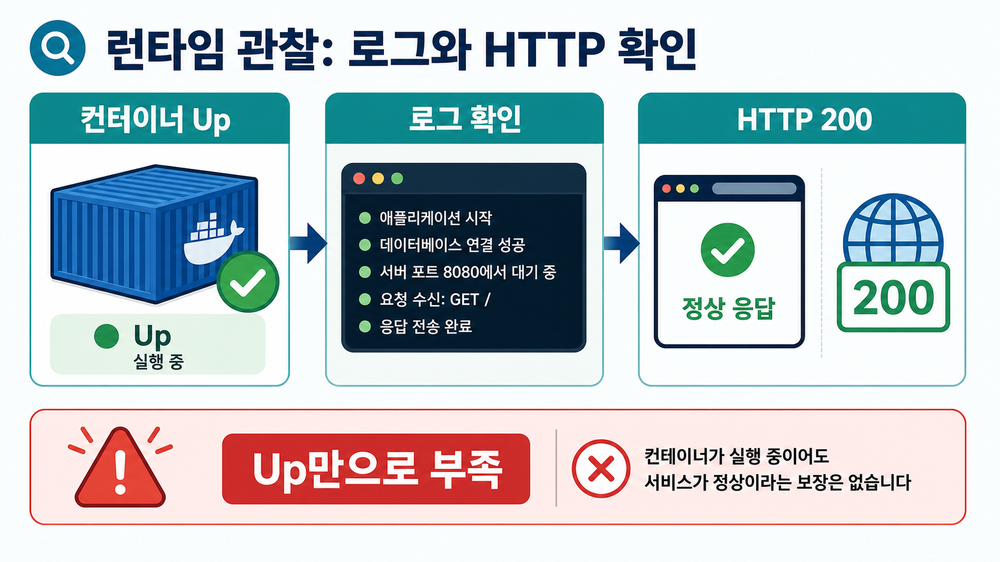

# 2교시: Logs와 HTTP 정상 확인



## 수업 목표
- `docker ps`의 `Up`과 서비스 정상 응답을 구분한다.
- `docker logs`에서 startup/access/error 신호를 확인한다.
- HTTP 응답으로 사용자가 접근 가능한 상태를 확인한다.
- HTTP 200과 frontend JSON parsing 성공을 다른 정상 기준으로 구분한다.

## 개념 설명
container가 `Up`이면 process가 살아 있다는 뜻이다. 하지만 사용자가 접속 가능한지, 올바른 port로 열렸는지, app이 정상 응답하는지는 별도 확인이 필요하다. 그래서 logs와 HTTP 확인을 같이 본다.

nginx는 좋은 예시다. process가 떠 있고 port publish가 맞으면 `curl -I`에서 `HTTP/1.1 200 OK`가 나온다. 반대로 port를 잘못 보면 container는 `Up`인데 host에서는 접속이 실패한다.

하지만 HTTP 200도 끝이 아니다. backend가 `200 OK`와 body `OK`를 돌려주면 health check는 통과할 수 있다. 그런데 frontend가 `/api/items`에서 JSON list를 기대하고 `response.json()`으로 파싱한다면, 같은 200 응답이라도 body가 `OK`이면 JSON parse error가 난다. 이때 backend process와 HTTP status만 보면 정상처럼 보이지만, 사용자 화면은 정상 실행 상태가 아니다.

이 교시의 기준은 다음처럼 나눈다.

| 확인 기준 | 정상처럼 보이는 증거 | 놓칠 수 있는 문제 |
|---|---|---|
| process | `docker ps`에서 `Up` | 요청을 처리하지 못할 수 있음 |
| HTTP status | `HTTP/1.1 200 OK` | body 형식이 frontend 계약과 다를 수 있음 |
| backend log | 요청이 도착함 | 응답 schema가 잘못됐을 수 있음 |
| frontend rendering | JSON list가 화면에 보임 | 실제 사용자 기능 정상 여부를 확인 |

logs를 볼 때도 환경 설정과 secret 기준을 같이 본다. 예를 들어 `APP_ENV=staging`으로 실행한 서비스가 startup log에 `mode=staging` 정도를 남기는 것은 도움이 된다. 하지만 `DB_PASSWORD=...` 같은 실제 secret을 log에 찍으면 실패다. 로그는 장애 분석을 위한 증거이면서 동시에 유출 경로가 될 수 있다.

## 실습 명령
```bash
cd /mnt/d/paperclip
docker rm -f paperclip-day4-nginx || true
docker run -d --name paperclip-day4-nginx -p 18084:80 nginx:1.27-alpine
docker ps --filter name=paperclip-day4-nginx
docker logs paperclip-day4-nginx --tail 30
curl -I http://localhost:18084
docker logs paperclip-day4-nginx --tail 30
```

Expected:

```text
STATUS Up
0.0.0.0:18084->80/tcp
HTTP/1.1 200 OK
```

## 확인 지점
| 증거 | 의미 |
|---|---|
| `STATUS Up` | container process가 실행 중 |
| `0.0.0.0:18084->80/tcp` | host 18084가 container 80으로 연결 |
| `HTTP/1.1 200 OK` | host에서 서비스 접근 성공 |
| access log | HTTP 요청이 container까지 도달 |

## frontend/backend JSON contract 실습
이번에는 backend와 frontend를 분리해서 본다. backend는 두 endpoint를 가진다.

| endpoint | 의미 |
|---|---|
| `/health` | plain text `OK`를 반환한다. 200 OK 확인용이다. |
| `/api/items` | frontend가 JSON list를 기대하는 API다. |

처음에는 backend를 일부러 잘못된 mode로 실행한다. `/api/items`도 200을 돌려주지만 body가 JSON이 아니라 `OK`다.

```bash
docker rm -f paperclip-day4-api paperclip-day4-frontend || true
docker run -d --name paperclip-day4-api \
  -p 18088:8080 \
  -e RESPONSE_MODE=text \
  -v "$PWD/week2/day4/labs/http-json-state/backend:/app:ro" \
  -w /app \
  python:3.12-alpine python app.py

docker run -d --name paperclip-day4-frontend \
  -p 18087:80 \
  -v "$PWD/week2/day4/labs/http-json-state/frontend:/usr/share/nginx/html:ro" \
  nginx:1.27-alpine
```

CLI에서 확인한다.

```bash
curl -i http://localhost:18088/health
curl -i http://localhost:18088/api/items
docker logs paperclip-day4-api --tail 20
```

Expected:

```text
HTTP/1.0 200 OK
OK
HTTP/1.0 200 OK
OK
path=/api/items mode=text
```

브라우저에서 두 페이지를 비교한다.

```text
http://localhost:18087/ok.html
http://localhost:18087/items.html
```

`ok.html`은 200 OK와 `OK` body를 보고 정상처럼 보인다. `items.html`은 같은 backend가 200을 돌려줘도 JSON parse failed를 보여준다. 이 상태는 backend 입장에서는 요청을 받은 것이지만, frontend 기능 기준으로는 정상 실행 상태가 아니다.

복구는 backend mode를 JSON으로 바꾸고 container를 다시 만드는 것이다.

```bash
docker rm -f paperclip-day4-api
docker run -d --name paperclip-day4-api \
  -p 18088:8080 \
  -e RESPONSE_MODE=json \
  -v "$PWD/week2/day4/labs/http-json-state/backend:/app:ro" \
  -w /app \
  python:3.12-alpine python app.py

curl -i http://localhost:18088/api/items
docker logs paperclip-day4-api --tail 20
```

Expected:

```text
HTTP/1.0 200 OK
Content-Type: application/json
{"items": ...}
path=/api/items mode=json
```

`items.html`을 새로고침하면 list가 렌더링된다.

## 상태 판단 표
| 관찰 | backend 관점 | frontend/사용자 관점 | 판단 |
|---|---|---|---|
| `/health` 200 OK | process와 route는 살아 있음 | health page는 정상 | 부분 정상 |
| `/api/items` 200 + `OK` | 요청 처리 성공처럼 보임 | JSON parse failed | 서비스 비정상 |
| `/api/items` 200 + JSON list | API 계약 충족 | list 렌더링 성공 | 정상 |
| backend log에 요청 있음 | request 도달 확인 | 화면 성공 보장은 아님 | 추가 확인 필요 |

## env 출력 로그 확인
애플리케이션이 startup 시점에 env를 로그로 남기는 경우도 있다. 이때 환경 이름은 도움이 되지만 secret 값은 마스킹해야 한다.

```bash
docker rm -f paperclip-day4-log-env || true
docker run --name paperclip-day4-log-env --env-file week2/day4/labs/env-report/.env -v "$PWD/week2/day4/labs/env-report:/work:ro" alpine:3.20 /work/report.sh || true
docker logs paperclip-day4-log-env
```

Expected:

```text
APP_ENV=practice
FEATURE_FLAG=on
DB_PASSWORD=***masked***
```

해석: `report.sh`가 password를 직접 출력하지 않고 masking했다. 실제 application log도 이런 방식이어야 한다.

## log에 남겨도 되는 것과 안 되는 것
| 로그 예시 | 판단 |
|---|---|
| `APP_ENV=staging` | 환경 이름 정도는 가능 |
| `HTTP/1.1 200 OK` | 정상 확인 증거 |
| `GET /` | 접근 확인 증거 |
| `DB_PASSWORD=my-real-password` | 실패, secret 노출 |
| `AWS_SECRET_ACCESS_KEY=...` | 실패, credential 노출 |

## 오해 교정
`docker logs`가 비어 있다고 항상 장애는 아니다. 요청을 아직 보내지 않았거나, image가 startup log를 적게 남길 수 있다. 이때는 `curl`을 먼저 보내고 logs를 다시 본다.

`200 OK`도 항상 서비스 정상은 아니다. status code, body type, JSON schema, frontend rendering을 함께 봐야 한다. 특히 운영에서는 backend log에 error가 없어도 frontend에서 parse error가 나면 사용자 기능은 실패다.

환경별 파일을 쓰는 서비스라면 logs에는 `어느 환경으로 떴는지`를 확인할 힌트가 남을 수 있다. 다만 password 자체를 확인하려고 logs에 찍는 방식은 금지한다. 값 확인은 masking된 script, `inspect`, application health endpoint 등으로 제한한다.

## 다음 연결
다음 교시는 `inspect`와 `exec`로 Docker metadata와 container 내부 상태를 나눠 본다.
