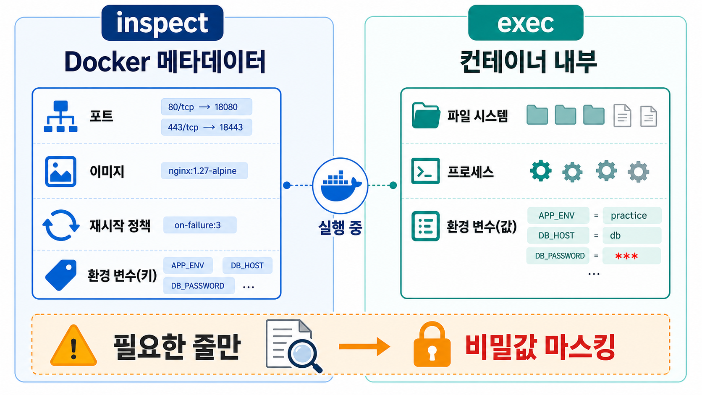

# 3교시: Inspect와 exec로 내부 확인



## 수업 목표
- `docker inspect`와 `docker exec`의 역할을 구분한다.
- port, image, restart policy 같은 metadata를 선별해서 확인한다.
- container 내부 filesystem/process/config file을 read-only 관찰 기준으로 확인한다.
- `docker exec -it ... sh`로 shell에 들어갈 때의 운영 위험과 금지 행동을 설명한다.

## 개념 설명
`inspect`는 Docker가 알고 있는 metadata를 보는 명령이다. port mapping, network, mount, image, env, restart policy처럼 container 외부 계약을 확인할 때 유용하다. `exec`는 이미 실행 중인 container 안에서 명령을 실행한다. filesystem, process, config file, network tool 존재 여부처럼 내부 상태를 볼 때 쓴다.

두 명령을 섞어 쓰면 안 된다. port mapping이 궁금하면 `inspect`, nginx가 실제로 어떤 파일을 serving하는지 궁금하면 `exec`가 맞다.

단, `inspect`와 `exec env`는 secret을 보여줄 수 있다. `--env-file .env`로 넣은 값도 container metadata나 container 내부 환경에서 확인될 수 있다. 그래서 수업 기록에는 전체 출력 대신 필요한 key와 masking된 값만 남긴다.

`exec`를 shell 진입 도구로 사용할 때는 기준이 더 엄격하다. shell은 관찰을 편하게 해주지만, 동시에 container 내부 파일을 임의로 수정하거나 삭제하거나 package를 설치할 수 있는 통로다. 운영 환경에서는 이런 변경이 image, Dockerfile, CI/CD, runbook에 남지 않아 재현 불가능한 장애를 만든다. 이 수업에서 shell 진입은 상태 확인 목적일 때만 허용하고, container를 고치는 방식의 문제 해결은 금지한다.

## exec shell 운영 원칙
| 허용 | 금지 |
|---|---|
| `ls`, `pwd`, `cat`, `head`, `tail`, `find`, `ps`, `env`, `whoami`로 상태 확인 | `vi`, `nano`, `sed -i`, `rm`, `mv`, `cp`, `apk add`, `apt install`로 내부 변경 |
| config file, static file, process, env key 존재 여부 확인 | container 안에서 hotfix를 직접 적용하고 정상이라고 보고 |
| 확인한 내용을 README/runbook에 evidence로 기록 | 변경 내용을 image/Dockerfile/compose에 반영하지 않고 방치 |
| 수정이 필요하면 Dockerfile, env file, volume source, compose/run option으로 되돌아가 변경 | 운영 중인 container를 snowflake server처럼 손으로 관리 |

핵심은 간단하다. `exec shell`은 진단 도구이지 배포 도구가 아니다. container 내부를 바꿔야 문제가 해결된다면, 그 변경은 container 안이 아니라 image build, runtime config, mounted file, compose.yaml 같은 재현 가능한 위치에 반영해야 한다.

## 실습 명령
```bash
docker inspect paperclip-day4-nginx --format 'Ports={{json .NetworkSettings.Ports}}'
docker inspect paperclip-day4-nginx --format 'Image={{.Config.Image}} Restart={{json .HostConfig.RestartPolicy}}'
docker exec paperclip-day4-nginx ls -l /usr/share/nginx/html
docker exec paperclip-day4-nginx sh -c 'ps | head'
docker exec paperclip-day4-nginx sh -c 'cat /etc/nginx/conf.d/default.conf | sed -n "1,40p"'
```

Expected:

```text
Ports={"80/tcp":[{"HostIp":"0.0.0.0","HostPort":"18084"}]}
Image=nginx:1.27-alpine
index.html
nginx
server {
```

## shell로 들어가서 확인하기
짧은 명령은 `docker exec <container> <command>`가 낫다. 여러 파일을 이어서 확인해야 할 때만 interactive shell을 사용한다.

```bash
docker exec -it paperclip-day4-nginx sh
```

container 안에서는 아래처럼 read-only 명령만 실행한다.

```sh
pwd
whoami
ls -al /usr/share/nginx/html
cat /usr/share/nginx/html/index.html | head
cat /etc/nginx/conf.d/default.conf | sed -n '1,40p'
ps
exit
```

Expected:

```text
/
root
index.html
server {
PID   USER
```

이 shell에서 `vi /etc/nginx/conf.d/default.conf`, `rm /usr/share/nginx/html/index.html`, `apk add curl` 같은 명령은 실행하지 않는다. 실습 container라 하더라도 그 습관은 운영 환경에서 사고가 된다. 변경이 필요하면 container를 빠져나와 Dockerfile, bind mount 원본 파일, env file, run option에서 수정한 뒤 container를 다시 만든다.

## 선택 기준
| 알고 싶은 것 | 먼저 쓸 명령 |
|---|---|
| host port가 어디에 연결됐는가 | `docker inspect ... NetworkSettings.Ports` |
| 어떤 image로 떴는가 | `docker inspect ... Config.Image` |
| restart policy가 무엇인가 | `docker inspect ... HostConfig.RestartPolicy` |
| container 안에 파일이 있는가 | `docker exec ... ls` |
| config file 내용을 확인해야 하는가 | `docker exec ... cat ...` 또는 read-only shell |
| process가 무엇인가 | `docker exec ... ps` |
| env key가 적용됐는가 | `docker inspect ... Config.Env` 또는 `docker exec ... env` |
| 내부 파일을 바꿔야 할 것 같은가 | `exec`로 수정하지 말고 Dockerfile/env/volume/run option으로 돌아간다 |

## env 확인 시 masking
env 확인이 필요하면 key 이름과 적용 여부를 본다.

```bash
docker rm -f paperclip-day4-env-inspect || true
docker run -d --name paperclip-day4-env-inspect --env-file week2/day4/labs/env-report/.env alpine:3.20 sleep 300
docker inspect paperclip-day4-env-inspect --format '{{range .Config.Env}}{{println .}}{{end}}' \
  | grep -E 'APP_ENV|FEATURE_FLAG|DB_PASSWORD' \
  | sed -E 's/DB_PASSWORD=.*/DB_PASSWORD=***masked***/'
docker exec paperclip-day4-env-inspect sh -c 'env | grep -E "APP_ENV|FEATURE_FLAG|DB_PASSWORD"' \
  | sed -E 's/DB_PASSWORD=.*/DB_PASSWORD=***masked***/'
```

Expected:

```text
APP_ENV=practice
FEATURE_FLAG=on
DB_PASSWORD=***masked***
```

해석: `inspect`와 `exec env` 모두 값 확인이 가능하다. 그래서 문제 해결에는 유용하지만, 제출물이나 질문 글에는 masking이 필요하다.

## 판단 drill
다음 상황에서 먼저 쓸 명령을 고른다.

| 상황 | 먼저 볼 증거 | 이유 |
|---|---|---|
| host port가 열렸는지 모르겠다 | `docker inspect ... NetworkSettings.Ports` | Docker가 적용한 publish 정보를 본다. |
| nginx가 어떤 파일을 serving하는지 모르겠다 | `docker exec ... ls /usr/share/nginx/html` | container 내부 filesystem을 본다. |
| nginx 설정이 어떤 root를 보고 있는지 모르겠다 | `docker exec ... cat /etc/nginx/conf.d/default.conf` | 설정 파일을 읽기만 한다. |
| env가 들어갔는지 확인해야 한다 | `inspect` 또는 `exec env` + masking | 값 확인은 가능하지만 기록은 masking한다. |
| process가 죽었는지 모르겠다 | `docker inspect ... State` 또는 `docker ps -a` | container 상태와 exit code를 본다. |
| container 안에서 파일을 고치면 빨리 해결될 것 같다 | 수정 금지, 재현 가능한 source로 돌아간다 | 손수 고친 container는 재빌드/재배포 시 사라지고 원인 추적을 어렵게 한다. |

## 주의
`docker inspect` 전체 JSON을 README에 붙이면 읽기 어렵다. 문제와 관련된 field만 뽑아서 증거로 남긴다.

`docker exec -it ... sh`로 들어간 shell은 강력하지만 위험하다. 운영 원칙은 "확인만 하고 변경하지 않는다"다. 누군가 container 내부를 임의로 바꾸면 `docker inspect`, Git history, Dockerfile, compose.yaml 어디에도 변경 근거가 남지 않는다. 그 결과 같은 image로 다시 띄웠을 때 장애가 재현되거나, 반대로 현재 container만 우연히 정상인 상태가 된다.

Kubernetes에서도 같은 기준이 이어진다. Pod의 env, ConfigMap, Secret mount를 확인할 수는 있지만, 민감한 값을 그대로 issue나 README에 붙이면 안 된다.

## 다음 연결
다음 교시는 resource 관찰과 restart policy를 다룬다.
