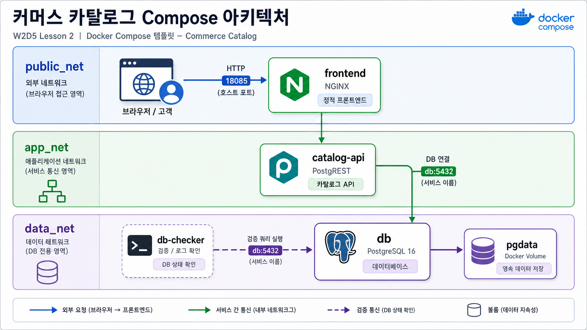

# 2교시: 쿠팡형 커머스 카탈로그 template



## 수업 목표
- frontend, catalog API, PostgreSQL을 별도 service로 실행하는 기본 구조를 읽는다.
- host port와 container internal port를 구분한다.
- `db-checker` 로그로 service name 기반 DB 연결을 확인한다.

## 언제 쓰는가
커머스 화면은 하나처럼 보이지만 뒤에는 상품 카탈로그 API와 상품 DB가 있다. W1D4의 커머스 아키텍처를 Compose로 줄이면 frontend, catalog API, PostgreSQL 세 덩어리로 시작할 수 있다.

## Template
```bash
cd week2/day5/labs/compose-architectures/01-web-postgres
docker compose config
docker compose up -d
docker compose ps
```

## compose.yaml 읽기
강의에서는 먼저 아래 축약본을 읽고, 실제 파일 `labs/compose-architectures/01-web-postgres/compose.yaml`과 비교한다.

```yaml
services:
  frontend:
    image: nginx:1.27-alpine
    ports:
      - "18085:80"                 # 고객/브라우저가 들어오는 web 진입점
    volumes:
      - ./html:/usr/share/nginx/html:ro
                                   # frontend 정적 파일을 nginx document root에 연결
    depends_on:
      - catalog-api                # frontend가 catalog API와 함께 뜨는 구조임을 표시
    networks:
      - public_net                 # browser 진입 영역
      - app_net                    # backend API와 연결되는 application 영역

  catalog-api:
    image: postgrest/postgrest:v12.2.8
    ports:
      - "18101:3000"               # 강의 확인용으로 API도 host에 공개
    environment:
      PGRST_DB_URI: postgres://app_user:app_password@db:5432/app
                                   # API container는 DB를 localhost가 아니라 db로 찾는다.
      PGRST_DB_SCHEMAS: api
      PGRST_DB_ANON_ROLE: web_anon
    depends_on:
      - db
    networks:
      - app_net                    # frontend/gateway 쪽에서 접근 가능한 API 영역
      - data_net                   # DB와 연결되는 data 영역

  db:
    image: postgres:16
    volumes:
      - ./db/init.sql:/docker-entrypoint-initdb.d/01-init.sql:ro
                                   # 최초 실행 시 products table과 권한을 준비한다.
      - pgdata:/var/lib/postgresql/data
                                   # 상품 데이터는 named volume에 보존된다.
    networks:
      - data_net                   # DB는 frontend/public 영역에 붙이지 않는다.

volumes:
  pgdata:

networks:
  public_net:
  app_net:
  data_net:
```

읽는 순서는 `frontend -> catalog-api -> db`다. 그림의 연결선이 Compose에서는 `networks`, `depends_on`, `PGRST_DB_URI`, service name `db`, named volume `pgdata`로 표현된다.

구성:

| Service | 역할 | 공개 범위 |
|---|---|---|
| `frontend` | nginx static web app | host `18085` |
| `catalog-api` | products table REST API | host `18101` |
| `db` | PostgreSQL 16 | Compose network 내부 |
| `db-checker` | DB 연결 확인 app | logs로 결과 확인 |

## 트래픽/부하 성향 노트
커머스 카탈로그 구조에서는 읽기 traffic이 많다. 상품 목록, 검색, 상세 조회가 반복되므로 API와 DB의 read path가 핵심이다.

| Service | 트래픽 성향 | CPU 부하 | 메모리/상태 부하 | 운영에서 먼저 볼 것 |
|---|---|---|---|---|
| `frontend` | 정적 파일 요청이 몰림 | 낮음. gzip/TLS를 붙이면 증가 | 낮음 | access log, 4xx/5xx |
| `catalog-api` | 상품 조회 API traffic 집중 | query 변환, JSON 응답 생성 시 증가 | connection pool 설정에 영향 | API latency, error log |
| `db` | read query 반복 | 정렬/필터/인덱스 부재 시 증가 | buffer/cache, table/index size | slow query, connection 수 |
| `db-checker` | 수업용 보조 traffic | 거의 없음 | 없음 | DB readiness evidence |

실무에서는 catalog API를 여러 개로 늘리거나 cache를 붙일 수 있다. 하지만 DB index가 부실하면 API scale out만으로 해결되지 않는다.

## Check
```bash
curl -I http://localhost:18085
curl -s http://localhost:18101/products
docker compose exec db psql -U postgres -d app -c "SELECT current_database();"
docker compose logs db-checker --tail 30
```

Expected:

```text
HTTP/1.1 200 OK
"name":"local-market-starter-kit"
products
```

## 실무 해석
host에서는 `localhost:18085`로 frontend에 접근하고 `localhost:18101/products`로 API를 확인한다. 하지만 API container는 DB에 `localhost`가 아니라 service name `db`로 붙는다. 이 차이가 host port와 internal service DNS의 핵심이다.

## Cleanup
```bash
docker compose down
# DB를 초기화할 때만
# docker compose down -v
```
