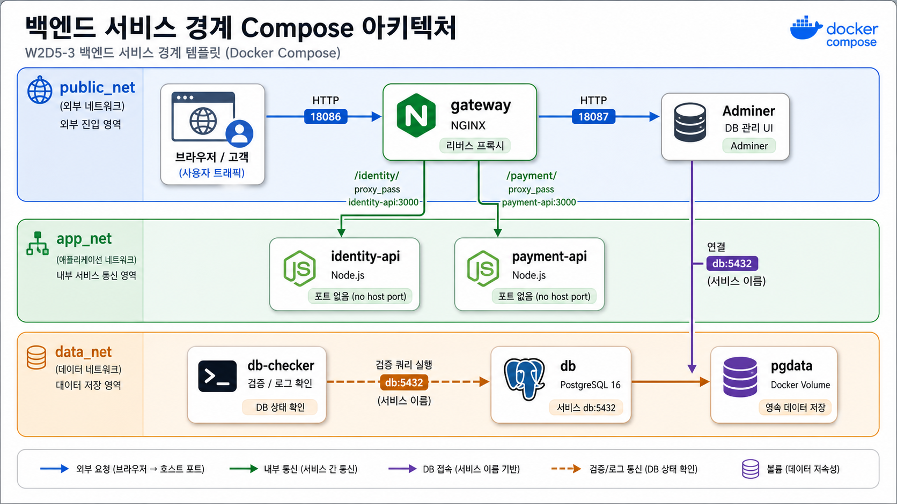

# 3교시: 당근형 백엔드 서비스 경계 template



## 수업 목표
- gateway 뒤에 identity API와 payment API를 분리한다.
- 공통 서비스가 많아질 때 service boundary와 장애 영향 범위를 설명한다.
- Adminer가 `db` service name으로 PostgreSQL에 접속하는 흐름을 확인한다.

## 언제 쓰는가
W1D4의 당근형 백엔드 경계 사례를 Compose로 줄인다. 사용자/신뢰 정보는 identity API, 결제 흐름은 payment API로 나뉘고, gateway가 외부 진입점을 맡는다. DB 관리 UI는 확인 도구로 붙이되 공개 범위를 항상 의식한다.

## Template
```bash
cd week2/day5/labs/compose-architectures/02-web-postgres-admin
docker compose config
docker compose up -d
docker compose ps
```

## compose.yaml 읽기
gateway가 외부 진입점을 맡고, identity/payment API는 내부 service로 남는 점을 코드에서 확인한다.

```yaml
services:
  gateway:
    image: nginx:1.27-alpine
    ports:
      - "18086:80"                 # 외부 공개 entrypoint는 gateway 하나로 모은다.
    volumes:
      - ./html:/usr/share/nginx/html:ro
      - ./nginx/default.conf:/etc/nginx/conf.d/default.conf:ro
                                   # /identity/, /payment/ routing 규칙을 nginx에 주입한다.
    depends_on:
      - identity-api
      - payment-api
    networks:
      - public_net                 # 외부 요청을 받는 gateway 영역
      - app_net                    # 내부 API로 routing하는 영역

  identity-api:
    image: node:20-alpine
    command: ["node", "server.js"]
    volumes:
      - ./apps/identity-api:/app:ro
    environment:
      PORT: 3000                  # host에는 공개하지 않고 gateway가 내부 port로 호출한다.
    networks:
      - app_net

  payment-api:
    image: node:20-alpine
    command: ["node", "server.js"]
    volumes:
      - ./apps/payment-api:/app:ro
    environment:
      PORT: 3000
    networks:
      - app_net

  adminer:
    image: adminer:4
    ports:
      - "18087:8080"               # DB 확인 도구이므로 실습 후 노출을 정리해야 한다.
    depends_on:
      - db
    networks:
      - public_net                 # 실습용 UI는 host에 공개된다.
      - data_net                   # DB에는 data 영역으로 접근한다.

  db:
    image: postgres:16
    networks:
      - data_net                   # DB는 gateway/app 영역과 분리한다.

networks:
  public_net:
  app_net:
  data_net:
```

여기서 중요한 포인트는 `identity-api`, `payment-api`에 `ports`가 없다는 점이다. 사용자는 gateway로만 들어오고, 내부 API는 Compose network 안에서 service name으로만 호출된다.

구성:

| Service | 역할 | 공개 범위 |
|---|---|---|
| `gateway` | static page, API route | host `18086` |
| `identity-api` | user/trust API | Compose network 내부 |
| `payment-api` | payment mock API | Compose network 내부 |
| `db` | PostgreSQL 16 | Compose network 내부 |
| `adminer` | DB 관리 UI | host `18087` |
| `db-checker` | DB 연결 확인 app | logs로 결과 확인 |

## Check
```bash
curl -I http://localhost:18086
curl -I http://localhost:18087
curl -s http://localhost:18086/identity/users
curl -s http://localhost:18086/payment/payments
docker compose logs db-checker --tail 30
```

Adminer login:

| 항목 | 값 |
|---|---|
| System | PostgreSQL |
| Server | `db` |
| Username | `postgres` |
| Password | `postgres` |
| Database | `app` |

## 실무 해석
gateway는 `/identity/`를 `identity-api:3000`으로, `/payment/`를 `payment-api:3000`으로 보낸다. Adminer에서 server를 `localhost`로 넣으면 실패한다. Adminer container 입장에서 `localhost`는 자기 자신이고, DB service는 Compose DNS 이름 `db`다.

## Cleanup
```bash
docker compose down
# DB를 초기화할 때만
# docker compose down -v
```
