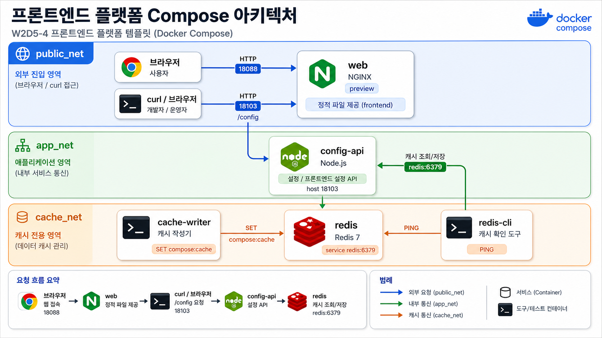

# 4교시: 토스형 프론트엔드 플랫폼 template



## 수업 목표
- frontend preview, config API, Redis cache를 함께 실행한다.
- API endpoint와 feature flag가 runtime config로 분리되는 방식을 확인한다.
- cache data lifecycle과 DB data lifecycle을 구분한다.

## 언제 쓰는가
W1D4의 프론트엔드 플랫폼 사례를 Compose로 줄인다. 화면은 nginx로 제공하고, 설정은 config API가 제공한다. Redis는 preview/cache/feature 실험에서 외부 backing service로 붙는다.

## Template
```bash
cd week2/day5/labs/compose-architectures/03-web-redis
docker compose config
docker compose up -d
docker compose ps
```

## compose.yaml 읽기
frontend 설정 API와 cache service가 app 밖으로 분리된 구조를 코드에서 읽는다.

```yaml
services:
  web:
    image: nginx:1.27-alpine
    ports:
      - "18088:80"                 # preview web 화면
    volumes:
      - ./html:/usr/share/nginx/html:ro
    depends_on:
      - redis
      - config-api
    networks:
      - public_net
      - app_net

  config-api:
    image: node:20-alpine
    command: ["node", "server.js"]
    ports:
      - "18103:3000"               # runtime config 확인용 API
    environment:
      API_BASE_URL: http://localhost:18101
      FEATURE_NEW_CHECKOUT: "true"
      FEATURE_AI_REVIEW: "false"   # 기능 플래그는 image build가 아니라 runtime config로 바꾼다.
    networks:
      - public_net                 # 강의에서 curl로 직접 확인하기 위해 공개
      - app_net
      - cache_net                  # backend가 cache 영역에 접근할 수 있는 구조

  redis:
    image: redis:7-alpine          # cache는 app process 내부 변수가 아니라 별도 service다.
    networks:
      - cache_net

  cache-writer:
    image: redis:7-alpine
    depends_on:
      - redis
    command: ["sh", "-c", "redis-cli -h redis SET compose:cache hit-from-cache-writer"]
                                   # Redis도 localhost가 아니라 service name redis로 접근한다.
    networks:
      - cache_net

networks:
  public_net:
  app_net:
  cache_net:
```

이 구조는 나중에 Kubernetes ConfigMap/Secret, Terraform variable, 환경별 `.env` 분리로 이어진다. “설정을 image 안에 굽지 않는다”는 원칙이 핵심이다.

구성:

| Service | 역할 | 공개 범위 |
|---|---|---|
| `web` | cache template 안내 web app | host `18088` |
| `config-api` | frontend runtime config API | host `18103` |
| `redis` | Redis cache | Compose network 내부 |
| `cache-writer` | Redis에 값을 쓰는 sample app | logs로 결과 확인 |
| `redis-cli` | 수동 확인 도구 | `--profile tool`로 실행 |

## 트래픽/부하 성향 노트
프론트엔드 플랫폼 구조에서는 web traffic과 config traffic을 분리해서 본다. config API는 단순해 보여도 모든 브라우저 시작 시점에 호출되면 의외로 중요해진다.

| Service | 트래픽 성향 | CPU 부하 | 메모리/상태 부하 | 운영에서 먼저 볼 것 |
|---|---|---|---|---|
| `web` | 정적 파일, SPA asset 요청 | 낮음. build asset 압축/캐시 정책 영향 | 낮음 | cache-control, 404 |
| `config-api` | 앱 시작/새로고침 시 반복 호출 | feature rule 계산이 복잡하면 증가 | config snapshot/cache | `/config` latency, error |
| `redis` | cache read/write 집중 | 단순 command는 낮음 | key 수, value 크기, eviction | memory usage, key count |
| `cache-writer` | 수업용 write traffic | 낮음 | 없음 | Redis write evidence |

Redis는 빠르지만 무한한 저장소가 아니다. cache key가 계속 늘면 memory pressure와 eviction이 생기고, 이때 app latency가 갑자기 흔들릴 수 있다.

## Check
```bash
curl -I http://localhost:18088
curl -s http://localhost:18103/config
docker compose logs cache-writer --tail 20
docker compose exec redis redis-cli GET compose:cache
docker compose --profile tool run --rm redis-cli
```

Expected:

```text
HTTP/1.1 200 OK
"newCheckout":true
hit-from-cache-writer
PONG
```

## 실무 해석
cache는 app container 안의 변수나 파일이 아니다. 별도 service다. 그래서 app이 재시작되어도 Redis service가 살아 있으면 cache는 유지될 수 있고, Redis container가 사라지면 cache도 사라질 수 있다.

## Cleanup
```bash
docker compose down
```
