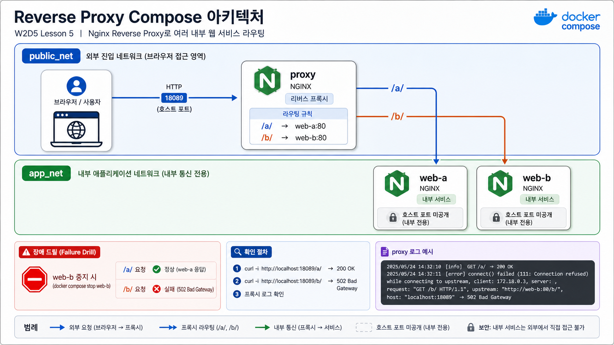

# 5교시: Nginx reverse proxy + multiple web services template



## 수업 목표
- 외부 traffic 진입점과 내부 upstream service를 분리한다.
- `web-a`, `web-b`를 host에 직접 공개하지 않는 이유를 설명한다.
- upstream 장애를 proxy logs로 확인한다.

## 언제 쓰는가
여러 web/API service를 하나의 entrypoint 뒤에 숨기고 path나 host 기준으로 routing할 때 사용한다. Week 3 MSA에서 gateway/API gateway 개념으로 넘어가기 전 가장 이해하기 쉬운 구조다.

## Template
```bash
cd week2/day5/labs/compose-architectures/04-nginx-reverse-proxy
docker compose config
docker compose up -d
docker compose ps
```

## compose.yaml 읽기
외부에 공개되는 service와 내부 upstream service를 Compose 코드에서 구분한다.

```yaml
services:
  proxy:
    image: nginx:1.27-alpine
    ports:
      - "18089:80"                 # 외부 traffic은 proxy로만 들어온다.
    volumes:
      - ./nginx/default.conf:/etc/nginx/conf.d/default.conf:ro
                                   # /a/ -> web-a, /b/ -> web-b routing 규칙
    depends_on:
      - web-a
      - web-b
    networks:
      - public_net                 # 외부 traffic 영역
      - app_net                    # 내부 upstream 영역

  web-a:
    image: nginx:1.27-alpine
    volumes:
      - ./web-a:/usr/share/nginx/html:ro
                                   # ports가 없으므로 host에서 직접 접근하지 않는다.
    networks:
      - app_net

  web-b:
    image: nginx:1.27-alpine
    volumes:
      - ./web-b:/usr/share/nginx/html:ro
    networks:
      - app_net

networks:
  public_net:
  app_net:
```

`web-a`, `web-b`에 `ports`가 없는 것이 설계 의도다. gateway/proxy가 살아 있어도 특정 upstream이 죽으면 해당 path만 실패한다는 것을 failure drill에서 확인한다.

구성:

| Service | 역할 | 공개 범위 |
|---|---|---|
| `proxy` | 외부 진입점, `/a/`, `/b/` routing | host `18089` |
| `web-a` | 내부 web app A | Compose network 내부 |
| `web-b` | 내부 web app B | Compose network 내부 |

## 트래픽/부하 성향 노트
reverse proxy 구조에서는 모든 외부 traffic이 `proxy`에 모인다. 하지만 path별로 실제 부하는 `web-a`, `web-b` 중 한쪽에 치우칠 수 있다.

| Service | 트래픽 성향 | CPU 부하 | 메모리/상태 부하 | 운영에서 먼저 볼 것 |
|---|---|---|---|---|
| `proxy` | 전체 외부 요청 진입 | TLS termination, 압축, access log가 많으면 증가 | connection buffer | access/error log, upstream status |
| `web-a` | `/a/` path traffic | 정적이면 낮음, API면 app logic 영향 | app cache/session 여부 | `/a/` 응답 시간 |
| `web-b` | `/b/` path traffic | path별 기능 차이에 따라 달라짐 | app cache/session 여부 | `/b/` 응답 시간 |

proxy CPU가 낮아도 특정 upstream이 죽으면 사용자에게는 장애로 보인다. 그래서 gateway graph만 보지 말고 upstream별 status와 latency를 나눠서 봐야 한다.

## Check
```bash
curl -s http://localhost:18089/a/
curl -s http://localhost:18089/b/
docker compose logs proxy --tail 40
```

Expected:

```text
Web A
Web B
```

## Failure drill
```bash
docker compose stop web-b
curl -i http://localhost:18089/b/ || true
docker compose logs proxy --tail 20
docker compose up -d web-b
```

proxy는 살아 있지만 upstream이 죽으면 `/b/`만 실패한다. 이 차이가 gateway 장애인지, backend 장애인지 구분하는 첫 단서다.

## Cleanup
```bash
docker compose down
```
