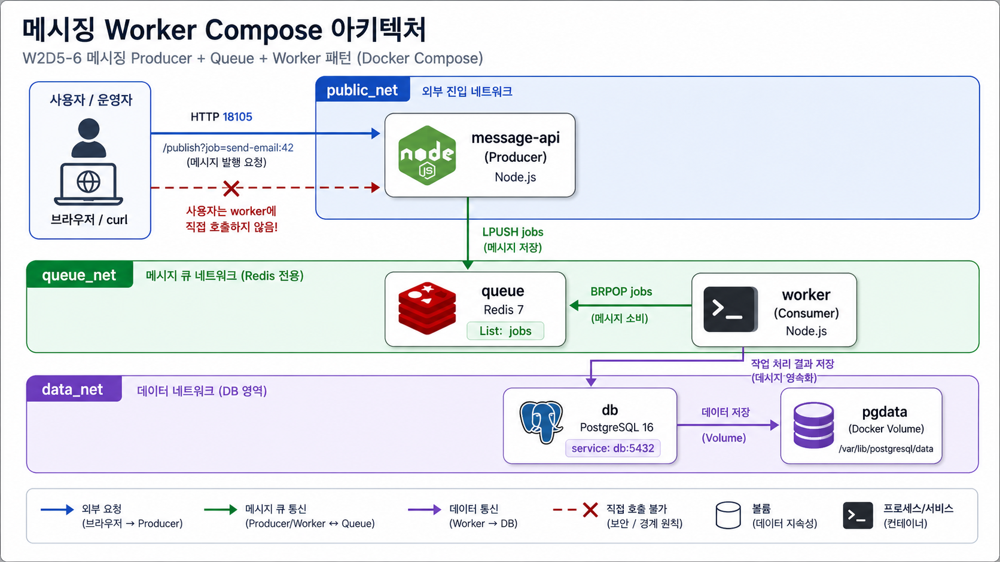

# 6교시: 카카오형 메시징/worker template



## 수업 목표
- HTTP producer, Redis queue, worker 구조를 Compose로 실행한다.
- worker logs로 job 소비를 확인한다.
- queue, worker, DB service boundary를 구분한다.

## 언제 쓰는가
W1D4의 메시징/스트리밍 사례를 Compose로 줄인다. API가 직접 모든 일을 끝내지 않고 queue에 job을 넣고, worker가 Redis queue에서 job을 꺼낸다.

## Template
```bash
cd week2/day5/labs/compose-architectures/05-queue-worker-db
docker compose config
docker compose up -d
docker compose ps
```

## compose.yaml 읽기
HTTP 요청을 받는 producer와 background worker가 직접 연결되지 않고 queue를 사이에 두는 구조를 읽는다.

```yaml
services:
  message-api:
    image: node:20-alpine
    command: ["node", "server.js"]
    ports:
      - "18105:3000"               # 사용자가 호출하는 공개 API
    environment:
      REDIS_HOST: queue            # producer는 queue service name으로 Redis에 연결한다.
    depends_on:
      - queue
    networks:
      - public_net                 # 사용자가 호출하는 HTTP API 영역
      - queue_net                  # queue에 job을 넣는 내부 영역

  queue:
    image: redis:7-alpine          # job을 잠시 보관하는 backing service
    networks:
      - queue_net

  worker:
    image: redis:7-alpine
    depends_on:
      - queue
    command:
      - sh
      - -c
      - |
        echo "worker waiting for jobs"
        while true; do redis-cli -h queue BRPOP jobs 0; done
                                   # worker는 HTTP port를 열지 않고 queue에서 job을 꺼낸다.
    networks:
      - queue_net
      - data_net                   # 처리 결과를 DB에 기록하는 확장 구조를 상정한다.

  db:
    image: postgres:16
    volumes:
      - pgdata:/var/lib/postgresql/data
    networks:
      - data_net

networks:
  public_net:
  queue_net:
  data_net:
```

이 template의 확인 순서는 API 응답 하나로 끝나지 않는다. `curl`로 job을 넣고, `worker logs`로 소비를 보고, 필요하면 Redis queue length와 DB 상태까지 확인한다.

구성:

| Service | 역할 | 공개 범위 |
|---|---|---|
| `message-api` | HTTP producer, queue에 job 입력 | host `18105` |
| `queue` | Redis queue | Compose network 내부 |
| `worker` | job consumer | logs로 결과 확인 |
| `db` | 처리 결과 저장 대상 | Compose network 내부 |

## 트래픽/부하 성향 노트
queue/worker 구조에서는 사용자 요청 traffic과 background 처리 부하가 분리된다. API가 빠르게 200을 반환해도 worker가 밀리면 실제 업무 처리는 지연될 수 있다.

| Service | 트래픽 성향 | CPU 부하 | 메모리/상태 부하 | 운영에서 먼저 볼 것 |
|---|---|---|---|---|
| `message-api` | job publish 요청이 몰림 | payload 검증/직렬화에서 증가 | 짧은 request buffer | publish 성공률, latency |
| `queue` | enqueue/dequeue 집중 | Redis command 자체는 낮음 | backlog length, memory | `LLEN jobs`, memory |
| `worker` | 사용자 직접 traffic 없음 | job 처리 로직이 무거우면 가장 큼 | batch buffer, retry state | worker throughput, error log |
| `db` | 처리 결과 write | transaction, index update에서 증가 | WAL, buffer/cache, volume | write latency, lock |

이 구조의 핵심 지표는 HTTP 200만이 아니다. queue length가 계속 증가하면 worker capacity가 부족하다는 신호다.

## Check
```bash
curl -s 'http://localhost:18105/publish?job=send-email:42'
docker compose logs worker --tail 40
docker compose exec db psql -U postgres -d jobs -c "SELECT current_database();"
```

Expected:

```text
send-email:42
current_database
jobs
```

## 실무 해석
사용자는 worker를 직접 호출하지 않는다. app은 queue에 job을 넣고, worker는 queue에서 꺼낸다. 장애 확인도 web response만 보지 말고 queue length, worker logs, DB 기록을 함께 봐야 한다.

queue 길이를 직접 보고 싶을 때만 다음 명령을 추가로 사용한다.

```bash
docker compose exec queue redis-cli LLEN jobs
```

## Cleanup
```bash
docker compose down
# DB를 초기화할 때만
# docker compose down -v
```
