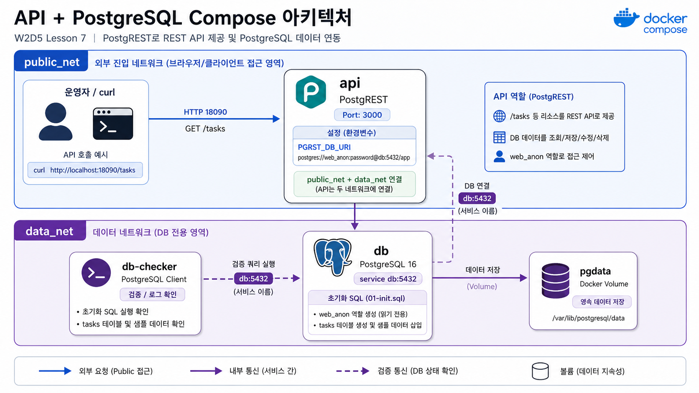

# 7교시: API + PostgreSQL template



## 수업 목표
- DB table을 REST API로 노출하는 구조를 실행한다.
- API service가 DB service name으로 연결되는지 확인한다.
- API 응답, DB query, service logs를 함께 확인한다.

## 언제 쓰는가
frontend와 database 사이에 API layer가 필요한 대부분의 웹 서비스에서 사용한다. 여기서는 PostgREST image를 사용해 짧은 template으로 API + DB 연결을 확인한다.

## Template
```bash
cd week2/day5/labs/compose-architectures/06-api-postgrest
docker compose config
docker compose up -d
docker compose ps
```

## compose.yaml 읽기
API가 DB table을 REST endpoint로 노출할 때 connection string, schema, role이 어디에 들어가는지 확인한다.

```yaml
services:
  api:
    image: postgrest/postgrest:v12.2.8
    ports:
      - "18090:3000"               # host에서 REST API를 확인하는 공개 port
    environment:
      PGRST_DB_URI: postgres://app_user:app_password@db:5432/app
                                   # DB host는 Compose service name db다.
      PGRST_DB_SCHEMAS: api        # REST로 노출할 schema
      PGRST_DB_ANON_ROLE: web_anon # 익명 요청에 부여할 DB role
    depends_on:
      - db
    networks:
      - public_net                 # REST API 확인용 host 공개 영역
      - data_net                   # DB 연결 영역

  db:
    image: postgres:16
    volumes:
      - ./db/init.sql:/docker-entrypoint-initdb.d/01-init.sql:ro
                                   # table, role, sample data를 초기화한다.
      - pgdata:/var/lib/postgresql/data
    networks:
      - data_net

  db-checker:
    image: postgres:16
    depends_on:
      - db
    command: ["sh", "-c", "until pg_isready -h db -U postgres -d app; do sleep 1; done"]
                                   # DB 준비 상태와 초기 데이터 확인용 보조 service
    networks:
      - data_net

networks:
  public_net:
  data_net:
```

PostgREST container가 running이어도 schema나 role이 틀리면 API는 정상 응답을 주지 못한다. 그래서 `curl`, `logs api`, `logs db-checker`를 함께 본다.

구성:

| Service | 역할 | 공개 범위 |
|---|---|---|
| `api` | DB table을 REST API로 노출 | host `18090` |
| `db` | PostgreSQL 16, init SQL 실행 | Compose network 내부 |
| `db-checker` | DB 초기화/연결 확인 | logs로 결과 확인 |

## Check
```bash
curl -s http://localhost:18090/tasks
docker compose logs api --tail 40
docker compose logs db-checker --tail 20
```

Expected:

```text
"title":"read compose.yaml"
"status":"done"
```

## 실무 해석
API가 뜬 것과 DB에 붙은 것은 다르다. API container가 running이어도 DB schema, role, connection string이 틀리면 endpoint는 실패한다. 그래서 HTTP 응답과 DB 초기화 로그를 같이 확인한다.

## Cleanup
```bash
docker compose down
# DB를 초기화할 때만
# docker compose down -v
```
