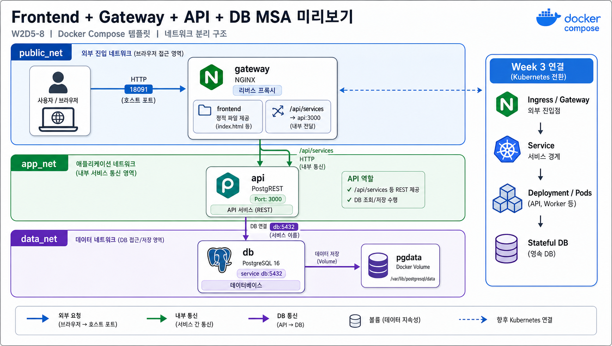

# 8교시: Frontend + gateway + API + DB MSA preview template



## 수업 목표
- browser traffic이 gateway로 들어오고 API/DB로 이어지는 흐름을 확인한다.
- frontend, gateway, API, DB의 service boundary를 구분한다.
- Week 3 MSA에서 다룰 dependency와 failure propagation 질문을 만든다.

## 언제 쓰는가
실제 서비스는 frontend 하나, API 하나, DB 하나로 끝나지 않는 경우가 많다. 그래도 처음에는 gateway가 외부 traffic을 받고, 내부 API와 DB로 연결되는 구조를 읽을 수 있어야 한다.

## Template
```bash
cd week2/day5/labs/compose-architectures/07-frontend-gateway-api-db
docker compose config
docker compose up -d
docker compose ps
```

## compose.yaml 읽기
Week 3 MSA로 넘어가기 전, browser traffic이 gateway를 거쳐 내부 API와 DB로 이어지는 최소 구조를 코드로 읽는다.

```yaml
services:
  gateway:
    image: nginx:1.27-alpine
    ports:
      - "18091:80"                 # browser가 접근하는 유일한 외부 진입점
    volumes:
      - ./nginx/default.conf:/etc/nginx/conf.d/default.conf:ro
      - ./frontend:/usr/share/nginx/html:ro
                                   # 정적 frontend와 /api/ reverse proxy 설정을 함께 제공
    depends_on:
      - api
    networks:
      - public_net                 # browser traffic
      - app_net                    # internal API routing

  api:
    image: postgrest/postgrest:v12.2.8
    environment:
      PGRST_DB_URI: postgres://app_user:app_password@db:5432/app
      PGRST_OPENAPI_SERVER_PROXY_URI: http://localhost:18091/api
                                   # 외부 기준 URL은 gateway path를 사용한다.
    depends_on:
      - db
    networks:
      - app_net
      - data_net

  db:
    image: postgres:16
    volumes:
      - ./db/init.sql:/docker-entrypoint-initdb.d/01-init.sql:ro
      - pgdata:/var/lib/postgresql/data
    networks:
      - data_net

volumes:
  pgdata:

networks:
  public_net:
  app_net:
  data_net:
```

이 코드는 “frontend가 API container에 직접 붙는다”가 아니라 “browser는 gateway로 들어오고 gateway가 내부 API로 넘긴다”는 구조를 보여준다. Kubernetes로 옮기면 gateway는 Ingress/Service, API는 Deployment/Service, DB는 Stateful한 backing service 논의로 이어진다.

구성:

| Service | 역할 | 공개 범위 |
|---|---|---|
| `gateway` | frontend 정적 파일 제공, `/api/` reverse proxy | host `18091` |
| `api` | PostgREST API | Compose network 내부 |
| `db` | PostgreSQL 16, init SQL 실행 | Compose network 내부 |

## Check
```bash
curl -s http://localhost:18091 | grep week2-day5-msa-preview
curl -s http://localhost:18091/api/services
docker compose logs gateway --tail 40
docker compose logs api --tail 40
```

Expected:

```text
week2-day5-msa-preview
"name":"gateway"
"name":"api"
```

## Week 3 연결 질문
| 질문 | 왜 중요한가 |
|---|---|
| gateway가 죽으면 어떤 요청이 실패하는가 | 외부 진입점 장애 |
| API가 죽으면 frontend는 어떻게 보이는가 | dependency failure |
| DB가 준비되기 전에 API가 뜨면 어떻게 되는가 | readiness/health check |
| API service를 2개로 늘리면 routing은 어떻게 바뀌는가 | scale out |
| 이 Compose service를 Kubernetes manifest로 옮기면 무엇이 바뀌는가 | Week 3 bridge |

## Cleanup
```bash
docker compose down
# DB를 초기화할 때만
# docker compose down -v
```
